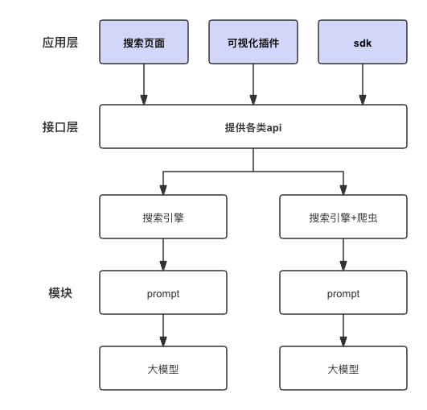
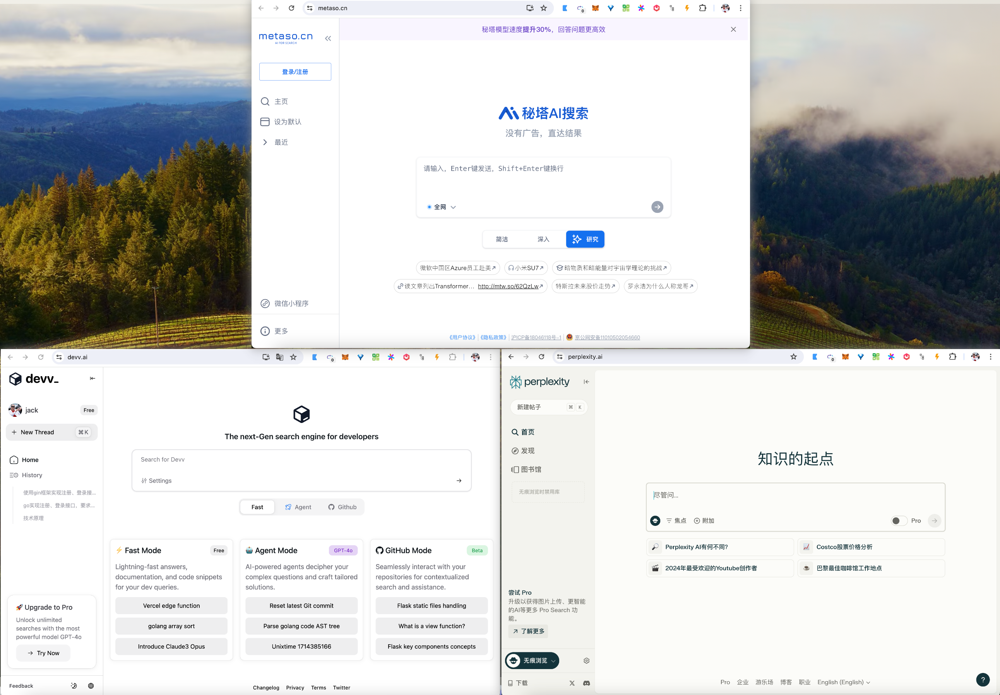
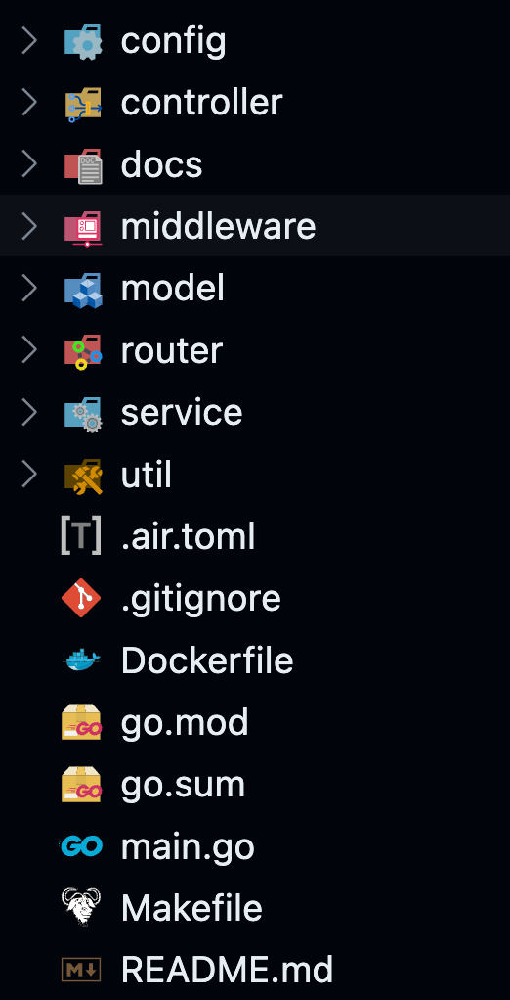
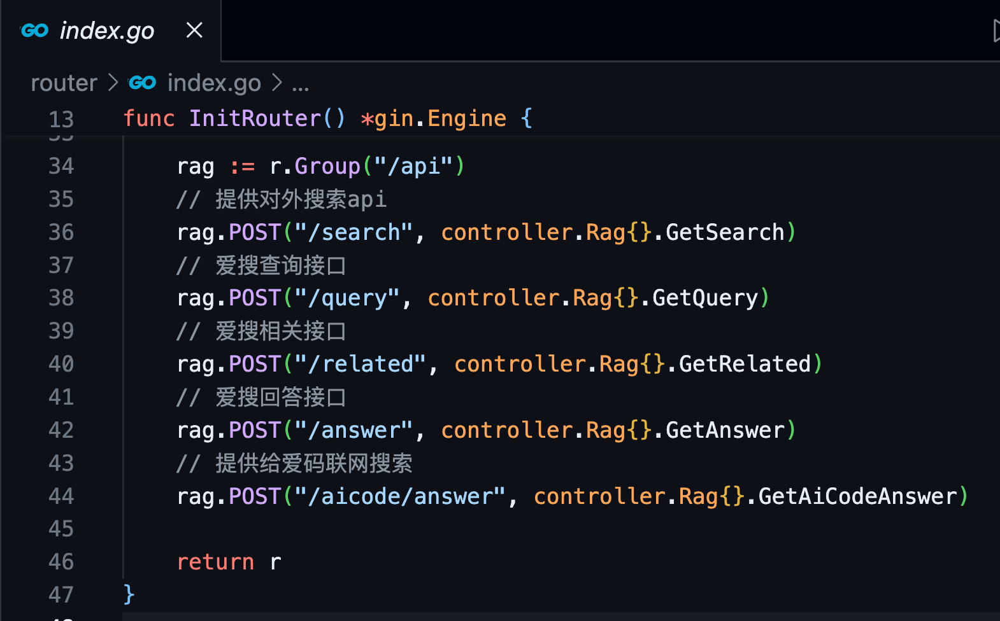
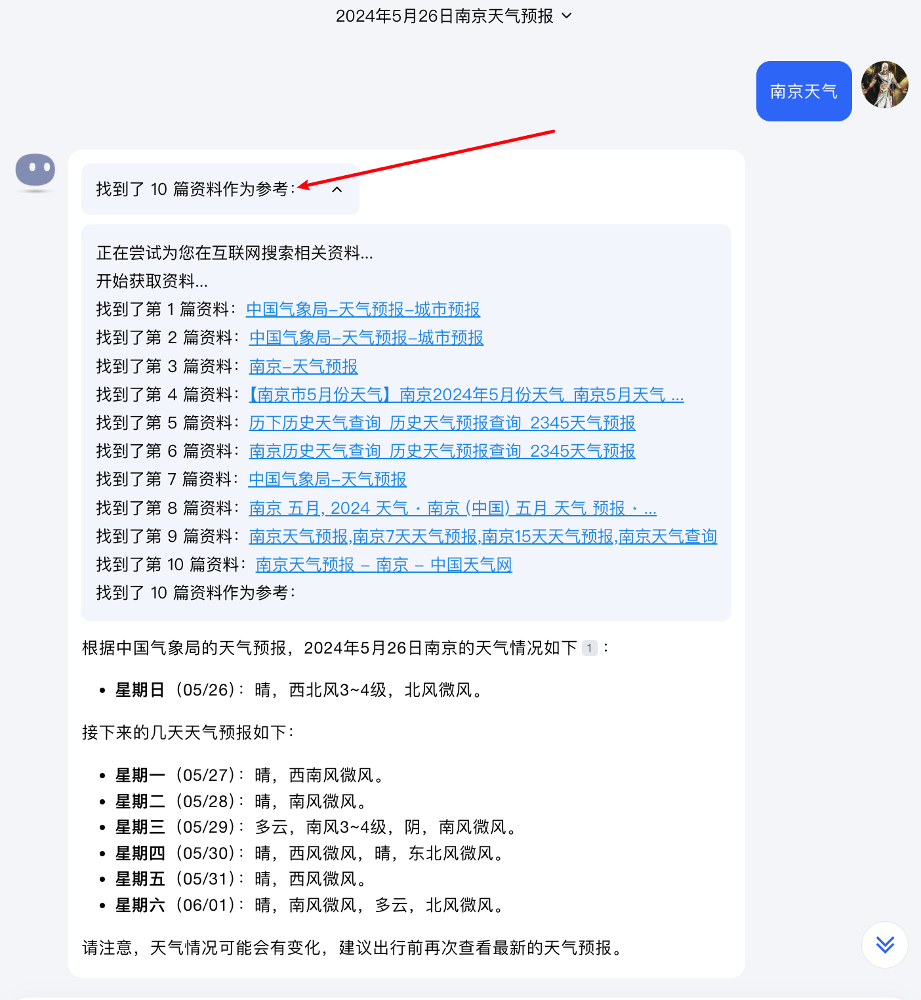
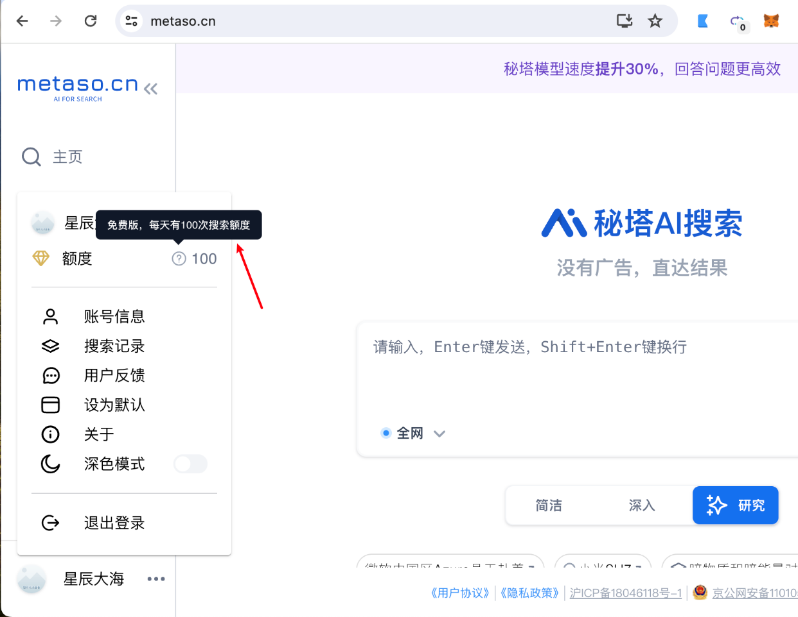
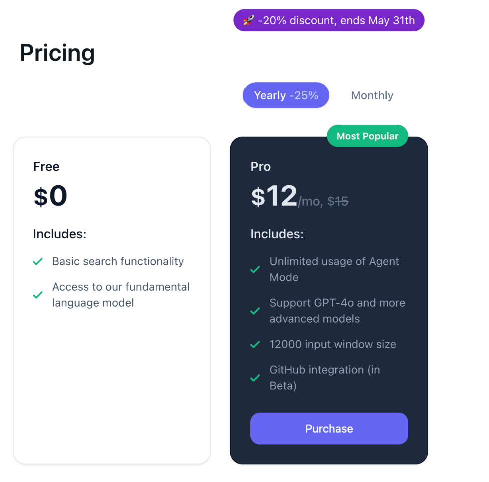
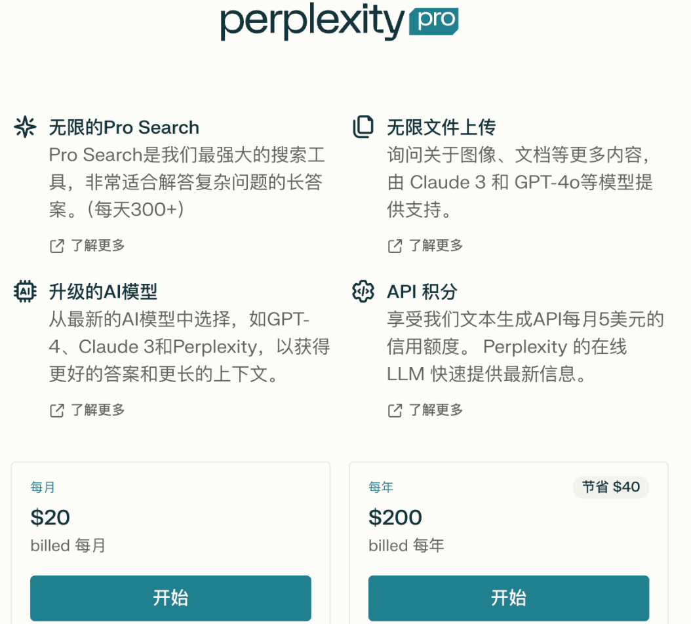
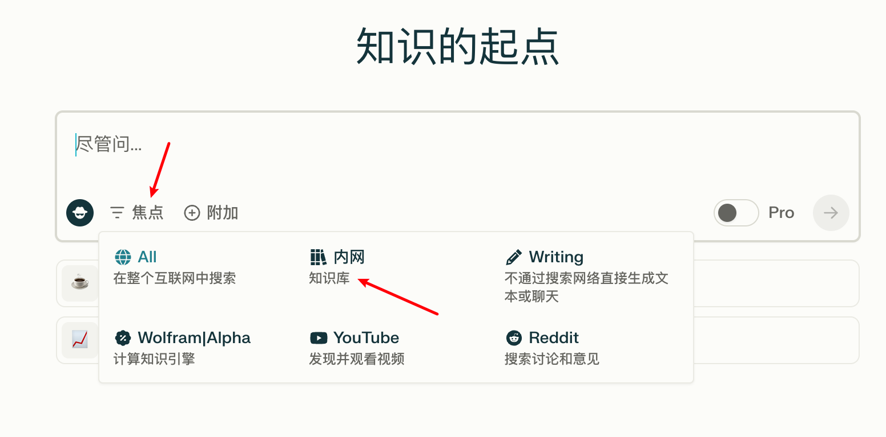
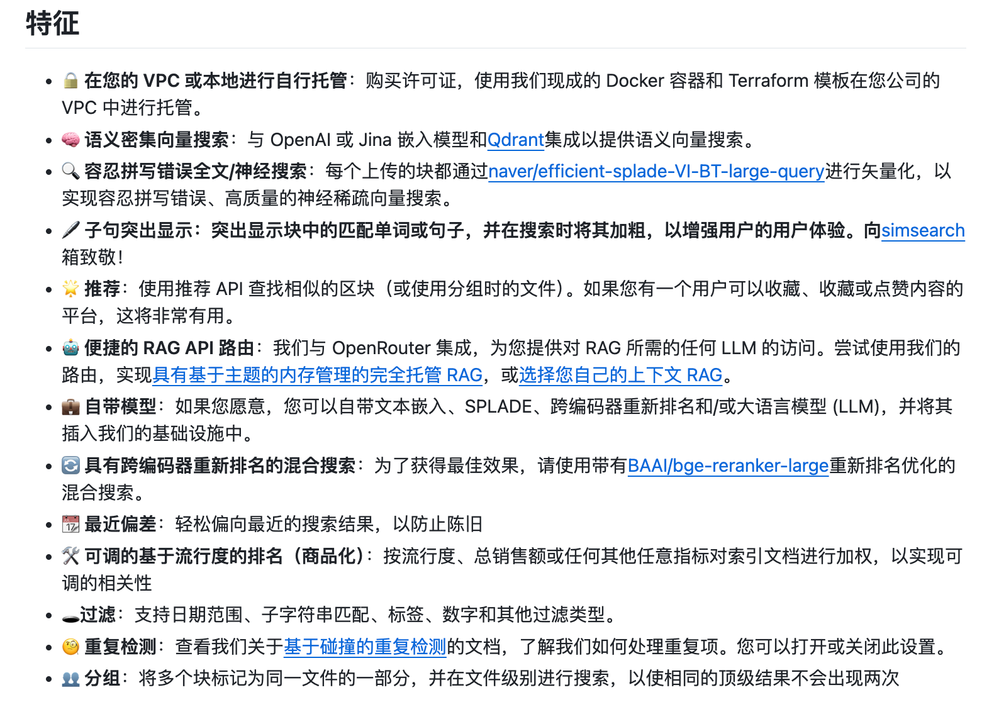

# AI搜索如何落地价值

完整文章见链接： <a target="_blank" href="https://mp.weixin.qq.com/s/FTb9-evHaEft6HUMXK0BMA">https://mp.weixin.qq.com/s/FTb9-evHaEft6HUMXK0BMA</a>

> 借鉴开源 Lepton Search 的灵感，在公司内部做了一款 AI 搜索工具，名为爱搜。这个工具目前处于带着做状态，没有投入什么人力和资源。遂想写点东西，记录下自己的一些想法和观点。不一定对，但都是吾之所悟。

# AI 搜索是什么

AI 搜索是指利用人工智能技术，帮助用户更快找到需要的信息，提供更加精准和相关的搜索结果。

# 为什么要做 AI 搜索

1. 现在 AI 是风口，所有产品前缀都可以加上 AI，搜索也不例外
2. 人工智能可以帮人类承担一些搜索工作，之前人类需要在搜索上花一个小时，现在有了 AI ，只需要花 20 分钟甚至更少

# 怎么做 AI 搜索

从现在看，做出一个简单的 AI 搜索产品已经不存在技术难点了，有很多成熟的产品，如：

- 国内：360AI 搜索、秘塔、天工等，还有一些内置到问答产品中，如 kimi
- 国外：devv 、perplexity 等

下面我将从技术架构、应用层、接口层、模块层来阐述怎么做 AI 搜索产品。

## 技术架构

下图是我画的简单 AI 搜索产品架构示意图：

上图把架构分成了三层，分别是应用层、接口层和模块层，解释如下：

- 应用层：可以是 web、native、桌面端、浏览器插件、sdk
- 接口层：支持应用层的各种 api
- 模块层：是搜索和 各种 agent 的核心实现

这应该是最简单的 AI 搜索架构了，复杂的我没有做过，就不画了。

## 应用层

目前一些 AI 搜索产品我都用过，直接参考秘塔、devv 和 perplexity 即可，三者页面如下图所示：

整体布局相似，取他们精华，去他们糟粕就可以了。技术选型上，根据团队情况选择就行，如 vue 、 react。整体没有技术瓶颈，正常去开发实现即可。

## 接口层

基于 restful api 去和应用层对接，比如有以下接口：

- 回答接口
- 相关问题接口
- 登录接口
- 历史记录接口
- 设置接口

这一层，也可以加上缓存功能，对于相同问题，直接返回缓存结果。也可以不加缓存，主要看业务需求。

爱搜接口层和模块层代码的目录结构如下图所示：

使用 go 作为开发语言，整体合理。爱搜提供的接口如下图所示：

除了自己用的接口，还给其他业务提供了一些能力支持。

## 模块层

这一层属于 AI 搜索的核心了，它能决定 AI 搜索的上限。模块层提供的能力越多，能力越强，产品的竞争力就越大。

上文的架构图画了两个模块：

- 模块 1：搜索引擎 --> prompt --> 大模型
- 模块 2：搜索引擎+爬虫 --> prompt --> 大模型

### 搜索引擎

搜索引擎的方案有两种，分别是付费和开源。如果用付费方案，则有百度、必应、谷歌、serper 等。如果用开源方案，则有 duckduckgo 、searxng 等。

- 付费方案中，serper 是我认为目前最好的选择，理由是非常便宜、底层走谷歌搜索、速度很快并且国内没有被墙。
- 开源方案中，我知道的有 searxng 和 duckduckgo ，searxng 更流行。

### 爬虫

1. 在不加限制的搜索场景下，没有找到一个合适的爬虫方案，这种场景有两种方案：

- 第一种方案：用传统的方法，拿到页面链接，然后解析页面内容，这种依赖页面 dom 结构，那么多页面，怎么去实现一个通用的解析逻辑，很难搞
- 第二种方案：用 AI 能力，借助视觉模型，拿到页面链接，进入页面，对页面做视觉判断，需要用到什么数据，就拿什么数据，这种目前还没有尝试，感觉难度也大

2. 如果加限制搜索场景，比如编程问题我只在 stackoverflow 、 reddit 、 github 上搜和爬取，这种是可以有合适的方案的。但是执行爬虫后，返回速度是不是会变慢，这个因素也需要考虑。

目前爱搜是没有做爬虫方案的，主要是没有想好怎么做。用过 kimi 的，都知道回答会有资料作为参考，如下图所示：

我比较好奇的是，kimi 有没有爬取资料 url 的页面内容。还是说，只是把调搜索引擎拿到的搜索结果展示出来，或者说，会根据问题有选择的爬取资料页面。

目前用 AI 做爬虫的开源项目也有一些，但到目前为止，我还没有找到一个适合所有搜索场景的爬虫方案。

## prompt

prompt 的设计有几个痛点：

### 大而全的 prompt 很难调

你想靠一个 prompt 解决搜索问题，是几乎不可能的，需要对 prompt 从上到下进行拆分，如下所示：

- prompt
  - 断言 prompt：判断搜索问题是什么类型
  - 编程 prompt
    - 错误解决
    - 功能实现
    - xxx
  - 非编程 prompt
    - 新闻类
    - 医学
    - xxx

如果想让回答更加符合用户想要的，prompt 的设计就需要考虑原子化。有利于维护、适配和扩展。

### 很依赖大模型的能力

如果未来的大模型能力比现在强大千倍，那也许一个大而全的 prompt 就够了，但现在，还做不到这种。你设计的一个 prompt 在 X 模型上表现很好，但换到 Y 模型上，表现可能就变差了。

上文将 prompt 从上到下进行拆分，变的小而精，也是为了增加鲁棒性，让其在不同模型上都能有很好的表现效果

### prompt 的设计准则太多了

据我了解，有很多提示词设计准则，像 CoT、CO-STAR、3S、微软出的 prompt 设计教程等。给我的感觉就是：到底哪个是最佳实践，估计目前没有最佳实践，这给 prompt 设计，又带来了一些困难，不同模型的 prompt 最佳实践可能不一样，如何在 prompt 上屏蔽掉这个因素，是值得思考的事情，将 prompt 拆小，在一定程度上做了屏蔽。但是也会有无法兼容的情况，这种就需要根据模型来单独设计适合它的 prompt 了。

### prompt 也需要后期

有时会发现，在模型固定的情况下，不管你怎么设计 prompt ，某一个场景的输出就是有问题，这个问题大多是指输出不够稳定。

比如一个问题的回答，需要输出字符串数组，这个问题问 10 次，会偶然出现一个输出数字数组，或者直接不是数组，这种情况怎么办，从我的观点看，这种情况就需要做后期处理了，通过写程序去识别这种情况，并做相应的处理，保证返回的永远都是字符串数组。

### prompt 自动化测试

prompt 本身不太可控，如何在迭代过程中，做到对 prompt 有一个稳定的监控，这就需要在 prompt 自动测试上做一些能力，比如：

1. 自动生成各个类别的问题，每个类别生成 10 个问题，
2. 自动去跑 prompt，每个问题，跑十遍 prompt
3. 将相同类别的相同问题跑出的结果进行对比，分析结构和内容是否相似
4. 将相同类别的问题跑出的结果进行对比，分析此类别的输出结果是否稳定、准确

## 模型

模型的重要性不言而喻，当前模型界应该是最卷的领域了，如何评估和选择模型是一个很重要的事情。就目前来说，模型选对了，产品的成本可能会降一半，效果还会更好。

### 模型和 prompt 配合

上文 prompt 也阐述了相关内容，模型和 prompt 工程形成良性的循环，是我们必须要去做的事情

### 私有化模型的挑战

如果不使用第三方模型 api，使用私有化模型，那需要做以下事情：

1. 评估和选择模型
2. 模型部署，要买卡，或者走托管服务
3. 模型微调【可能需要，但如果想更好，大概率需要做】

买卡的话，成本就变大了。模型大小也要考虑，“越大”，需要的算力越多。从控制成本角度看，方向如下：

1. 采取面向模型开发模式，用合适且性价比高的模型去解决不同的业务场景
2. 模型倾向于选择 MOE ，在“小”的同时，获得高质量的输出结果
3. 让 prompt 多发力，再加上后期，也可以让“小”模型的效果逼近“大”模型的效果
4. 选择正确的微调方案，这里我没有经验，目前业界有预训练、SFT、RLHF、LORA、指令微调等
5. 模型侧要保证性能和准度，就是输出结果要快和准，相同参数级别模型
   - a、想更快，可以尝试用 bit 更小的量化模型，测试输出效果会不会有明显差别，没有的话，就可以考虑用，这样会提高模型性能
   - b、想更准，需要根据情况做处理，比如做指令微调

## AI 搜索商业价值

我先说下，目前 to c 产品的一些价值场景

- 360：回答页面加了广告...

- 天工：目前没看到付费场景，但是从我的角度看，天工做的还可以，agent 很多，包括 ai ppt、数据分析等

- 秘塔：免费版搜索次数有限制，目前没看到上限付费版

- devv：按月/年付费，可获无限次 agent 使用、gpt-4o 模型等其他付费功能

- perplexity：按月/年付费，付费功能如下图所示：

从我的角度看，这些 AI 搜索产品，还没有到让我付费的程度。也就说，已经 To C 的产品，我都没有付费的意愿，那在公司内部搞的 AI 搜索工具，如何去落地或者呈现价值呢？

以下有我的几点思考和看法

## 多在 AI Agent 上发力

AI Agent 概念：即人工智能代理，是一种利用人工智能技术来执行特定任务或服务的软件程序。AI 代理可以模拟人类智能行为，进行自主决策、学习和交互。它们可以应用于多种领域，包括但不限于客户服务、数据分析、自动化任务、个人助手等。AI 代理能够处理复杂的任务，提高效率，减少人为错误，并为用户提供更加个性化和智能化的服务体验。

这里我举一些 Agent 例子：

1. RSS 订阅自动总结和推送 Agent
   对 RSS 订阅有强依赖的用户群体，这个功能就能产生较大的价值
2. 科技、手机、AI 等主题新闻，最新咨询日报生成和推送
   通过 AI 搜索去自动搜索各主题最新新闻并进行阅读，最后输出新闻内容总结和高质量点评，对于提高用户的行业前沿资讯感知是有价值的
3. 简历分析和评估，上传一个简历，会自动分析简历内容，给出评估报告和面试时需要问的面试问题

当前的 Agent，我更倾向于做一些小而美的 agent，太宏大的 agent，实现起来很困难，一方面受限于技术，一方面也会受限于算力

## 内网的搜索和总结要做好

1. 内网的知识库：包含文档、pdf、各类分享视频
2. 业务相关的文档

可以在搜索页面加一个搜索范围，像 perplexity 那样：

上图显示的 内网->知识库 是我按 f12 改了下 dom 内容。

这些功能，爱搜目前都没做，看起来几句话，实际需要不少工作量。就拿 pdf 解析来说，目前业界对于复杂 pdf 的解析好像都没有太好的方案，我试过很多开源项目，都达不到我的理想需求，最近我又看到一个很不错的开源项目，叫 trieve ，其特性如下图所示：

这个开源项目已经获得 YC 的投资了，证明其还是有技术和潜力的。目前是我看到对 pdf 分块、解析和搜索最好的开源项目了。后续多研究下这个项目。大家有什么好的开源方案也欢迎告知我。

业务相关的文档，做起来难度也大，爱搜目前也没有做，如果做的话，整体思路如下：

业务上可以根据你的登录信息，查你当前拥有的业务权限，然后允许用户选择搜索哪个业务，比如业务 A 所有的项目管理文档，包含策划文档、策划评审意见等，然后对用户选择的业务进行训练和搜索，后续用户可以在业务 A 选项中搜自己想要的内容，并获得相应的回答和索引。

## 多和公司内部业务联动

比如给某个业务提供联网搜索能力、提供搜索能力、提供爬虫能力等，类似这种多去和内部业务沟通交流，也能发挥落地一些价值

## 总结

1. 想一下，bing 和谷歌做 AI 搜索，都被外界喷效果差，就知道要做好 AI 搜索还是很有难度的。
2. 当然，bing 和谷歌的目标和我们不一样，我们更专注于垂直领域，我希望做小而美的 AI 搜索，它可以是一个产品矩阵，也可以是一个聚合产品
3. 我们聚焦的是目前世界上最前沿的领域，有困难很正常

商业价值不是靠讨论出来的，而是靠试出来的。
