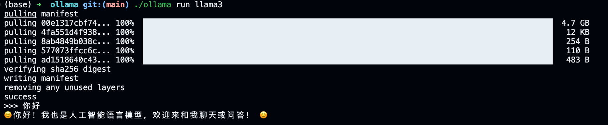

# 本地启动ollama+llamas

我的方案是，本地m3，通过buld后启动

## 搭建环境
```sh
git clone git@github.com:ollama/ollama.git
cd ollama
# brew install cmake go
go generate ./...
go build .
./ollama serve
# Finally, in a separate shell, run a model:
./ollama run llama3
```

## 交互

效果如下：

