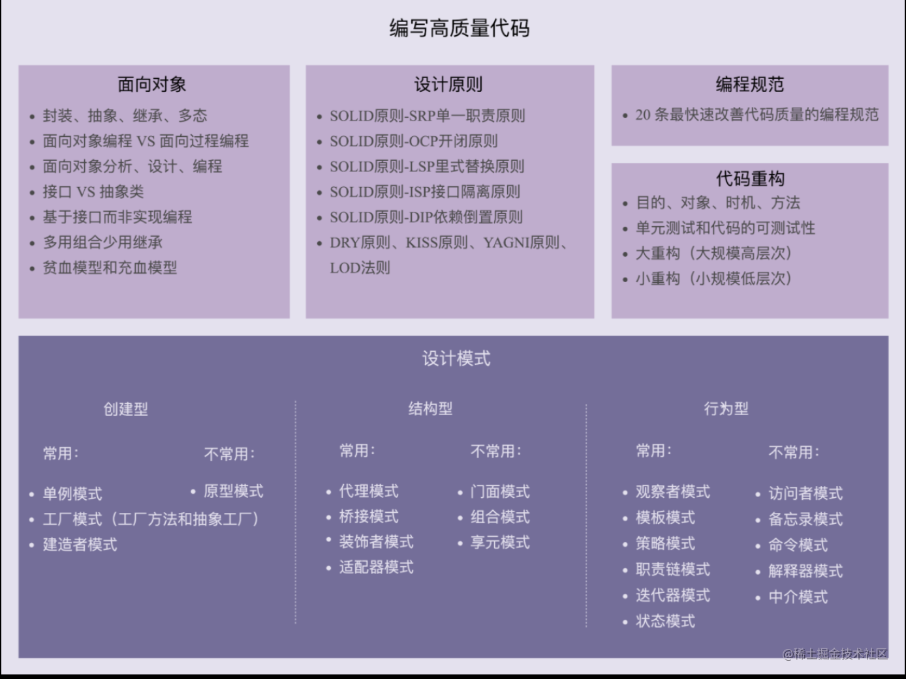

# 掌握设计原则

## 25个问题，你会几个

- 如何理解单一职责原则？
- 如何判断职责是否足够单一？
- 职责是否设计得越单一越好？
- 什么是开闭原则？
- 修改代码就一定意味着违反开闭原则吗？
- 怎样的代码改动才被定义为扩展或者说是修改？
- 如何做到对扩展开放、修改关闭？
- 如何在项目中灵活运用开闭原则？
- 什么是依赖反转(倒置)原则 ？
- 高层模块和低层模块是啥意识?
- 如何理解反转两个字？
- 什么依赖被反转了？
- 什么是控制反转 `IOC` ( `Inversion Of Control` )?
- 什么是依赖注入 `DI` ( `Dependency Injection` )?
- `IOC` 和 `DI` 有什么区别？
- 代码行数越少就越简单吗？
- 代码逻辑复杂就违背 `KISS` 原则吗？
- 如何写出满足 `KISS` 原则的代码？
- 如何判断是否满足 `KISS` 原则？
- 重复的代码就一定违背 `DRY` 吗？
- 如何提高代码的复用性？
- 什么是迪米特法则？
- 高内聚、松耦合是什么意识？
- 如何理解高内聚和松耦合？
- 如何用好迪米特法则？

看完这些问题，是不是激动的一笔，激动了，说明你又要进步成长了。


 
## 行文方式

先哈两句，活跃一下气氛。然后通过提出问题，回答问题，然后结合生活例子和代码，来全方位阐述设计原则知识。

## 为什么要学习设计原则

### 给你的自由过了火

做人需要原则，那写代码的时候，大家有没有讲原则呢?


按照正常剧情，这时候有小伙伴要开始表演了：

> 高赞回答： **不好意识，我做人没有原则。**


哈哈哈哈，那我只能说，你是光，你是电，你是唯一的神话。

### 越下游，越自由

大家有没有这种感觉，没有没关系，我举几个例子，大家就明白了。

> 例子如下所示：

- 产品经理写产品策划文档，给开发测试看，起码要有点人样
- 交互设计写交互设计文档，给开发产品看，起码要有点人样
- `ui` 设计师产出设计稿，给开发产品看，起码要有点人样

> 看完上面例子，再说我们：

当骄傲的前端工程师写完代码，然后 `two days later` 。惊喜的发现，自己写的代码已经不认识了，这就非常尴尬了。然心中窃喜，毕竟我们处于最下游，不存在把代码给谁阅读之说，最多也就是走下 `code review` 。

这种感觉是非常危险的，当我们处于非常下游的地方，也意味着我们非常自由，它有很多负面影响。

> 所以，我们通过什么来约束这种自由呢？这个答案就是本文想详细阐述的：

**通过设计原则来约束这种过火的自由。**

## 设计原则有哪些呢

> 大家请看下图：



图中设计原则一栏，涵盖了所有重要的设计原则，如 `SOLID` 、 `KISS` 、 `YANGI` 、 `DRY` 、`LOD` 。

活不多说，下面大家跟着我，一步步掌握设计原则吧！

## 用好设计原则的目的

上面说了为什么要学习设计原则，那大家再想一下，我们用好设计原则的目的是什么？

> 目的如下： 让代码或者项目具备：

- 可读性
- 可扩展性
- 复用性
- 可维护性

总结一句话就是： **降低软件开发的复杂度，让迭代的难度保持在合理区间内。**

`OK` , 说完目的，我们开始逐一介绍这些设计原则，小伙伴们请往下阅读。


注意：下文所说的类，也代指模块，这样我就不再单独写一遍模块了。
 
## SOLID

这是第一个介绍，也是最重要的。

> 重要的事说三遍：

**请记住：设计原则中， `SOLID` 是重点， 而 `SO` 是重点中的重点。**

## S

### 名称
- **SRP：**  *Single Responsibility Principle*
- 中文： 单一职责原则

### QUESTION

#### 如何理解单一职责原则？

一个类只负责完成一个职责或者功能，不要设计大而全的类，要设计粒度小、功能单一的类，简单点说，就是要小而美。单一职责原则的目的是为了实现代码高内聚、低耦合，提高代码的复用性、可读性、可维护性。

#### 如何判断职责是否足够单一？
这里有 `5` 个技巧：

1. 类中的私有方法过多
2. 比较难给类起一个合适的名字
3. 类中的代码行数、函数或者属性过多
4. 类中大量的方法都是集中操作类中的某几个属性
5. 类依赖的其他类过多，或者依赖类的其他类过多


#### 职责是否设计得越单一越好？

单一职责原则通过避免设计大而全的类，避免将不相关的功能耦合在一起，来提高类的内聚性。同时，类的职责单一，其依赖的和被依赖的其他类也会变少，从而实现代码的高内聚、松耦合。

**注意:** 如果拆分得过细，实际上会适得其反，反倒会降低内聚性，也会影响代码的可维护性。

### 生活中例子

**社会分工：** 写代码的，不会同时去写策划文档。

### code 展示

> 例子1： 符合单一职责

```js
useFuncA()
useFuncB()
```
可以把上面的函数看成是 `hooks` , 一个函数( `hooks` )完成一个功能。


> 例子2： 不同业务层面，可以符合单一职责，也可以不符合单一职责

```js
const userInfo = {
  userId: '',
  username: '',
  email: '',
  telephone: '',
  createTime: '',
  lastLoginTime: '',
  avatarUrl: '',
  provinceOfAddress: '',
  cityOfAddress: '',
  regionOfAddress: '',
  detailedAddress: ''
}
```

1. 从用户业务层面看，满足单一职责原则。
2. 从用户展示信息、地址信息、登录认证信息这些更细粒度的业务层面来看，就不满足单一职责原则。

> 例子3： 符合单一职责


从上图可以看出，一个功能只由一个模块目录完成。

> 例子4：不符合单一职责

```js
function bindEvent(elem, type, selector, fn) {
  if (fn == null) {
    fn = selector
    selector = null
  }
}
bindEvent(elem, 'click', '#div', fn)
bindEvent(elem, 'click', fn)
```

我们发现，`bindEvent` 函数可以传很多参数，不符合单一职责原则，它是外观模式思想的体现。

**PS：** 外观模式如下图所示：


### SRP 总结

上面的问题回答，进行了总结，这里再补充句：

**`SRP` 要结合业务场景去看待，角度不同，结果不同。**

## O

- **OCP：**  *Open Closed Principle*
- 中文：开闭原则

### QUESTION

#### 什么是开闭原则？

软件实体（类、模块、函数）都应当对扩展具有开放性，但对于修改具有封闭性。

也就是说：添加一个新功能应该是，在已有代码基础上扩展代码（新增模块、类、方法等），而非修改已有代码。

#### 修改代码就一定意味着违反开闭原则吗？

不一定，这个我们要灵活看待：

- 第一：开闭原则并不是说完全杜绝修改，而是以最小修改代码的代价来完成新功能的开发
- 第二：同样的代码改动，在粗代码粒度下，可能被认定为修改，在细代码粒度下，可能又被认定为扩展
- 第三：尽量让最核心、最复杂的那部分逻辑代码满足开闭原则

#### 怎样的代码改动才被定义为扩展或者说是修改？

通常情况下，只要它没有破坏原有代码的正常运行，**没有破坏原有的单元测试**，我们就可以认为它是符合开闭原则的。如果破坏了，那我们就可以认为它不符合开闭原则。

#### 如何做到对扩展开放、修改关闭？

1. 保持函数、类和模块当前本身的状态，或是近似于他们一般情况下的状态（即不可修改性）
2. 使用组合的方式（避免使用继承方式）来扩展现有的类、函数或模块，以使它们可能以不同的名称来暴露新的特性或功能

#### 如何在项目中灵活运用开闭原则？
时刻具备扩展意识、抽象意识、封装意识。

### 生活中例子

**高考试卷：** 比如明天就要高考了，但是老师发现没法区分高分学生和低分学生，必须得在试卷里面增加两个难度比较大的题，但是明天就高考了，如果现在去修改高考中的试卷，显然是不合理的。经过思考，最好的办法就是给高考的试卷加一个附加题【你可以加附加题，但是你不能修改原来的卷子，这就是对扩展开放，对修改关闭】。

### code

例子1：中间件

```js
app.use(A).use(B).use(C)
```

例子2：`function optional`
```js
fn(f1(),f2(),f3())
```

例子3：插件

```js
Vue.use(PluginA)
Vue.use(PluginB)
```

例子4：装饰器

```js
@get('/hello')
async hello() {
  // ...
}
```

### 总结
有以下两点：

1. 开闭原则是最重要的设计原则，很多设计模式都是以开闭原则为指导原则的
2. 它的核心是为了**提高代码的扩展性**

## L

- **LSP：** *Liskov Substitution Principle*
- 中文：里氏替换原则

额，这缩写怎么有点搞笑，嗯？


### QUESTION

#### 什么是里氏替换原则？

子类在设计的时候，要遵守父类的行为约定（或者叫协议）。父类定义了函数的行为约定，子类可以改变函数的内部实现逻辑，但不能改变函数原有的行为约定。

这里的行为约定包括：函数声明要实现的功能、对输入、输出、异常的约定、甚至包括注释中所罗列的任何特殊说明。

#### 如何判断是否满足里氏替换原则？
拿父类的单元测试去验证子类的代码。如果某些单元测试运行失败，就有可能说明，子类的设计实现没有完全遵守父类的约定，子类有可能违背了里氏替换原则。

### 生活中例子

**盗版光盘：** 原来人家的光盘是正版的，但现在你弄了一个盗版的光盘，我们有两张光盘，放到 `DVD` 里面，都可以单独运行【盗版光盘把正版光盘全部 `copy` 过来，子类父类行为预期一致】

### code

> 例子1： 代码执行重复，不符合 `LSP` 原则

```js
class People {
  constructor(name, age) {
    this.name = name
    this.age = age
  }
  eat() {
    // ...
  }
}

class Student extends People {
  constructor(name, age) {
    super(name, age)
  }

  eat() {
    // ...
  }
}

const kuangXiangLu = new Student('KuangXiangLu', 10)
kuangXiangLu.eat()
```

为什么不符合 `LSP` 呢？有以下两个原因：

第一：`Student` 类继承了 `People` 类，同时修改了 `People` 类的 `eat` 方法，这时就违背了 `LSP` 原则

第二：没有遵循父类的设计，修改了输出

### 总结
里氏替换原则的核心是用来指导，继承关系中子类该如何设计的一个原则，也就是 `design by contract` （按照协议来设计）。

## I

- **ISP：** *Interface Segregation Principle*
- 中文：接口隔离原则 

### QUESTION

#### 什么是接口隔离原则 ？
接口的调用者或者使用者，不应该强迫依赖它不需要的接口。

#### 接口隔离原则中的接口是指什么？
接口可以理解为下列三种东西：一组 `API` 接口集合、单个 `API` 接口或函数、`OOP` 中的接口概念

### 生活中例子

**汽车 USB 插口：** 汽车上有很多插口，但是你想插 `usb` 接口，你想让它有 `usb` 功能，又想让它有三线插头的功能，这就是不科学的事情【每一个接口都应该有自己的一种角色，只负责自己的角色】。

### code

代码1：

```js
const obj = {
  login() {
    // 用户登录
  }，
  delete() {
    // 删除用户信息
  }
}
```

`delete` 是不常用且危险的操作，如果和 `login` 放在一起，就存在被不需要调 `delete` 的业务误调的可能，违背了 `ISP` 原则。


代码2：

```js
function main() {
  // 处理加法
  // 处理减法
  // 处理乘法
  // 处理...
}
```

一个函数里面处理了很多逻辑，也违背了 `ISP` 原则。

#### 总结

**兄弟们， 细细品，重在隔离。**

## D

- **DIP：** *Dependency Inversion Principle*
- 中文：依赖反转(倒置)原则

### QUESTION

#### 什么是依赖反转(倒置)原则 ？

高层模块（ `high-level modules` ）不要依赖低层模块（ `low-level` ）。高层模块和低层模块应该通过抽象（ `abstractions` ）来互相依赖。除此之外，抽象（ `abstractions` ）不要依赖具体实现细节（ `details` ），具体实现细节 （ `details` ）依赖抽象（ `abstractions` ）。

#### 高层模块和低层模块是啥意识?
在调用链上，调用者属于高层，被调用者属于低层。

#### 如何理解反转两个字？
反转指的是在没有使用框架之前，程序员自己控制整个程序的执行。在使用框架之后，整个程序的执行流程可以通过框架来控制。

**流程的控制权从程序员反转到了框架。**

#### 什么依赖被反转了？
高层模块被反转了。

#### 什么是控制反转 `IOC  (Inversion Of Control)` ?
控制反转，控制是指对程序执行流程的控制，在没有反转前，控制权在程序员手里，经过反转后，控制权到了框架手里。

控制反转并不是一种具体的实现（编码）技巧，而是一个比较笼统的设计思想，一般用来指导框架层面的设计。

#### 什么是依赖注入 `DI (Dependency Injection)` ?
不通过 `new()` 的方式在类内部创建 依赖类对象，而是将依赖的类对象在外部创建好之后，通过构造函数、函数参数等方式传递 （或注入）给类使用。

依赖注入是一种具体的（实现）编码技巧。

#### `IOC` 和 `DI` 有什么区别？
`IOC` 是设计思想， `DI` 是具体（实现）编码技巧。

### 生活中例子
- **三个和尚打水：** 正常操作是直接用桶从井里面打水，但是现在非要加一个环节，先用桶把井里的水打到大桶里，然后再从大桶里面打水【不需要中间操作环节，直接用底层操作】。
- **`CPU` 内存：** 硬盘都是针对接口设计的，如果针对实现来设计，内存就要对应到具体的某个品牌的主板，明显不合理。

### code

代码和解读如下图所示：


### 总结
`DIP` 是一个抽象难懂的设计原则，从 `IOC` 和 `DI` 的中文命名就可以看出来。大家在运用 `DIP` 的时候，要理解透彻 **反转** 一词。记住将流程交给框架控制，然后再实现它。

### SOLID 总结

下表是对 `SOLID` 在不同维度的比较，大家可以看看，然后结合上面阐述的内容，细细品味下。

| 原则 | 耦合度 | 内聚度 | 扩展性 | 冗余度 | 维护性 | 测试性 | 适应性 | 一致性 |
| ---- | ------ | ------ | ------ | ------ | ------ | ------ | ------ | ------ |
| SRP  | -      | +      | o      | o      | +      | +      | o      | o      |
| OCP  | o      | o      | +      | -      | +      | o      | +      | o      |
| LSP  | -      | o      | o      | o      | +      | o      | o      | +      |
| ISP  | -      | +      | o      | -      | o      | o      | +      | o      |
| DIP  | -      | o      | o      | -      | o      | +      | +      | o      |

`+`代表增加，`-`代表降低，`o`代表持平。

## KISS

- 英文：*Keep It Simple and Stupid*
- 中文：保持简单愚蠢
- 俗解：保持代码简单

### QUESTION

#### 代码行数越少就越简单吗？
不一定，如一些较长的正则表达式，三位运算符，这些都是违背了 `KISS` 原则。

#### 代码逻辑复杂就违背 `KISS` 原则吗？
不一定，如果是复杂的问题，用复杂的方法解决，并不违反 `KISS` 原则。

#### 如何写出满足 `KISS` 原则的代码？

1. 不要使用同事可能不懂的技术来实现代码
2. 不要重复造轮子，要善于使用已经有的工具类库
3. 不要过度优化

#### 如何判断是否满足 `KISS` 原则？
`KISS` 是一个主观的评判，可以通过 `code review` 来做，如果大多数同事对你的代码有很多疑问，基本就说明不够 `KISS` 。

### code

如下代码所示：不符合 `KISS` 原则

```js
let a = b ? c : d ? e : f
```

### 总结

- 关注如何做
- 我们在做开发的时候，一定不要过度设计，不要觉得简单的东西就没有技术含量。实际上，越是能用简单的方法解决复杂的问题，越能体现一个人的能力。

## YANGI

- 英文：*You Ain’t Gonna Need It*
- 中文：你不会需要它
- 俗解：不要做过度设计

### 生活中例子

**双11剁手：** 卧槽，好便宜啊，下单下单下单，然后... 自行想象。

### 总结

1. 永远不要因为：预计你会用到某个功能就去写一段代码去实现
2. 而是：真的需要这个功能时才去实现它

## DRY

- 英文：`Don’t Repeat Yourself`
- 中文：不要重复你自己
- 俗解：不要写重复的代码

### QUESTION

#### 重复的代码就一定违背 `DRY` 吗？
重复的代码不一定违背 `DRY` 原则，代码重复有三种典型情况，分别是：

1. 实现逻辑重复
2. 功能语义重复
3. 代码执行重复

#### 如何提高代码的复用性？
减少代码耦合、满足单一职责原则、模块化、业务与非业务逻辑分离、通用代码抽离、抽象和封装、使用设计模式。

### code

> 例子1： 实现逻辑重复

代码 1 ：
```js
function isValidUserName() {
  // 内容一样
}
function isValidPassword() {
  // 内容一样
}

function main() {
  isValidUserName()
  isValidPassword()
}
```

代码2：
```js
function isValidUserNameOrPassword() {
  // 内容一样
}
function main() {
  isValidUserNameOrPassword()
}
```

大家看， 代码 `1` 中的两个函数代码都是一样的，所以我们通过去除重复，变成一个函数，变成了代码 `2` 。这里问大家一个问题，你们觉得这样做是否违背了 `DRY` 呢?

- 结果： 代码 `1` 不违背 `DRY` ,代码 `2` 违背了 `DRY` 的初衷。
- 原因： 虽然实现逻辑重复，但是语义不重复。从功能上看，他们是做的是两件完全不同的事情。合并后，一个函数做了两件事情，违反了 `SRP` 和 `ISP` 。
- 改善：抽象出更细粒度函数

> 例子 2 ：功能语义重复

```js
function sayHello() {
  // 
}
function speakHello() {
  //
}
```

都是表达 `hello` 的意识，虽然代码没重复，但是语义重复了，违背 `DRY` 。

> 例子 3 ：代码执行重复

```js
function isLogin() {
  //
}
function main() {
  if (xxx) {
    isLogin()
  }
  // 代码省略...
  if (yyy) {
    isLogin()
  }
} 
```

在一个函数中，多次执行同一个函数，违背了 `DRY` 。

### 总结

不重复并不代表可复用，要辩证思考和灵活应用。

## LOD

英文：`Law of Demeter`
中文：迪米特法则
俗解：高内聚、松耦合

### QUESTION

#### 什么是迪米特法则？
不该有直接依赖关系的类之间，不要有依赖。有依赖关系的类之间，尽量只依赖必要的接口

#### 高内聚、松耦合是什么意识？
1. 高内聚是指：相近的功能应该放到同一个类中，不相近的功能不要放到同一类中。因为相近的功能往往会被同时修改，放到同一个类中，修改会比较集中。
2. 松耦合是指：在代码中，类与类之间的依赖关系简单清晰。即使两个类有依赖关系，一个类的代码改动也不会或者很少导致依赖类的代码改动。

#### 如何理解高内聚和松耦合？

结合下图来理解：


它是一个通用的设计思想，可以用来指导不同粒度代码的设计与开发，比如系统、模块、类，甚至是函数，也可以应用到不同的开发场景中，比如微服务、框架、组件、类库等。

#### 如何用好迪米特法则？
减少代码耦合、满足单一职责原则、模块化。

### 生活中例子

现实中的对象：你对你的对象肯定了解的很多，但是你要是对别人的对象也了解很多，那就出大事了【一个对象应该对其他对象有尽可能少的了解】。


### code


如上图所示：我们用 `lerna` 去开发一个框架，将框架的不同功能放到不同的 `package` 中进行维护迭代，符合 `LOD` 。

### 总结

高内聚、松耦合是一个非常重要的设计思想，它能够有效地提高代码的可读性和可维护性，缩小功能改动导致的代码改动范围。

## 设计原则总结

好啦，看到这，设计原则基本就阐述完了，我对主要的设计原则进行了阐述，大家读会发现，一些设计原则虽然起名不同，但是其目标都是类似和相同的。学习和掌握主要的设计原则，可以帮助我们更好的进行软件设计、开发和迭代。也是为我们学习和掌握设计模式打下坚实的基础。