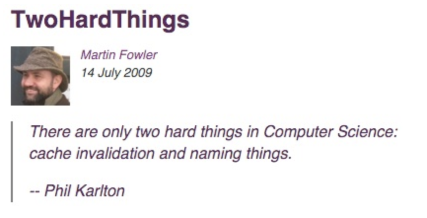
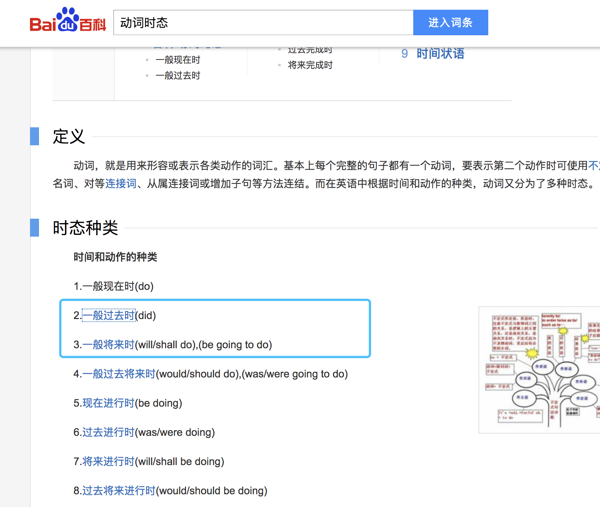
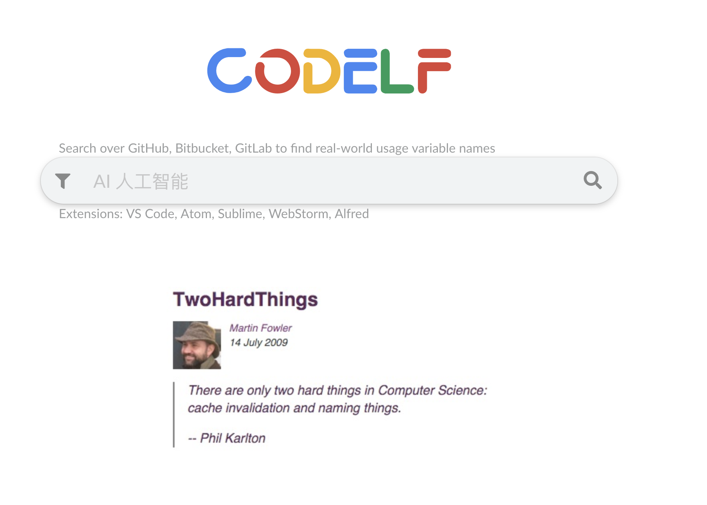
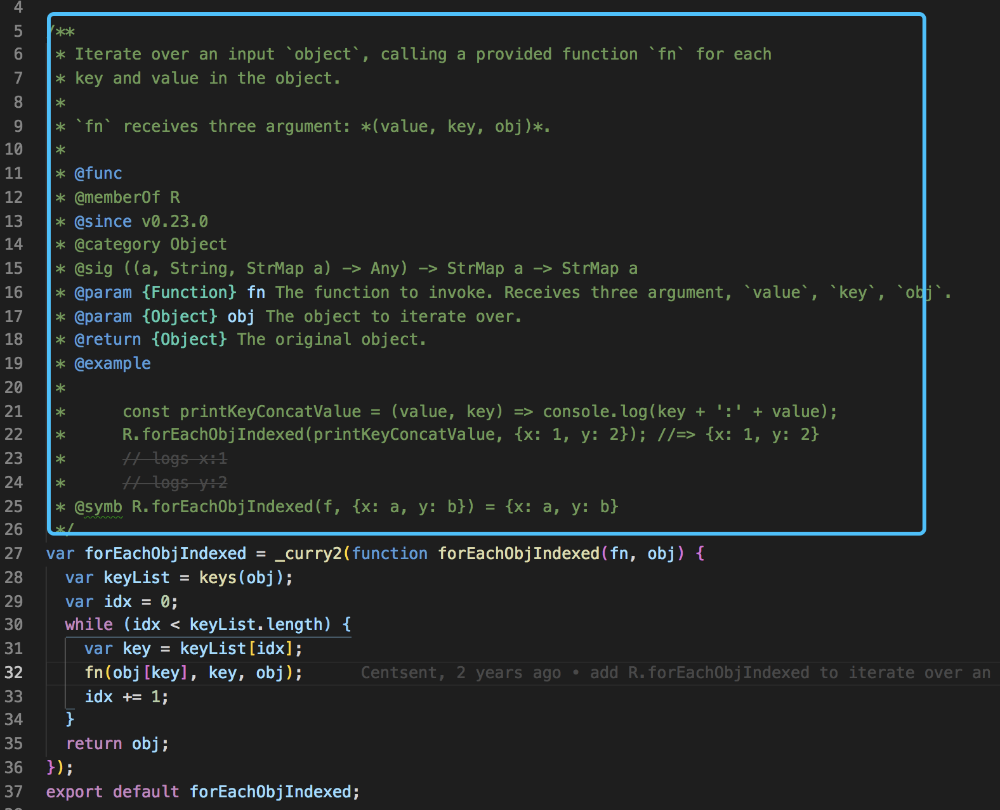
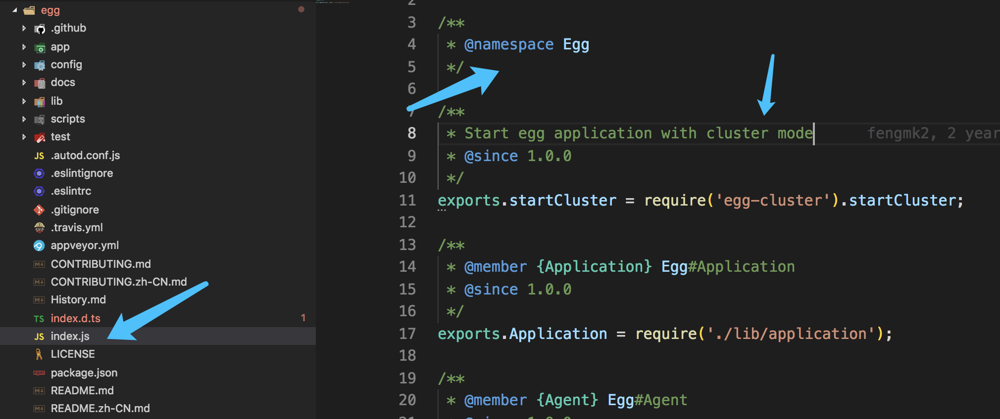
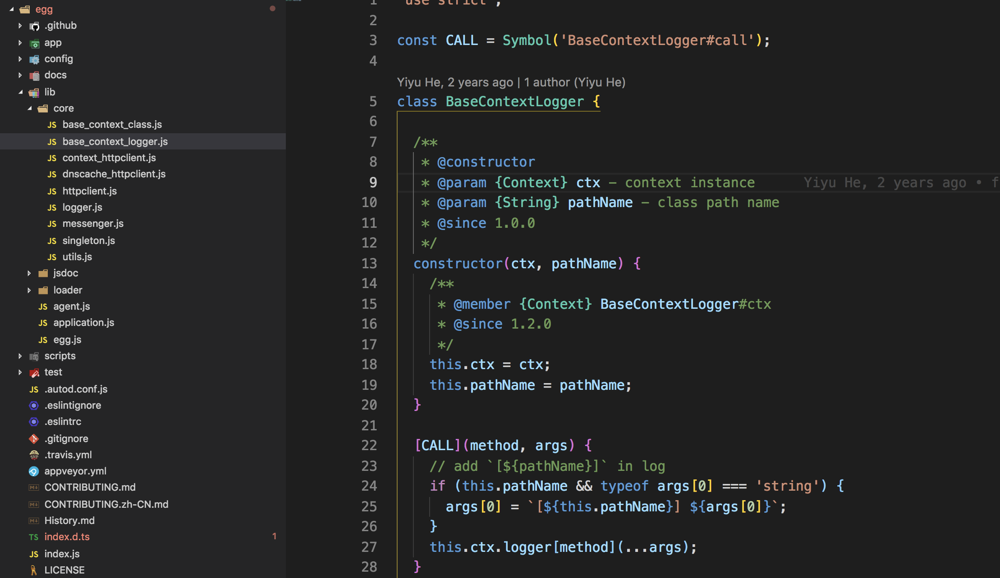
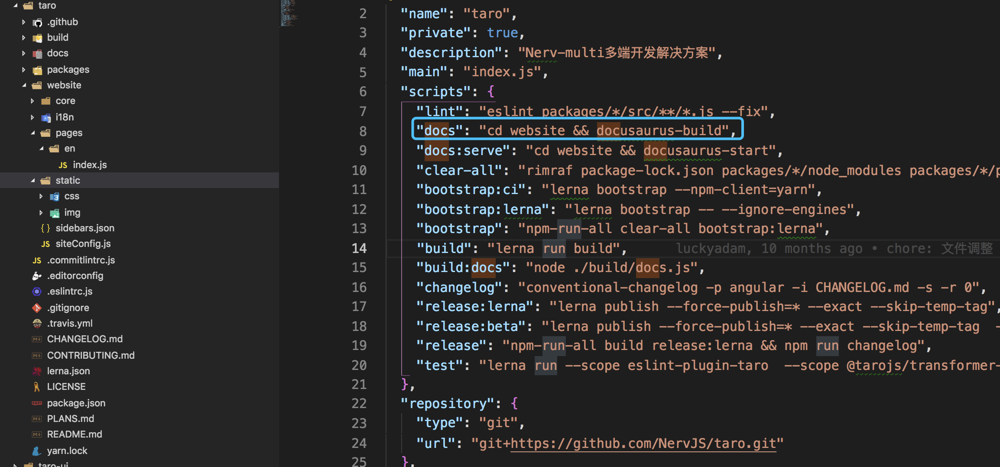
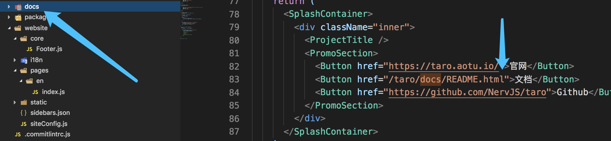
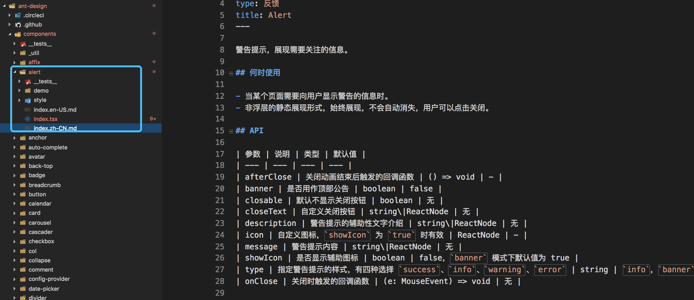
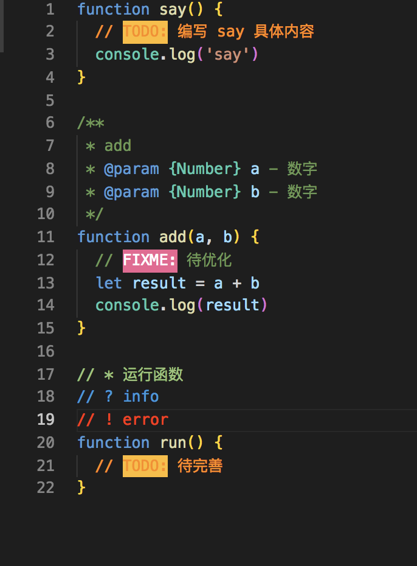

# 如何编写高质量的函数-命名|注释|鲁棒篇



此篇我将会从函数的命名、注释和鲁棒性方面，阐述如何编写高质量的函数。

## 函数命名

从文章开头的图片可以知道，命名和缓存是计算机科学中的两大难题。

而今天要说的是函数命名，虽然函数命名涉及到的范围较窄，但思想都是一样的，完全
可以借鉴到其他的形式中。

我阅读过代码大全的变量一章，也针对性的阅读过一些源码，比如 `lodash` , `ramda` 这些函数工具库。现在根据我个人的一些感悟，总结了一些我个人认为能帮助你彻底解决命名这个事情的 `best practice` 。

> PS: 虽然变量命名这个没有所谓 `best practice` ，但是对于前端的函数命名来说，我个人认为是可以有一套完善的 `best pratice` 的， 听我娓娓道来。


### 目前前端的函数命名存在什么问题

存在什么问题呢？要我说啊，那些业界标准，比如驼峰，首字母大写的类和构造函数，下划线，`$` 等都不是瓶颈。真正的瓶颈是一些你察觉不到的，或者察觉到但是无能无力的细节。比如：

- 中英语言的差异性
- 不懂得从多维度去提升命名的准确性
- 不会使用辅助工具

下面进行简明扼要的分析。

> PS: 关于驼峰等耳熟能详的业界标准我就不再提了。

### 汉语和英语的差异性

为什么一开始要说这个呢，因为我认为这是目前命名中，存在的最大的问题。英语水平好的哥们没多少，很多人不能掌握英语命名的那一套语法规则，说白了就是你英语水平达不到能像外国人那样能写出符合英语 `style` 的名字。

#### 为什么不能用汉语方式命名呢？

理由就三个：

- 用拼音的本质问题：汉语拼音存在多义性，想想就瑟瑟发抖。
- 用汉字的问题：虽然辅助工具已经很完善了，但是没法普及，没法和国际接轨，说白了就一句话，太小众了，外国人没有会的，不跟你玩。
- 鄙视链已经形成(emmmm)。

#### 用英语时遇到的困难

最大的困难就是 **不会** 。

我举个例子，都知道 `react` 的生命周期吧，如下：

- `componentDidMount`

- `componentWillReceiveProps`

- `shouldComponentUpdate`


很多人都会有疑问，为什么用 `did` ，为什么用 `will` 。行吧，记住就完事了，然后过了一段时间，面试的被问到了，然后心里 `ob：` 是 `componentMounted` 还是啥来...

多么鲜活的例子，嗯，继续往下读吧，后面有惊(极)为(为)天(惊)人(悚)的答案。

### 如何让命名有英语 style

> 黑人脸，怎么让啊？

老哥，多翻翻高中或者初中的英语语法知识吧。比如我举个最简单的例子，你就知道了。

> `componentDidMount` 是 `react` 等生命周期的钩子，但是为什么要这样命名？

> `componentWillReceiveProps` 为什么要这样命名？

答案就在下图：



注意上图中的 `did` 代表一般过去时，`will` 代表一般将来时。

然后我们百科一般过去式和一般将来时，然后如图所示：

一般过去时：


一般将来时：


看上图的红箭头，`did` 表示一般过去时，时是指动作发生的时间，用在这里，突出了钩子的含义，一旦 `mount` 成功就执行此函数。是不是瞬间明白了，好了，`will` 同理。

啥也别说了，赶紧去好好看看初高中英语语法吧。


### 通过函数返回结果来命名

这是个小特性，比如 `shouldComponentUpdate` ， 为什么 `should` 放在最前面。

因为这个函数返回的值是布尔值。那么我们可以理解为这是个问句，通过问句的形式来告诉我们，这里具有不确定性，需要根据返回值来判断是否更新。

> 关于问句的英语语法，老铁们还要多翻翻语法书啊(泪)。


### 借助工具

#### 借助谷歌翻译

谷歌翻译这个就不说了，大家都会

#### 借助 codelf

这是一个神器，用来搜索各种开源项目中的变量命名，来给你提供参考。



> 地址：https://unbug.github.io/codelf/


对应名字的 `VSCODE` 插件也有，具体怎么用，小伙伴自行去了解吧。


### 如何避免函数命名的多义性和不可读性

可能你给一个函数命名了，其他人看到这个函数时，一脸懵逼，完全不知道这命名的啥子东西哟，只能靠猜。

比如我从 `ramda` 源码中找了一个函数，代码如下：
```js
var forEachObjIndexed = _curry2(function forEachObjIndexed(fn, obj) {
  var keyList = keys(obj);
  var idx = 0;
  while (idx < keyList.length) {
    var key = keyList[idx];
    fn(obj[key], key, obj);
    idx += 1;
  }
  return obj;
});
export default forEachObjIndexed;

```

这个函数叫 `forEachObjIndexed` ，看到这个命名，是不是一脸懵逼，反正我第一次看到是懵逼了，这啥子嘛，什么鬼东西，然后我就去趴了下源码，从源码里面的函数注释中才知道是干啥的，函数注释如下图：



看到没，多详细，当然，这是为了输出文档用的，但是给了我们一起非常好的解决方法。那就是：

如果你实在想不到如何去命名，或者你自己已经知道这个命名很烂了，比如太长，比如很难理解，那这个时候你就别挣扎了。写一个你觉得还 `ok` 的命名，然后把剩下的时间留给你写注释吧。比如 `forEachObjIndexed` 的第一部分的注释就是对整个函数的整体介绍和说明。

如果你的函数命名很烂，那这个时候，函数的整体介绍和说明就显得非常重要了。这部分你一定要做好，英语水平不好的话，那就老老实实写中文。这部分做好了，这个函数你哪怕用两行文字命名的，或者用了火星文命名的，也没关系，问题不大。

### 函数命名的分类

最后说一说命名的分类，这是我个人的一些看法。

为什么我会说函数命名的分类呢，是因为我们经常会看到函数会这样命名(源码中很普遍)。比如:

```js
- $xxx()
- _xxx()
```

这种带各种前缀的函数名，看起来并不好看。这样命名，在我个人看起来是非常别扭的，但是为什么要有这种命名呢，其实这是前端的无奈之举。

> 核心原因就是 `JS` 语言不支持私有变量，导致只能使用 `_` 或者 `$` 来保证相应的对外不可见，通过治标不治本的方法来解决这个问题。


所以我把前端的函数命名分为两大类，如下：

第一类：不想暴露给外部访问的函数(比如只给内部使用)

第二类：暴露给外部访问的函数(各种功能方法)

我个人目前的观点，大致也就这两大类了。

> PS：这里我没把 Symbol 初始化的函数命名考虑在内，比如如下代码：

```js
const ADD = Symbol('add')

[ADD](a, b) {
  console.log('a + b')
}
```

关于 `Symbol` 的用法，大家可以自行了解，这种特例我就不考虑在内了。

> PS：关于这个无奈之举，在了解的更多的时候，会发现在前端，并没有什么方法(设计模式也好，`hack` 方法也好)能绝对的解决上面的问题，所以有时候你不得不使用 `_` 等，因为当都不能解决这个问题的时候，那越简单的方式越受欢迎，这就是现实。

### 总结

总结一下最佳实践：

**多学习初中高中英语语法，开源项目中的函数命名没有那么难理解，通过语法的学习和借助工具，函数命名基本可以解决，如果遇到无法清晰描述所写函数的目的的命名时，请务必给函数写上良好注释，不管函数名字有多长多难懂，只要有良好的注释，那就是可以接受的一件事情。毕竟你也不想命名的这么难懂啊，但是能力有限，那就用汉语做好注释吧，这样的效果也是杠杠的。**

如何通过良好的函数命名来提供函数的质量，我也说的差不多了，答案都在文字中，如何去借助工具，如何去理解英语中的命名语法，如何去通过多维度来增加命名含义的准确性和可读性。简单聊了下目前前端界函数命名的分类，大家自行体会和运用吧。

> PS：一些都知道的点我就不说了，比如动词+名词，名词+动词，驼峰等，清晰描述函数的目的，这都不是痛点，痛点我都说了，最佳实践也说了。


## 函数的注释
我们来谈函数的注释，注释一方面提高了可读性，另一方面也可以通过注释去做一些其它的事情，比如生成在线文档。一个高质量的函数，注释少不了的，但是这并不代表所有的函数都需要注释。富有富的活法，穷有穷的潇洒，重要或者说复杂的函数，那就给个好注释，简单或者不重要的函数，可以不给注释或者给一个简单的注释。说空话没有意义，我们来看看目前函数的注释都有哪几种方式。

> PS：这里要注意我上面的用词，如果你觉得这个函数命名很烂，那你就应该给一个好的注释。


### 先说一些有名的npm包的一些注释风格
就像大学里面写论文之前，都要阅读很多文献资料，我们也一样，我们来看看几个有名的 `npm` 包是怎么玩注释的。

#### egg.js 的注释风格



从图中，我们看到 `egg.js` 的入口文件的注释情况，暂且不去判断这是不是一种 `doc` 工具的注释规则(不要在意细节)。我们就看一下其注释特点，是不是发现和你脑海中的注释风格又有区别了呢。这种入口文件的注释特点，简单整洁，这种思想是不是要吸收一波，以后你做开源项目的时候，这些思想都可以带给你灵感。

继续看下图：


这是一个被抽象出来的基类，展示了作者 [`Yiyu He`] 当时写这个类的时候，其注释的风格。从这张图中，我们能学到什么呢？有以下几点：

第一点：构造函数的注释规则，表达式语句的注释规则。

第二点：注释的取舍，有一些变量可以不用注释，有些要注释，不要有那种要注释就要全部注释的思想。

再看两张有趣的图片：





看上面两张图的箭头，指向的都是同一个作者 [`fengmk2`] ， 我们看他的函数注释规则。体会一下不同，想想为什么第一张图没有空格，第二种有空格，还有对返回的 `this` 的注释，比如很多人习惯将 `this` 直接注释成 `Object` 类型。

#### lodash.js

说到函数注释，就不能不说到 `lodash.js` 。但是写到这，我发现这块要是加上去的话，第二篇的文字就又超了，那这里就不再说了，大家自己看看源码分析一下吧(这操作真香)。


### 通过注释生成在线文档的思考

有人说注释要很规范，方便给别人，比如用 `jsdoc` 等 。这里我个人的看法是这样的，对一些不需要开源的 `web` 项目，没有必要用 `jsdoc` ， 理由如下：

1. 繁琐，需要按照 `jsdoc` 规则来
2. 个人认为，`jsdoc` 有入侵性，文档规则需要写在代码中。

这里我认为如果要写注释说明手册，对于大型项目，我推荐使用 `apidoc` ， 因为 `apidoc` 入侵性不强，不要求把规则写在代码中，你可以把所有规则写到一个文件中。具体使用方法，我就不说了，自行搜索相关资料。

但是一般小项目，没有必要单独写一份 `api` 文档。如果是开源的大型项目，那你要考虑的事情就更多了，首先需要有开源的官方网站，你会看到网上的一些开源项目官网好像很酷，其实这个世界上不缺的就是轮子，你也可以很快的做出这样的网站，下面我们来看看是如何做到的。

首先我们看一下 `taro` 源码，会发现如下图：


这里就是生成一个静态网站的秘密，执行这个 `npm run docs` 就可以了。用到的是 `docusaurus` 包，不知道的可以自行搜索。

然后这里你看下图：


从图中可以知道，文档的内容，来源于 `docs` 目录，里面都是 `md` 文件，开源项目的文档说明都在这里。

当然也有把对应的文档直接放到对应的代码目录下的，比如 `ant-design` 如下图：



就是直接把文档放在组件目录下了。

从这里，我们可以知道，目前流行的开源项目的官方网站是怎么实现的，以及文档该怎么写。你可以说这和函数注释没有什么关系，但是想想好像又有点关系，这里就不多言了，自己体会吧。


### 我个人的注释习惯

下面说说我本人对函数注释(只针对函数注释)的一些个人风格或者意见。

#### 分享 `VSCode` 关于注释的几个工具

- `Better Comments` 给注释上色 
- `Document This` 自动生成注释
- `TODO Highlight` 高亮 `TODO` ，并可以搜寻所有 `TODO`


具体用法就不说了，下面是一张演示图，自行去研究吧：



---------------

#### 写和不写注释的平衡

我个人的观点是这样的：

不影响可读性，复杂度低，对外界没有过度干涉的函数可以不写注释。

#### 表达式语句的注释

函数内，表达式语句的注释可以简单点，我一般如下图所示，`//` 后面加简要说明。

```js
function add(a, b) {
  // sum ....
  let sum = a + b
}
```

#### TODO 注释

```js
function say() {
  // TODO: 编写 say 具体内容
  console.log('say')
}
```

#### FIXME 注释

```js
function fix() {
  // FIXME: 删除 console.log方法
  console.log('fix')
}
```
#### 函数注释

一般我分为普通函数和构造函数。


> 普通函数注释：

```js
/**
 * add
 * @param {Number} a - 数字
 * @param {Number} b - 数字
 * @returns {Number} result - 两个整数之和
 */
function add(a, b) {
  // FIXME: 这里要对 a, b 参数进行类型判断
  let result = a + b
  return (result)
}
```

> 构造函数注释：

```js
class Kun {
  /**
   * @constructor
   * @param {Object} opt - 配置对象 
   */
  constructor(opt = {}) {
    // 语句注释
    this.config = opt
  }
}
```

### 总结
从开源项目的代码中可以发现，注释的风格多种多样，有时候我自己不同项目的注释风格也有点差别，但是我会尽可能的去平衡注释和不注释，上面注释的基本原则还是要遵守的。

但是怎么说呢，注释这块不存在银弹。

## 函数的鲁棒性(防御性编程)

大家都听过防御性编程对吧，`let it crash` 。 我们看一个段子，下图：


看最后一句，测试测了那么多场景，最后酒吧还是炸了(哈哈哈哈哈哈怎么回事？)。

所以，我们可以看出，防御性编程的核心就是：

**把所有可能会出现的异常都考虑到，并且做相应处理。**

但是我个人认为，防御性的程度要看其重要的程度。一般来说，不可能去处理所有情况的，但是提高代码鲁棒性的有效途径就是进行防御性的编程。

### 一个项目的思考
我接手过一个需求，重写(完全重构)苏宁易购微信小程序的登录注册绑定的功能，并将代码同步到苏宁其他小程序(和其他小程序的开发进行代码交接并协助 `coder` 平稳完成版本过渡)。

这个项目重要性不言而喻，由于用户的基数很大，风险程度很高，需要考虑很多场景，比如：

1. 支不支持线上版本回退，也就是需要有前端的 `AB` 版本方案(线上有任何问题，可以快速切到旧登录方案)

2. 需要有各种验证：图形验证码、短信验证码、`ip` 、人机、设备指纹、风控、各种异常处理、异常埋点上报等。

3. 代码层面的考虑：通过代码优化，缩短总的响应时间，提高用户体验。

4. 如何确保单个节点出问题，不会影响整个登录流程。

你会发现，需要考虑的点很多，如何去合理的完成这个需求还是比较有难度的。


> PS: 关于第四点的如何确保单个节点出问题，不会影响整个登录流程，文末有答案。

下面我就关于函数鲁棒性，说一说我个人的一些看法。

### 前端函数鲁棒性的几种方式

#### 入参要鲁棒性

在 `ES6` 的到来后，函数的入参写法已经得到了质的提高和优化。看下面代码

```js
function print(obj = {}) {
  console.log('name', obj.name)
  console.log('age', obj.age)
}
```
    
`print` 函数，入参是 `obj` 通过 `obj = {}` 来给入参设置默认的参数值，从而提高入参的鲁棒性。

但是你会发现，如果入参的默认值是 `{}` ，那函数里面的 `obj.name` 就会是 `undefined` ，这也不够鲁棒，所以下面就要说说函数内表达式语句的鲁棒性了。

#### 函数内表达式语句要鲁棒性
继续上个例子：

```js
function print(obj = {}) {
  console.log('name:', obj.name || '未知姓名')
  console.log('age:', obj.age || '未知年龄')
}
```

如果这样的话，那你会发现表达式语句就变得比较鲁棒性了，但是还不够好，这样写不够抽象，我们换种方式稍微把表达式语句给解耦一下，代码如下：

```js
function print(obj = {}) {
  const { name = '未知姓名', age = '未知年龄' } = obj
  console.log('name:', name)
  console.log('age:', age)
}
```

这样的话，看起来就感觉好多了，其实还可以再抽象，比如吧 `console.log` 封装成 `log` 函数，通过调用 `log(name)` ，就能完成 `console.log('name:', name)` 的功能， 这里就不再说了，自行研究吧。


#### 函数异常处理的两个层面

> 上面的那几个点，我个人认为可以归类到一个方案层面去，那就是：

**防患于未然，从一开始就不要让异常发生。**

> 但是不要忘了，总会有万一，还有一个方案层面要去考虑，那就是：

**异常还是出现了，该怎么去处理出现的异常。**

下面两个层面已经确定了，那如何去更好的处理各种异常，提高函数的鲁棒性呢，我个人有以下几点看法。

#### 推导一下 `try/catch` 的原理

有很多人不清楚怎么去用 `try/catch` 。这里我来按照我个人的见解，来推一下其原理吧，首先 `js` 是运行在 `node.js` 提供的运行时环境中的，而 `node.js` 是用 `C++` 写的。`C++` 是有自己的异常处理机制的，也是有 `try/catch` 的 。那就说明 `js` 的 `try/catch` 的底层实现是直接通过桥，调用 `C++` 的 `try/catch` 。

而 `C++` 的 `try/catch` 具有的一些特性，大家可以自行去了解一下，比如其中就有一个特性是这样的：

`try/catch` 只能捕捉当前线程的异常。

所以这也就很好的解释了，为什么 `JS` 的 `try/catch` 只能捕捉到同步的异常，而对于异步的异常就无能为力了(因为异步是放在另一个线程中执行的)。

> 这里是我的推导，不代表确切答案。

这里我推荐一篇博客：

> [C++中try、catch 异常处理机制](https://blog.csdn.net/qq_40191710/article/details/81063878)

有兴趣的可以看看。


#### 合理的处理异常

这里有几个方法：

> 第一个方法：如果是同步的操作，可以用 `throw` 来传递异常

看下面代码：

```js
try {
  throw new Error('hello godkun, i am an Error ')
  console.log('throw 之后的处代码不执行')
} catch (e) {
  console.log(e.message)
}
```

首先我们要知道 `throw` 是以同步的方式传递异常的，也就是 `throw` 要和使用 `throw` 传递错误的函数拥有相同的上下文环境。

如果上下文环境中，都没有使用 `try/catch` 的话，但是又 `throw` 了异常，那么程序大概率会崩溃。

如果是 `nodejs` ，这个时候就应该再加一个进程级的 `uncaughtException` 来捕捉这种没有被捕捉的异常。通常还会加上 `unhandledRejection` 的异常处理。


> 第二个方法：如果是异步的操作

有三种方式：

1. 使用`callback` ，比如 `nodejs` 的 `error first` 风格

2. 对于复杂的情况可以使用基于 `Event` 的方式来做，调用者来监听对象的 `error` 事件

3. 使用 `promise` 和 `async/await` 来捕捉异常


现在的问题是，怎么去选择哪个方式呢？有这几个原则：

1. 简单的场景，直接使用 `promise` 和 `async/await` 来捕捉异常

2. 复杂的场景，比如可能会产生多个错误，这个时候最好用 `Event` 的方式


> 第三个方法：如果既有异步操作又有同步操作

怎么办呢？这个时候，我个人认为，最好的方式，就是使用最新的语法：`async/await` 来结合 `promise` 和 `try/catch` 来完成对既有同步操作又有异步操作的异常捕捉。

> 第四个方法：处理异常的一些抽象和封装

对处理异常的函数进行抽象和封装也是提高函数质量的一个途径。如何对处理异常进行抽象和封装呢？有几个方式可以搞定它：

- 第一个方式：对 `nodejs` 来说，通常将异常处理封装成中间件，比如基于 `express/koa` 的异常中间件，通常情况下，处理异常的中间件要作为最后一个中间件加载，目的是为了捕获之前的所有中间件可能出现的错误

- 第二个方式：对前端或者 `nodejs` 来说，可以将异常处理封装成模块，类似 `Event` 的那种。

- 第三种方式：使用装饰器模式，对函数装饰异常处理模块，比如通过装饰器对当前函数包裹一层 `try/catch` 。

- 第四种方式：使用函数式编程中的函子( `Monad` )等来对异常处理进行统一包裹，这里 的 `Monad` 和 `try/catch` 在表现上都相当于一个容器，这是一个相当强大的方法。从 `Monad` 可以扩展出很多异常处理的黑科技，但是我建议慎用，因为不是所有人都能看懂的，要考虑团队的整体技术能力，当然一个人的话，那就随便嗨了。


合理的处理异常，需要能确定使用哪一种方式来处理异常，我大致也说了具体的选择情况，这里我推荐一篇博客：

> [Callback Promise Generator Async-Await 和异常处理的演进](https://mp.weixin.qq.com/s/UYT42aiZ4oVbVmcoR2LrhQ)

目前我见到的讲的最全的处理异常的博客，但我这里说的都是我认为比较重要的主要的点，两者还是有明显区别的，大家融合一下吸收吸收吧。

### 如何确保单个节点出问题，不会影响整个登录流程

比如登录流程需要4个安全验证，按照通常的写法，其中一个挂了，那就全部挂了，但是这不够鲁棒性，如何去解决这个问题呢。这里我提一下，可能很多人都不会注意到。

主要方案就使用将 `promise` 的链式写法换一种方式写，以前的写法是这样的：

伪代码如下：

```js
auth().then(getIP).then(getToken).then(autoLogin).then(xxx).catch(function(){})
```

经过鲁棒调整后，可以改成如下写法：

伪代码如下：
```js
auth().catch(goAuthErrorHandle).then(getIP).catch(goIPErrorHandle).then(function(r){})
```

经过微调后的代码，直接让登录流程的鲁棒性提升了很多，就算出错也可以通过错误处理后，继续传递到下一个方法中。


### 我个人对异常处理的看法
我个人认为对异常的处理，还是要根据实际情况来分析的。大概有以下几点看法：

> 要考虑项目可维护性，团队技术水平

我曾在一个需求中，使用了诸如函子等较为抽象的处理异常的方法，虽然秀了一把(作死)，结果导致，后续这块的需求改动，还得我自己来。嗯，就是这么刺激，因为同事不熟悉函数式编程。

> 要提前预估好项目的复杂性和重要性。

比如在做一个比较重要的业务时，一开始没有想到异常处理需要这么细节，而且一般第一版的时候，需求并没有涉及到很多异常情况处理，但是后续需求迭代优化的时候，发现异常情况处理是如此的多，直接导致需要重写异常处理相关的代码。

所以以后在项目评估的时候，要学会尝试根据项目的重要性，来提前预留好坑位。

这也算是一种面对未来的编程模式。

### 总结
关于函数的鲁棒性(防御性编程)，我介绍了很多东西，基本上是前端或者是 `nodejs` 处理异常的常规方法吧。处理异常不是一个简单的活，工作中还得结合业务去确定合适的异常处理方式，总之，多多实践出真知吧。