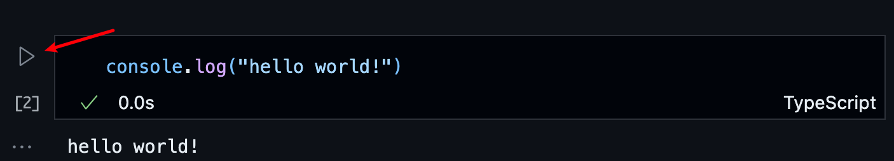

# deno+jupyter尝试

## 背景

工作和学习过程中，时常用jupyter写python代码，突然想到，py和js都是脚本语言，用jupyter写js 是不是也可以实现？

遂简单调研了下，经过尝试，最终确定通过deno可以方便的在jupypter中写js和ts代码

## 目的

jupyter 最大的好处是可以以文本的形式保存运行的结果，还可以很方便的分步骤运行

## 安装deno

```bash
// mac/linux
curl -fsSL https://deno.land/install.sh | sh
// windows
irm https://deno.land/install.ps1 | iex
```

## 安装 python3 和 jupyter

两种方式：

1. 直接安装完 python3 后，再安装 jupyter
```
// 安装完python3后，执行
pip3 install jupyterlab notebook
// 有的人python3的包管理器是pip，那就执行
pip install jupyterlab notebook
```

2. 直接安装 anaconda ，然后搭建python和 jupyter 环境

电脑性能好的，推荐第二种

## 在 jupyer 中使用 deno

执行

```sh
deno jupyter --unstable --install
```

## 在vscode中使用

- 安装 Jupyter 扩展

- 新建 demo.ipynb 文件，点击 选择Jupyter内核 ，然后选择 Deno 作为内核，如下 gif 图所示：


图省事，这里直接用的deno官方文档上的图

至此就可以愉快编写jupyter文档啦

## 简单演示

下面是几个简单的demo，分别演示了：

- hello world
- 读取文件
- 引入远程包
- 处理数据

### hello world

如下图：


### 读取文件
如下图：


### 引入远程包
如下图：


### 处理数据


## 总结

借助 deno 实现 用 jupyter 写 js 和 ts 是很有趣的一种方式，感兴趣的同学可以尝试下。

