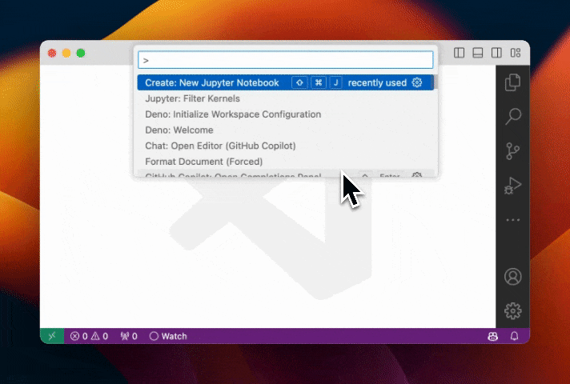
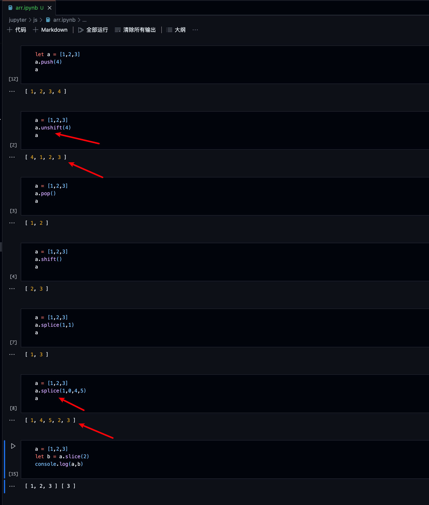
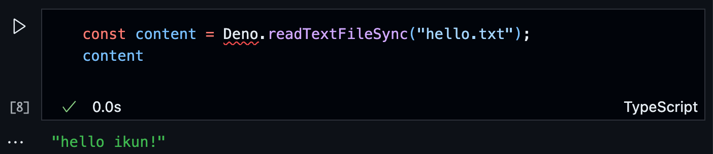
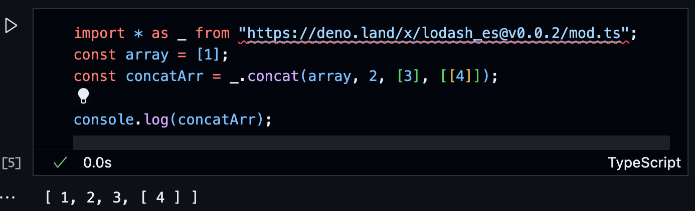
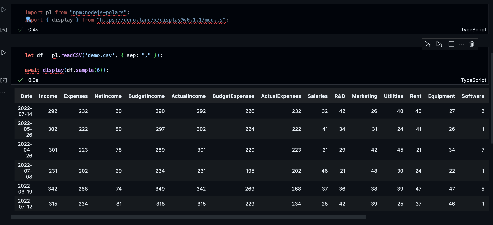

# 确认了！可以 jupyter 写 ts 和 js 代码

## 背景

工作和学习过程中，时常用 `jupyter` 写 `python` 代码，突然想到， `py` 和 `js` 都是脚本语言，用 `jupyter` 写 `js` 是不是也可以实现？

遂简单调研了下，经过尝试，最终确定通过 `deno` 可以方便的在 `jupypter` 中写 `js` 和 `ts` 代码。

## 目的

`jupyter` 最大的好处是可以以文本的形式保存运行的结果，还可以很方便的分步骤运行。

## 安装 deno

```sh
// mac/linux
curl -fsSL https://deno.land/install.sh | sh

// windows
irm https://deno.land/install.ps1 | iex
```

## 安装 python3 和 jupyter

有两种方式：

1. 直接安装完 `python3` 后，再安装 `jupyter`

```sh
// 安装完 python3 后，执行
pip3 install jupyterlab notebook
// 有的人 python3 的包管理器是 pip ，那就执行
pip install jupyterlab notebook
```

2. 直接安装 `anaconda` ，然后搭建 `python` 和 `jupyter` 环境

电脑性能好的，推荐第二种

## 在 jupyer 中使用 deno

在终端执行

```sh
deno jupyter --unstable --install
```

## 在 vscode 中使用

- 安装 `jupyter` 扩展

- 新建 demo.ipynb 文件，点击 选择 `jupyter` 内核 ，然后选择 `deno` 作为内核，如下 `gif` 图所示：



图省事，这里直接用的 `deno` 官方文档上的图

至此就可以愉快编写 `jupyter` 文档啦

## 例子演示

下面是几个简单的 `demo` ，分别演示了：

- 存储运行结果
- 读取文件
- 引入远程包
- 处理数据

### 存储运行结果

比如你想知道对一个数组做 `push、pop、shift、unshift、splice、slice` 操作，其数组自身会不会改变

可以按下图操作：


运行的结果可以以文本的形式保存，后续也不用再运行看结果了。其中方便之处，溢于言表。

### 读取文件

读取写有 hello ikun! 的 `txt` 文件，如下图所示：



### 引入远程包

引入 `lodash` 包，如下图所示：



### 处理数据

使用 `polars` 包，像 `pandas` 那样处理 `cvs` 数据，如下图所示：



## 总结

借助 `deno` 实现 用 `jupyter` 写 `js` 和 `ts` 是很有趣的一种方式，感兴趣的同学可以尝试下。
