# node应用故障定位顶级技巧—动态追踪技术[Dynamic Trace]

## 背景和行文目的

在做 `node` 或者其他语言的软件开发时，是否有以下经历：

1. 测试环境一切正常，发到生产环境后，出现诡异问题且难以定位
2. 不同机器、不同容器上，某些逻辑呈现不同的结果，如时区、 `host`
3. 对于时好时坏的玄学问题，束手无策，没有完整的解决思路，无头苍蝇般的各种尝试，效率低下
4. 遇到坑，习惯搜网友解决方案,然后试很多方案，都不能解决问题，此时就会感觉头皮发麻😂

我相信，上述我说的经历，大多数人都会有所共鸣。本文，我将尽可能的把我所学的动态追踪技术分享给大家。

文章内容如下所示：

1. 介绍 `Dynamic Trace` 的概念、优势、原理和用法(我们需要掌握的那部分)
2. 通过 `demo` ， 展示 `Dynamic Trace` 技术的强大
3. 实战演示： 搭建 `node` 性能监控 `easy-monitor` 和构建 `node` 应用，构造诡异故障，并阐述如何用 `Dynamic Trace` 去精确快速定位
4. 分享代码： 会把实战演示的代码放到 `github` 上，大家可以 `clone` 自行去体验
5. 动态追踪技术的未来： 介绍下目前最领先的 `Dynamic Trace` 方案
6. 总结： 做一个精简的总结
7. 附： 其他内容

话不多说，直接开整。

## 动态追踪技术

### 是什么

这里我把章亦春大佬的原话引用过来：

动态追踪技术其实是一种后现代的高级调试技术。它可以帮助软件工程师以非常低的成本，在非常短的时间内，回答一些很难的关于软件系统方面的问题，从而更快速地排查和解决问题。

### 优势

优势如下：

- 随时随地，按需采集
- 基于操作系统内核实现，性能损耗极小

### 原理

动态追踪的事件源根据事件类型不同，主要分为静态探针、动态探针以及硬件事件，其原理如下图所示：

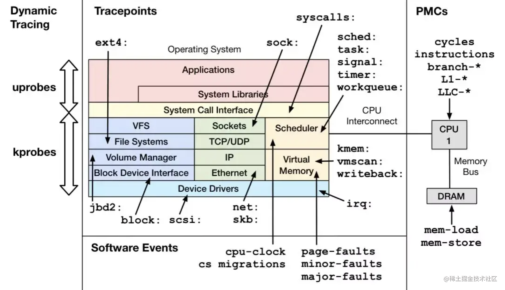

看不懂也正常，我也看不懂，不过会用进行，就跟你不会造车，但你可以把车开的很溜。

简单点说，就是在 `linux` 中，进程不能直接访问硬件设备，当进程需要访问硬件设备时，如 `IO` 操作，必须由用户态切换至内核态，然后通过操作系统调用硬件设备。
所以可以通过跟踪进程产生的系统调用，来获得参数、返回值、执行时间，从而完成动态追踪。

我们用的多的是动态探针，它可以让我们实时分析线上运行的程序。

### 用法

动态追踪工具有 `strace` 、 `dtruss` 、 `systemtap` 、 `perf` 、 `dtrace` 、 `eBPF` 等，我这边使用的是 `strace` 和 `dtruss` 。

也就是 `linux` 环境使用 `strace` ， `macos` 系统使用 `dtruss` 。

strace 的主要参数说明如下表所示：

|  参数名   | 含义  |
|  ----  | ----  |
| -v  | 输出所有的系统调用，一些调用关于环境变量、状态、输入输出等调用由于使用频繁，默认不输出 |
| -s SIZE  | 指定输出的字符串的最大长度，默认为32，文件名一直全部输出 |
| -p PID  | 跟踪指定的进程pid |
| -c  | 统计每一系统调用的所执行的时间,次数和出错的次数等 |
| -d  | 输出strace关于标准错误的调试信息 |
| -f  | 跟踪由fork调用所产生的子进程 |
| -o filename  | 将strace的输出写入文件filename |
| -e trace=network  | 跟踪与网络有关的所有系统调用 |
| -e trace=file  | 只跟踪有关文件操作的系统调用 |

以上参数用的最多的就是 -v 、 -s 、 -p 、 -c 。

比如我现在想看部署在 `linux` 上的 `node` 应用运行时的信息，那我就可以执行以下命令

```sh
strace -p 8000 -v -s 2048
```

参照参数说明表解读上述命令： 跟踪 `pid` 为 `8000` 的进程（ `node` 应用），输出所有的运行时系统调用，同时指定字符串最大长度为 `2048` 。

同理， `dtruss` 的主要参数说明如下表所示：

|  参数名   | 含义  |
|  ----  | ----  |
| -a  | 输出所有详细信息 |
| -p PID  | 跟踪指定的进程pid |
| -c  | 输出系统调用计数 |
| -d  | 输出相对时间 |
| -e  | 输出运行时间 |
| -f  | 跟踪由fork调用所产生的子进程 |
| -t  | 仅检查此系统调用 |
| -s  | 输出堆栈回溯 |
| -o  | 输出cpu时间 |

以上参数用的最多的就是 -p 、 -c 、 e 、 f 。

注意： 在 `macos` 系统上使用 `dtruss` ， 要先执行 `csrutil disable`

命令行例子就不举了，和 `strace` 是一样的道理。

## demo 演示

场景：
大家在做开发的时候，有的会遇到时区问题，比如说在我的机器上，时间是对的，但是在其他机器或者容器上，时间是不对的。然后你就很疑惑，开始搜，找到了所谓的执行下某个命令就好了。

思考：
你有没有想过两台机器的时间为什么不一样，是哪个环节出了问题，比如下面代码在两台机器上的输出结果为什么不同。

```js
console.log(new Date().toLocaleString())
```

如果你知道动态追踪技术，那你就可以开启 **透视眼 ** ， 看看在系统内核层面，上面代码究竟做了什么事情。

动态追踪：

参照 `dtruss` 参数表，我们执行如下命令

```sh
sudo dtruss -of node time.js
```

控制台如下图：

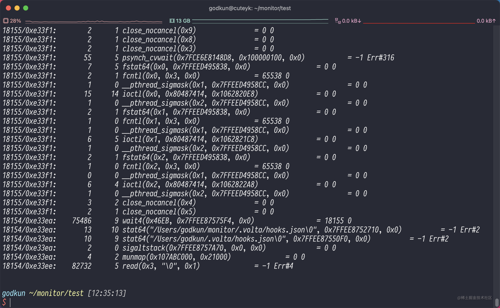

输出了非常多的东西，没关系，我们直接搜 `toLocaleString` 关键词，结果如下：

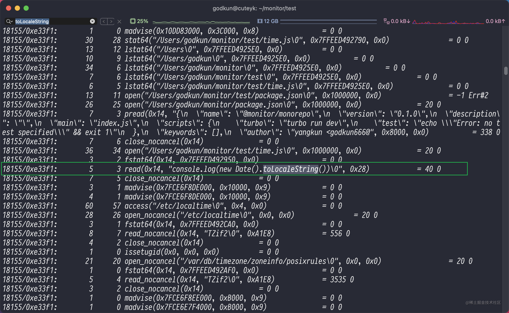

会发现图中绿色框中 `read(0x14, "console.log(new Date().toLocaleString())\0", 0x28)` 出现了搜索的关键词，
这句表达式的字面含义是： 系统在读取 `time.js` 中的内容。

我们顺着上面语句往下阅读，会发现如下图所示重要语句：

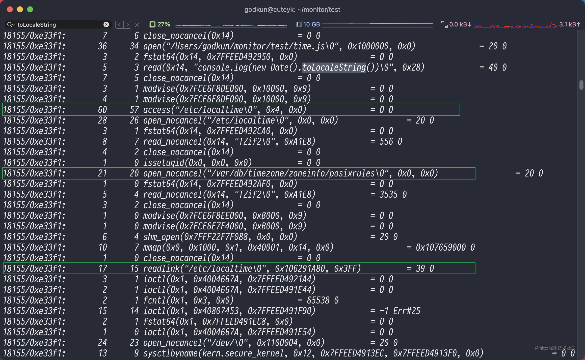

看到上面三个绿色框内容后，已经基本确定， `new Date().toLocaleString()` 返回值， 是系统层面读取 `/etc/localtime` 的内容。也就是说，这个问题的原因是不同机器的 `/etc/localtime` 不一样

看到这你会明白：

- 为什么不同机器的返回值会不一样
- 为什么网上给的时区解决方案是和 `/etc/localtime` 有关的

上面这个小 `demo` ，可以让我们更好的感知用 `Dynamic Trace` 所带来的巨大好处，所有的代码在内核层面都是裸奔的，它可以帮你更好的定位稀奇古怪的问题。

## 实战演示

为了更方便的演示，我这边所有操作都是在 `mac` 电脑进行的。 我将做以下操作

- 搭建 `easy-monitor` 环境
- 启动一个 `egg` 应用
- 制造制造问题
- 结合 `easy-monitor` 用 `Dynamic trace` 进行有序精准定位
- 实战总结

### 搭建 easy-monitor 环境

花了 `20` 分钟左右，搭建好一个本地 `easy-monitor` 环境，项目结构如下图所示：

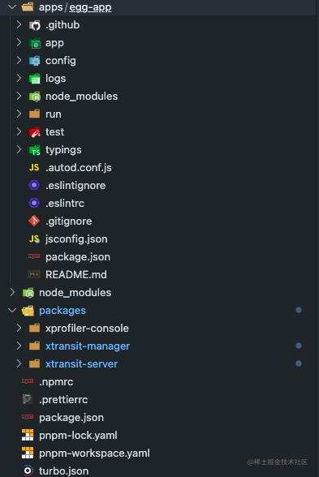

在官网文档的情况下做了一点点优化，优化如下：

1. 将监控模块整合成 `monorepo` 形式，使用 `pnpm` 管理，上 `workspace`
2. 采用 `turbo` ，快速拉起所有包的开发模式

搭建好，一键启动开发环境，终端如下图所示：

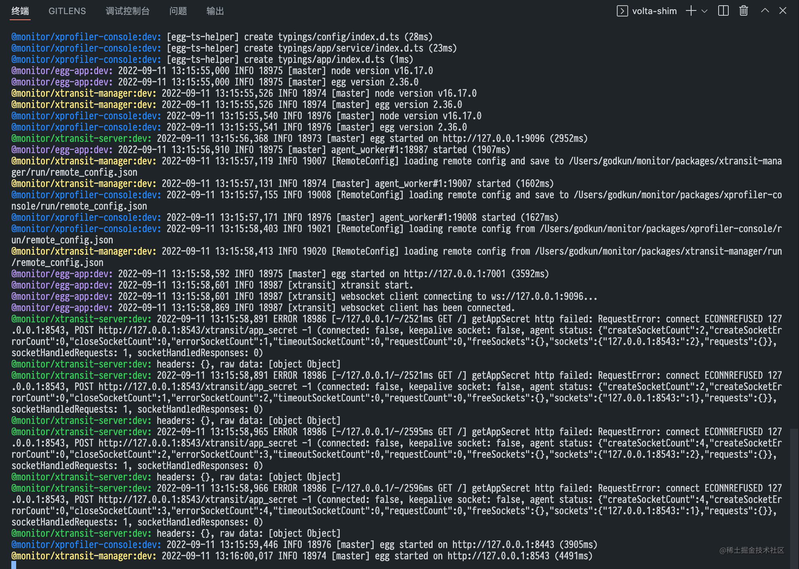

`web` 控制台如下图所示：

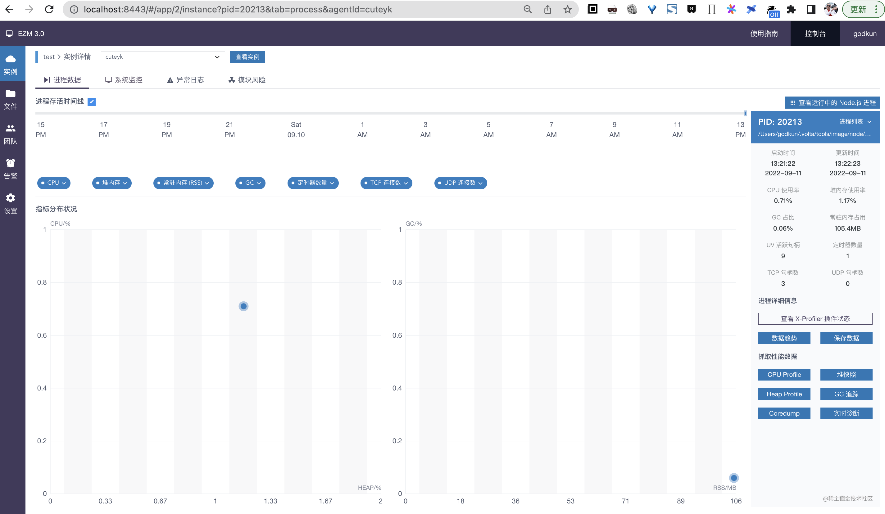

### 启动一个 egg 应用

这个按照官网文档创建一个 `egg` 应用， 然后按照下图所示进行配置即可

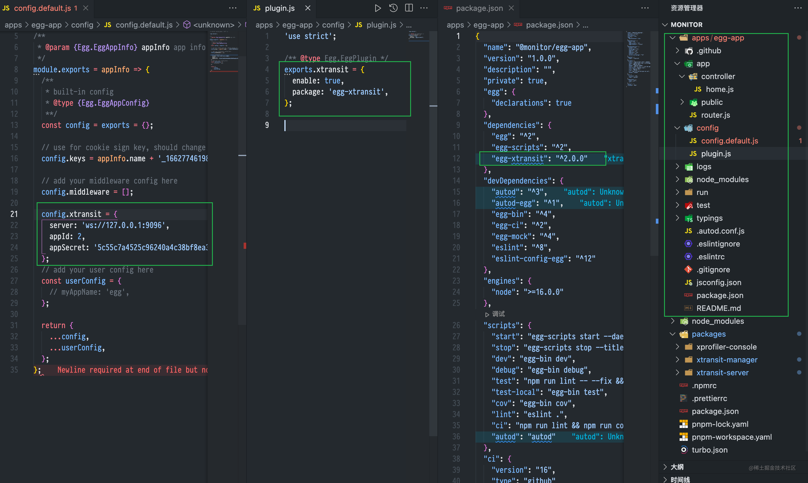

过程非常简单，在上一个过程，我已经用 `turbo` 一起启动 `egg` 应用了。

### 制造问题

简单化， 我们写一个 `node` 服务， 加一个 `bug` 代码。代码如下：

```js
const Controller = require('egg').Controller;
const fs = require('fs');

async function read() {
  const data = await fs.readFileSync(__dirname + '/home.js', 'utf-8');
  if (data) read();
}

class CpuController extends Controller {
  async index() {
    const { ctx } = this;
    ctx.body = 'cpu will be 90%';
    read();
  }
}

module.exports = CpuController;
```

访问路由 `/cpu` 的时候， `node` 服务进行读取 `home.js` 文件死循环状态。 此时 观察 `easy-monitor` `cpu`  状态。如下图所示：

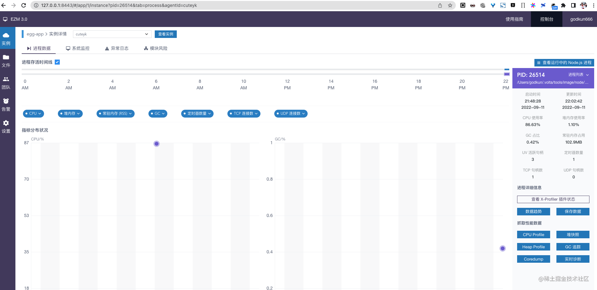

会发现， `cpu` 在逐渐升高，然后开始报警，遇到这种问题，如何快速精准定位呢？

### Dynamic trace 精准定位

在 `easy-monitor` 上发现 `cpu` 持续升高，居高不下时。心里有一个基调，那就是线上可能出问题了，此时，先冷静，然后进行问题定位，步骤如下

1. 确定使 `cpu` 居高不下的进程，这个通过 `easy-monitor` 或者 `top` 命令都可以。
2. 拿到进程 `pid` 后，通过下面命令，来动态追踪，该进程运行时信息和热点函数。

```sh
sudo dtruss -c -p 26514
```

执行 `10` 秒后，退出，查看输出内容，如下图所示：

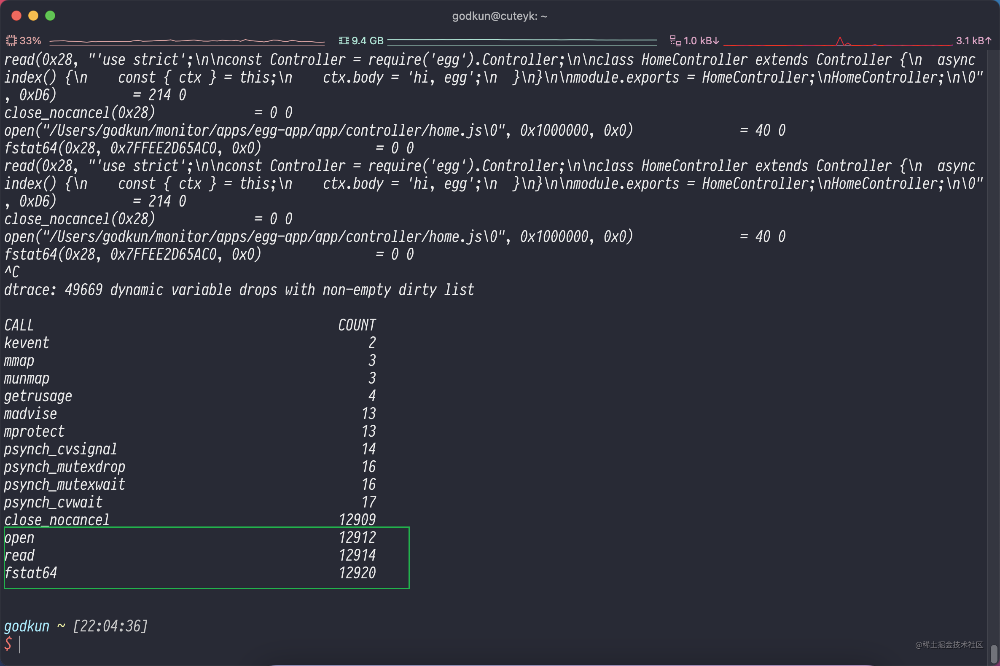

会发现，当前服务，其 `open` 、 `read` 和 `fstat64` 调用次数非常多，心里大概确定该问题和文件操作有关，然后再细致的看下输出内容，如下图所示：

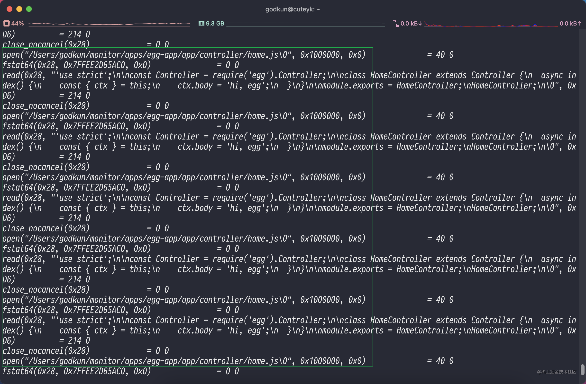

会发现，存在大量的读取路径 `/Users/godkun/monitor/apps/egg-app/app/controller/home.js` 的操作，分析到这，基本可以确定问题的原因之一了，那么后面的事情就非常简单。

快速查阅该部分代码，发现存在隐藏的循序读取逻辑，遂进行优化，优化后， `easy-monitor` 的性能监控显示， `cpu` 立刻下降，且运行平稳。

### 实战总结

我们构造了一个循环读取文件导致 `node` 服务 `cpu` 居高不下的线上问题，然后结合 `easy-monitor` 做性能监控， 同时使用动态追踪技术进行外科手术式精准定位线上问题，最后快速给出解决方案，整个过程有序高效。

可以这么说， 动态追踪 + `easy-monitor` 基本可以解决 `node` 服务遇到的所有疑难杂症。

## 分享代码

实战代码链接： <https://github.com/godkun/dynamic-trace>

代码仓库主要是将 `easy-monitor` 和 `dynamic-trace` 结合，在本地模拟各种问题场景，来学习、理解和掌握。

写的比较急，目前还没做 `mysql` 、 `redis` 的 `docker` 化，后面有空会更新上这个功能。

## 动态追踪技术的未来

### 传统工具

目前的动态追踪工具，如 `dtruss` `strace` `perf` 等，都是诞生时间很久的工具了，在用的过程中，会发现有大量的无用输出，会影响定位效率，这算是一个小小的缺点。

### 潜力工具

在动态追踪工具中，有一个叫 `eBPF` ， 它可以只输出某一行代码活某一段代码和系统交互的信息，可以让我们迅速定位哪里出了问题，而不是面对一大堆输出信息，去阅读、查找、判断和定位。

### 未来 + 顶尖

目前动态追踪领域，最厉害的工具应该是章亦春大佬开发的 `xray` ，但目前没有开源，未来期待春哥开源 `xray` ，将动态追踪能力拉满，造福广大程序员们。

## 总结

到此，本文即将完成，我们可以把动态追踪技术想象成核磁共振。当你的应用出现问题的时候，无需停机、即刻对其做一个扫描，它可以让你看到应用代码在内核层面实时裸奔的画面。

动态追踪是 一种不限于 `node` 服务，可以定位所有服务线上故障的顶级技术。

这里补一个内容，就是可能会有读者问， `easy-monitor` 和 `Dynamic Trace` 有什么区别，为什么不能都用 `easy-monitor` ？

原因很简单： `easy-monitor` 只能到 `JavaScript` 的级别，而 `Dynamic Trace` 是直接到最底层，也就是操作系统的层面。所以，我们既需要 `easy-monitor` ，也更需要 `Dynamic Trace` 。

## 文末彩蛋

文章难免有错误，如有错误和见解，欢迎在评论处交流，也欢迎大家关注我的 `github` 。

https://github.com/godkun

以后我会持续更新更多优质内容，如开源实践、架构设计，也包括一些简洁的观点和见解。

最后，推荐一篇我认为国内写的最好的关于动态追踪技术的文章，链接如下

[动态追踪技术漫谈](https://blog.openresty.com.cn/cn/dynamic-tracing/)

版本声明：未经本人允许，不得转载
