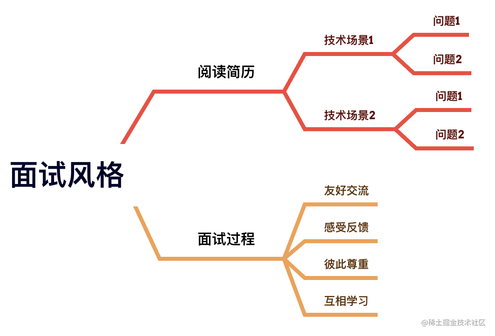
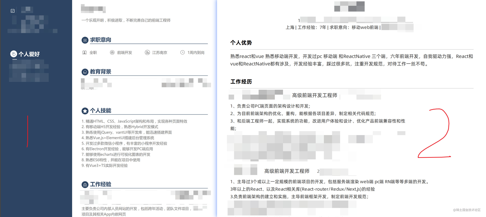
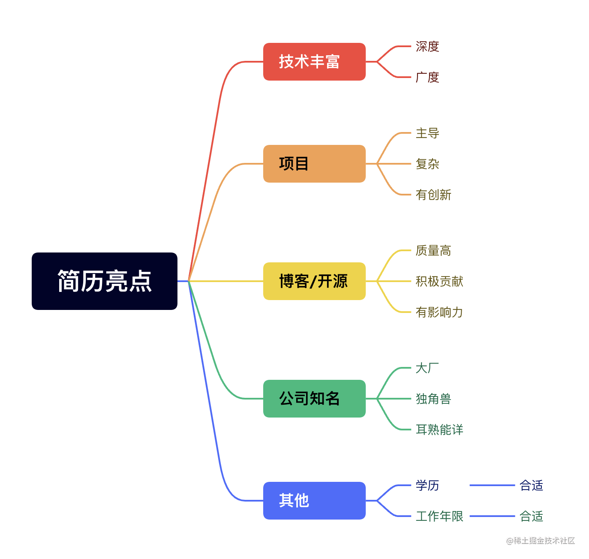
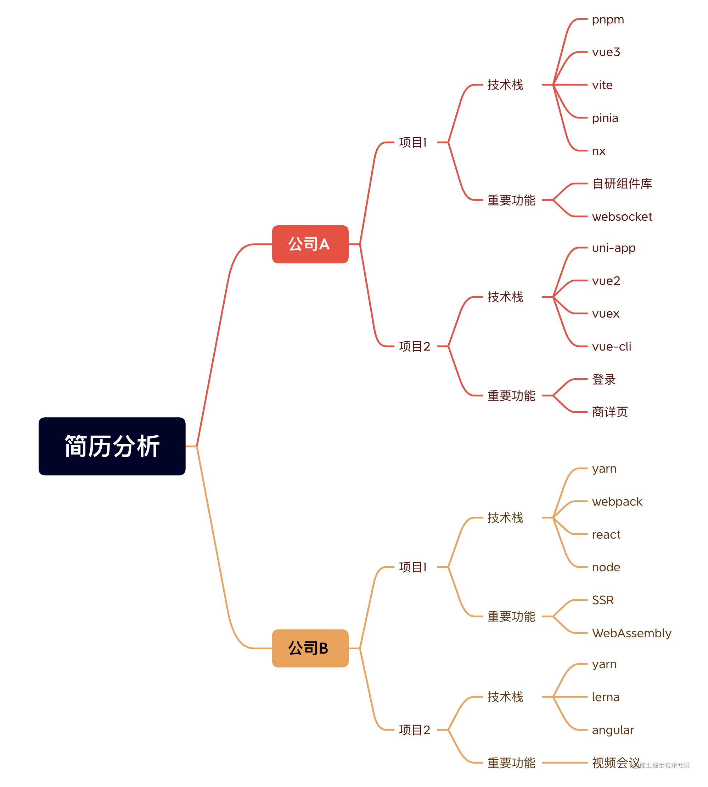

# 我当面试官的经历总结

## 背景

工作之余，负责过公司前端岗位的一些技术面试，一直在想，能不能对这个经历做一个总结，遂有了这篇文章。

文章主要内容如下：

1. 我的面试风格
2. 面试者——简历格式与内容
3. 面试者——简历亮点
4. 面试者——准备面试
5. 面试官——面试前准备
6. 面试官——面试中
7. 面试官——面试结果评价
8. 总结

## 我的面试风格

我非常讨厌问一些稀奇古怪的问题，也不喜欢遇到任何面试者，都准备几个相同的技术问题。我的面试风格可以总结为以下几点：

1. 根据简历内容，提炼和简历深度关联的技术场景
2. 将提炼的技术场景分解成问题，可以是一个问题，也可以是多个问题，可以困难，也可以容易
3. 和面试者进行友好交流，感受面试者的各种反馈，尊重面试者
4. 面试是一个互相学习的过程

以上总结可以用如下思维导图概括：

## 面试者——简历格式与内容

我们看一张两个简历的对比图，如下所示：

上图中的两个简历，代表了大多数人的简历样子。大家可以自行感觉下，哪一个简历更好些。

我对简历格式与内容，有如下两点看法：

1. 我更喜欢图中简历 `2` 的格式，但简历格式不会影响我的面试评价
2. 简历内容是核心，我会根据简历内容来决定要不要面试和如何面试

所以对于面试者来说，一定要写好简历内容。

## 面试者——简历亮点

究竟什么样的内容算是亮点呢？对此，我罗列了简历亮点的思维导图，如下图所示：

简洁阐述下简历亮点思维导图：

1. 技术丰富：有深度，比如你在 `node` 方面做了 `ssr` 、微服务和一些底层工具等；有广度，比如你实践过 `pc` 、 `h5` 、小程序、桌面端、`ssr` 、 `node` 、微前端、低代码等
2. 项目：比如你深度参与或者主导低代码平台项目建设，该项目非常复杂，在建设过程中，做了很多技术等方面的提升和创新，产生了很好的效果
3. 博客/开源：比如你写的博客文章质量高，有自己独特和深入的见解；你在开源方面做了很多贡献，提了一些好的 `pr` ，有自己的开源作品
4. 公司知名：这个好理解，比如你在头部互联网，独角兽等公司工作过
5. 其他：学历和工作年限，算是门槛，合适也是亮点

面试者要善于把自己的亮点展示在简历上，这对于应聘心怡公司来说，是非常重要的事情。

## 面试者——准备面试

面试者在准备面试阶段，应当做好以下 `5` 点：

1. 写好简历内容，这个是重中之重
2. 整理好自我介绍，控制好时间，做到言简意赅，把重点、亮点突出
3. 确定好回答面试官提问的基本方式，保持统一的回答方式
4. 根据简历内容，自己对自己做一次面试，或者找朋友模拟面试官，面试自己
5. 找出不足，进行优化

面试者可以对写好的简历，用思维导图等工具，对内容进行分解，如下图所示：

在分解完成后，我们将相同点进行归纳，然后对多次提及，重复提及，着重提及的归纳进行重点复习和梳理。

这里用上图举 `2` 个归纳例子说明下：

我的技术栈中提及 `pnpm` `yarn` ， 其涉及到的知识点，有以下：

1. 包管理器选型， `npm` `yarn` `pnpm` 三者的区别
2. `monorepo` 设计

我的重要功能提及商详页，其涉及到的知识点，有以下：

1. 性能优化
2. `wap` 端的常见问题，如 `1px` 问题、滚动穿透、响应式、终端适配

做好面试准备，会让你在面试过程中，胸有成竹，运筹帷幄。

## 面试官——面试前准备

主要有以下四个步骤：

1. 看简历：作为面试官，在面试前，要认真看面试者的简历，这是对面试者的尊重
2. 找亮点：这块参考上文提到的面试者亮点
3. 定场景：根据简历内容和亮点，确定深度关联的技术场景
4. 提问题：将确定的技术场景分解成问题，可以是一个问题，也可以是多个问题，可以困难，也可以容易

我认为面试前准备是面试官最重要的流程，这个做好了，剩下的就很容易做了。

## 面试官——面试中

整个过程的主线如下：

1. 官方开头：比如打招呼、面试者自我介绍
2. 重点过程：这个过程主要有两个事情：

第一个事情：按照上文 面试前准备 的内容来和面试者进行沟通交流，衡量面试者的回答和所写简历内容两者之间的联系
第二个事情：对于有疑惑的联系，要二次验证，这个举个例子

比如面试者简历上写，自研组件库。我问他按需加载是怎么实现的，他的回答会有下面两种情况

第一种情况：回答的很好，这个时候我会再讨论一个按需加载相关的小问题，如果回答还是很流畅。那很好，这个就是面试亮点

第二种情况：回答的很差，那我会怀疑自研组件库是不是他用心做的事情。因为他有可能是 fork 一个开源组件库，然后改改，然后就没然后了。这个时候，我倾向于直接和他沟通，比如问他在自研组件库上花了多少时间，是不是随便搞的。在回答很差的前置条件下，面试者大都会说实情。这样我就能掌握正确的信息，避免误解。

3. 官方结尾：上家辞职原因、为什么选择来我司、定居情况、回答面试者提的各种问题

## 面试官——面试结果评价

结果无非就是失败和成功，绝大多数的面试结果评价都是客观公正的，剩下的少数都是一些特殊情况，遇到这种，那就是运气不好了。

## 总结

以上是我作为面试官经历的一次总结，虽然面试次数不多，但依然值得我为此写一个总结，这是一份宝贵的面经。

