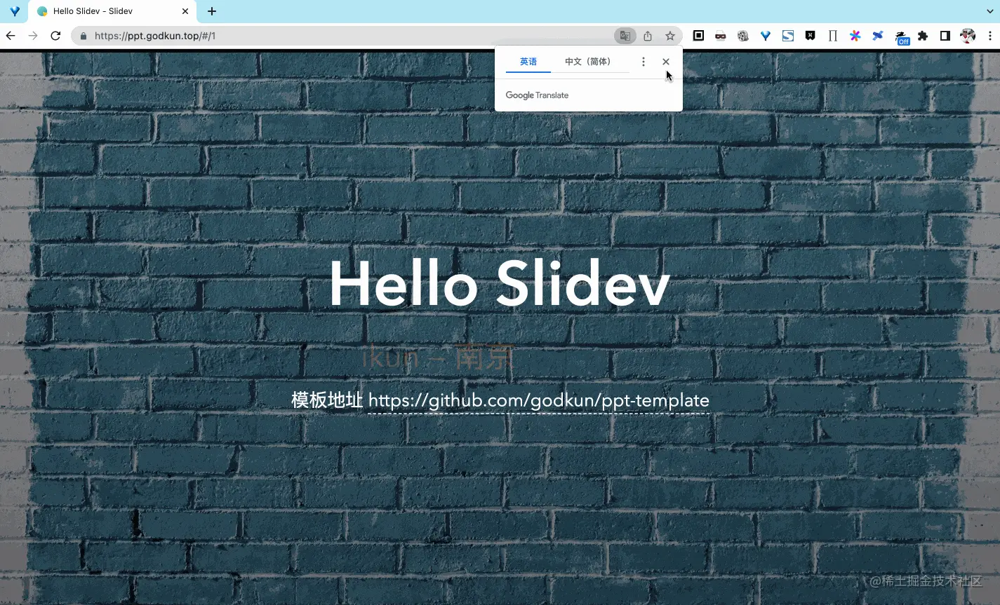

# 【全网最佳Slidev实践】ikun教你写web3.0的ppt

- 你是否对 `ppt` 中图片展示太小，观众看不清而烦恼？
- 你是否对 `ppt` 中贴代码，贴不全而感到苦恼？
- 你是否对如何用 `ppt` 做炫酷特效而感到束手无策？
- 你是否对在 `ppt` 里面点击链接直接跳出 `ppt` 而感觉不好？
- 你是否对在 `ppt` 演讲中无法使用画笔功能而感到差强人意？
- 你是否想拥有对 `ppt` 更加细粒度的修改记录
- 你是否想更好的复用 `ppt` 和文档

有了 `Slidev` 通通不是问题！

## 背景

俗话说， `ppt` 做的好，少走 `20` 年弯路啊。 哈哈哈，我开玩笑的。

我用过各种软件做过 `ppt` ， 直到我遇到 `Slidev` ， 我第一次有了 `Slidev` 一定要越来越好，如果需要，我可以贡献我的一份力量。

这里，我用 `1W2H` 的写作方式，把我的实践分享给大家。文章内容主要有以下 `4` 点：

1. 背景
2. `Slidev` 是什么
3. 为什么使用 `Slidev`
4. 如何使用 `Slidev` 【核心内容】

在如何使用 `Slidev` 章节中，我会介绍我创造的将 `naive-ui` 和 `Slidev` 结合的强大模板，文中会给出模板地址。

## Slidev 是什么

`Slidev` 是基于 `Web` 的幻灯片制作和演示工具。它旨在让开发者专注在 `Markdown` 中编写内容，同时拥有支持 `HTML` 和 `Vue` 组件的能力，并且能够呈现像素级完美的布局，还在你的演讲稿中内置了互动的演示样例。

其具备的功能如下：

1. 📝 `Markdown` 支持 —— 使用你最喜欢的编辑器和工作流编写 `Markdown` 文件
2. 🧑‍💻 开发者友好 —— 内置代码高亮、实时编码等功能
3. 🎨 可定制主题 —— 以 `npm` 包的形式共享、使用主题
4. 🌈 灵活样式 —— 使用 `Windi CSS` 按需使用的实用类和易用的内嵌样式表
5. 🤹 可交互 —— 无缝嵌入 `Vue` 组件
6. 🎙 演讲者模式 —— 可以使用另一个窗口，甚至是你的手机来控制幻灯片
7. 🎨 绘图 - 在你的幻灯片上进行绘图和批注
8. 🧮 `LaTeX` 支持 —— 内置了对 `LaTeX` 数学公示的支持
9. 📰 图表支持 —— 使用文本描述语言创建图表
10. 🌟 图标 —— 能够直接从任意图标库中获取图标
11. 💻 编辑器 —— 集成的编辑器，或者使用 `VSCode` 扩展
12. 🎥 演讲录制 —— 内置录制功能和摄像头视图
13. 📤 跨平台 —— 能够导出 `PDF、PNG` 文件，甚至是一个可以托管的单页应用
14. ⚡️ 快速 —— 基于 `Vite` 的即时重载
15. 🛠 可配置 —— 支持使用 `Vite` 插件、 `Vue` 组件以及任何的 `npm` 包

此部分内容，摘自 `Slidev` 官网。

## 为什么使用 `Slidev`

`Slidev` 给我最大的感受就是：

**它有传统 `ppt` 所拥有的所有功能，同时它基于 `Web` 驱动，比传统 `ppt` 来说，具有无限的可能性。**

基于 Web 驱动的含义是：任何可以在 `Web` 应用中完成的事情， `Slidev` 也可以做到。如 `WebGL` 、 `API` 请求、 `Iframe` 等功能。

## 如何使用 `Slidev`

这里分为基本使用和实战阐述[`Naive-ui` 和 `Slidev` 结合]

## 基本使用

大家可以查阅官方文档地址： https://cn.sli.dev/guide/ 掌握基本使用方法，这里不再介绍。

> PS： 按照官方指南，如果遇到报错等问题，可以去 github issues 查下或提问。

## `Naive-ui` 和 `Slidev` 结合

**我把 Navive-ui 和 Slidev 结合，创造了一个强大的 ppt 模板。**

### 模板演示

模板演示如下 `gif` ：



模板交互演示如下 `gif` ：


大家也可以打开 https://ppt.godkun.top 亲自浏览， 电脑打开效果最佳。手机打开的话，手指点击页面空白处即可翻页。

### 模板地址

唯一地址： https://github.com/godkun/ppt-template

### 模板架构设计

模板项目目录如下图所示：


架构组成有如下 `6` 点：

1. 技术栈： `slidev` + `vite` + `vue3` + `unocss` + `navive-ui`
2. `monorepo` ： 使用 `pnpm` ，版本 `7` 以上，这里进行简单化，不再加其他能力。
3. 组件： 按需封装 `naive-ui` 组件，完成 `slidev` 接入
4. 全局设置： 配置 `ppt` 全局顶部和底部内容
5. 构建部署： 使用 `vercel` 进行自动化构建和部署
6. 基本配置： 结合官方文档，查看 `slides.md` 文件的头部配置内容

### 模板使用

启动项目：

```sh
git clone git@github.com:godkun/ppt-template.git
cd ppt-template
pnpm i
pnpm dev
```

如果发现启动出现下图所示报错：


则需要在 `host` 文件中，设置一行 `127.0.0.1 localhost` 即可解决。

在模板中编写自己的 `ppt` ：

主要有以下操作要点：

1. 如果你需要对基本配置做调整，则结合官方文档对 `slides.md` 文件进行调整
2. 你可以直接使用模板中的三种经典布局，如下图所示：


图中左边是 `ppt` 内容，右边是 `ppt` 展示效果。

3. 你可以使用图像、轮播、抽屉、渐变文字、时间线组件，这里举 `3` 个例子

图像例子如下图所示：


图中上边是 `ppt` 内容，下边是 `ppt` 展示效果，通过 `n-image` 组件让 `ppt` 中的图像拥有了放大旋转等功能。

轮播例子如下图所示：


图中左边是 `ppt` 内容，右边是 `ppt` 展示效果，通过 `n-carousel` 组件让 `ppt` 中的多个图片拥有了更好的展示，支持轮播、自动播放、模拟拖拽功能。

抽屉例子如下图所示：


图中左边是 `ppt` 内容，右边是 `ppt` 展示效果，通过 `n-drawer` 组件让 `ppt` 可以轻松嵌入网页，无需跳出 `ppt` 浏览外链网址。

4. 如果你觉得模板中缺少你需要的组件，你可以按照我的封装方案，自行封装需要的 `naive-ui` 组件，或者其他组件库

至此，模板使用就阐述完了，模板的开源许可证是 `MIT` ，大家可以自行调整，也非常欢迎把好的改善 `pr` 到模板中。

## 总结

本文阐述了 `Slidev` 是什么、为什么选择 `Slidev` 以及如何使用 `Slidev` 。在使用章节中，我阐述了如何将 `naive-ui` 和 `slidev` 结合，并且创造成模板，变成我的 `PPT` 利器。

目前这套模板已成为我做技术分享 `ppt` 的不二法宝。

## 附

文章只在掘金、 `github` 和公众号上同步

- 掘金地址：https://juejin.cn/user/2101921962531469/posts
- github：https://github.com/godkun
- 公众号：  元语言

版权声明：本文系我原创，未经许可，不可转载和二次创作。
