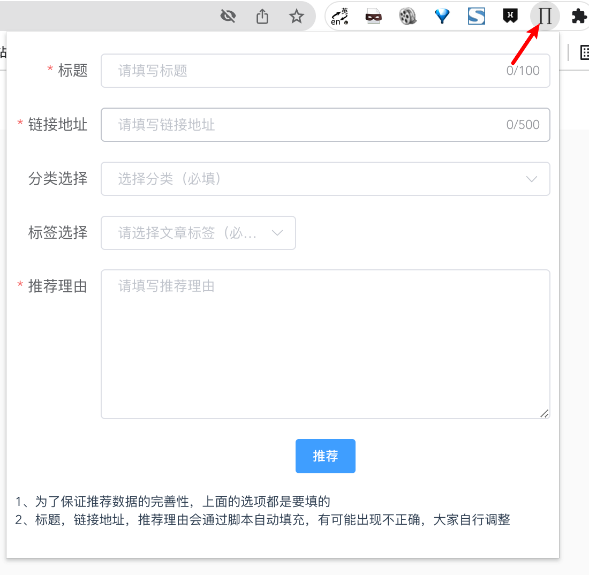

# 【这些年】沉淀的生产力工具集

本文，我将从背景、写作工具包、工作工具包、学习工具包四个方面去总结这些年我沉淀的生产力工具集。

下面沉淀的是长期稳定的工具集，如果后续有变更，会更新此文章。

## 背景

身为技术工程师，你一定折腾过很多东西，比如下面这些灵魂思考：

- 寻找最好用的编辑器，将编辑器设置成最适合我的模式
- 哪款笔记软件最棒，能很好的满足我记录所有的事情
- 哪些软件可以帮助我更好的写文章、写 `ppt`
- 电脑自带终端看着好丑，用起来好别扭，努力寻找完美的终端软件
- 截图、复制粘贴、搜索这些事情，用什么软件可以高效更好的完成

看着这些话，是不是感到很熟悉？这几乎是软件工程师都会经历的事情，其中就有我。好了，背景介绍完了，下面我将分享我这些年沉淀的生产力工具集，都是精华哦，请跟我一起往下看。

## 写作工具包

我将通过先整体，后部分来阐述此内容。

### 写作工具包整体方案

> 目前的整体方案是：

1. 实时同步： 使用百度云同步空间
2. 写作软件： 使用 `vscode`
3. 截图： 使用 `snipaste`
4. 画图： 使用 `excalidraw`
5. `gif` 录屏： 使用 `gifox`
6. 粘贴板： 使用 `paste`
7. 思维导图： 使用 `xmind` 或幕布或 `mindnode`
8. 图床管理： 使用 `PicGo` 关联 `gitee`
9. 文章多平台发布： 使用开源项目 `mdnice` 并进行本地化代码改造

整体方案如上，下面会选取部分进行精要介绍。

### 实时同步

这里我选择了百度云同步空间做这个事情，大家也可以选择 `gitee` 、 `github` 做实时同步。

> 百度云同步空间，其官网介绍如下图所示：


看图就知道具体能力了，我这边用它的主要理由如下：

- 多台电脑手机本地实时同步，在手机上还可以进行阅览
- 保留很多历史版本，查看和切换版本非常方面，防止不小心删除数据导致数据永久丢失的发生
- 我本人电脑笔记本上所有的数据存储都会用百度云进行存储或备份，写作这块也用百度云，这样比较统一
  
我之前试过用 `github` 、 `gitee` 、硬盘做这个事情，但现在我选择用同步空间来完成实时同步。
感兴趣的小伙伴可以试试，还是很不错的。我目前是 `svip` 会员，走优惠价也没多少钱，买个高效和方便。

### 编辑软件

以前写文章我用过 `txt` 、为知笔记、有道云笔记、 `Ulysses` 、各种博客网站自带的编辑器。不过现在写文章，我只用 `vscode` 。

> 这里配合我写作的 `vscode` 插件有：

- Markdown All in One
- Word Count
- Polacode-2020

写作的过程大致如下：

1. `PicGo` 、 `snipaste` 、 `paste` 软件为开启状态
2. 需要截图作为图片时，就使用快捷键 `cmd+1` 进行截图，再使用快捷键 `shift+cmd+p` 通过 `PicGo` 将图片上传到 `gitee` 图床上，成功后自动复制成 `markdown` 图片 `url` 格式
3. 需要对代码进行截图优化，就是用 `vscode` 插件 `Polacode-2020` 进行代码截图优化

### 截图-画图-gif录屏-粘贴版

以前在 `windows` 和 `mac` 上尝试过各种截图、画图等工具。现在在只用 `mac` 的情况下，我沉淀了下面 `4` 个软件：

> 截图 snipaste

软件设置图如下：


有以下优点：

- 体积非常小，使用起来非常流畅，功能很全
- 使用我定制的 `cmd + 1` 快捷键就可以快速截图，需要组装几张截图时，可以使用贴图功能
- 最近更新了一个功能，当你截图的时候，会提示你可以使用下图所示功能：


一句话总结下：这截图体验真的绝了。

-----------------

> 画图 excalidraw

软件图如下：


有以下优点：

- 开源软件，人气很高，一直在维护
- 操作简洁，有很多素材库可直接使用
- 很棒的手画风格，看着非常舒服

一句话总结：这是一款最符合审美的在线画图工具，用过的都说好。

-----------------

> gif录屏 gifox

之前用过 `LICEcap` ，直到发现 `gifox` 后，果断使用 `gifox` ，是真好用！

软件图如下：


有以下优点：

- 提供全屏、窗口和部分选择模式录制 `gif` 动画
- 支持视频转 `gif` 功能
- 支持录制键盘输入
- 支持自定义快捷键，使用更加便捷
- 支持逐帧处理 `gif`

一句话总结：这是 `mac` 最好用的 `gif` 录制工具。

-----------------

> 粘贴板 paste

软件运行图如下：


上图是复制过的内容，通过按 `cmd + 2` 快捷键即可调起粘贴板，很方便的查看复制记录和使用某一个复制内容。解决了使用系统复制功能时，对相同内容进行多次选取复制的问题。

一句话总结： 看似简单的功能，提效很明显，而且是会让你感到舒适，不再为重复选取感到焦躁。

-----------------

### 图床管理

折腾过 `uPic` 、 云服务器 `oss` 、 `github` 、 掘金、 `csdn` ， 最终选择 `PicGo` 关联 `gitee` 作为我的解决方案。

软件图如下：


有以下优点：

- 开源软件，人气很高，一直在维护
- 支持多种图床，支持开发扩展插件
- 功能体验流畅

图床我选择了 `gitee` ，优势是在国内、免费、免域名。虽然有图片体积限制，但这个对我没什么影响。像云图床需要自己备案域名，不方便。 还有 `github` 又存在被强的问题，所以综合下来，我选择 `gitee` 。

一句话总结： `PicGo + gitee` 是我目前能找到的在免费情况下，最简单最稳定的图床设置。

> 2022-4-16 更新：gitee 前段时间做了图片防盗链，图床 GG 了，现在我已经放弃 gitee ，使用 github 作为图床了。

### 文章多平台发布

这里我使用的是在开源项目 `markdown-nice` 的基础上进行定制化的工具。

> 展示图如下所示：


文章发布步骤如下：

1. 写好文章后，打开本地项目，导入文章，做了实时自动读取功能
2. 选择我想用的主题，可以根据自己的需求创建合适的主题，比如通用主题、掘金主题、公众号主题
3. 点击右侧的平台按钮，如掘金、公众号等平台，会自动将内容复制
4. 复制内容后，到各个平台的编辑中，进行粘贴，还原度非常高，大大节省了多平台调整文章版式的时间

一句话总结： 站在开源的肩膀上，定制自己的需求，让文章多平台发布高效快捷。

### 写作工具包总结

至此，写作工具包介绍完了，包含了在写作过程中，会涉及到的编辑、截图、画图、`gif` 录屏、复制粘贴、图床、文章发布场景。基本上涵盖了技术写作的所有流程，目前我很满意沉淀的这套写作工具包，能够很好的满足我现在的写作需求。

## 工作工具包

我将通过先整体，后部分来阐述此内容。

### 工作工具包整体方案

> 目前的整体方案是：

1. 终端软件：`iterm2` + `zsh` + `oh-my-zsh`
2. `ppt` 创作： 使用 `wps`
3. 截图： 使用 `snipaste`
4. 画图： 使用 `excalidraw`
5. `gif` 录屏： 使用 `gifox`
6. 粘贴板： 使用 `paste`
7. 插件工具集： 使用 `utools`
8. 开发工具： 使用 `vscode` 、 `android studio` 、小程序开发者工具
9. `ui` ： 使用 `figma` 和 `sketch`
10. 抓包： 使用 `charles` 、 `wireshark`
11. `api` 工具： 使用 `apifox`
12. 数据库： 使用 `navicat`
13. 思维导图： 使用 `xmind` 或幕布或 `mindnode`
14. `host` 管理： 使用 `SwitchHosts`
15. `FTP` 软件： 使用 `filezilla`
16. 浏览器： `chrome`
17. 其他工具： 解压- `maczip` | 取色- `sip` | 比较- `Beyond Compare` | 版本管理- `git` | 软件下载- `brew`

整体方案如上，下面会选取部分进行精要介绍。

### iterm2 + zsh + oh-my-zsh

从用系统自带的终端，到找特定的终端软件， 如 `item2` 、 `tmux` ，最后稳定使用 `iterm2` 。

`iterm2` 软件如图所示：


> `iterm2` 核心的配置如下：

- 外观主题选择 `minimal`
- 字体选择 `PragmataPro`
- 颜色主题选择 `Dracula`
- 背景选择一张喜欢的墙纸
- 终端 `zsh` 主题选择 `ys`
- 加了个点缀设置，终端顶部展示 `cpu` 、 内存 、上传和下载的监控展示

我调整的 `iterm2` 配置就是上面这些，其他的未做修改，我会备份成配置文件存储到同步空间中。

> `zsh` + `oh-my-zsh` 配置代码如下

```sh
export ZSH=$HOME/.oh-my-zsh
ZSH_THEME="ys"
plugins=(git autojump pip sudo web-search zsh-syntax-highlighting osx)
source $ZSH/oh-my-zsh.sh
prompt_context() {}
```

这里我列了我在 `.zshrc` 中的配置代码，配合具体效果就是上面的软件图，界面整洁美观，使用体验优秀。

一句话总结： `iterm2 + zsh + oh-my-zsh` 的终端工具集，已足够满足我目前对终端的使用要求，对此也很满意。


> 2022-5-3 更新：最近了解到一款自称 The terminal for the 21st century 的终端软件 warp ，技术是基于 rust 的，融资了 2000 多万刀，看起来还不错，地址： https://www.warp.dev/ 目前我准备体验下，感兴趣的小伙伴也可以试试。


> 2022-7-25 更新：最近在朋友的安利下，使用了 fish 代替 zsh ，速度非常快，体验也很不错，感兴趣的可以试试。


### ppt

折腾过 `office` 、 `wps` 和 `keynote` ，由于工作中大家用的都是 `office` 和 `wps` ，综合方案如下：

- 写和工作相关的 `ppt` ，根据情况使用 `wps` 或者 `office`
- 写自己的一些东西，如一些技术分享，则使用 `keynote` ，风格为好朋友推荐的高桥流简报

> 2022-5-4 更新：最近发现一个宝贝，那就是 Slidev ！之前用过 nodeppt 但是感觉功能太弱了，后面就没用了，但当我发现 Slidev 的时候，我对 web 版 ppt 又充满了无限的期待，功能非常强大。Slidev 已经纳入到我写日常的技术分享 ppt 工具库中了，开心！
官网地址： https://cn.sli.dev/

### 插件工具集-utools

只需要双击 `option` 即可唤起 `utools` ，唤起后，模糊输入 `p` ，点击偏好设置，进入下图所示界面：


可以在偏好设置中，安装自己想要的插件，安装后，就可以使用指定的快捷键进行快速启动插件，启动的快捷键还支持模糊查询，非常方便。

> 有以下优点

- 一切皆插件，一个插件解决一个问题
- 快捷键迅速启动，即用即走，不中断当下的工作
- 体积小，流畅，不卡顿

一句话总结： 这是一个非常高效的插件工具集，使用体验也很棒，是我当下长期使用的一个软件。

### 开发工具-vscode | 多端开发者工具 | android studio

> `vscode`

大家都不陌生吧，我现在的主力编辑器，以前搞前端开发折腾过 `sublime` 、 `atom` 、 `webstorm` 。不过现在已经确定只用 `vscode` 了。这里推荐几个自己用的插件

- vscode-icons
- TODO Hightlight
- Tabnine AI
- Markdown All in One
- Github Theme
- Chinese
- Better Comments
- Comment Translate
- file-size
- Polacode-2020
- Markdown All in One
- Word Count

> 小程序开发者工具

现在前端基本都要接触的开发者工具，虽然不在上面写代码，但必须要用。比如开发小程序、快应用、甚至使用 `uni` 、 `taro` 这种开发多个端的应用。

> `android studio`

我司是安卓手机公司，最近在学习安卓开发，用到 `android studio` 。感觉很不错，希望能掌握更多的客户端知识和实践技能。

### ui

我用过 `ps` 、 `sketch` 、 `figma` 。 在没使用 `figma` 的时候， 蓝湖也用过。不过目前我使用最多的是 `figma` ， 直接 `web` 端查看和编辑，很方便。 `sketch` 也带着用。
随便提一句， `figma` 的 `cto` 就是 `esbuild` 的作者，非常强。可以预见的是，在未来， `web` 端 `figma` 之类的 `ui` 协同软件是主流了。

### 抓包-charles | wireshark

目前 `mac` 开发环境下，我只用 `charles` 和 `wireshark` 。 使用如下：绝多数情况下，只用 `charles` ， 需要抓更底层和细节的内容就用 `wireshark` 。

我之前也抱怨过 `charles` 体验不好，折腾过 `proxyman` ，但是在考虑到公司测试开发都使用 `charles` 情况下，就继续使用了，这个要结合工作情况去选择的。
就像 `ppt` 那样，大家都用 `wps` 进行工作 `ppt` 交流，你去用 `keynote` ，就会存在一些问题。

### api 工具-apifox

`api` 工具是指接口文档、接口调试、接口 `mock` 等操作的工具集。之前折腾过各种 `api` 工具，现在我只用 `apifox` ， 它集成了接口文档、接口调试、接口 `mock` 等操作，还有很多开放 `api` 。

软件如图所示：


官网介绍其 `Apifox = Postman + Swagger + Mock + JMeter`

一句话概括： 非常好用，很好的 `api` 工具，用就完事了。

这里说下，一些公司有这方面的自研工具，这个可以根据工作需要灵活切换。


> 2022-7-25 更新：最近 apifox 发布了 WEB 版，结合官方 chrome 插件可以完成桌面端所有功能，非常 nice 。

### 数据库-navicat

折腾过很多数据库管理软件，如 `MongoDB Compass` 、 `nosqlbooster for mongodb` 、 `MySQL Workbench` 、 `navicat` 。 自从 `navicat` 支持 `mongodb` 后，
我就固定使用 `navicat` 作为我的数据库管理软件了，功能稳定且强大。

软件如图所示：


一句话总结： 体验很不错，一款非常好用的数据库管理软件。

### 思维导图

之前折腾过各种思维导图，现在只用 `xmind` 、 `mindnode` 和 幕布自带的思维导图。

- `xmind` 用的不多，主要是公司其他人用的多，比如测试出测试用例等，所以我也带着用
- `mindnode` 界面超级简洁优雅，用起来很爽，使用优先级为第二
- 幕布思维导图 这个是我用的最多的，优先级第一，主要原因是我本来就用幕布做大纲笔记，然后再用幕布转成思维导图，非常高效

### 浏览器-chrome

这个就不再解释了，开发人员必备浏览器，有非常强大的开发者工具和丰富的插件。 这里推荐几个我用的插件

- `Vimium`
- `OneTab`
- `Infinity`
- `Octotree`
- `Holmes`
- 划词翻译
- 捕捉网页截图

还有自己开发的 `chrome` 插件，用来推送好的文章到资源管理网站，作用和 `zoom` 前端团队的小报系统类似。

### 解压- `maczip` | 取色- `sip` | 版本管理- `git` | 软件下载- `brew`

> 取色-sip

目前只使用 `sip` ，非常轻便好用。 输入 `cmd + 3` 快捷键即可快速取色，流畅不卡顿。

软件如下图所示：


> 比较-Beyond Compare

目前只使用 `Beyond Compare` ，非常好用，功能超强。

软件如下图所示：


一句话总结： 对一些谨慎合并的文件，需要手动对比差异的时候，就用 `Beyond Compare` 。

> 版本管理-git

这个说下，我目前的 `git` 快捷命令设置如下：

```sh
alias gs='git status'
alias ga='git add .'
alias gcm='git commit -m'
alias gb='git branch'
alias gba='git branch -a'
alias gp='git pull'
alias gpu='git push'
alias gl='git log'
```

这些快捷命令也是我用的最多的，虽简单，但方便实用。

### 工作工具包总结

至此，工作工具包就介绍完了，有些像项目管理软件、 `cicd` 系统、文档系统，我这边用的是公司内部的自研软件，这里就没有介绍。
目前介绍的沉淀软件，能满足我大部分工作内容了，后续有好的沉淀软件，会更新此文。

## 学习工具包

整体方案如下：

1. 自研资源管理
2. 存储： 百度云
3. 笔记： 幕布、腾讯文档、语雀

### 自研资源管理

> 整体架构如下：

- 技术栈： `nuxt` + `node` + `mongodb` + `docker`
- 系统组成： 前台页面系统+管理系统+chrome插件
- 服务器： 本地
- 数据库： 本地，数据定时备份

> 页面展示如下图所示：


`chrome` 插件截图：



> 功能如下：

- 对好的外部工具和资源进行记录，放到百宝箱中，后台提供增删改查功能
- 对好的分享进行记录，放到分享资料中，后台提供增删改查功能
- 对好的外链文章进行记录，放到文章中，后台提供增删改查功能，前台提供强大的查找功能
- 对自研的资源进行记录，放到资源导航中，后台提供增删改查功能
- 开发者模式下，使用本地 `chrome` 插件对好的文章或者链接进行投稿，将会在文章一栏中展示投稿内容

本地 `docker` 一键启动，数据库使用 `navicat` 管理，定时备份数据，上传的图片直接保存在项目中的目录下。使用 `git` 管理的同时，也会将项目放到同步空间中。

对于个人的东西，不再折腾放在云服务器上了，之前还整过域名等东西，现在感觉没有必要。本地+ `git` +同步空间即可解决，还很可靠稳定。

目前使用体验不错，可以将我平时想收集的知识点全部归集起来，方便我进行学习、查阅和使用。

### 存储-百度云

作为存储软件，百度云目前是我最优的选择，我一直用它存储我的各种数据，包括、各种视频、电子书籍、图片。它的安全可靠是我一直使用的原因。

曾经也折腾过云服务器存储、硬盘存储。后面发现都不如百度云安全可靠，虽然要会员才能不限速，但这个遇到大促销再买，也还好，能接受。省了很多事情，现在还能使用同步空间功能，体验更好了。

### 笔记-幕布 | 腾讯文档 | 语雀

曾经折腾过 `txt` 文件、为知笔记、有道云笔记、马克飞象，现在主要使用幕布、语雀、腾讯文档做笔记。

- 幕布用来做大纲类的笔记，顺带生成思维导图，这个非常方便，我的主力笔记
- 语雀是 `office` 类文档主力， `markdown` 支持的也很不错
- 腾讯文档为辅助，主要用来和他人协作，毕竟大家都有微信账号

幕布如下图所示：


语雀和腾讯文档我就不截图了，这两个大家都熟悉。

### 学习工具包总结

至此，学习的工具包就介绍完了，内容不多，主要介绍了收集文章、软件、各种好资源的管理系统、保存各类学习视频、电子书籍的百度云。以及结合幕布语雀腾讯三者作为我的笔记软件。

整体沉淀较为满意，唯一不满意的就是学习时间有点少😂。

## 附所有软件官网地址

1. 百度云 <https://pan.baidu.com/download>
2. vscode <https://code.visualstudio.com/>
3. snipaste <https://www.snipaste.com/>
4. excalidraw <https://excalidraw.com/>
5. gifox <https://gifox.io/>
6. paste <https://pasteapp.io/>
7. xmind <https://www.xmind.cn/>
8. 幕布 <https://mubu.com>
9. mindnode <https://www.mindnode.com/>
10. PicGo <https://molunerfinn.com/PicGo/>
11. mdnice <https://github.com/mdnice/markdown-nice>
12. iterm2 <https://iterm2.com/>
13. utools <https://u.tools/>
14. figma <https://www.figma.com/>
15. sketch <https://www.sketch.com/>
16. apifox <https://www.apifox.cn/>
17. navicat <https://www.navicat.com.cn/>
18. SwitchHosts <https://swh.app/zh/>
19. maczip <https://ezip.awehunt.com/>
20. sip <https://sipapp.io/>
21. charles <https://www.charlesproxy.com/>
22. wireshark <https://www.wireshark.org/>
23. Beyond Compare <https://www.beyondcompare.cc/>
24. 语雀 <https://www.yuque.com/>
25. 腾讯文档 <https://docs.qq.com/>
26. wps <https://www.wps.cn/>

## 全文总结

综上我总结了这些年，我在写作、工作和学习三个方面，沉淀的一些工具集。
俗话说：磨刀不误砍柴工，把刀磨快了，砍起柴来就轻松高效了。
本文阐述的思想也是如此，把工具认真沉淀好，办起事来就游刃有余、事半功倍了。

## 2022-6-3日更新

推荐一个 `mac` 笔记本清理工具：`CleanMyMac` 

非常好用，清理效果也很好，如下图所示，默认就给清理了 `17.8GB` 的系统垃圾。


软件下载地址：https://www.macwk.com/soft/cleanmymac-x

## 致谢

感谢阅读我的文章，请大家关注我，后续会定期发布一些总结方面的文章。


