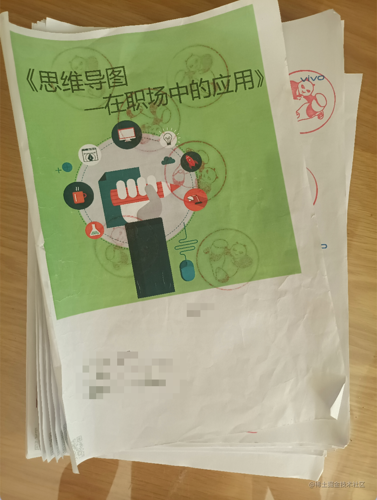
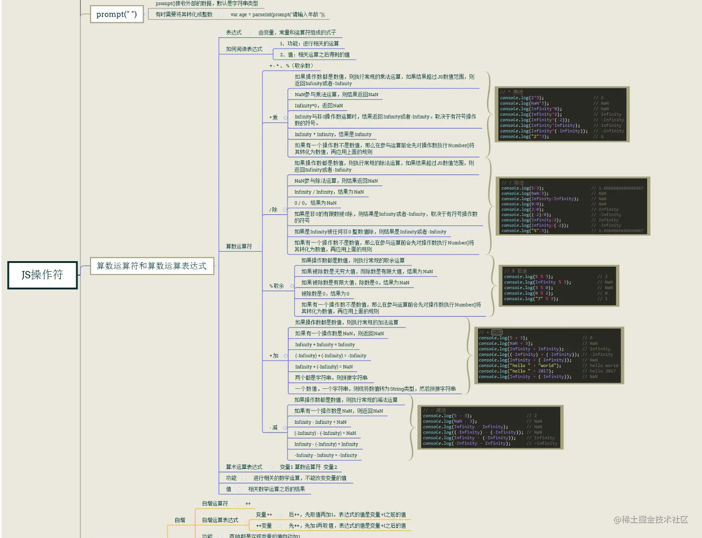
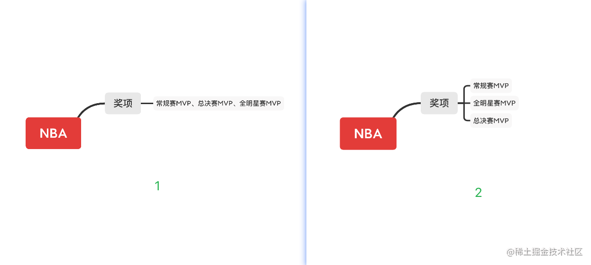
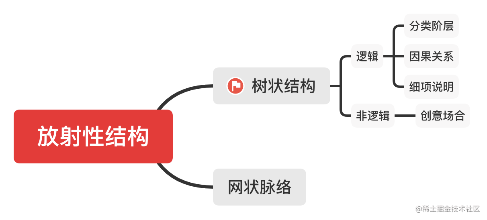
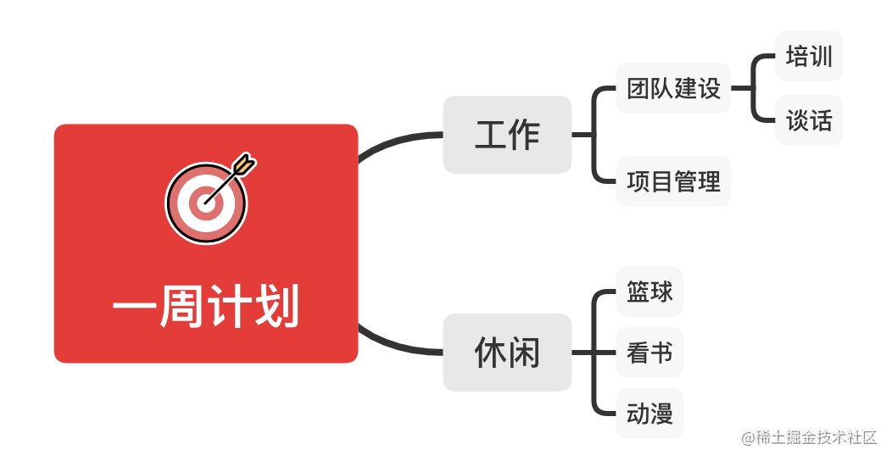
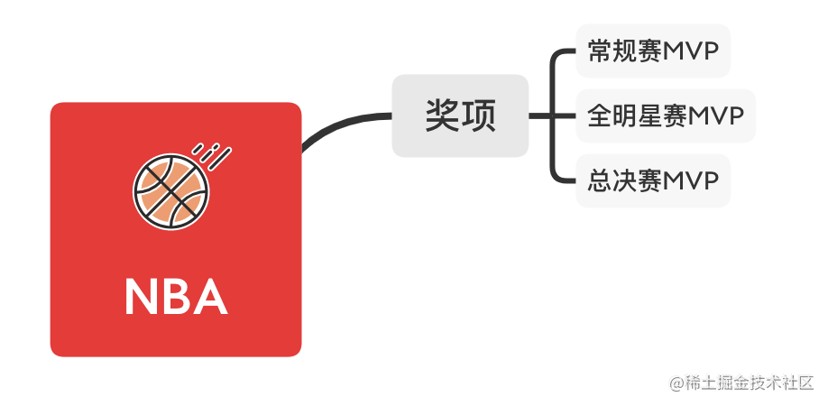
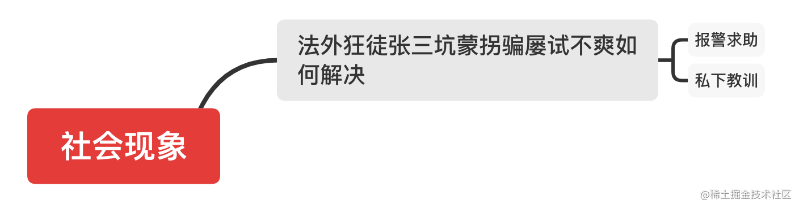
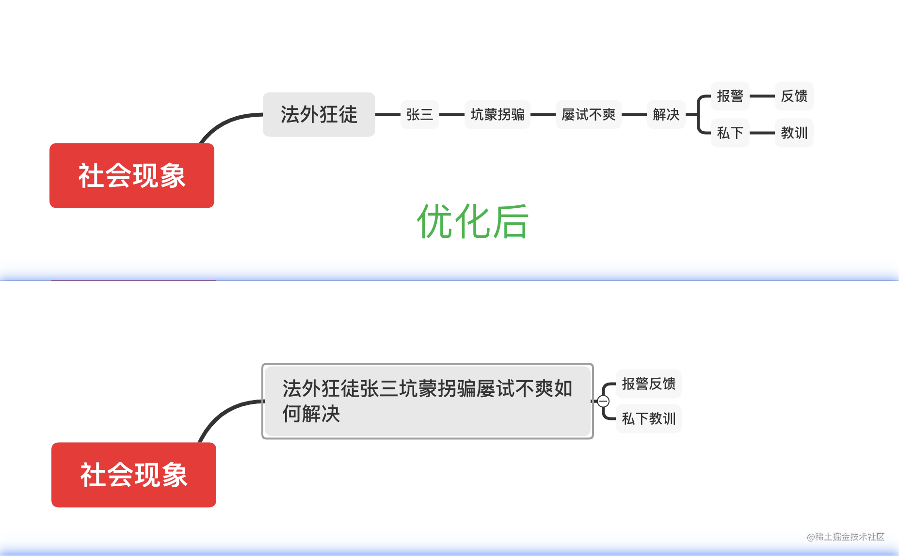
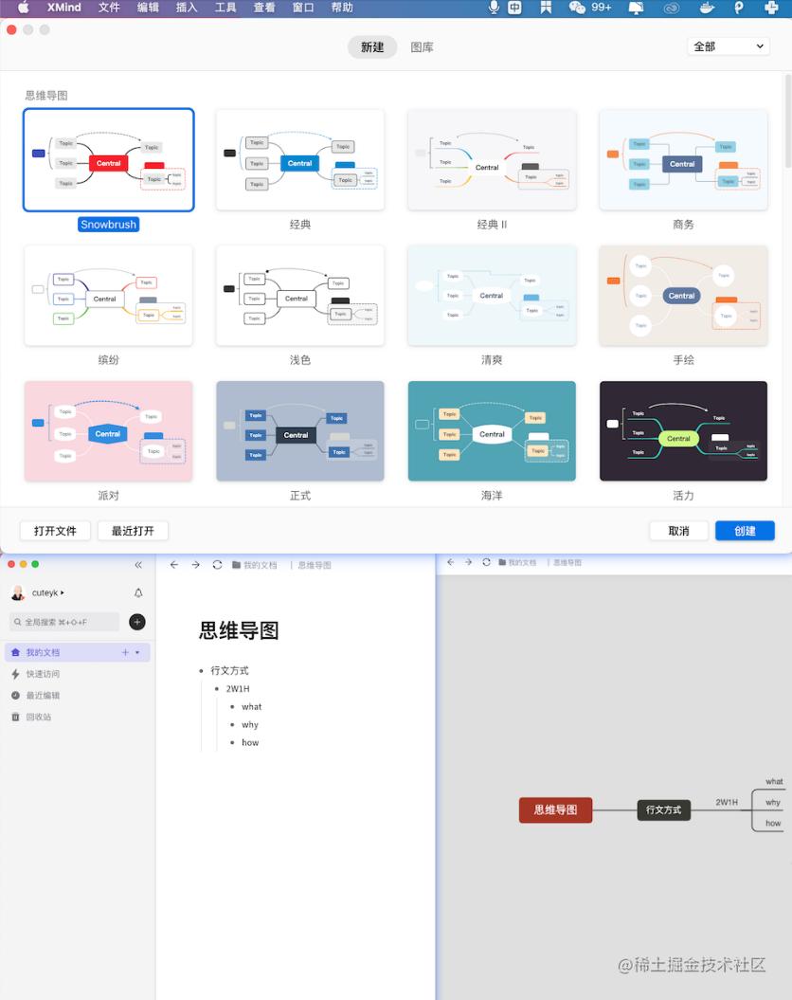

# 用思维导图开启思考活口

## 背景

之前在公司内部参加过思维导图的课程培训，借此机会，结合所学课程和个人思考，分享和总结下我对思维导图的整体理解。

本文写作方式为 `2W1H` （是什么、为什么、如何做） 方式。

## 思维导图是什么

思维导图是一种高效的思维模式，可以有效激发潜能，释放无限创造力，通过使用思维导图工具，可以更好的将思维形象化，向他人或者给自己传达更加清晰的信息。

## 为什么要学习和掌握思维导图

1. 正确应用思维导图，正确使用思维导图工具
2. 开启思考活口
3. 提升演讲、头脑风暴、面试、管理以及汇报等水平

## 如何学习和掌握思维导图

这部分是本文的核心，我将从以下 `3` 个方面进行介绍

1. 思维导图四大核心
2. 思考活口
3. 思维导图工具

### 思维导图四大核心

1. 关键词
2. 放射性结构
3. 插图
4. 颜色色彩

上面四个核心中，我认为前 `2` 个核心是最重要的，掌握好前 `2` 个核心就可以了。

#### 关键词

在做思维导图时，以名词为主，动词次之，非必要不加修饰词。

> 常见误区：我们在画思维导图的时候，喜欢用很多字或者语句来表达某一个支干的内容。

如下图所示：

这是我在网上搜到的一张图，类似这种思维导图有很多。这种画法没有遵循关键词这个核心原则。

对支干使用非常长的句子阐述，让人一看，大脑就有被约束的感觉，没有体现出使用思维导图的意义。

我们在画思维导图的时候，要理解关键词原则，对支干不要做过多的文字阐述，只有精简的名词或者动词。如果遇到必须要用很多字数才能阐述清楚，那就对支干进行二次拆解。

这里我画个思维导图来做个对比，如下图所示：

大家从上图中能看到左右两个思维导图，我们对比会得到以下结论：

1. 左图中，奖项的一级支干描述，将奖项的类别写在一起，字数过多，不符合关键词原则，也不利于扩展
2. 右图中，在发现奖项的一级支干内容过多的情况下，将奖项进行二次拆解，既遵守关键词原则，又非常利于扩展，更容易激发你的思考创造力

上面是一个简单的例子，但所表达的含义是非常清晰的，关键词是一个非常重要的核心，大家在画思维导图的时候，要主动养成遵守关键词原则的习惯

#### 放射性结构

放射性结构是一个核心的原因，是因为大脑思考是以放射性、跳跃式的方式来进行的。所以，我们在应用思维导图的时候，要去理解放射性结构。

我们在画思维导图的时候，大多少人并没有以什么结构去画思维导图这样一个概念。作为普通人，我们也不用去掌握很多细节，但至少我们要去了解这样一个核心。也就是我们至少要做到，知其然。

放射性结构的主要组成如下图所示：

从放射性结构思维导图中，我们可以获得以下信息：

1. 思维导图的核心结构是树状结构
2. 树状结构的核心组成是逻辑关联，包含分类阶层、因果关系和细项说明

举个例子加以说明，我们用思维导图去整理一周计划，如下图所示：

看上图一周计划思维导图，你会发现其是具有很强的逻辑关联，我们在将工作的事情和非工作的事情，抽象成工作和休闲，之后，对于工作，我们进行了分类阶层的逻辑处理，将工作分为
团队建设和项目管理，然后对团队建设又进行了再次细分。

所以，一周计划思维导图是一个具有逻辑性的树状结构。对于非逻辑性的，一般用的不多，这里不再阐述。

知道和理解思维导图的结构特征，将有助于我们更好更快的用思维导图完成各种事情。

到此，我认为最重要的 `2` 个核心已经阐述完了，读者可以慢慢体会，然后和自己完成过的思维导图做个对比，再总结出适合自己的方案。

#### 插图

插图的主要作用如下：

- 重要信息，关联记忆
- 内容联想、标识重点、强化记忆

俗话说，一图胜千言，图片起到的作用不可忽视，但我们也不能在思维导图中放过多图片，图片放多了，这个量，大家自行判断，大致原则就是不要对不重要的内容放图片。

举个例子，我们可以对上文中的 `NBA` 思维导图增加一个图片，用来强化记忆，如下图所示

可以感觉到，加个篮球图片后，眼睛会自动聚焦篮球图片，同时大脑中会不由自主的出现篮球的画面，达到强化记忆的目的。

#### 颜色色彩

区分不同类别，表达内心感受，比如红色代表喜庆、金黄代表收获、绿色代表生命，这个核心个人认为，作用不大，大家了解即可，不用刻意去遵守这个规则。

### 思考活口

很多人应该不懂思考活口是什么意识，这个词语是我在课程培训中学习到的，理解了它的含义后，我觉得收获颇多。

目的： 通过画正确的思维导图，来主动激活我们的思考。

下面举个例子，罗翔老师画了一个思维导图，如下图所示：

看上图，参考上文，会得到以下信息：

1. 社会现象下的一级内容，不符合关键词规则
2. 法外狂徒张三坑蒙拐骗屡试不爽如何解决下的一级内容，也不符合关键词规则

针对上面的问题，我们对罗翔老师画的思维导图做一个优化，优化后和优化前的思维导图如下图所示：

给大家 `10` 秒钟思考下，对比优化前，优化后的社会现象思维导图发生了什么变化。

时间到，我们结合上文内容，仔细体会下，会发现优化后的社会现象思维导图具有以下 `2` 点优势：

1. 遵守了关键词原则，让支干内容更加简洁、清晰、独立
2. 开启了思考活口

第 `2` 点是最大的优势： 它让社会现象思维导图变的更加灵动，写完这个思维导图，再看它的时候，你会不由自主的开启各种联想，比如以下联想：

- 有法外狂徒，是不是也有法内狂徒
- 有张三，是不是也有李四
- 有坑蒙拐骗，是不是也有偷鸡摸狗
- 有屡试不爽，是不是也有处处碰壁
- 有报警反馈，是不是也有报警立案、报警逮捕
- 有私下教训、是不是也有私下沟通、私下协商

而且，想加上这些联想，也非常方便，对应支干直接加个同级内容即可。

看到这，再看下优化前的社会现象思维导图，是不是发现，两者的差距是如此的大。

理解了思考活口，你就理解了思维导图的本质，它不仅仅是一个画图工具，更是一个可以实现上文 <思维导图是什么> 中描述内容的利器。

### 思维导图工具

这部分内容很简单，这里我推荐两个软件，分别是 `xmind` 和 幕布，其中 `xmind` 是更专业的思维导图工具。这两个软件，都支持思维导图和大纲互转。比如我用幕布，可以先写大纲，然后再生成思维导图。

`xmind` 和幕布软件如下图所示：

其他的思维导图工具，个人不做推荐。

## 总结

作为一名 `coder` ，我们在掌握硬技能的情况下，也要主动学习和掌握软技能，有时，把软技能运用好了，会达到如虎添翼的效果。

有人可能会说，软硬都要掌握的那么好，是不是太卷了？

其实，每个人都有自己的观点。我个人认为，这不是卷，这是一种不断学习，不断追求自我提升，以及追求更强烈的自我认同感和自豪感的人生态度。

这是软技能的第一篇，后续我会继续分享和总结我对其他软技能如写作、分享、沟通、逻辑呈现的个人理解和感悟。

## 附

文章只在掘金、 `github` 和公众号上同步

- 掘金地址： https://juejin.cn/user/2101921962531469/posts
- github：  https://github.com/godkun
- 公众号：   元语言

版权声明： 本文系我原创，未经许可，不可转载和二次创作。
