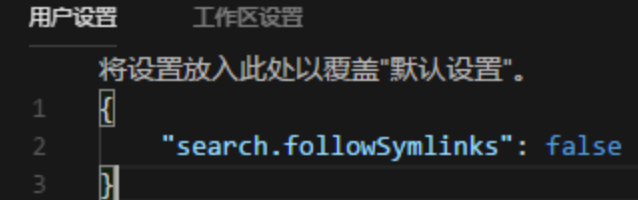

# 收藏过的一些解决方案

- 用高德做物流轨迹的方案：https://lbs.amap.com/demo/javascript-api-v2/example/marker/replaying-historical-running-data

- 小程序图片 mode 设置为 widthFix 图片显示瞬间竖向拉伸变形闪烁

设置 `height: auto`

- oh-my-zsh ys 主题去除命令行前面计算机名：https://www.jianshu.com/p/86efae3150b9

- Linux下编辑文档报错is read-only (add ! to override）

```sh
# 你要先强制退出
:q!
# 退出后在执行
:sudo !!
# 再次编辑内容
vim ...
# 保存
:wq!
```

- VSCode更新之后，rg.exe占用cpu过高

安装完成之后文件->首选项->搜search.followSymlinks“改为false



- webpack/vue-cli构建速度和打包体积优化 https://juejin.cn/post/7200278377458548793?searchId=20230823105054040FFD2ADE1AF10702FB

### 单步调试 step into/step out/step over 区别

Step Into (单步进入):

当你在一行代码上设置断点并开始调试时，step into操作会让你进入函数或方法内部。

如果你在一个函数调用上设置了断点，当你执行step into时，调试器会进入被调用的函数内部，并在这个函数的第一行暂停执行。

这样可以让你深入到函数或方法的内部，查看其内部的工作细节。

---

Step Over (单步跳过):

step over操作会执行当前行代码，并直接跳到下一行，而不进入函数或方法内部。

如果当前行是函数调用，step over会执行这个函数调用，但不会进入函数内部。

这在你不关心函数内部细节或不想逐行调试函数时非常有用。

---

Step Out (单步跳出):

step out操作会执行当前函数或方法的剩余部分，并跳出这个函数或方法。

调试器会运行当前函数或方法的剩余代码，直到返回到调用点。

这在你想快速完成当前函数或方法的调试，并直接返回到调用它的地方时非常有用。

### git pull 和git push 一直没反应，是什么原因

我本机的现象是发生在系统升级后（macOS 升级到 Monterey），ssh 连接 gitlab 、github 都没有反应！连接 https 可以。之后关闭 wifi ，使用有线网络，ssh 就连接成功了。最终查看 wifi 和有线网络的配置，发现 wifi 配置中，勾选了 “自动发现代理”，取消掉后就好了

### 取消vscode go保存时自动格式化代码

setting.json如下设置

```json
{
  "[go]": {
    "editor.formatOnSave": false,
    "editor.codeActionsOnSave": {
      "source.organizeImports": false
    }
  }
}
```

### net::err_cleartext_not_permitted

https://www.jianshu.com/p/fdba710183f6

### vite+ts+element-plus打包报错

https://blog.csdn.net/weixin_45952652/article/details/121849684

### bash快捷建-光标移到行首、行尾等

https://blog.csdn.net/force_eagle/article/details/7999153

### Mac下访问github网址速度慢或者无法访问终极解决方案

https://developer.aliyun.com/article/908721

### xcrun: error: invalid active developer path (/Applications/Xcode.app/Contents/Developer)解决办法

mac下卸载了xcode，使用git等命令时就提示错误。invalid active path(Applications/Xcode.app/Contents/Developer),这种情况可以通过xcode-select --switch指定一个xcode安装路径，如果不想安装xcode,那么可以通过重置系统默认开发工具路径.

可以通过xcode-select命令来重置系统默认的CommandLineTools路径，如下

sudo xcode-select -r

sudo xcode-select --switch /Library/Developer/CommandLineTools

sudo xcode-select -p

### react router项目部署nginx 配置问题

https://www.jianshu.com/p/51ba2bec00c7

### 当Vue中img的src是动态渲染时不显示问题

https://blog.csdn.net/jsnancy/article/details/80973863

### event对象中 target和currentTarget 属性的区别

https://www.cnblogs.com/sxz2008/p/6393232.html

### vue-cli3 中跨域解决方案

https://www.cnblogs.com/whnba/p/10680010.html

### vue cli单页模式下偶尔报错 invalid signature 的错误

https://segmentfault.com/a/1190000008804738

### vue-cli3项目搭建配置以及性能优化

https://juejin.cn/post/6844903805927047176

### vue :class的动态绑定

https://www.cnblogs.com/cina33blogs/p/6738038.html

### vue二级联动select

https://www.cnblogs.com/beileixinqing/p/8073899.html

### vscode使用code命令无效（bash: code: command not found）

https://blog.csdn.net/Programmer_CJC/article/details/121938363

### error 'defineProps' is not defined no-undef

https://zhuanlan.zhihu.com/p/439111794

### mac homebrew下载报错

https://blog.csdn.net/weixin_43690525/article/details/107729180

### mac 安装 zsh 报错

https://www.cnblogs.com/ilovewindy/p/3971894.html

### 各种布局代码

https://flowrift.com/c/faq

### grep结合awk简单用法

https://www.cnblogs.com/lcj0703/p/6434653.html
