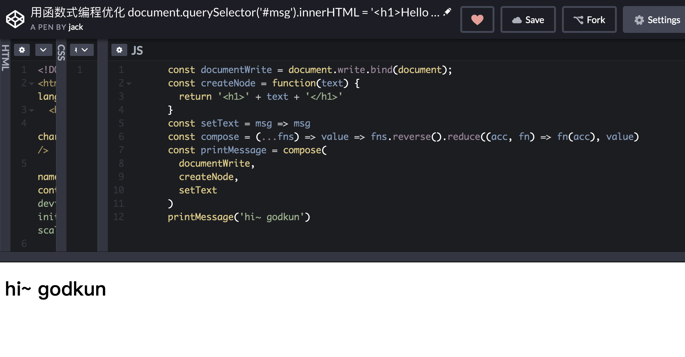
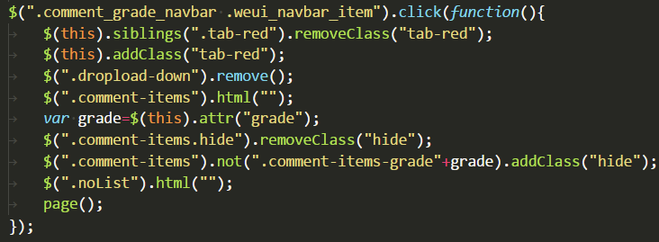
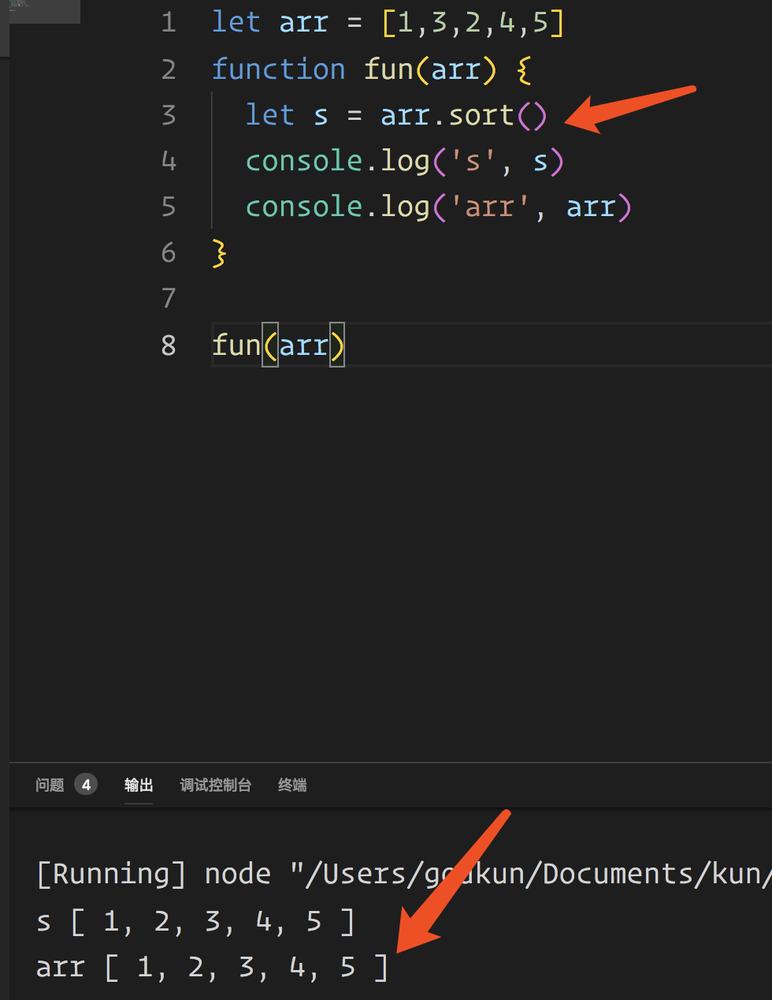
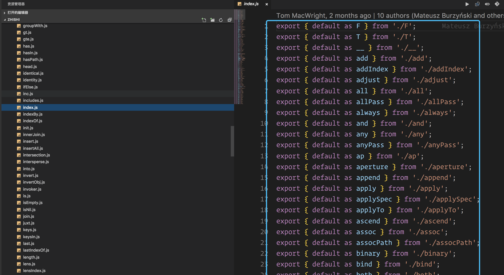
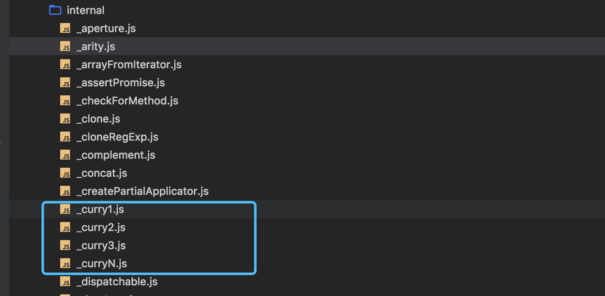
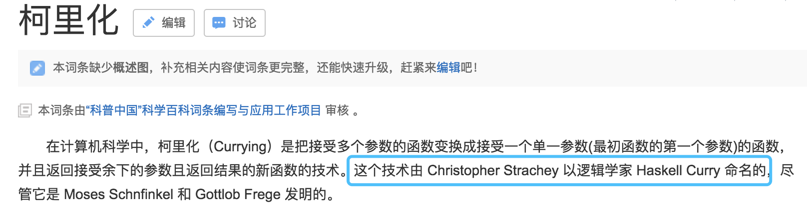
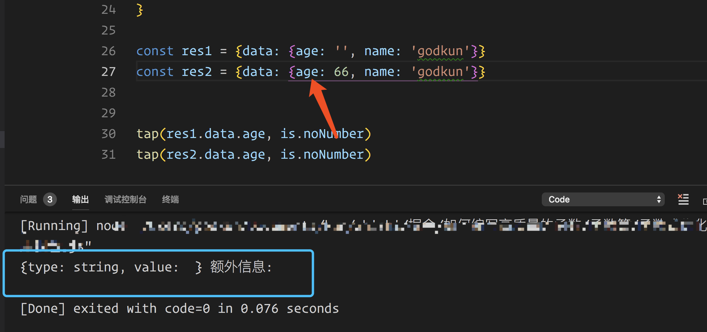
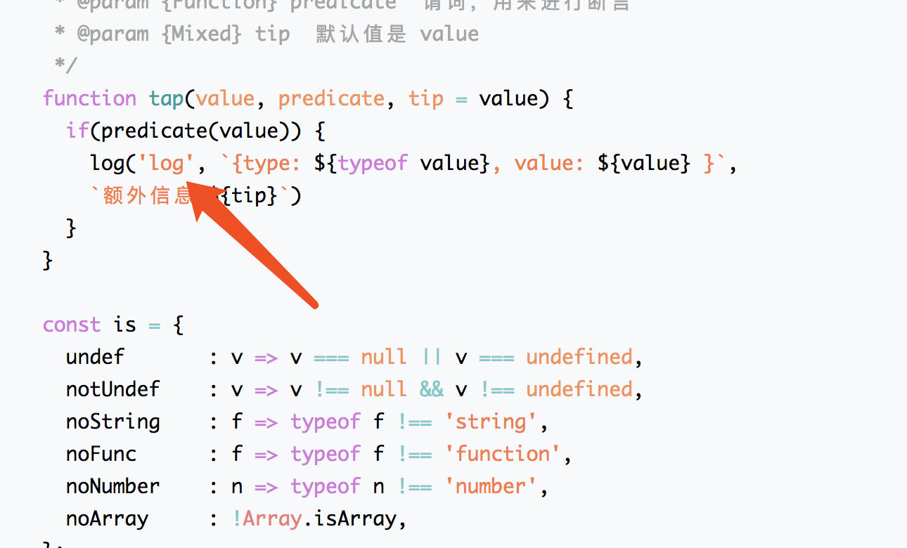
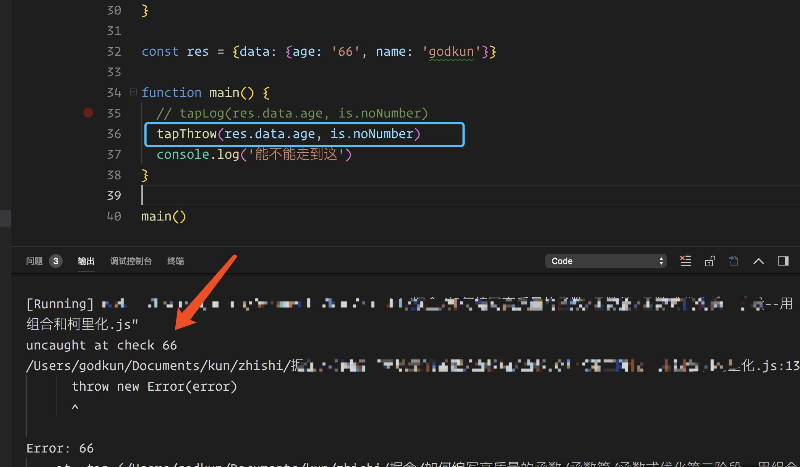

# 函数式编程[3]

## 引言

下面我会从如何用 `FP` 编写高质量的函数、分析源码里面的技巧，以及实际工作中如何编写，来展示如何打通你的任督二脉。

话不多说，下面就开始实战吧。


## 如何用 `FP` 编写高质量的函数

这里我通过简单的 `demo` 来说明一些技巧。技巧点如下：

### 注意函数中变量的类型和变量的作用域

#### 如果是值类型 -- 组合函数/高阶性

那你就要注意了，这可能是一个硬编码，不够灵活性，你可能需要进行处理了，如何处理呢？比如通过传参来干掉值类型的变量，下面举一个简单的例子。

代码如下：
```js
document.querySelector('#msg').innerHTML = '<h1>Hello World'</h1>'
```

我们来欣赏一下上面的代码，我来吐槽几句：

第一：硬编码味道很重，代码都是写死的。

第二：扩展性很差，复用性很低，难道我要在其他地方进行 `crtl c` `ctrl v` 然后再手工改？

第三：如果我在 `document.querySelector('#msg')` 拿到对象后，不想 `innerHTML` ，我想做一些其他的事情，怎么办？


看了上面的三点，是不是感觉很 `DT` 。`OK` ，下面我就先向大家展示一下，如何完全重构这段代码。这里我只写 `JS` 部分：

代码如下：
```js
// 使用到了组合函数，运用了函数的高阶性等
const compose = (...fns) => value => fns.reverse().reduce((acc, fn) => fn(acc), value)

const documentWrite = document.write.bind(document)
const createNode = function(text) {
  return '<h1>' + text + '</h1>'
}
const setText = msg => msg

const printMessage = compose(
  documentWrite,
  createNode,
  setText
)

printMessage('hi~ godkun')
```

效果如图所示：


完整代码我放在了下面两个地址上，小伙伴可自行查看。

> codepen: https://codepen.io/godkun/pen/EMMOmr

> gist：https://gist.github.com/godkun/772cd0ac25ebfcce3717b8f114064aea


> 注意事项一：

`compose` 函数的执行顺序是从右向左，也就是数据流是从右向左流，你可以把

```js
const printMessage = compose(
  documentWrite,
  createNode,
  setText
)
```

看成是下面这种形式：

```js
documentWrite(createNode(setText(value)))
```

> 注意事项二：

在 `linux` 世界里，是遵循 `pipe` (管道) 的思想，也就是数据从左向右流，那怎么把上面的代码变成 `pipe` 的形式呢？

很简单，只需要把 `const compose = (...fns) => value => fns.reverse().reduce((acc, fn) => fn(acc), value)` 中的 `reverse` 干掉就好了，写成：

```js
const compose = (...fns) => value => fns.reduce((acc, fn) => fn(acc), value)
```

> 总结

是不是发现通过用函数式编程进行重构后，这个代码变得非常的灵活，好处大致有如下：

1. 大函数被拆成了一个个具有单一功能的小函数
2. 硬编码被干掉了，变得更加灵活
3. 使用了组合函数、高阶函数来灵活的组合各个小函数
4. 职责越单一，复用性会越好，这些小函数，我们都可以在其他地方，通过组合不同的小函数，来实现更多的功能。


> 上来我就写了个 **简单** 的开胃菜？

并不简单，大家好好想一想，仔细体会一下。

> 思考题：这里我甩贴一张小伙伴在群里分享的图：



是不是感到头皮发麻，这是我送个大家的礼物，大家可以尝试把上面图片的代码用函数式进行完全重构，加油。

#### 如果是引用类型 -- 等幂性/引用透明性/数据不可变

下面轻松点，代码 `demo` 如下：
```js
let arr = [1,3,2,4,5]
function fun(arr) {
  let result = arr.sort()
  console.log('result', result)
  console.log('arr', arr)
}
fun(arr)
```

结果如下图所示：


看上面，你会发现数组 `arr` 被修改了。由于 `fun(arr)` 函数中的参数 `arr` 是引用类型，如果函数体内对此引用所指的数据进行直接操作的话，就会有潜在的副作用，比如原数组被修改了，这种情况下，改怎么办呢？

很简单，在函数体内对 `arr` 这个引用类型进行创建副本。如下面代码：

```js
let arr = [1,3,2,4,5]
function fun(arr) {
  let arrNew = arr.slice()
  let result = arrNew.sort()
  console.log('result', result)
  console.log('arr', arr)
}

fun(arr)
```

通过 `slice` 来创建一个新的数组，然后对新的数组进行操作，这样就达到了消除副作用的目的。这里我只是举一个例子，但是核心思想我已经阐述出来了，这里已经体现了理论卷中的数据不可变的思想了。

如果函数体内引用变量的变化，会造成超出其作用域的影响，比如上面代码中对 `arr` 进行操作，影响到了数组 `arr` 本身 。那这个时候，我们就需要思考一下，要不要采用不可变的思想，对引用类型进行处理。

#### 注意有没有明显的命令式编程 -- 声明式/抽象/封装

> 注意函数里面有没有大量的 `for` 循环

为什么说这个呢，因为这个很好判断。如果有的话，就要思考一下需不需要对 `for` 循环进行处理，下文有对 `for` 循环的专门介绍。

> 注意函数里面有没有过多的 `if/else`

也是一样的思想，过多的 `if/else` 也要根据情况去做相应的处理。

#### 将代码本身进行参数化 -- 声明式/抽象/封装

标题的意识其实可以这样理解，对函数进行高阶化处理。当把函数当成参数的时候，也就是把代码本身当成参数了。

> 什么情况下要考虑高阶化呢。

当你优化到一定地步后，发现还是不够复用性，这个时候就要考虑将参数进行函数化，这样可以将参数变成可以提供更多功能的函数。

函数的高阶化，往往在其他功能上得以体现，比如柯里化，组合。

#### 将大函数变成可组合的小函数

通过上面例子的分析，我也向大家展示了如何将函数最小化。通过将大函数拆成多个具有单一职责的小函数，来提高复用性和灵活性。

### 函数式编程的注意点

`FP` 不是万能的，大家不要认为它很完美，它也有自己的缺点，下面我简单的说两点吧。

#### 注意性能

进行 `FP` 时, 如果你使用的不恰当，是会造成性能问题的。比如你递归用的不恰当，比如你柯里化嵌套的过多。

#### 注意可读性

这里我想说的是，在进行 `FP` 时，不要过度的抽象，过度的抽象会导致可读性变差。

## 源码中的学习

### 看一下 Ramda.js 的源码

说到函数式编程，那一定要看看 `Ramda.js` 的源码。`ramda.js` 的源码搞懂后，函数式编程的思想也就基本没什么问题了。

关于 `Ramda.js` 可以看一下阮大的博客：

[Ramda 函数库参考教程](http://www.ruanyifeng.com/blog/2017/03/ramda.html)

看完了，那开始执行：
```
git clone git@github.com:ramda/ramda.git
```

然后我们来分析源码，首先按照常规套路，看一下 `source/index.js` 文件。

如图所示：


嗯好，我大概知道了，我们继续分析。

看一下 `add.js`
```js
import _curry2 from './internal/_curry2';
var add = _curry2(function add(a, b) {
  return Number(a) + Number(b);
});
export default add;
```
看上面代码，我们发现，`add` 函数被包了一个 `_curry2` 函数。 下划线代表这是一个内部方法，不暴露成 `API` 。这时，你再看其他函数，会发现都被包了一个 `_curry1/2/3/N` 函数。

如下图所示：


从代码中，我们可以知道，`1/2/3/N` 代表掉参数个数为 `1/2/3/N` 的函数的柯里化，而且会发现，所有的 `ramda` 函数都是经过柯里化的。

> 我们思考一个问题，为什么 `ramda.js` 要对函数全部柯里化？

我们看一下普通的函数 `f(a, b, c)` 。如果只在调用的时候，传递 `a` 。会发现，`JS` 在运行调用时，会将 `b` 和 `c` 设置为 `undefined` 。

从上面我们可以知道，`JS` 语言不能原生支持柯里化。非柯里化函数会导致缺少参数的实参变成 `undefined` 。继续想会发现，`ramda.js` 对函数全部柯里化的目的，就是为了优化上面的场景。

下面，我们看一下 `_curry2` 代码，这里为了可读性，我对代码进行了改造，我把 `_isPlaceholder` 去掉了，假设没有占位符，同时把 `_curry1` 放在函数内，并且对过程进行了相应注释。

二元参数的柯里化，代码如下：
```js
function _curry2(fn) {
  return function f2(a, b) {
    switch (arguments.length) {
      case 0:
        return f2;
      case 1:
        return _curry1(function (_b) {
          // 将参数从右到左依次赋值 1 2
          // 第一次执行时，是 fn(a, 1)
          return fn(a, _b);
        });
      default:
        // 参数长度是 2 时 直接进行计算
        return fn(a, b);
    }
  };
}

function _curry1(fn) {
  return function f1(a) {
    // 对参数长度进行判断
    if (arguments.length === 0) {
      return f1;
    } else {
      // 通过 apply 来返回函数 fn(a, 1)
      return fn.apply(this, arguments);
    }
  };
}

const add = _curry2(function add(a, b) {
  return Number(a) + Number(b);
});

// 第一次调用是 fn(a, 1)
let r1  = add(1)
// 第二次调用是 fn(2,1)
let r2 = r1(2)
console.log('sss', r2)
```

完整代码地址如下：

> gist：https://gist.github.com/godkun/0d22fe7b97d34e83db44735bf03bb7f6

> codeopen：https://codepen.io/godkun/pen/EMMGdN

上面的代码在关键处已经做了注释，这里我就不过多解释细节了，小伙伴自行领悟。

> 柯里化的好处

看了上面对 `ramda.js` 源码中柯里化的分析，是不是有点收获，就像上面说的，柯里化的目的是为了优化在 `JS` 原生下的一些函数场景。好处如下：

第一：从上面 `add` 函数可以知道，通过柯里化，可以让函数在真正需要计算的时候进行计算，起到了延迟的作用，也可以说体现了惰性思想。

第二：通过对参数的处理，做到复用性，从上面的 `add` 函数可以知道，柯里化把多元函数变成了一元函数，通过多次调用，来实现需要的功能，这样的话，我们就可以控制每一个参数，比如提前设置好不变的参数，从而让代码更加灵活和简洁。

> PS: 柯里化命名的由来



#### 关于 `ramda` 中的 `compose` 和 `pipe` -- 组合函数/管道函数

本文一开始，我就以一个例子向大家展示了组合函数 `compose` 和 `pipe` 的用法。

关于 `ramda` 中，`compose` 和 `pipe`  的实现我这里就不再分析了，小伙伴自己看着源码分析一下。这里我就简洁说一下组合函数的一些个人看法。

> 个人对组合(管道也是组合)函数的看法

在我看来，组合是函数式编程的核心，`FP` 的思想是要函数尽可能的小，尽可能的保证职责单一。这就直接确定了组合函数在 `FP` 中的地位，玩好了组合函数，`FP` 也就基本上路了。

> 和前端的组件进行对比来深刻的理解组合函数

**函数的组合思想是面向过程的一种封装，而前端的组件思想是面对对象的一种封装。**

## 实际工作中的实践

### 写一个集成错误，警告，以及调试信息的 tap 函数

#### 故事的背景

实际工作中，你肯定会遇到下面这种接收和处理数据的场景。

代码如下：
```js
// 伪代码
res => {
  // name 是字符串，age 是数字
  if (res.data && res.data.name && res.data.age) {
    // TODO:
  }
}
```

上面这样写，看起来好像也没什么问题，但是经不起分析。比如 `name` 是数字，`age` 返回的不是数字。这样的话， `if` 中的判断是能通过的，但是实际结果并不是你想要的。

> 那该怎么办呢？问题不大，跟着我一步步的优化就 `OK` 了。

#### 进行第一次优化

```js
res => {
  if (res.data && typeof res.data.name === 'string' && typeof res.data.age === 'number') {
    // TODO:
  }
}
````
看起来是够鲁棒了，但是这段代码过于命令式，无法复用到其他地方，在其他的场景中，还要重写一遍这些代码，很烦。

#### 进行第二次优化

```js
// is 是一个对象函数  伪代码
res => {
  if (is.object(res.data) && is.string(res.data.name) && is.number(res.data.age)) {
    // TODO:
  }
}
```

可能有人要问，这是函数式编程么。现在我告诉你，这是 `FP` ，将过程抽象掉的行为也是一种函数式思想。上面代码，提高了复用性，将判断的过程抽象成了 `is` 的对象函数中，这样在其他地方都可以复用这个 `is` 。

但是，代码还是有问题，一般来说，各个接口的返回数据都是 `res.data` 这种类型的。所以如果按照上面的代码，我们会发现，每次都要写 `is.object(res.data)` 这是不能容忍的一件事。我们能不能做到不写这个判断呢？

当然可以，你完全可以在 `is` 里面加一层对 `data` 的判断，当然这个需要你把 `data` 作为参数 传给 `is` 。

#### 第三次优化

```js
// is 是一个对象函数  伪代码
res => {
  if (is.string(res.data, data.name) && is.number(res.data, data.age)) {
    // TODO:
  }
}
```
按照上面的写法，`is` 系列函数会对第一个参数进行 `object` 类型判断，会再次提高复用性。

**好像已经很不错了，但其实还远远不够。**

#### 总结上面三次优化

> 为什么还远远不够

第一：有 `if` 语句存在，可能会有人说，`if` 语句存在有什么的啊。现在我来告诉你，这块有 `if` 为什么不好。是因为 `if` 语句的 `()` 里面，最终的值都会表现成布尔值。所以这块限制的很死，需要解决 `if` 语句的问题。

第二：`is` 函数功能单一，只能做到返回布尔值，无法完成调试打印错误处理等功能，如果你想打印和调试，你又得在条件分支里面各种 `console.log` ，然后这些代码依旧过于命令式，无法重用。其实，我们想一下，可以知道，这也是因为用了 `if` 语句造成的。

说完这些问题，那下面我们来解决吧。

#### 进行函数式优化--第一阶段

我们想一下，如果要做到高度抽象和复用的话，首先我们要把需要的功能罗列一下，大致如下：

第一个功能：检查类型

第二个功能：调试功能，可以自定义 `console` 的输出形式

第三个功能：处理异常的功能(简单版)

看到上面功能后，我们想一下函数式思想中有哪些武器可以被我们使用到。首先怎么把不同的函数组合在一起。

> PS：哈哈哈哈，你看你自己无意识间就说出了组合这个词。

是的，你真聪明。现在，如何将小函数组合成一个完成特定功能的函数呢？想一下，你会发现，这里需要用到函数的高阶性，要将函数作为参数传入多功能函数中。`ok` ，现在我们知道实现的大致方向了，下面我们来尝试一下吧。

这里我直接把我的实现过程贴出来了，有相应的注释，代码如下：
```js
/**
 * 多功能函数
 * @param {Mixed} value 传入的数据
 * @param {Function} predicate  谓词，用来进行断言
 * @param {Mixed} tip  默认值是 value
 */
function tap(value, predicate, tip = value) {
  if(predicate(value)) {
    log('log', `{type: ${typeof value}, value: ${value} }`, `额外信息:${tip}`)
  }
}

const is = {
  undef       : v => v === null || v === undefined,
  notUndef    : v => v !== null && v !== undefined,
  noString    : f => typeof f !== 'string',
  noFunc      : f => typeof f !== 'function',
  noNumber    : n => typeof n !== 'number',
  noArray     : !Array.isArray,
};

function log(level, message, tip) {
  console[level].call(console, message, tip)
}

const res1 = {data: {age: '', name: 'godkun'}}
const res2 = {data: {age: 66, name: 'godkun'}}

// 函数的组合，函数的高阶
tap(res1.data.age, is.noNumber)
tap(res2.data.age, is.noNumber)
```
结果图如下:


会发现当，`age` 不是 `Number` 类型的时候，就会打印对应的提示信息，当时 `Number` 类型的时候，就不会打印信息。

这样的话，我们在业务中，就可以直接写:
```js
res => {
  tap(res.data.age, is.noNumber)
  // TODO: 处理 age
}
```
不用 `if` 语句，如果有异常，看一下打印信息，会一目了然的。

**当然这样写肯定不能放到生产上的，因为 `tap` 不会阻止后续操作，我这样写的原因是：这个 `tap` 函数主要是用来开发调试的。**

但是，如果需要保证不符合的数据需要直接在 `tap` 处终止，那可以在 `tap` 函数里面加下 `return false` `return true` 。然后写成下面代码的形式：
```js
res => {
  // if 语句中的返回值是布尔值
  if (tap(res.data.age, is.noNumber)) {
    // TODO: 处理 age
  }
}
```

但是这样写，会有个不好的地方。那就是用到了 `if` 语句，用 `if` 语句也没什么不好的。但退一步看 `tap` 函数，你会发现，还是不够复用，函数内，还存在硬编码的行为。

如下图所示：


存在两点问题：

第一点：把 `console` 的行为固定死了，导致不能设置 `console.error()` 等行为

第二点：不能抛出异常，就算类型不匹配，也阻止不了后续步骤的执行

怎么解决呢？

#### 进行函数式优化--第二阶段

简单分析一下，这里我们一般希望，先采用惰性的思想，让一个函数确定好几个参数，然后，我们再让这个函数去调用其他不固定的参数。这样做的好处是减少了相同参数的多次 `coding` ，因为相同的参数已经内置了，不用我再去传了。

**分析到这，你应该有所感悟。你会发现，这样的行为其实就是柯里化，通过将多元函数变成可以一元函数。同时，通过柯里化，可以灵活设置好初始化需要提前确定的参数，大大提高了函数的复用性和灵活性。**

对于柯里化，由于源码分析篇，我已经分析了 `ramda` 的柯里化实现原理，这里我为了节省代码，就直接使用 `ramda` 了。

代码如下：
```js
const R = require('ramda')
// 其实这里你可以站在一个高层去把它们想象成函数的重载
// 通过传参的不同来实现不同的功能
const tapThrow = R.curry(_tap)('throw', 'log')
const tapLog = R.curry(_tap)(null, 'log')

function _tap(stop, level, value, predicate, error=value) {
  if(predicate(value)) {
    if (stop === 'throw') {
      log(`${level}`, 'uncaught at check', error)
      throw new Error(error)
    }
    log(`${level}`, `{type: ${typeof value}, value: ${value} }`, `额外信息:${error}`)
  }
}

const is = {
  undef       : v => v === null || v === undefined,
  notUndef    : v => v !== null && v !== undefined,
  noString    : f => typeof f !== 'string',
  noFunc      : f => typeof f !== 'function',
  noNumber    : n => typeof n !== 'number',
  noArray     : !Array.isArray,
};

function log(level, message, error) {
  console[level].call(console, message, error)
}

const res = {data: {age: '66', name: 'godkun'}}

function main() {
  // 不开启异常忽略，使用 console.log 的 tapLog 函数
  // tapLog(res.data.age, is.noNumber)
  
  // 开启异常忽略，使用 console.log 的 tapThrow 函数
  tapThrow(res.data.age, is.noNumber)
  console.log('能不能走到这')
}

main()
```


代码地址如下：

> gist: https://gist.github.com/godkun/d394fcff9be39d5b2162d5af117f7c1f


关键注释，我已经在代码中标注了。上面代码在第一次进行函数式优化的时候，在组合和高阶的基础上，加入了柯里化，从而让函数变得更有复用性。

> PS: 具有柯里化的函数，在我看来，也是体现了函数的重载性。


执行结果如下图所示：


会发现使用 `tapThrow` 函数时，当类型不匹配的时候，会阻止后续步骤的执行。

> 这次实践的总结：

**我通过多次优化，向大家展示了，如何一步步的去优化一个函数。从开始的命令式优化，到后面的函数式优化，从开始的普通函数，到后面的逐步使用了高阶、组合、柯里的特性。从开始的有 `if/else` 语句到后面的逐步干掉它，来获得更高的复用性。通过这个实战，小伙伴可以知道，如何循序渐进的使用函数式编程，让代码变得更加优秀。**

> 思考题：上面的代码还可以继续优化，这里就不再继续分析了，有兴趣的小伙伴可以自行分享，也可以和我私聊交流。在鄙人看来，前期先运用高阶、组合、柯里化做到这样，就已经很不错了。

### 为什么要干掉 for 循环

之前就有各种干掉 `for` 循环的文章。各种讨论，这里我按照我的看法来解释一下，为什么会存在干掉 `for` 循环这一说。

代码如下：
```js
let arr = [1,2,3,4]
for (let i = 0; i < arr.length; i++) {
  // TODO: ...
}
```

我们看上面这段代码，我来问一个问题：

> 上面这段代码如何复用到其他的函数中？

稍微想一下，大家肯定可以很快的想出来，那就是封装成函数，然后在其他函数中进行调用。

> 大家为什么会这样想呢？

是因为 `for` 循环是一种命令控制结构，你发现它很难被插入到其他操作中，也发现了 `for` 循环很难被复用的现实。


其实，当你说出这个答案的时候。这个关于为什么要干掉 `for` 循环的讨论就已经结束了。

**因为你在封装 `for` 循环时，就是在抽象 `for` 循环，就是在把 `for` 循环给隐藏掉，就是在把过程给隐藏掉，就是在告诉用户，你只需要调我封装的函数，而不需要关心内部实现。**

于是乎，`JS` 就诞生了诸如 `map` `filter` `reduce` 等这种将循环过程隐藏掉的函数。底层本质上还是用 `for` 实现的，只不过是把 `for` 循环隐藏了，如果按照业界内的说话逼格，就是把 `for` 循环干掉了。这就是声明式编程在前端中的应用之一。所以，其实大家每天都在写函数式编程，只不过你意识不到而已。

#### 你是如何处理数组变换的

> 三种方式：

第一种：传统的循环结构 - 比如 `for` 循环

第二种：链式

第三种：函数式组合

这里我就不具体举例子了，很简单，前面的例子基本都涵盖了，小伙伴们自行实践一下。

### 如何利用函数的纯洁性来进行缓存

> 为什么在编写函数时，要考虑缓存？

一句话，避免计算重复值。计算就意味着消耗各种资源，而做重复的计算，就是在浪费各种资源。

> 纯洁性和缓存有什么关系？

我们想一下可以知道，纯函数总是为给定的输入返回相同的输出，那既然如此，我们当然要想到可以缓存函数的输出。

> 那如何做函数的缓存呢？

记住一句话：给计算结果赋予唯一的键值并持久化到缓存中。

大致 `demo` 代码：
```js
function mian(key) {
  let cache = {}
  cache.hasOwnProperty(key) ?
    main(key) :
    cache[key] = main(key)
}
```
上面代码是一种最简单的利用纯函数来做缓存的例子。下面我们来实现一个非常完美的缓存函数。

> 给原生 `JS` 函数加上自动记忆化的缓存机制

代码如下：
```js
Function.prototype.memorized = () => {
  let key = JSON.stringify(arguments)
  
  // 缓存实现
  this._cache = this._cache || {}
  this._cache[key] = this._cache[key] || this.apply(this, arguments)
  return this._cache[key]
  
}

Function.prototype.memorize = () => {
  let fn = this
  // 只记忆一元函数
  if (fn.length === 0 || fn.length > 1) return fn
  return () => fn.memorized.apply(fn, arguments)
}
```
代码地址如下：

> gist: https://gist.github.com/godkun/5251f3d9973f45ddc685fd8332e80750


通过扩展 `Function` 对象，我们就可以充分利用函数的记忆化来实现函数的缓存。

> 上面函数缓存实现的好处有以下两点：

第一：消除了可能存在的全局共享的缓存

第二：将缓存机制抽象到了函数的内部，使其完全与测试无关，只需要关系函数的行为即可

## 备注

- 实战部分，我没有提到函子知识，不代表我没有实践过，正是因为我实践过，才决定不提它，因为对于前端来说，有时候你要顾及整个团队的技术，组合和柯里还有高阶函数等还是可以很好的运用到实践中的，函子暂时就算了吧，以后有机会我会单独写一篇关于函数式高级玩法的文章。
- 小伙伴们看实战篇的时候，一定要结合理论篇一起看，这样才能无缝连接。
- 最后说一句，实战篇也是写的头皮发麻，俺不容易啊，点个赞支持一下俺吧。

## 参考

### 参考链接 

- [图解 Monad](http://www.ruanyifeng.com/blog/2015/07/monad.html)
- [monad wiki](https://en.wikipedia.org/wiki/Monad_(functional_programming))
- [What is a monad?-stackoverflow](https://stackoverflow.com/questions/44965/what-is-a-monad)
- [读书笔记: 范畴论](http://www.cnblogs.com/steven-yang/p/10014796.html)

