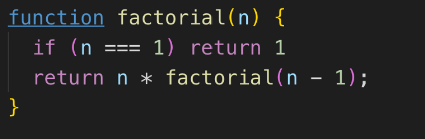

# 函数式编程[1]

## 为什么写这篇文章

因为我之前写过一篇文章：

> [如何编写高质量的函数 -- 打通任督二脉篇[理论卷]](https://juejin.im/post/6844903807051268110)

如今我再看这篇文章的时候，发现有些观点并不深入，没有那种直接本质的穿透感。于是，我想重新对函数式编程的理论篇进行一次高纬度的概括。

在本文中，我将通过背景加提问的方式，对函数式编程的本质、目的、来龙去脉等方面进行一次清晰的阐述，请和我一起往下看。

## 文章整体介绍

### 写作逻辑

通过对计算机和编程语言发展史的阐述，找到函数式编程的时代背景。通过对与函数式编程强相关的人物介绍，来探寻和感受函数式编程的那些不为人知的本质。

### 背景介绍

1. 计算机和编程语言的发展史

### 函数式编程的10问

1. 为什么会有函数式语言？函数式语言是如何产生的？它存在的意义是什么？
2. `lambda` 演算系统是什么？`lambda` 具体说的是啥内容？`lambda` 和函数有啥联系？为啥会有 `lambda` 演算系统？
3. 函数式编程为什么要用函数去实现？
4. 函数式语言中，或者在函数式编程中，函数二字的含义是什么？它具备什么能力？
5. 函数式编程的特性关键词有哪些？
6. 命令式和函数式编程是对立的吗？
7. 按照 `FP` 思想，不能使用循环，那我们该如何去解决？
8. 抛出异常会产生副作用，但如果不抛出异常，又该用什么替代呢？
9. 函数式编程不允许使用可变状态的吗？如何没有副作用的表达我们的程序？
10. 为什么函数式编程建议消灭掉语句？
 
### `JavaScript` 函数式编程的 5 问

1. 为什么函数式编程要避免使用 `this`
2. `JavaScript` 中函数是一等公民， 就可以得出 `JavaScript` 是函数式语言吗？为什么说 `JS` 是多态语言？
3. 为什么 `JS` 函数内部可以使用 `for` 循环吗？
4. `JS` 函数是一等公民，是什么意识？这样做的目的是啥？
5. 用 `JS` 进行函数式编程的缺点是什么？

### 总结

1. 函数式编程的未来。

> 简要目录介绍完啦，大家请和我一起往下看。

> PS：我好像是一个在海边玩耍的孩子，不时为拾到比通常更光滑的石子，或更美丽的贝壳而欢欣鼓舞，而展现在我面前的是完全未探明的的真理之海。

## 计算机和编程语言的发展史

计算机和编程语言的发展史是由人类主导的，去了解在这个过程中起到关键作用的人物是非常重要的。

> 下面我们一起来认识几位起关键作用的超巨。

### 戴维·希尔伯特


> 点击 `TP` 介绍: [戴维·希尔伯特](https://baike.baidu.com/item/%E6%88%B4%E7%BB%B4%C2%B7%E5%B8%8C%E5%B0%94%E4%BC%AF%E7%89%B9/7242382)

**希尔伯特** 被称为 **数学界的无冕之王** ，他是  **天才中的天才**。

> 在我看来，希尔伯特最厉害的一点就是：

**他鼓舞大家去将证明过程纯机械化，因为这样，机器就可以通过形式语言推理出大量定理。** 

也正是他的坚持推动，形式语言才逐渐走向历史的舞台中央。

### 艾伦·麦席森·图灵


> 点击 `TP` 介绍: [艾伦·麦席森·图灵](https://baike.baidu.com/item/%E8%89%BE%E4%BC%A6%C2%B7%E9%BA%A6%E5%B8%AD%E6%A3%AE%C2%B7%E5%9B%BE%E7%81%B5)

**艾伦·麦席森·图灵** 称为 **计算机科学之父**。

> 我认为，他最伟大的成就，就是发明了图灵机：


上图所示，就是图灵机的模型图。

>  这里我们注意一点：

从图中，我们会发现，每个小方格可存储一个数字或者字母。这个信息非常重要，大家可以思考一下。

`PS:` 等我介绍 **冯·诺依曼** 的时候，就会明白它们之间的联系。

### 阿隆佐·邱奇


> 点击 `TP` 介绍: [阿隆佐·邱奇](https://baike.baidu.com/item/%E9%98%BF%E9%9A%86%E4%BD%90%C2%B7%E9%82%B1%E5%A5%87)

**阿隆佐·邱奇**，**艾伦·麦席森·图灵** 的博导。

> 他最伟大的成就，就是：

**发明了 λ(lambda) 演算。**


如上图，就是 `λ(lambda) 演算` 的基本形式。

> **阿隆佐·邱奇** 发明的 `λ演算` 和图灵发明的图灵机，一起改写了当今世界，形式语言的历史。

**思考:** 邱奇的 `λ演算` 和图灵的图灵机，这两者有什么区别和联系？

### 冯·诺依曼


> 点击 `TP` 介绍: [冯·诺依曼](https://baike.baidu.com/item/%E7%BA%A6%E7%BF%B0%C2%B7%E5%86%AF%C2%B7%E8%AF%BA%E4%BE%9D%E6%9B%BC?fromtitle=%E5%86%AF%C2%B7%E8%AF%BA%E4%BE%9D%E6%9B%BC&fromid=388909)

**冯·诺依曼** 被称为 **计算机之父**。

> 他提出了 **冯·诺依曼** 体系结构:


> 从上图，我们可以看出：

**冯·诺依曼** 体系结构由运算器、控制器、存储器、输入设备、输出设备五个部分组分组成。采用二进制逻辑，程序存储、执行作为计算机制造的三个原则。

> 注意一个信息：

我们知道，计算机底层指令都是由 `0` 和 `1` 组成，通过对 `0` 和 `1` 的 `CRUD`  ，来完成各种计算操作。我们再看图灵机，会发现其每个小方格可存储一个数字或者字母。

> 看到这，是不是发现冯·诺依曼体系结构和图灵机有一些联系。

是的，现冯·诺依曼体系结构就是按照图灵机的模型来实现的计算机结构。计算机的 `0` 和 `1` ，就是图灵机的小方格中的数字或者字母的特例。

### 为什么要提这些人

因为如果想彻底解开函数式编程的困惑，那就必须要去了解这时代背景和关键人物的一些事迹。

### 说一说 邱奇-图灵论题

邱奇是图灵的博士生导师，他们之间有一个著名的论题，那就是 **邱奇-图灵论题** 。

> 论题大致的内容是：

**图灵和 lambda 这两种模型，有没有一个模型能表示的计算，另一个模型表示不了呢？**

到目前为止，这个论题还没有答案。也正因为如此，让很多人对 `lambda` 模型充满了信心。后面的岁月中，`lambda` 模型一直在被很多人研究、论证、实践。

### 第一台可编程计算机的诞生


它叫 **ENAIC**。

`1946` 年，世界上第一台电子计算机——    `ENIAC` 问世，它可以改变计算方式，即可以更改程序。

> 也就是说：

**它是一台可编程计算机。**

### 为什么要可编程

`perl` 语言的设计者 `Larry Wall` 说过：

优秀的程序员具有三大美德：**懒惰、急躁、傲慢。**

>  可编程完美诠释了懒惰的美德。在 `ENAIC` 诞生后，出现了各种各样的 程序设计语言。三大美德也体现的淋漓尽致。

### 计算机语言的分类


从上图可以获得以下信息：

1. 程序设计语言只是计算机语言的一个分类。
2. `HTML` 、`XML` 是数据设计语言。
3. 在程序设计语言中，分为说明式和声明式。
4. 在说明式中，又包含函数式、逻辑式等，其实 `MySQL`。 就是逻辑式语言，它通过提问的方式来完成操作。
5. 冯诺依曼体系更符合面向过程的语言。


> 这个分类可以好好看看，会有一些感受的。

### 简单的程序设计语言发展史


上图非常简单明了，只到 `1995` 年。

> 时间线大概是这样的：

**xxx ---> xxx ---> .... ---> JavaScript ...**

时间来到了 `1996` 年，`JavaScript` 诞生了！

### JavaScript 诞生了！

#### JavaScript 之父——布兰登·艾奇


图中这位老哥叫 **布兰登·艾奇** 。那一年，他34岁。

#### 看一看阮一峰写的一段话


> 从上图中你会有如下几点感受：

1. 第一个感受：阿布对 `Java` 一点兴趣也没有。
2. 第二个感受：由于讨厌 Java ，阿布不想用 Java 的对象表示形式，于是就借鉴了 Self 语言，使用基于原型的继承机制。埋下了前几年前端界用原型进行面对对象编程的种子。
3. 第三个感受：阿布借鉴了 `Scheme` 语言，将函数提升到一等公民的地位，让 `JS` 拥有了函数式编程的能力。埋下了 `JS`  可以进行函数式编程的种子。
4. 第四个感受：`JS` 是既可以函数式编程，也可以面对对象编程。

####  我个人的感受

我在回顾程序设计语言的发展史和一些故事后，我并不认为 `JavaScript` 是一个烂语言，相反正是这种中庸之道，才使得 `JavaScript` 能够流行到现在。

### 总结

通过对计算机语言的发展史和关键人物的简洁介绍，我们可以从高层面去体会到函数式编程在计算机语言发展史中的潜力和影响力。

不过，通过背景和人物的介绍，对函数式编程的理解还是有限的。下面我将通过提问的方式来阐述函数式编程的来龙去脉。

## 函数式编程的 10 问

下面将通过 `10` 个问题的解答，来阐述函数式编程的理论支撑、函数式编程的诞生背景、函数式编程的核心理论以及推导等知识。

### 为什么会有函数式语言？函数式语言是如何产生的？它存在的意义是什么？

**函数式语言的存在，是为了实现运算系统的本质——运算。**

> 重要的事情重复三遍：运算、运算、运算。

#### 形式化运算系统的研究

计算机未问世之前，四位大佬 阿兰·图灵、约翰 ·冯·诺依曼 、库尔特 ·哥德尔 和阿隆左 ·丘奇。展开了对形式化的运算系统的研究。

>  通过形式系统来证明一个命题：

**可以用简单的数学法则表达现实系统。**

#### 图灵机和冯·诺依曼结构体系的缺陷

从上文的图片和解析可知，图灵机和冯诺依曼体系的计算机系统都依赖存储(内存)进行运算。

> 换句话说就是：

**通过修改内存来反映运算的结果。并不是真正意义上的运算。**

修改内存并不是我们想要的，我们想要的仅仅是运算。从目的性的角度看，修改内存可以说是运算系统中的副作用。或者说，是表现运算结果的一种手段。

这一切，图灵的博导邱奇看在眼里，他看到了问题的本质。为了实现运算系统的本质——运算，即不修改内存，直接通过运算拿到结果。

他提出了 `lambda` 演算的形式系统，一种更接近于运算才是本质的理论。

####  函数式语言和命令式语言的隔阂

> 从语言学分类来说：

是两种不同类型的计算范型。

> 从硬件系统来说：

它们依赖于各自不同的计算机系统(也就是硬件)。 为什么依赖不同的硬件，是因为如果用冯诺依曼结构的计算机，就意味着要靠修改内存来实现运算。但是，这和 `lambda` 演算系统是相矛盾的。

因为基于 `lambda` 演算系统实现的函数式语言，是不需要寄存器的，也不存在需要使用寄存器去存储变量的状态。它只注重运算，运算结束，结果就会出来。

> **最大的隔阂就是依赖各自不同的计算机系统 。**

#### 计算机硬件的限制

目前为止，在技术上做不到基于 `A` 范型的计算机系统，同时支持 `B` 范型。也就是说，不能指望在 `X86` 指令集中出现适用于 `lambda` 演算 的指令、逻辑或者物理设计。

> 你可能会疑问，既然硬件不支持，那我们为什么还能进行函数式编程？

其实现实中，大多数人都是用的冯诺依曼体系的命令式语言。所以为了获得特别的计算能力和编程特性。语言就在逻辑层虚拟一个环境，也因为这样，诞生了 `JS` 这样的多范型语言，以及 `PY` 这种脚本语言。

**究其根源，是因为，冯·诺依曼体系的计算机系统是基于存储与指令系统的，并不是基于运算的。**

#### 黑暗中的曙光

在当时硬件设备条件的限制下，邱奇提出的 `lambda` 演算，在很长时间内，都没有被程序设计语言所实现。

直到冯诺依曼等人完成了 `EDVAC` 的十年之后。一位 `MIT` 的教授 `John McCarthy`对邱奇的工作产生了兴趣。在 `1958` 年，他公开了表处理语言 `LISP` 。这个 `LISP` 语言就是对邱奇的 `lambda` 演算的实现。

自此，世界上第一个函数式语言诞生了。

`LISP` 就是函数式语言的鼻祖，完成了 `lamda` 演算的实现，实现了 运算才是本质的运算系统。


上图是 `Lisp` 的图片，感受一下图片中符号的魅力。

> 为什么我说是曙光？

是因为，并没有真正的胜利。此时的 `LISP` 依旧是工作在冯·诺依曼计算机上，因为当时只有这样的计算机系统。

> 所以从 `LISP` 开始，函数式语言就是运行在解释环境而非编译环境中的。也就是传说中的脚本语言，解释器语言。

#### 真正的胜利

直到 `1973` 年，`MIT` 人工智能实验室的一组程序员开发了，被称为 `LISP` 机器的硬件。自此，阿隆左·丘奇的 `lambda` 演算终于得到了 硬件实现。终于有一个计算机(硬件)系统可以宣称在机器指令级别上支持了函数式语言。

#### 总结

关于这问，我阐述了很多，从函数式语言诞生的目的、到函数式语言诞生的艰难过程、再到计算机硬件的限制。最后在不断的努力下，做到了既可以通过解释器，完成基于冯·诺依曼体系下，计算机系统的函数式编程。也可以在机器指令级别上支持了函数式语言的计算机上进行纯正的函数式编程。

>  思考题：想一想，在如今，函数式编程为什么越来越被人所了解和掌握。

### lambda 演算系统是啥？lambda 具体说的是啥内容？lambda 和函数有啥联系？为啥会有 lambda 演算系统？

#### lamda 诞生的目的

`lambda` 是一种解决数学中的函数语义不清晰，很难表达清楚函数的结构层次的问题的运算方案。

>  也就是在运算过程中，不使用函数中的函数运算形式，而使用 `lambda` 的运算形式来进行运算。

#### lamda 简单介绍 

1. 一套用于研究函数定义、函数应用和递归的系统。
2. 数式语言就是基于 `lambda` 运算而产生的运算范型。

#### 函数式编程的理论基石

`lambda` 演算系统是学习函数式编程的一个非常重要的知识点。**它是整个函数式编程的理论基石。**

#### 数学中的函数

如下图所示：


>  从上面的数学函数中，我们可以发现以下几点：

1. 没有显示给出函数的自变量
2. 对定义和调用区分不严格。 `x2-2*x+1` 既可以看成是函数 `f(x)` 的定义，又可以看成是函数 `g(x)` 对变量 `x-1` 的调用。

> 体会上面几点，我们会发现：

数学中的函数语义并不清晰，它很难表达清楚函数的结构层次。对此，邱奇给出了解决方法，他提出了 `lambda(λ)` 演算。

####  lambda(λ) 演算

> 基本定义形式：

**λ<变量>.<表达式>**

通过这种方法定义的函数就叫 `λ(lambda)` 表达式。

我们可以把 `lambda` 翻译成函数，即可以把 `lambda` 表达式念成函数表达式。

> **PS:** 这里说一下，函数式语言中的函数，是指 lambda(函数)，它和我们现在的通用语言中，比如 `C` 中
的 `function` 是不同的两个东西。

#### 举个栗子

`λx.x2-2*x+1`  就是一个 `λ` 表达式，其中显式地指出了 `x`  是变量。将这个 `λ` 表达式定义应用于具体的变量值时，需要用一对括号把表达式括起来，当 `x` 是 `1` 时，如下所示

`(λx.x2-2*x+1)1`

应用(也就是调用)过程，就是把变量值赋值给表达式中的 `x` ，并去掉 `λ` <变量>，过程如下

`(λx.x2-2*x+1)1=1-2*1+1=0`

#### 多个变量

`λx.λy.x+y`

`x=1, y=2，` 调用过程如下

`((λx.λy.2*x+y)1) 2 = (λy.2+y) 2 = 4`


可以看到 ，函数的返回值也可以是一个函数，这样不同函数的层次问题也解决了，这里用到了高阶函数。在函数式编程语言中，当函数是一等公民时，这个规律是生效的

#### 总结

仔细想一下，你会发现 `lambda` 演算系统，简洁而又优美。它可以被称为最小的通用程序设计语言。`λ` 演算系统的构建过程，就是一个程序语言从无到有的构建过程。整个系统中任何一个复杂的 `λ` 表达式都是由：`λ` 抽象、应用和括号，粘合在一起的。

`lambda` 演算系统 证明了：

**任何一个可计算函数都能用这种形式来表达和求值，它等价于图灵机。**

至此，我阐述了函数式语言出现的原因。以及支持函数式语言的重要理论支撑 —— `lambda` 演算系统的由来和基本内容。


## 函数式编程为什么要用函数去实现？

上文提到过，运算系统的本质是运算。

**函数只是封装运算的一种手段，函数并不是真正的精髓，真正的精髓在于运算。**

### 总结

说到这，大家从根本上对函数式编程有了一个清晰的认知。比如它的数学基础，为什么存在、以及它和命令式语言的本质不同点。

### 函数式语言中，或者在函数式编程中，函数二字的含义是什么？它具备什么能力？

#### 函数二字的含义

这个函数是特指 满足 `lambda` 演算的 `lambda` 表达式。函数式编程中的函数表达式，又称为 `lambda` 表达式。

> 该函数具有四个能力：

1. 可以调用
2. 是运算元
3. 可以在函数内保存数据
4. 函数内的运算对函数外无副作用

#### 运算元


在 `JS` 中，函数也是运算元，但它的运算只有调用。

#### 函数内部保存数据


闭包的存在使得函数内保存数据得到了实现。函数执行，数据存在不同的闭包中，不会产生相互影响，就像面对对象中不同的实例拥有各自的自私有数据。多个实例之间不存在可共享的类成员。

#### 总结

从这问可以知道，并不是一个语言支持函数，这个语言就可以叫做函数式语言，或者说就具有函数式编程能力。

### 函数式编程的特性关键词有哪些？

> 大致列一下：

引用透明性、纯洁性、无副作用、幂等性、惰性求值/非惰性求值、组合、柯里化、管道、高阶性、闭包、不可变性、递归、`partial` 
`monad` 、 `monadic` 、 `functor` 、 `applicative` 、尾递归、严格求值/非严格求值、无限流和共递归、状态转移、 `pointfree` 、一等公民、隐式编程/显式编程等。


#### 引用透明性

> 定义：

任何程序中符合引用透明的表达式都可以由它的结果所取代，而不改变该程序的含义。

> 意义：

让代码具有得到更好的推导性、可以直接转成结果。

> 举个例子：

比如将 `TS` 转换成 `JS` 的过程中，如果表达式具备引用透明性。那么在编译的时候，就可以提前把表达式的结果算出来，然后直接变成值，在 `JS` 运行的时候，执行的时间就会降低。

#### 纯洁性

> 定义：

对于相同的输入都将返回相同的输出。

> 优点：

1. 可测试
2. 无副作用
3. 可以并行代码
4. 可以缓存

#### 惰性求值与非惰性求值

> 定义：

如果一个参数是需要用到时，才会完成求值(或取值) ，那么它就是惰性求值的。反之，就是非惰性求值。

> 惰性求值：

```js
true || console.log('源码终结者') 
```
特点：当不再需要后续表达式的结果的时候，就终止后续的表达式执行，提高了速度，节约了资源。


> 非惰性求值：
```js
let i = 100
console.log(i+=20, i*=2, 'value: '+i)
console.log(i)
```
特点：浪费 cpu 资源，会存在不确定性。

#### pointfree——隐式编程

函数无需要提及将要操作的数据是什么。也就是说，函数不用指明操作的参数，而是让组合它的函数来处理参数。

> 通常使用柯里和组合来实现 `pointfree`


#### 组合


#### 柯里化


#### 函数式编程的高级知识点——Functor 、Applicative 、Monad


这些高级知识点，随便一个都够解释很长的，这里我就不做解释了。我推荐一篇文章，阐述的非常透彻。

> 点击 `TP` ：[Typescript版图解Functor , Applicative 和 Monad](https://juejin.im/post/6844903924172865543)

> 对于这三个高级知识点，我有些个人的看法。

第一个：不要被名词吓到，通过敲代码去感受其差异性。

第二个：既然要去理解函数式语言的高级知识，那就要尽可能的摆脱命令式语言的固有思想，然后再去理解这些高级知识点。

第三个：为什么函数式编程中，会有这些高级知识点？

> 关于第三个看法，我个人的感受就是：

**函数式编程，需要你将隐式编程风格改成显式风格。这也就意味着，你要花很多时间在函数的输入和输出上。**

> 如何解决这个问题？

可以通过上述的高级知识点来完成，在特定的场景下，比如在 `IO` 中，不需要列出所有的可能性，只需要通过一个抽象过程来完成所有情况的处理，并保证不会抛出异常。

> 我们可以把这些函数式编程的高级知识点和面对对象编程的继承等做比较，会发现：

它们都是为了一个目的，减少重复代码量，提高代码复用性。

#### 总结

> 此问，我没有详细回答，我想说的是：

这些特性关键词，都值得认真研究，这里我只介绍了我认为该注意的点，具体的知识点，大家自行去了解和研究。

### 命令式编程和函数式编程是对立的吗？

从前面提到的一些阐述来看，命令式编程和函数式编程不是对立的。它们既可以独立存在，又可以共生。并且在共生的情况下，会发挥出更大的影响力。

**我个人认为，在编程领域中，多范式语言才是王道，单纯只支持某一种范式的编程语言是无法适应多场景的。**

### 按照 FP 思想，不能使用循环，那我们该如何去解决？

对于纯函数式语言，无法使用循环。我们能想到的，就是使用递归来实现循环，回顾一下前面提到的 `lamda` 演算系统，它是一套用于研究函数定义、函数应用和递归的系统。所以作为函数式语言，它已经做好了使用递归去完成一切循环操作的准备了。

### 抛出异常会产生副作用，但如果不抛出异常，又该用什么替代呢？

> 说到这，我们需要转变一下观念：

比如在命令式语言中，我们通常都是使用 `try catch` 这种来捕获抛出的异常。但是在纯函数式语言中，是没有 `try catch` 的，通常使用函子来代替 `try catch` 。

看到上面这些话，你可能会感到不能理解，为什么要用函子来代替 `try catch` 。

> 其实有困惑是很正常的，主要原因就是：

**我们站在了命令式语言的理论基石上去理解函数式语言。**

如果我们站在函数式语言的理论基石上去理解函数式语言，就不会感觉到困惑了。你会发现只能用递归实现循环、没有 `try catch` 等要求，是合理且合适的。

> PS: 这就好像是一直使用函数式语言的人突然接触命令式语言，也会满头雾水的。

### 函数式编程不允许使用可变状态的吗？如何没有副作用的表达我们的程序？

可以使用局部的可变状态，只要该局部变量不会影响外部，那就可以说改函数整体是没有副作用的。

### 为什么函数式编程建议消灭掉语句？

> 因为语句的本质是：

**在于描述表达式求值的逻辑，或者辅助表达式求值。**

## `JavaScript` 函数式编程的 5 问

### 为什么函数式编程要避免使用this

> 主要有以下两点原因：

1. `JS` 的 `this` 有多种含义，使用场景复杂。
2. `this` 不取决于函数体内的代码。
3. 所有的数据都应以参数的形式提供给函数，而 `this` 不遵守这种规则。

### 为什么JS函数内部可以使用for循环吗？

> 很多人可能没有想过这个问题

其实在纯函数式语言中，是不存在循环语句的。循环语句需要使用递归实现，但是 `JS`
 的递归性能并不好，比如没有尾递归优化，那怎么办呢？

为了能支持函数式编程，又要避免 `JS` 的递归性能问题。最后允许了函数内部可以使用 `for` 循环，你会看到 `forEach` 、 `map` 、 `filter` 、 `reduce` 的实现，都是对 `for` 循环进行了封装。内部还是使用了 `for` 循环。

> PS: 在 `JS` 中，只要函数内的 `for` 循环不影响外部，那就可以看成是体现了纯洁性。

### JS函数是一等公民是啥意识？这样做的目的是啥？

> 我总结了一下，大概有以下意识：

1. 能够表达为匿名的直接量
2. 能被变量存储
3. 能被其它数据结构存储
4. 有独立而确定的名称(如语法关键字)
5. 可比较的
6. 可作为参数传递
7. 可作为函数结果值返回
8. 在运行期可创建
9. 能够以序列化的形式表达
10. 可(以自然语言的形式)读的
11. 可(以自然语言能在分布的或运行中的进程中传递与存储形式)读的

#### 序列化的形式表达

> 这个是什么意识呢？

在 `js` 中，我们会发现有 `eval` 这个 `api` 。正是因为能够支持以序列化的形式表达，才能做到通过 `eval` 来执行字符串形式的函数。

#### 总结

> `JS` 之父设计函数为一等公民的初衷就是想让 `JS` 语言可以支持函数式编程。

**函数是一等公民，就意味着函数能做值可以做的任何事情。**

### 在JS中，如何做到函数式编程?

核心思想：**通过表达式消灭掉语句。**

> 有以下几个路径：

1. 通过表达式消灭分支语句 举例：单个 `if` 语句，可以通过布尔表达式消灭掉
2. 通过函数递归消灭循环语句
3. 用函数去代替值(函数只有返回的值在影响系统的运算，一个函数调用过程其实只相当于表达式运算中的一个求值)

### 用 JS 进行函数式编程的缺点是什么？

1. 缺少不可变数据结构( `JS` 除了原始类型，其他都是可变的)
2. 没有提供一个原生的利于组合函数而产生新函数的方式，需要第三方支持
3. 不支持惰性序列
4. 缺少尾递归优化
5. `JS` 的函数不是真正纯种函数式语言中的函数形式(比如 `JS` 函数中可以写循环语句)
6. 表达式支持赋值

#### 缺少尾递归优化

对于函数式编程来说，缺少尾递归优化，是非常致命的。就目前而言，浏览器对尾递归优化的支持还不是很好。

> 什么是尾递归？

如下图所示：


我们来看下面两张图




第一张图，没有使用尾递归，因为 `n * fatorial(n - 1)` 是最后一个表达式，而 `fatorial(n - 1)` 不是最后一个表达式。第二张图，使用了尾递归，最后一个表达式就是递归函数本身。

> 问题来了，为什么说 `JS` 对尾递归支持的不好呢？

这里我想强调的一点是，所有的解释器语言，如果没有解释环境，也就是没有 `runtime` ，那么它就是一堆文本而已。`JS` 主要跑在浏览器中，需要浏览器提供解释环境。如果浏览器的解释环境对 `JS` 的尾递归优化的不好，那就说明，`JS` 的尾递归优化很差。由于浏览器有很多，可见  `JS` 要实现全面的尾递归优化，还有很长的路要走。

> PS: 任何需求都是有优先级的，对浏览器来说，像这种尾递归优化的优先级，明显不高。我个人认为，优先级不高，是到现在极少有浏览器支持尾递归优化的原因。

## 参考

### 参考链接 

- [符号: 抽象、语义](https://mp.weixin.qq.com/s?__biz=MzIwMDgyNzUzNw==&mid=2247483658&idx=1&sn=2dde89033d2fef0cba307db9b8b5489e&scene=0#wechat_redirect)
- [Typescript版图解Functor , Applicative 和 Monad](https://juejin.im/post/6844903924172865543)
- [邱奇-图灵论题与lambda演算](https://www.cnblogs.com/dcdcbigbig/p/10282224.html)
- [为什么需要Monad?](https://www.jdon.com/46884)
- [为什么是Y？](https://cgnail.github.io/academic/lambda-4/)

### 参考书籍

- JavaScript 函数式编程指南
- Scala 函数式编程
- Haskell 趣学指南
- 其他电子书


## 未来，可期

本文通过阐述加提问的方式，对函数式编程的一些理论知识进行了一次较为清晰的阐述。限于篇幅，一些细节无法展开，如有疑问，可以与我联系，一起交流一下，共同进步。

现在的前端，依旧在快速的发展中。从最近的 `react Hooks` 到 `Vue` `3.0` 的 `Function API` 。我们能感受到，函数式编程的影响力在慢慢变大。

在可见的未来，函数式编程方面的知识，在脑海里，是要有一个清晰的认知框架。

> 最后，发表下我个人的看法：

**JavaScript 最终会回到以函数的形式去处理绝大多数事情的模式上。**
