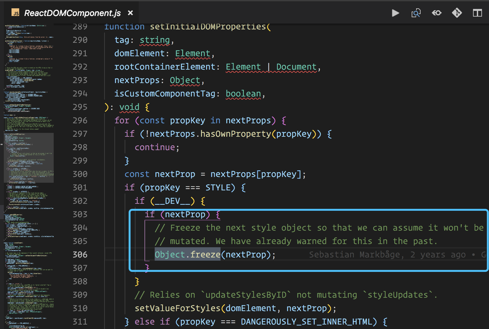

# 如何编写高质量的函数[理论卷]

> 第一个问题：如何高质量的阐述函数式编程

> 第二个问题：如何真正意义上的通过打通函数式的任督二脉来提高编写函数的质量

### 我的答案

> 第一个问题的答案

我会通过阐述几个很细节但非常重要的函数式编程知识，通过这些细节来介绍函数式编程，同时向大家展示函数式编程的知识体系，以及和我们现在大部分的知识体系有什么共同点和不同点。

> 第二个问题的答案

这里我会通过分析开源项目的代码和平时工作中的代码以及小伙伴的代码，来展示如何运用函数式编程来提高函数的质量。

上述是我面临的一些问题和解决方案，最后写出了这两篇文章，希望能够获得大家的喜欢吧。(当然喽，拉勾打个赌，敢不敢不看完文章就先给我点个赞，嘿嘿嘿)

## 番外篇——当代前端工程师面临的考验

突然的番外，让我措手不及，来不及思考，就要进入新世界了。

### 需求的复杂度越来越高

我想说的是：由于前端需求的复杂度越来越高，大量的业务逻辑放到前端去实现，这虽然减轻了后端的压力，但是却让前端的压力大大增加，前端工程师为此要完成存储、异步、事件等一系列综合性的操作。

### 需求完成度越来越苛刻

我们可以看一个公式：

> **f(需求) = 完美**

简单理解就是：输入需求，然后输出尽可能完美的结果。

在需求复杂度持续增加的条件下，需求完成度却越来越苛刻，这样的情况，会导致前端工程师的压力很大。我们不仅要解决各种负责的业务场景，还要保证还原度和开发效率，以及线上运行的性能等方面的表现。

### 前端工程师的普遍目标

我总结了一下，大致有四点：

1. 增强开发技能
2. 提高代码质量
3. 提高开发效率
4. 享受生活和 `coding` 的乐趣

这四点总结起来，我们要达成的目的，其实就是下面这张图：


**我能做的就是提前告诉你 One Piece 的内容。嗯，没错，就是上面这张图。加油吧，各位兄得。**

### 前端工程师的普遍现状

但现实总是美好和残酷混合的，由于各种原因，前端工程师的普遍现状可以用下面几点概况。

1. `coder` 的 `oop` 思想不强，导致代码质量不高
2. `coder` 的 `fp` 思想不强，导致代码质量不高
3. `JS` 语言自身的问题，导致代码的可控性较差

> 为什么我会这样说呢，且听我娓娓道来

首先，`JS` 是一门很灵活的编程语言，在灵活和基础不牢的双重作用下，代码就会积累足够的复杂度，代码的质量和可控性就会出现问题。

> 关于 `oop` 和 `fp` 的思想，可以用下面两句话进行总结概况

面对对象编程 `oop` 通过封装变化，使得代码质量更高。

函数式编程 `fp` 通过最小化变化，使得代码质量更高。

而前端工程师的 `oop` 和 `fp` 思想都不是很成熟，虽然现在前端界一直在推动吸收这些思想，但目前确实还是一个问题。

### 我个人的看法和总结

对于上面我写的那些话，我不是说前端工程师底子差什么的，我是在客观阐述一些观点，大家可以想一下，为什么现在不去说 `PHP` 了，还不是因为爱你( 前端工程师 )啊。

我们就像是新世代被选中的一群孩子，能做的就是接受这份挑战。就算以后某个时刻，你不做 `coder` 了 ，但是现在，身为前端 `coder` 的你，应该去战胜它，不为别的，只为作为 `coder` 心中的那一份执着和荣耀。

## 科普篇--关于编程语言

你跟我来，我从番外篇穿梭到科普篇的世界里。

### JavaScript 是函数式编程语言吗

> 要回答这个问题，首先，要明确的一点是：

`JS` 不是纯正的函数式编程语言，所以它不是函数式编程语言。

> 为什么呢？

因为它具有 `for` 循环等命令式味道过重的语言设计。真正的纯函数式编程语言，比如 `Haskell` 是没有 `for` 循环的，遍历操作都是使用递归。

> 为什么我要提这个点，是因为我想说一个道理，那就是：

既然 `JavaScript` 不是纯正的函数式编程语言，那我们就没有必要在使用 `JS` 的时候，全部采用 `FP` 思想，我们要做的，应当是取长补短。其实这句话也从另一个方面结束了之前掘金上关于函数式编程的讨论。

### 那 JavaScript 是什么语言？

> 这里我引用一句话：

**自然语言是没有主导范式的，JavaScript 也同样没有。开发者可以从过程式、函数式和面向对象的大杂烩中选择自己需要的，再适时的地把它们融为一体。**

> 出自：Angus Croll, 《If Hemingway Wrote JavaScript》

听我分析，虽然上面的话可能过于绝对，如果想知道上面的话为什么会这样说，我建议大家可以去学一下编译原理知识。

> 为什么我要这样建议

是因为我个人认为，所有的高级语言，都是要通过翻译来变成机器语言的，而越底层的实现，其思想和方法越具体和单一。比如，词法分析，语法分析，业界的方法屈指可数。也是因为只有统一，才能建立标准，就像当今的 `TCP/IP` 协议。

当然，我胡诌那么多没有啥卵用，但我们依然可以知道并确定一件事情，那就是：

**讨论 `JavaScript` 是一门基于什么样的语言，是没有任何意义的。**

### 一等公民究竟是什么鬼哦

都是 `JS` 的函数是一等公民，那一等公民究竟是什么鬼哦？其实，编程语言也是分 **阶级** 的，大致有如下阶级：

> 一等公民

如果编程语言中的一个值，可以作为参数传递，可以从程序中返回，可以赋值给变量，就称它为一等公民。

> 二等公民

可以作为参数传递，但是不能从子程序中返回，也不能赋给变量。

> 三等公民
它的值连作为参数传递都不行。

由于 `JS` 的函数是一等公民，所以我们可以把函数当初参数，也可以作为返回值，也可以赋值给变量。也正因为是一等公民，`JS` 的函数式编程才能发光发热。

## 卖萌篇--函数的分类

嗯，是不是很气，仁兄别急，`dva` 现在拉着你的手，从科普片场来到了卖萌片场。

下面是我心血来潮，总结加胡诌的一些看法。

### 从纯洁性角度分类

1. 纯函数
2. 非纯函数

嗯，我这分类没谁了，就像人，可以分为是人和不是人...

### 从调用形式角度分类

#### 中缀函数
代码如下：
```js
6 * 6 
```
 
`6 * 6` 中的 `*` 就是一个函数。而且由于在两个表达式的中间，所以叫中缀。看到这，大家应该有这样的思维，那就是在 `JS` 中用这些符号的时候，要自然的将其想象成函数。这样你会发现代码会变得更容易理解。

#### 前缀函数
代码如下：
```js
function f(str) {
  console.log(str)
}

f('hello, i am 源码终结者')
```

这种在函数名 `f` 后面加上参数的执行形式，就称函数 `f` 为前缀函数。这个我就不说了，大家应该很熟悉了。

### 提一下 let

当我学习 `haskell` 的时候，我发现 `haskell` 也有 `let` 。它是这样介绍的：

> **`let` 后加上表达式，可以允许你在任何位置定义局部变量。**

当看到这，我立刻想起来 `JS` 中 的 `let` 。这和 `JS` 的 `let` 不谋而合，虽然其他语言也有 `let` ，比如 `go` 语言。但我现在更有信心确定， `JS` 中 `let` 的诞生，借鉴的应该是 `haskell` 中的 `let` 。

所以，在 `JS` 中，我更想将 `let` 称为绑定。`haskell` 中介绍了 `let` 的缺点，这里我们推一下可以知道，`JS` 中的 `let` 缺点也很明显，那就是 `let` 绑定的作用域被限制的很小。

所以你会发现，在某些场景下，使用 `var` 也是非常合理和正确的。

我是分割线，热身要结束了，即将开始正题。

-----------------------------------------

## 文章整体思路

> 当失去以后，再次拥有时，才会倍加珍惜吧。

嗯，那开始正题吧。

首先可以知道的一点是：本文的思路是清晰的，文章前半段，我会着重阐述函数式编程的理论知识。比如我会阐述很多人心中对于函数式编程的一些困惑。文章后半段，我会结合开源项目的源码和实际工作中的 `coding` ，来展示如何运用函数式编程来编写高质量的函数。

> 下文的 函数式编程 统称为 `FP`


## 关于 FP 你真正困惑的那些点--FP理论知识

关于理论知识，我不会把 `FP` 的方方面面都涵盖，我会尝试从小的点出发，带你去认识 `FP` ，让大家可以在宏观层面上对函数式编程有一个较清晰的认知。

下面，我会从以下这些点出发：

- 函数式编程存在的意义
- 声明式编程
- 数学中的函数
- 纯函数/纯洁性/等幂性/引用透明/
- 副作用
- 数据的不可变性
- 惰性
- 态射
- 高阶性
- 其他理论知识

> PS: 这里我不会对单个点进行详细介绍，只说出我个人对其的一个认知和理解。


### 函数式编程存在的意义

这是一本书中的解释：

> **函数式编程的目的是使用函数来抽象作用在数据之上的控制流与操作，从而在系统中消除副作用并减少对状态的改变。**

这句话总结的很不错，看起来好像很深奥，小伙伴们不要怕，看下面我的分析你就明白了。

> 我们看一下上面的解释，会发现这句话，其实是在说：

函数式编程是一种解决问题的方式。

> 为什么我会这样说呢，继续往下看：

我们继续分析上面的解释，可以知道下面两点：

第一点：`FP` 抽象了过程，比如控制流(如 `for` 循环)

第二点：`FP` 消除程序中的副作用(后面说)

稍加推导可以知道第三点：

`FP` 的存在一定是解决了其他范式的一些缺陷，比如面对对象范式的一些缺陷，如副作用在面对对象中很常见，从 `Java` 的锁机制可以看出副作用的表现，当然我对锁机制这种观点可能不准备，但是关于一定是解决了其他范式的一些缺陷这个观点，还是很正确的，不然就没有存在的意义了。

> 提一下函数式编程和抽象的关系

上面第一点提到，`FP` 抽象了过程，关于抽象，我们知道，抽象层次越低，代码重用的难度就会越大，出现错
误的可能性就会越大。

> 为什么说抽象层次越低，代码重用的难度就会越呢？

我来举个栗子，你就会明白了。就一句话：每次吃面条时，作为 `coder` 的你，有两种选择：

第一种：直接去超市买把面条，下着吃。

第二种：自己和面，自己擀面条，然后下着吃。

上面两种方法，你会选哪一种呢，其实我已经猜到了，抽象的高和低就是第一种和第二种的区别，小伙伴好好想一想。

> 综上，我们可以知道：

`FP` 的本质意义就在于此，真正理解了其存在的目的，也就理解了我们为什么要使用函数式编程了。

### 前段日子掘金上关于 FP 的讨论

之前掘金上有那么几天非常热闹，是关于函数式编程的讨论，有说函数式好用的，有说不用函数式的政治正确的，有 `/^驳/` 的。那些天，每天刷掘金，都能看到相关的文章，总是想说些什么，但是最后也没有说什么。

但是，如果真正理解了函数式编程的意义，也就不会有这么多不同的声音了。

> 但声音这么多，主要原因应该还是：

**写文章的时候，偶尔会说出很绝对的话，这会导致其他作者进行回应，紧接着，事件持续发酵，激起了可爱的吃瓜群众的兴趣，遂开启了大规模的围观和讨论。** 

在这里，我想用一句话来结束争议，那就是：

**函数式不是工具，也不是 `api` ，它是一种解决问题的方式。**

> 这句话，不做解释了，自行脑补吧。

### 声明式编程

说到声明式，就要提到命令式。声明式和命令式，是目前前端所面临的两种编程范式。

小伙伴应该知道，函数式编程是声明式编程。当你看完上面我对 `FP` 意义的解释后，你就会明白为什么会有声明式编程存在了。

**`FP` 可以将控制流抽象掉，不要其暴露在程序中，这就是一种声明式编程。**

关于编程范式，大家可以快速浏览下面关于编程范式的维基：
> [维基百科链接-编程范式]https://zh.wikipedia.org/wiki/%E7%BC%96%E7%A8%8B%E8%8C%83%E5%9E%8B


> 思考题：声明式编程的软肋在哪，它与命令式编程的本质区别是什么？小伙伴可以思考一下。

### 数学中的函数

为什么要说这个，我认为，如果想更好的理解和运用函数式编程，就必须要去了解数学中的函数，因为函数式编程的很多概念和数学中函数的思想是强相关的。

这里我不做分析了，我贴一个维基链接：
> [函数-维基](https://zh.wikipedia.org/wiki/%E5%87%BD%E6%95%B0)

小伙伴们自行学习一下，看的时候，大家可以顺带滑到最下面，看看有相关范畴论的介绍，范畴学的思想对函数式编程非常重要。

### 纯函数/纯洁性/等幂性/引用透明性

这几个词在 `FP` 中很常见，在我看来，这些词最终的目标都是一样的，那就是达成上文提到的 `FP` 的目的。这里我用简洁的语言去阐述一下这些词背后的理念。

这些词代表的意识其实是一样的，可以这样理解：

**纯函数的特性包括纯洁性，等幂性，引用透明性。** 

> 那纯函数是什么呢？可以通过下面的说法来认识纯函数。

**所有的函数对于相同的输入都将返回相同的输出。**

`PS:` 当然我这篇文章并不是让大家运用纯函数去实现编程，而是想让大家运用函数式的思想去实现编程，不一定要是纯函数的，引纯函数知识 `FP` 的一个思想而已。

### 函数的副作用

上面说了纯函数，那么如何理解函数的副作用呢，可以这样理解：

**相同的输入，一定会输出相同的输出，如果没有的话，那就说明函数是有副作用的。**

> 从这句话，我们认真想一下，可以推导出：

因为 `I/O` 的输出是具有不确定性的，所以一切的 `I/O` 都是有副作用的。

> 如何处理副作用

后面实战再说，这里我提一点，大家可以去看看 `dva` 的文档或者源码，其中关于异步请求的，都只在 `effect` 中完成，而 `effect` 在函数式编程中有副作用的意识，这是一种将函数的副作用隔离起来的设计思想。

### 数据的不可变性

关于数据的不可变性，还是很重要的，我们需要去深入的理解它。我想几个问题：

第一：前端出现数据的不可变性的目的

第二：前端如何做到数据的不可变性

下面我们来一次回答这两个问题。

#### 前端出现数据的不可变性的目的

回答这个问题之前，我想说另外一个事情，那就是：许多编程语言都支持让数据不可变，比如 `java` 的 `final` ，可以看看这篇文章，很不错。看完，你会对数据不可变有一个交叉的了解。

> [浅谈Java中的final关键字](https://www.cnblogs.com/xiaoxi/p/6392154.html)

`ok` ，我个人认为，不可变性思想很简单，但很重要，我举个例子你就明白了。


代码如下：
```js
const obj = {}
const arr = []
const sum = 0

function main(arg){
  // TODO:
}

main(obj)
main(arr)
main(sum)
```

> 从上面的代码，我们可以知道以下几点：

第一点：`main` 函数的参数都是依赖了外部作用域的变量

第二点：变量 `obj` `arr` `sum` 是可以被外界改变的

第三点：要注意一个事情，我们目前无法避免外界对这些变量进行改变，有可能是必须要改变的，也有可能是无意间被改变了。

第四点：虽然我们无法避免外界对其可能造成的影响，但我们可以避免我们自己对其可能造成的影响，比如我们使用 `main` 直接对 `obj` `arr` 本身进行操作，这样的话就会使得 `obj` 和 `arr` 被改变，如果改变了，那在我们多次调用 `main` 函数时，就可能会出现问题。

第五点：上面的代码已经违反了函数式编程的原则，就是不能依赖外界的数据，这样会有副作用。

> 基于上面五点后的答案

知道上面五点的信息后，我们想一下，如果能把`arr` `obj` `sum` 设置成不可变数据结构。那我们就可以直接避免了外界和我们本人对其造成的所有影响。因为设置了数据不可变性，外界没法去改变它们。所以这就是为什么，前端会出现数据不可变性这一说，因为当前端越来越复杂的时候，这种要求就表现的更加明显了。但是，很遗憾的时候，`JS` 是不支持不可变的数据结构的。

#### 前端如何做到数据的不可变性

前端如何做到数据的不可变性，这里有三种方法：

> 第一种方法：

在函数内对引用类型创建一个新的副本，然后对副本进行指定业务处理。

> 第二种方法：

对引用类型进行封装，业界常用的方法就是值对象模式，通过闭包的形式暴露出去。

> 第三种方法：

通过 `JS` 的 `api` 来实现，用规则来阻止对象状态的修改。比如使用 `Object.freeze()`  来冻结一个对象，当外界试图对这个对象进行增删改属性的时候，就会导致程序错误。对于第三个方法，我们看一下 `react` 的源码中，哪些地方用到了，如图所示：



在 `ReactDOMComponent.js` 中对 `nextProp` 对象进行了冻结，可能很多人不明白为什么要冻结，其实很好理解，我们从因果关系来理解。

首先 `react` 假设 `nextProp` 不会发生改变，那么怎么保证不会发生改变呢？肯定是通过 `Object.freeze(nextProp)` 对 `nextProp` 进行冻结，冻结后，`react` 就可以知道，从这个时刻开始，`nextProp` 对象就是不可变的了。所以它就可以进行下一步，按照不可变作为前置条件的流程了。这样做，其实也是在告诉我们，如果我们试图修改它，就会报错。

#### 数据的不可变性总结

理解不可变性是非常重要的，我们不能把不可变性框在一个很窄的范围，比如上面的代码，全局变量 `sum` 虽然是值类型，可能你觉得值类型是不可变的，但是你会发现，它也会被外界所修改。所以这里的不可变性，并不是小范围的不可变，而是多个层面的不可变，这里还需要多多去理解和感悟吧。

### 惰性

我认为惰性不仅仅是 `FP` 的特性，它在前端领域，也是一个非常重要的思想。

> 惰性可以用一句话来解释：

**只在需要时才发生。**

怎么理解这句话呢，我来列举一下，前端用到 **惰性思想** 的场景，场景如下：

- 前端的懒加载
- 前端的 `tree shaking`
- 无限列表问题
- `recycle list`
- 动态导入导出
- 前端的缓存

想一下，会发现， `FP` 的惰性目的，已经包含在上面那些场景中了。

> 关于 **只在需要时才发生。** 这句话， 小伙伴们可以结合我列举的场景进行对比理解，我就不继续苍白解释了，点到为止。

### 态射

为什么我要说这个，是因为理解态射的知识，对你更好的使用函数式编程有着非常重要的意义。

> 那什么是态射呢？

简单理解，就是一种状态到另一种状态的映射。态射包含很多种形式，这里我们说一下类型映射。比如输入一个 `String` 类型，然后返回一个 `Boolean` 类型，这就属于一种态射。

比如下面的 `demo` ：

```js
const isNumber = n => typeof n === 'number'
```

上面的函数，输入的是数字类型，出入的是布尔类型，这就是一种态射形式。函数式编程的很多概念都和态射有关系，比如管道化、高阶化、组合、链式等。如何将一种类型的数据机构映射成另一种数据结构，这是一个很重要的知识点，这里我把核心的点提了出来，小伙伴自己一定要多去了解和掌握。

### 高阶性

高阶性是函数式编程的一个核心思想之一，在更高抽象的实现上，必须依靠高阶性来实现。通过把函数作为参数，对当前函数注入解决特定任务的特定行为，来代替充斥着临时变量与副作用的传统循环结构，从而减少所要维护以及可能出错的代码。

我认为，高阶性是一个非常重要的特性，想玩转函数式编程，就必须要玩转高阶性。为

> 为什么我要这样说呢？

因为你会发现，函数的管道化，组合，柯里化，都是要依靠函数的高阶性来实现。拥有高阶性的函数，我们称它是高阶函数，那么什么样的函数成为高阶函数呢。

> 目前我理解的高阶函数---HOC(Higher-Order-Functions)的定义是这样的：

**传入的参数是函数，返回的结果是一个函数，这两个条件，具备一个，就可以称函数是高阶函数。**

关于高阶函数，更多是去理解和实战，这里关于理论方面的知识我就不多介绍了，大家结合我的实战篇好好理解一下。

### 其他理论知识

上面我提到的理论知识，都是原子级别的特性，也算是 `FP` 的基石。像柯里化、偏应用、函数组合、函子等其他更高阶的实现，都是在前面这些 基石的基础上实现的。所以这里理论篇我就不介绍他们了，小伙伴们自行去分析和学习，我会在实战篇把这些高级实现串起来。当然如果对这方面理论知识有兴趣的小伙伴，想和我交流的，也可以私聊我。

### 关于 FP 理论知识的总结

`FP` 是个好东西，它可以帮助你控制代码的复杂性，可以增强你的逻辑能力，可以让测试更容易，等等。

> 现在，大家对比下面两个问题：

1. 学习算法对前端工程师有用吗
2. 学习函数式编程对前端工程师有用吗

你会发现，都有用，但不代表我们就要在实际前端场景中大量使用它们。

> 个人认为前端需要掌握 `FP` 的水平

上面我介绍了我认为目前 `FP` 领域内，需要掌握的一些元知识，只有掌握了这些元知识，我们才能更好更快的掌握基于元知识衍生出的各种功能实现。比如柯里化函数、偏应用函数、组合函数、高阶函数甚至函子等。

但其实，在我实践了 `FP` 后，我个人认为，现在的前端工程师在 `FP` 方面，只需要把组合，柯里化，和高阶玩好就行了。其他的高级用法可以先不用进行实践。我认为前端工程师掌握这三个，就已经能够在前端把函数式思想发挥到淋漓尽致的地步了。这是在学习 `FP` 的感悟。

## 文末总结

本来想写一篇的，但是发现一篇太长了，就分成了上下两篇。

函数式编程这块，涉及到的东西非常多，光理论知识就很多了，我的这篇文章对于理论知识，没有过多的去解释和分析，我是按照我个人的理解和总结去向大家展示如何搞定函数式编程的理论知识。所以可能会有一些意见的不统一，或者理论知识涵盖的不全，还请多多理解和支持。这篇文章不是单纯的只分享如何搞定 `FP` ，是结合如何编写高质量的函数去向大家进行综合阐述。

## 参考

### 参考链接 

- [图解 Monad](http://www.ruanyifeng.com/blog/2015/07/monad.html)
- [monad wiki](https://en.wikipedia.org/wiki/Monad_(functional_programming))
- [What is a monad?-stackoverflow](https://stackoverflow.com/questions/44965/what-is-a-monad)
- [读书笔记: 范畴论](http://www.cnblogs.com/steven-yang/p/10014796.html)

### 参考书籍

- JavaScript ES6 函数式编程入门经典
- JavaScript 函数式编程指南
- Haskell 趣学指南
- 其他电子书