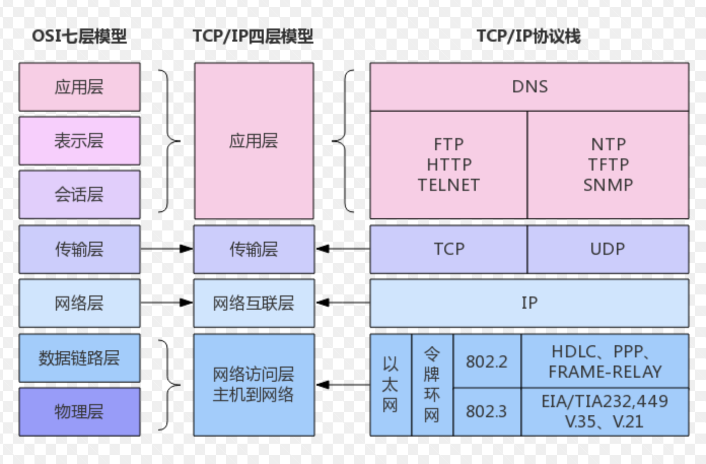
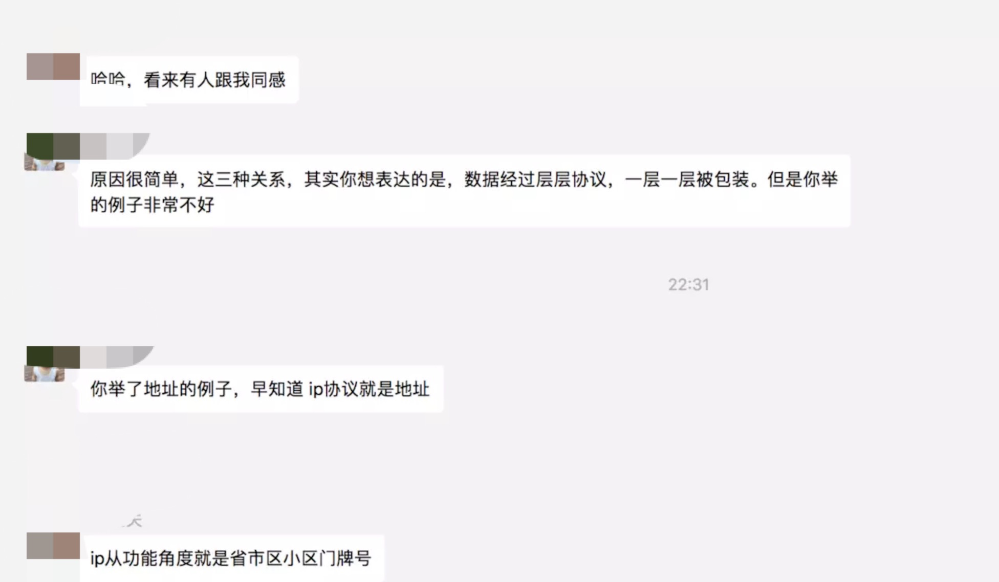
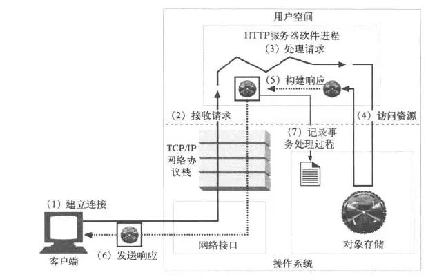
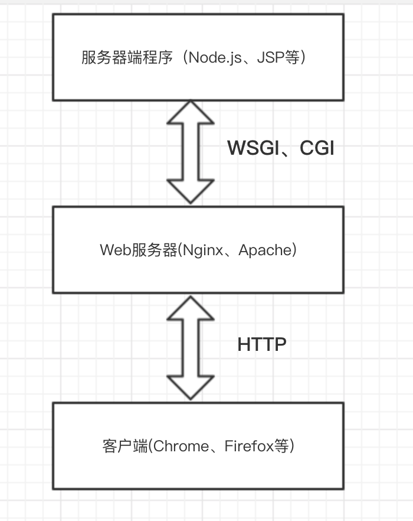

# 前端网络知识

## 写在最前
有人说，前端工程师的网络基础很弱，说很多都是非计算机的，门槛低，其实不能一概而论。但是既然人家吐槽了，那我们就提高自己呗。

## 没有规矩，不成方圆
前端工程师对这句话应该有比较深刻的感受吧，这也可能是前端变化真的太 `TM` 的快了。但变化的这么快，总是要沉淀下来一些 **规矩** 吧，不然的话还能不能过了。

> 那沉淀下来的规矩在哪呢？

规矩有很多，比如：`AMD`，`CMD`、`Promise` 等，都可以看做是一种 **规矩** ，下文统一叫标准吧。

> 有句话是这样说的:

**可以随便造库，但是不要随便定标准。**

也就是说，如果没有足够多的人达成共识的话，那么你造的标准其实并没有什么卵用。

> 所以，静下来想一下，我们从哲学的角度看：

如果没有标准，那么这个世界将会变的非常无序和混乱，正因为有了标准，世界才变的有序整齐。

> 对此我们可以类比数据归纳法进行推导一下：

我们将世界的网络( `Internet` ——国际互联网)，进行归纳，得出一个结论，如果世界上的网络没有约定标准的话，那也将会变的异常混乱。

所以，我们学习网络基础，其实就是在学习当今 `Internet` 的标准。当我们学会了标准后，我们就可以遵循它，然后去做一些我们想实现的东西。其实，你会发现，很多东西，都是这个道理。

> now，我们应该就知道要怎么去提高我们的网络基础了。

我们要去学习 `Internet` 的标准，看看它的标准是什么，为什么要这样去设计标准，以及这样写的好处是什么，还有这样设计的编程思想是什么。

> 编程思想有时候会给我们带来很多不一样的感受。

为什么现在有 `MVP` 、`MVVM` 、`MVX` 等设计模式。那是因为优秀的程序员，去学习 `MVC` 的经典设计思想后，得到灵感，然后将一个经典设计思想，扩展出很多更加优秀的设计思想。所以，这也是我们去学习一个东西的目的，也是一个能够使我们形成一种自我驱动的一种学习模式。只有这样，我们才能不断进步吧。

--------------

好了，不胡扯了，那下面我就开始以我个人的学习和见解，去阐述一下 **网络基础** 。

**PS：**`Promise` 有 `PromiseA/B/C/` 等等社区标准，但是最终选择了 `PromiseA+` 作为官方标准。

## `Internet` 并不神秘

> `Internet` 真的并不神秘，且听我说：

想上网，首先你得有网络设备吧，这里不一定是要你去买，可能是别人给你提供好了，比如运营商拉线子过来了，你就不用买线子了丫(手动滑稽)，还有主机、交换机、路由器等，这些基本组成了 `Internet` 的网络设备。

可能一些人不理解每个设备的作用，但是有一些东西，当你不了解的时候，就尝试使用 **代入法** 去理解。比如，可能对交换机和路由器不了解，但是不去了解，又会对后面的了解造成障碍，那么怎么办呢？

> 我们可以把硬件设备当成软件看待

毕竟硬件里面也是有编的代码丫，当然有些没有代码，比如线子，集线器，但是我们可以认为里面写了个空函数啊，那这样就可以从软件层面理解硬件了。

> 那再可爱一点:

**我们可以把完成特定功能的硬件看成是软件中的功能模块，有入参，有出参。**

> 再形象点，可以理解成中间件

数据就是在一个个中间件中进行传输，并且在每个中间件中做相应的处理，比如封装，验证正确性，最后数据展示在了你的眼睛里。

如果这样去理解，是不是感觉没有想象中的深奥难懂了呢。

> 其实我们的目的就是：

**把抽象深奥的知识形象化，然后把形象化的知识抽象成我们能理解的样子。**

这样我们就好像让我们可爱的脑子完成了一次 `babel` 转译，真是有趣，这是一个快速理解深奥知识的一个技巧。知识不能学死了，万变不离其宗，很多地方都是一样的思想，学会融会贯通是一种很重要的能力。

## 一道经典题引发的联想

**你能说说三次握手，四次挥手的过程吗？**

相信很多人都会被问到过，这是在考察网络知识的情况下，基本少不掉的问题，也说明了这个问题所体现的知识是基础的，是在考察你的网络基础。

现在当我们再次看到这个问题，我们可以尝试向上溯源一下。比如，想一下为什么要有这个过程，为什么要这样去做，我两次握手解决不行吗，我不做第四次挥手不可以吗？

这里有一篇个人认为还不错的文章：

> [跟着动画学习TCP三次握手和四次挥手](https://mp.weixin.qq.com/s/pSrKbVryn71kDVIXUtpXMA)

关于三次握手和四次挥手的回答我就不回答了，上面文章已经介绍了比较清楚了。有啥疑问，可以文末扫我微信二维码，我们私聊交流一波( 滑稽脸 )。

## 数据和电的故事
> 这是我胡诌的一个故事：

将数据从一个主机 [北京] 传输到另一个主机 [南京] 是一个复杂的过程，不像是输电那样，一股脑输过来就好了，当然输电也是一门高学问，比如高压输电。

> 但是数据这东西比起电，可复杂多了。

比如，电是中央空调，谁掏钱，我就流向谁，大家都一样，没有什么。基本不会存在像：你这家电好可爱哦，你家的电比我家的电帅多了的这些情况😂。通过这个小栗子，我主要想说明电没有隐私，不具有让用户损失什么东西的可能。今晚电压低了，忍一忍，明天换个大的变压器，晚上就正常了，用户也不会说什么。

相比之下，数据可不一样了，数据是一种具有隐私性质的信息，既然具有隐私，那就得保证安全性和完整性，而且不能时而安全，时而不安全，时而完整，时而不完整，所以一下就大大提高了传输的复杂程度。

## 一张图引发的联想

下面我们看一张图：

首先这张图展示了目前整个 `Internet` 的层级结构。我现在也不解释为什么是这样的，因为这是标准，已达成共识。但是我想说几个情况。

第一个情况：你肯定不止一次看到过这种图，但是很多人还是会在面试的时候被问倒，一时想不起来，这种情况的原因，基本是当初没有理解，或者没有进行形象化的记忆。比如一个血淋淋的事实，就是英语单词背了那么多，还是很快就忘。那么现在，我们再看到这个图时，怎么保证下一次不再被问倒了呢？

那就要从记忆学上做文章了，要联想，要有故事参与进来，带剧情的那种。`OK` ，那现在，我们从这张图能联想到什么？这是一个问题，那么跟着我开始联想吧。

### 第一个角度

从前端角度来联想，`OSI` 七层模型到 `TCP/IP` 四层模型的转换过程中，很明显是做了封装了。

从中间件的角度来思考，这 `7` 层或者 `4` 层，我们都可以把每一层看做是中间件。数据在中间件之间进行流动，那么每一次经过一个中间件，也就意味着会进行一次数据处理。每个中间件完成一个特定的功能。 `TCP/IP` 的四层是将七层的模型包装了一下，化繁为简的哲学。将功能重复性的层合并在同一层，有利于确保每一层的功能相对独立，属于更高级别的抽象。隐藏了细节，同时层级之间的功能区别更加明显。

### 第二个角度
可以从 `npm` 包的角度来思考，你会发现在 `TCP/IP` 分层结构中，高层级会依赖低层级。就好像是 `npm` 包，安装 `A` 包，你会自动安装 `B` 包，`B` 包又会依赖 `C` 包。也就是，要想安装成功 `A` 包，那么 `B` 包, `C` 包都要参与。OK，那这样理解的话，我应用层发起的数据流动，一定会依赖传输层，网络层，接口层。所以一些前端工程师只知道发起 `ajax` 或者 `fetch` 请求的时候，走了下 `http` 。对于走不走 `tcp` , `ip` ，接口层。不太清楚。所以，看到这里，我觉得小伙伴还是要好好理解一下你发起的数据请求是如何在网络中进行流动的。

## HTTP/TCP/IP 三者的联系
三者有什么联系，这里我举个栗子，虽然不能算准确，但足够形象。

`IP` 是以主机为单位，通过 `IP` 能找到你所在的城市。

`TCP` 是以主机的端口为单位，通过 `TCP` 能找到你所在城市的你居住的小区。

`HTTP` 呢，它是以用户进程为单位，通过 `HTTP` 能找到你所在城市所在小区的房间号。

通过上面的比喻，是不是发现非常通俗易懂，这就是讲故事的魅力，哈哈哈。这个例子也能说明，如果你想找到房间号，那你肯定是要先找到城市，然后再找到小区，最后找到房间号。也就是说你想发送 `HTTP` 成功的话，那必须是 `TCP` , `IP` 都要成功，你才能发送 `HTTP` 成功。

2019年2月3号备注：上面这个 `HTTP/TCP/IP 三者的联系` 的例子举的很不准确，在此表示道歉。

> 已有大佬和我进行了交流：

上图已经给出了正确的解释，主要原因是我强行故事了一波，导致有点本末倒置，而且还容易误导小伙伴，道歉道歉😂。

## IP

`IP` 层是网络层，定义了不同主机之间的寻址方式。简单点理解，就是通过 `IP` 地址来找到对应的主机。

## TCP/UDP

传输层是非常重要的一层，具有承上启下，向上对应用层提供通信服务，向下将应用层信息封装为网络信息。

传输层连接主机之间的进程，同一主机中不同进程的网络通信通过端口进行区分，所以传输层为主机提供的是端口对端口的服务。

> 这里提一下，进程是什么

可以这样理解，当应用程序被调入内存运行后，这个应用程序就可以被称为进程了。

> 端口不属于任何应用程序

应用程序通过系统调用与某个端口建立连接( `Binding` )后，才会确定这个端口是为这个进程服务的，数据什么的都是通过端口来传输给进程的。因为端口不属于任何应用程序，只是在绑定的时候，才会确定为哪个进程服务。

> 传输层和端口的交互方式

传输层传给该端口的数据都被相应的进程所接收，相应的进程发给传输层的数据都从该端口发出。这里的端口是传输层的寻址方式。

> 端口是软件级的概念

端口是由 16 位二进制数来表示的正整数，也就意味着一个主机理论上最多有 65535 个传输层信道。但是通常都少于 65535 个。
比如说，80 端口，21 端口，8080 端口等，都是默认的端口号，通过这些端口号来完成特定的通信。

## HTTP

`HTTP` 是构建在 `TCP/IP` 之上的应用层协议，而 `HTTPS` 是在 `HTTP` 之下加入 `SSL/TLS` 。

简单介绍下，`HTTP` 是超文本传输协议的英文缩写，它是 `Internet` 上最主要的 `Web` 应用层标准，`HTTP` 能够传输任何格式的数据。

> 作为前端工程师，我们应该从 `HTTP` 里学习到什么呢？

我们说一个事情，比如面试经常问你，输入一个 `url` 后，会发生什么，其实如果你理解的比较深的话，完全可以画个图告诉他，当然打电话就只能口述了。

1. 首先你点击一个 `url` ，是发起了一次 `http` 请求
2. `http` 请求一定会依赖 `tcp` ，`ip` 等。也就是意味着你要做 `tcp` 建连，`IP` 查询。
3. 如果你的 `url` 是域名的话，还需要先去解析域名，也就是 `dns` 操作。使其变成 `ip` 地址。这个过程一定是在应用层完成的，因为应用层不完成的话，那 `TCP` 层就拿不到 `IP` 地址，那 `IP` 也就收不到地址数据。所以我们这样一推导，也就这知道了 `dns` 是在应用层完成的。
4. 数据正常传到接口层后，肯定是要传到对应 `IP` 地址的服务器的对应端口。也就是 `TCP` 建联。`TCP` 要先建连成功，`HTTP` 才能进行传输。因为是依赖关系，接收方的 `HTTP` 需要从 `TCP` 那获取数据。如果 `TCP` 建连失败，那 `HTTP` 也就不可能建联成功。
5. 如果都成功了，那就传输数据吧。
6. 传输完，`TCP` 连接关闭。页面有了新的数据展示在用户的面前

看到这，你肯定会想，缓存呢，这里我没有把缓存考虑进去，今晚缓存无处不在，缓存这个点大家自行填充吧。

下面可以用一张很酷的图，展示当输入 `URL` 时，整个过程是什么样子的。如下图所示：

`HTTP` 是一种标准，他有自己的形式，你看看 `HTTP` 的数据传输形式，你大概就能想象到 `TCP` 大概是什么样子的数据传输形式了。

网络请求的数据结构是前端控制的，比如请求的方法，请求的 `url` ，请求的参数等。那么响应的数据结构就应该是由服务端来控制了，服务端给我们必要的返回信息，比如状态码，数据，缓存控制等。

### HTTP状态码

在 `web` 编程中，状态码是非常重要的事情。

> 设置状态码的目的是什么？

是为了让开发人员和用户知道服务器是正常处理了请求还是出现了错误。了解目的，对于我们去了解状态码为什么会这样分，是非常必要的事情，至少心里不那么感觉到陌生了。

而在状态码中，有一个系列非常重要，那就是 `3XX` 系列。

#### `301` ，`302` 的区别

> 302 临时重定向

临时重定向，意识是当服务端关闭的时候，客户端发起 `url` 请求，是不能成功的。它还需要向服务端发起请求，让服务端重定向到目标网址，也就是返回 `location` ，然后再转到目标网址。

PS: 思考一下，为什么会有 302 ？ 

> 301 永久重定向

永久重定向，是即使服务端关闭了，浏览器端发起 `url` 请求，也可以不经过服务端而直接转到目标网址。除非清理缓存，否则以后再次访问都是直接访问另一个地址。

### HTTP 请求方法
可以这样理解，`HTTP` 就好比一个对象参数，里面有 `Method` ，代表 `HTTP` 的请求方法，用来告诉服务器，客户端访问你的 `url` 的目的是什么，是获取信息，上传数据还是删除信息。通常用到的最多就是 `GET` 和 `POST` 。经常用的 `GET` 和 `POST` 就不说了，这里说一下 `OPTIONS` ：

`OPTIONS` 是为客户端提供一种查询 `URL` 地址中有哪些可用的访问方式的方法。

PS: 留给思考，这个 `OPTIONS` 的使用场景是什么呢？

#### `POST` 和 `PUT` 的区别：

`POST`：`POST`的数据，服务器必须保证数据被完整的保存，并且不允许出现重复的 `POST` 数据提交。通常在 `HTML` 中通过表单来提交数据。

`PUT`： `PUT` 允许客户端提交重复的数据，当提交重复的数据时，会用新提交的数据覆盖掉服务器已有的数据。

**PS: 这里推荐一本我读过的书籍 《图解HTTP》写的很不错，图文并茂，简单易懂，值得阅读。**

### HTTP是怎么在服务端走的
看下面我画的一张图，这是服务器端程序、`Web` 服务器、客户端之间的关系：

上图是主流的模式，`Web` 服务器仅起到桥梁的作用，即将浏览器的 `HTTP` 请求解码，转换成服务器端程序能够识别的接口调用方式，然后服务器端程序会将生成的返回封装成 `HTTP Response` ，并返回给用户。

> 注意1：

在服务端，用户发的请求，如果是为了获取静态资源的话，一般是不经过服务器端程序的，直接通过服务端的缓存机制，返回资源给用户，比如 `Nginx` 的静态资源缓存。不走服务端程序，会大大提高响应速度。

> 注意2：

服务端一般都是在公司的内网，外网是无法访问的，发起 `HTTP` 请求，其实大多数情况下都是先通过 `Nginx` 进行反向代理，同时也是负责流量转发，将不同的请求转发给内网特定的服务器。 

## Socket
`Socket` 在汉语中是指孔或插座的意识，顾名思义，插上了就可以通信了。`Socket` 一开始是作为 `BSD UNIX` 的进程通信机制，然后逐渐成为主流操作系统共同遵守的网络编程标准。

### `Socket` 是什么

`Socket` 是一个通信链的句柄，可以用来实现不同虚拟机或不同计算机之间的通信，也可以实现相同主机内的不同进程之间的通讯。

### `Socket` 的组成

**`Socket` = `IP` 地址 + 端口 + 协议**

`IP 地址 + 端口 + 协议` 组成一个唯一标识，用来标识一个通信链路。

可以看到，`Socket` 其实是对 `TCP/IP` 进行了高度封装，屏蔽了很多网络细节。这样可以使开发者更好地进行网络编程。其实就是我们写个高度封装内部细节的函数，通过传参来完成指定的行为。

可以这么说，所有的 `TCP/UDP` 等编程，基本都是按照 `Socket` 协议标准来进行编程的，换句话说，`Socket` 是一套标准，就好比 `DOM` ，所有语言都可以按照 `DOM` 的接口标准来实现自己的逻辑。 

`Socket` 有自己的原语，开发者可以按照 `Socket` 的原语在不同语言下的实现方式来进行网络编程。

## 谈谈 WebSocket

### WebSocket 是什么？

这是 `HTML5` 定义的一种新的标准协议，实现了浏览器与服务器的全双工通信。我们可以将 `WebSocket` 理解为 `Web + Socket` ，它是一种双工通信。

> 什么是双工通信？

就是在同一时刻，我既可以扮演通信双方的发送方，也可以扮演通信双方的接收方。

### 为什么会出现 `WebSocket`

在 `WebSocket` 出来之前，前端的 `Web` 通信基本就靠 `HTTP` ，但是 `HTTP` ( 1 或者 2 ) 请求本身有一些缺陷，比如：

1. 首部信息冗余，每次发送请求，都要携带大量冗余信息。
2. 不能实现双工通信。

所以在这个技术背景下，`WebSocket` 技术出现了，弥补了 `HTTP` 的缺陷。但是我们又不能不用 `HTTP` ，因为已经用的场景太多了，所以就综合了一下，让 `WebSocket` 协议是在 `HTTP` 协议之上的。这样就可以做到平稳过渡到新的通信协议上了。 

### `WebSocket` 的通信原理

`WebSocket` 是建立在 `HTTP` 之上的，也就意味着你要建立 `WebSocket` 的话，需要走一次 `HTTP` ，走完后，你的 `WebSocket` 就建立起长连接了。然后只要不是主动断开的，就会保持好客户端和服务端之间的连接，不会使其断开。当有数据传输的时候，会直接进行传输，不再发起 `HTTP` 请求。

前端使用 `WebSocket` 很简单，就那么几个 `API` ，可自行去查看。但是我们要清楚每个 `API` 究竟发生了什么事情，只有理解了背后的那些真相，我们才算是真正理解了 `WebSocket` 。

### WebSocket 优点

1. 支持推送功能，服务端可以向客户端推送数据。
2. 减少通信量，一方面是 `WebSocket` 的首部信息很小，另一方面是不需要频繁进行 `HTTP` 连接了，可以进行持久连接。

这里推荐一篇文章，写的挺不错，可以看看：

> [WebSocket 是什么原理？为什么可以实现持久连接？](https://www.zhihu.com/question/20215561)

## C/S 和 B/S 架构
对于前端工程师来说，还是要去了解一下 `web` 架构的发展演变的，提到发展演变，不得不说一下 `C/S` 和 `B/S` 架构。

### C/S

`C/S` ，即 `Client/Server` ，当前网络编程的主流架构模型。 `Clent` 是客户端的意识，`S` 是 服务端的意识。

### B/S

即 `Browser/Server` ，是使用 `Web` 浏览器作为客户端的应用软件。

从上面介绍我们可以推断出，`C/S` 中的 `C` 有很多，比如 `APP` ，桌面应用等。但是 `B/S` 中的 `B` 只特指浏览器。

问题来了，`B/S` 结构与 `C/S` 结构相比，有什么区别或者说有什么优势呢？

### B/S 的优缺点

#### 优点

第一： 最显而易见的就是，`B/S` 部署升级快，无需应用程序更新，因为 `B/S` 系统的所有应用程序都是部署在服务器上的，不需要更新客户端软件。所以很多 `APP` 内都内嵌 `H5` ，`Hybrid` 。 因为不需要审核，可以直接发布。为什么不需要审核呢，是因为前端的跨域限制，`JS` 是无法获取设备其他信息的，不需要担心安全问题，也就不用审核了。

第二： 跨平台，因为操作系统都支持 `Web` 浏览器，所以只需要在浏览器中运行就好了。

#### 缺点

安全性要求高，`B/S` 架构是建立在广域网上的，面向所有用户。通过 `url` 就可以访问服务器端资源，所以安全性要求要比 `C/S` 要高。

## 备注
1. 没有写过多细节，一些细节自行去理解吧，也可以私聊我技术交流。
2. 本文在整体上阐述了一个前端工程师应该要去掌握的网络知识。
3. 本文字数还行，看着应该不怎么累( 笑哭脸 )。 

## 参考连接

> [关于TCP/IP，必须知道的十个知识点](https://www.toutiao.com/i6570218601117123080/#comment_area)
