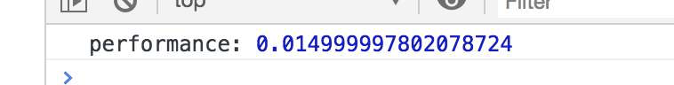
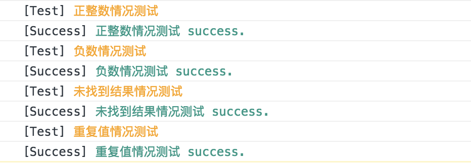
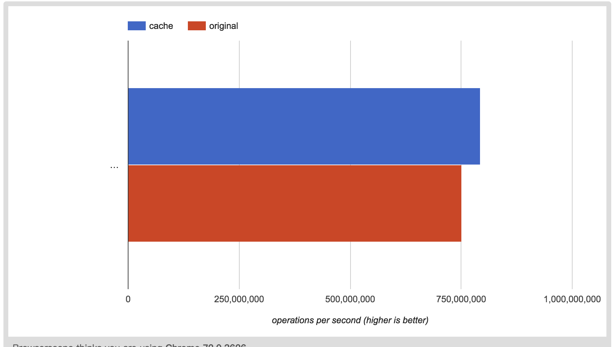
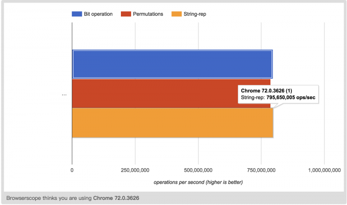

# 从一个数组中找出N个数其和为M的所有可能

## 故事的背景

这是一个呆萌炫酷吊炸天的前端算法题，曾经乃至现在也是叱咤风云在各个面试场景中。

可以这样说，有 90% 以上的前端工程师不会做这个题目。

这道题涉及的知识点很多，虽然网上也有相关的解答文章，但是在算法小分队的讨论和分析中，一致认为网上的文章太旧了，而且最多就是贴贴代码，写写注释，并没有具体的分析。

## 暴风雨前的宁静

我们看一下题目：

**从一个数组中找出 N 个数，其和为 M 的所有可能。**

大家可以中断 5 分钟想一下，不管想什么，反正先看着题目想 5 分钟。

想完了吗？

是不是感受到了一股杀气，好像知道些，但是又无从下手的那种胜利的感觉，嗯...？

机智(鸡贼)的我，选择先把题目留在这儿，我们先去探讨一下算法这个妹纸。

### 什么是算法

《算法导论》一书将算法描述为定义良好的计算过程，它取一个或一组值作为输入，并产生一个或一组值作为输出。

> 计算的组成

计算机主要的单元包括：`I/O` 、`CPU` 、内存等，这里我们要介绍的是`CPU`。

`CPU` 负责的功能主要就是解释和执行程序，它能认识的就是一堆 `0` 和 `1`  组成的机器码。

我们敲下的每一行代码最终都被编译成机器码，然后将机器码交给 `CPU` 执行。

> 想一想上面的话，我们可以知道：

**我们所知的程序，其实就是指令和数据的集合，而算法的本质就是执行设计好的指令集，从输入到产生输出的过程。**

> 算法是抽象的概念，但越是抽象的东西，其越具有清晰的特征。特征如下：

1. **确定性：** 算法的每一个步骤都是明确的、可行的、结果可预期的
2. **有穷性：** 算法要有一个终止条件
3. **输入和输出：** 算法是用来解决问题的，少不了输入和输出

<!--所以，这里纠正几个误区。-->

### 大多数人只看见了树，缺未见森林

> 看到这，你可能有疑问，为什么要这样说呢？且听我娓娓道来：

列举一些大家可能知道的一些词吧：

递归法、贪婪法、分治法、动态规划法、线性规划法、搜索和枚举法（包括穷尽枚举）、极大极小值法、 `Alpha-beta` 、剪枝等等。

看到上面这些稀罕词，很多人认为这就是算法了，但其实这只是算法设计范式中，一些前人总结出来的模式而已。

> 我们可以将这种算法层面的模式和平常我们说的设计模式进行对比。

对比后，会发现，这就是一种算法抽象的最佳实践范式。其实我们写的任何一个代码片段（包含输入和输出），都可以认为是算法的子集，甚至程序也只是算法的一种存在形式而已。

之前看到有人把程序比做水流，从源头顺流而下（顺序执行），也可以分流而下（分支、并发），还可以起个漩涡（递归），其实这些也都只是算法中具体的实现或者组织方式而已。

**算法的领域极其广阔，不要把思维仅仅局限在计算机领域中。**

对于计算机行业人员来说，算法就是内功。就好比乾坤大挪移，学成之后，天下武功皆能快速掌握。

## 算法设计

这一块儿其实是很庞大的知识体系，需要苦练内功根基。下面简要介绍下算法设计方面的知识。

> 顺序执行、循环和分支跳转是程序设计的三大基本结构。

算法也是程序，千姿百态的算法也是由这三大基础结构构成的。

> 算法和数据结构关系紧密，数据结构是算法设计的基础。

如果对诸如哈希表、队列、树、图等数据结构有深刻的认识，那在算法设计上将会事半功倍。

上面提到的知识，主要的目的是抛砖引玉。算法的设计与分析是无上神功的心法口诀和入门要领。无论多么精妙绝伦的算法实现，都是由一些最基础的模型和范式组装起来的。

关于算法设计，这里给大家推荐一门课程，很不错，小伙伴可以看看：

> [算法设计与分析-Design and Analysis of Algorithms](https://zh.coursera.org/learn/algorithms)

**TIPS：** 小伙伴如果有好的资源，也可以留言 **mark** 哦。

## 最 `NICE` 的解法

### 降维分析，化繁为简
现在，到了最关键的时刻。我们回到题目中，开始设计我们的算法。

题干信息很简单，核心问题在于：

> 如何从数组中选取 `N` 个数进行求和运算。

如何做，这里我们通常且正确的做法，是对问题进行降维分析，并且化繁为简。

> 下面开始降维分析，化繁为简：

假如 `N = 2` ，也就是找出数组中两个数的和为 `M` 的话，你会怎么做？可能你会想到每次从数组中弹出一个数，然后与余下的每个数进行相加，最后做判断。

那么问题来了，当  `N = 3` 呢，`N = 10` 呢，会发现运算量越来越大，之前的方式已经不可行了。

> 不妨换一种思路：

数组中选取不固定数值 `N` ，我们可以尝试着使用标记的方式，我们把 `1` 表示成选取状态， 把 `0` 表示成未选取状态。

假设数组 `constarr=[1,2,3,4]` ，对应着每个元素都有标记 `0` 或者 `1` 。如果 `N=4` ，也就是在这个数组中，需要选择 `4` 个元素，那么对应的标记就只有一种可能 `1111` ，如果 `N=3` ，那就有 `4` 种可能，分别是 `1110` 、 `1101` 、`1011` 以及 `0111` (也就是 `C4取3->4`  ) 种可能。

> 开始抽象

通过上面的层层叙述，我们现在的问题可以抽象为：

标记中有几个 `1` 就是代表选取了几个数，然后再去遍历这些 `1` 所有可能存在的排列方式，最后做一个判断，这个判断就是：每一种排列方式，都代表着数组中不同位置的被选中的数的组合，所以这里就是将选中的这些数字，进行求和运算，然后判断求出的和是不是等于 `M` 。

于是，问题开始变得简单了。

### 如何将数组和标记关联

> `0101` 这样的数据一眼望上去第一反应就是二进制啊

对于 `arr` 来说，有 4 个元素，对应的选择方式就是从 `0000`（ `N = 0` ）到 `1111`( `N = 4` )的所有可能。

而 `1111` 就是 `15` 的二进制，也就是说这所有的可能其实对应的就是 `0 - 15` 中所有数对应的二进制。

> 这里的问题最终变成了如何从数组长度 `4` 推导出 `0 - 15`

这里采用了位运算--左移运算， `1 << 4` 的结果是 `16` 。

所以我们可以建立这样一个迭代：

```js
const arr = [1, 2, 3, 4]
let len = arr.length, bit = 1 << len

// 这里忽略了 0 的情况(N = 0)，取值就是 1 - 15
for(let i = 1; i < bit; i++) {
  // ...
}
```

<!--### 关于位运算-->

<!--如果对-->


### 如何从 `1110` 标记中取出 `1` 的个数

最简单的方式：

```js
const n = num => num.toString(2).replace(/0/g, '').length
```

这其实也是一道算法常考题，因为位运算是不需要编译的，肯定速度最快。

**PS:** 如果不理解位运算为何会提高性能的同学，可以自行搜索一下位运算。简单点说就是：位运算直接用二进制进行表示，省去了中间过程的各种复杂转换，提高了速度。

> 我们尝试使用 `&` 运算来解决这个问题

首先我们肯定知道 `1 & 1 = 1; 1 & 0 = 0` 这些结论的。所以我们从 `15 & 14 => 14` 可以推导出 `1111 & 1110 => 1110` ，为什么可以这样推导呢，因为  `15` 的二进制就是 `111`` ，`14` 同理。

我们可以看到，通过上面的操作消掉了最后的 `1`。

**所以我们可以建立一个迭代，通过统计消除的次数，就能确定最终有几个 `1` 了。**

代码如下：

```js
const n = num => {
  let count = 0
  while(num) {
    num &= (num - 1)
    count++
  }
  return count
}
```

### 计算和等于 `M`

现在我们已经可以把所有的选取可能转变为遍历一个数组，然后通过迭代数组中的每个数对应的二进制，有几个 `1` 来确定选取元素的个数。

> 那么，现在需要的最后一层判断就是选取的这些数字和必须等于 `M`

这里其实就是建立一个映射：

`1110` 到 `[1, 2, 3, 4]` 的映射，就代表选取了 `2, 3, 4`，然后判断 `2 + 3 + 4` 与 `M` 。

这里可以这样看：`1110` 中的左边第一个 `1` 对应着数组 `[1, 2, 3, 4]` 中的 `1` 。 

> 现在有一个问题，该如何建立这个映射关系呢？

我们知道前者 `1110` 其实就是对应的外层遍历中的 `i = 14` 的情况。

再看看数组`[1, 2, 3, 4]` ，我们可以将元素及其位置分别映射为 `1000 0100 0010 0001`。

实现方式也是通过位运算--左位移来实现：

`1 << inx` ，`inx` 为数组的下标。

#### 位掩码介绍

对 **位掩码** 不熟悉的童鞋会有点晕，这里简单科普下：

实质上，这里的 `1 << j` ，是指使用 `1` 的移位来生成其中仅设置第 `j` 位的位掩码。

比如：`14` 的二进制表示为 `1110`，其代表（从右往左）选取了第 `2` , `3` , `4` 位。

<!--也就是第 `2` , `3` , `4` 位为 `1` 。-->

<!--那么我们通过下面代码进行推导一下。-->

<!--代码如下：-->

那么(下面故意写成上下对应的方式)：
```js
// demo1
  1110
&
  0001
=
  0000 
  
// demo2
  1110
&
  0010
=
  0010 
```

> **PS:** 通过上面代码，我们可以看到上下对应的 `0` 和 `1` 在进行 `&` 运算以后，得出的结果和在 `js` 中进行相同条件下 `&` 运算的结果相同。

所以：
```js
1 << 0 // 1 -> 0001
1 << 1 // 2 -> 0010
1 << 2 // 4 -> 0100
1 << 3 // 8 -> 1000

// 说白了，就是把左边的值变成二进制形式，然后左移或者右移，超出补0

// 所以， 1110 对应着 第一位没有选取，那么 1110 & 0001(设置为第一位的位掩码) = 0，如果 i & (1 << inx) !== 0 代表该位被选取了
for(let j = 0; j < arr.length; j++){
  if((i & (1 << j) !== 0) {
    // 代表这个数被选取了，我们做累加求和就行
  }
}
```

所以综上所述，最终代码实现如下：
```js
// 参数依次为目标数组、选取元素数目、目标和
const search = (arr, count, sum) => {
  // 计算某选择情况下有几个 `1`，也就是选择元素的个数
  const n = num => {
    let count = 0
    while(num) {
      num &= (num - 1)
      count++
    }
    return count
  }

  let len = arr.length, bit = 1 << len, res = []
  
  // 遍历所有的选择情况
  for(let i = 1; i < bit; i++){
    // 满足选择的元素个数 === count
    if(n(i) === count){
      let s = 0, temp = []

      // 每一种满足个数为 N 的选择情况下，继续判断是否满足 和为 M
      for(let j = 0; j < len; j++){
        // 建立映射，找出选择位上的元素
        if((i & 1 << j) !== 0) {
          s += arr[j]
          temp.push(arr[j])
        }
      }

      // 如果这种选择情况满足和为 M
      if(s === sum) {
        res.push(temp)
      }
    }
  }

  return res
}
```

### 如何测试

这其实也是可以单独写一篇文章的知识点。

测试的种类、方式多种多样，我们将自己想象成一个 `TroubleMaker` ，各种为难自己写的算法，然后不断优化自己的代码，这个过程也是有趣极了。

首先二话不说，照着心里一开始就想的最简单的方式撸一个测试用例。

代码如下：
```js
// 写一个很大的数组进行测试
const arr = Array.from({length: 10000000}, (item, index) => index)
// 测试不同选取容量
const mocks = sum => [3, 300, 3000, 30000, 300000, 3000000].map(item => ({count: item, sum }))

let res = []
mocks(3000).forEach((count, sum) => {
  const start = window.performance.now()
  search(arr, count, sum)
  const end = window.performance.now()
  res.push(end - start)
})

```

然后结果如下图：


发现造了一个长度为 `10000` 万的数组，找 `6` 个数，居然只要 `0.014` 秒。什么鬼，这么快的么，开挂了吧。不行，感觉这不靠谱，还是从长计议，写一个专业的测试案例比较好，请继续往下看。

我们主要从两个方向下手：

#### 第一个方向：全方位攻击

其实就是抠脑袋想出一万种情况去折腾自己的代码，也就是所谓的 地毯式测试案例轰炸。

完整代码如下：
```js
// 比如针对上面的算法，可以这样写
export const assert = (desc, condition) => {
  condition = typeof condition === "function" ? condition() : condition;
  console.info(`[Test] %c${desc}`, "color: orange");
  if (!condition) {
    throw new Error(`[Error] %c${desc} failed.`, "color: pink");
  }
  console.info(`[Success] %c${desc} success.`, "color: #198");
};

const mock_a = Array.from({ length: 4 }, (item, index) => index);
const mock_b = Array.from({ length: 6 }, (item, index) => index - 3);
const mock_c = Array.from({ length: 4 }, () => 0);

assert(`正整数情况测试`, () => {
  const res = search(mock_a, 2, 3);
  const lengthTest = res.length === 2;
  const resTest = JSON.stringify(res) === JSON.stringify([[1, 2], [0, 3]]);
  return lengthTest && resTest;
});

assert(`负数情况测试`, () => {
  const res = search(mock_b, 2, 0);
  const lengthTest = res.length === 2;
  const resTest = JSON.stringify(res) === JSON.stringify([[-1, 1], [-2, 2]]);
  return lengthTest && resTest;
});

// ...
```
[ `codesandbox` 完整代码地址](https://codesandbox.io/s/38pn0jvmr1)

在 `codesandbox` 的运行控制台下，可以看到测试结果如下图所示：


会发现，这里把很多测试场景都覆盖了，这样的好处就是让自己的代码能够更鲁棒、更安全。

当然，上面的 `case` 还可以再极端点，从而可以驱使代码变得更加鲁棒。

极端的场景带来的优化如下：

第一个极端：增加小数的情况。因为精度误差的问题，这里就可以将代码继续优化，以支持小数情况。

第二个极端：增加公差参数的情况。不用绝对相等来取数，可以通过公差来增加灵活性。

#### 第二个方向：性能测试和持续优化

关注的第二个点在于性能测试，为什么呢？

如果要将自己的算法付诸生产，除需要稳定的功能表现之外，还要有足够让人信服的性能。毕竟，性能高的代码是我们普遍的追求。

这里分享一下有用的技巧:

通过 `window.performance.now()` ，或者 `console.time()`  ，我们可以简单快捷的获取到程序执行的时间。

在写这样的测试案例的时候，有几个原则，分别是：

只关注自己的测试内容。

保持干净

考虑极端情况（比如数组很大很大）

将多次测试结果进行对比分析

当然你也可以使用类似 `jsperf` 之类的工具，然后一点一点的去扣这些优化点，来持续打磨自己的代码。

这里提一下，虽然通过测试数据的反馈，可以调整你的算法。但是不要为了性能盲目的进行优化，性能优化其实就是找一个平衡点，原则是足够用就好。

具体怎么做呢？对于上面的算法，我们如果采用空间换时间的优化方式，可以在计算 `1`  的个数的 `n` 函数上做一些优化 ，比如加个缓存。

然后对比性能，如下图所示：：



[完整的测试案例地址](https://jsperf.com/acm-perf/1)

### 测试性能对比

说到测试性能对比，这里主要收集一些实现方式，比如基于 `jsperf` 做一些对比。

如果有其他的实现方式，欢迎小伙伴留言补充。

`jsperf` 测试性能结果，如下图所示：



[完整的测试案例地址](https://jsperf.com/acm-r/1)

## 总结

这道题很有难度，用到的知识也很多，认真想一想，一定能有很多收获的，这道算题的解决，大致用到了以下这些知识：

1. 二进制以及位运算的知识
2. 剪枝的思想
3. 如何全方位、地毯式、走极端、多方面的对一个算法进行性能测试
4. 算法思想，算法设计相关的简要知识
5. 如何将极其抽象的问题进行降维分析，化繁为简

## 番外篇--复杂度

### 算法复杂度

这涉及到大 **O** 判断法。(算法业内一般不叫大 `O` ，叫 `big O` 连起来读，比如 `B沟N` )

这部分内容大家自行维基搜索吧，很详细的。下面我们提一下，离我们工作很近的一种复杂度的计算法则。

### 如何判断业务代码的复杂度

对前端来说，大 `O` 判断法不能太适用，其实还有一种很有趣的判断复杂度的方法，它叫做 **Tom McCabe** 方法。

该方法很简单，通过计算函数中 **决策点** 的数量来衡量复杂度。下面是一种计算决策点(结合前端)的方法：

1. 从 `1` 开始，一直往下通过函数
2. 一旦遇到 `if while for else` 或者带有循环的高阶函数，比如 `forEach map` 等就加 `1`
3. 给 `case` 语句中的每一种情况都加 `1`

比如下面代码:
```js
function fun(arr, n) {
  let len = arr.length
  for (let i = 0; i < len; i++) {
    if (arr[i] == n) {
        // todo...
    } else {
        // todo...
    }
  }
}
```
按照 **Tom McCabe** 方法来计算复杂度，那么这个 `fun` 函数的决策点数量是 `3` 。知道决策点数量后，怎么知道其度量结果呢？这里有一个数值区间判断：

| 数量区间 | 度量结果 |
| ---- | ----   |
| 0-5 | 这个函数可能还不错 |
| 6-10 | 得想办法简化这个函数了 |
| 10+ | 把这个函数的某一部分拆分成另一个函数并调用他 |

从上面的判断依据可以看出，我上面写的代码，数量是 `3` ，可以称为函数还不错。我个人觉得这个判断方法还是很科学和简单的，可以作为平时写代码时判断函数需不需要重构的一个考虑点，毕竟一个函数，一眼扫去，决策点数量大致就知道是多少了，很好计算。


