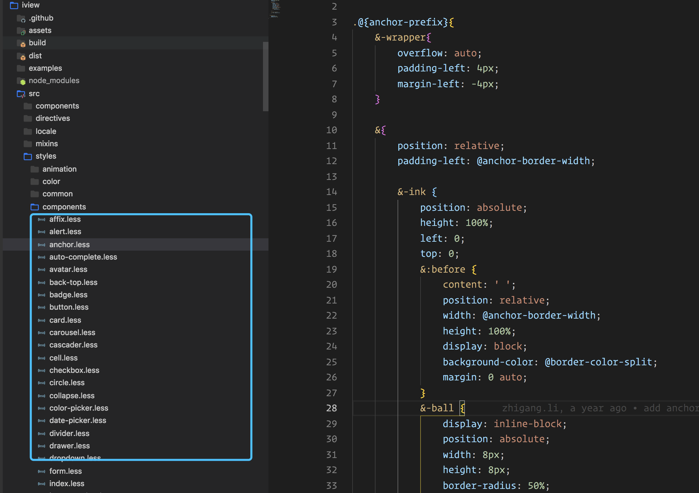
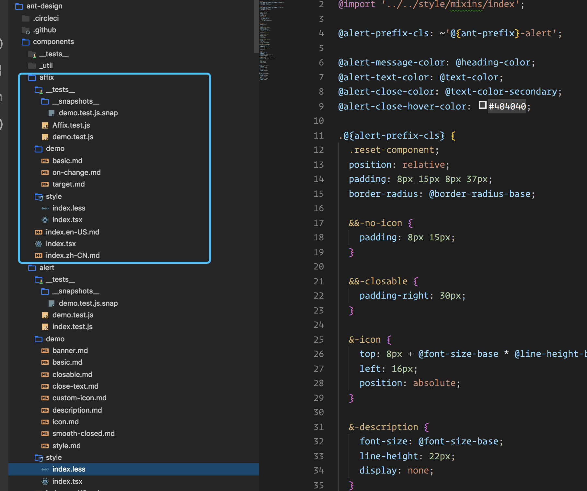

# 2019年一次私活的经历

## 你猜我想说什么

我想写一个结对编程小记。最近在和 `S` (帅气的花名) 利用业余时间，进行了一次结对编程。现在我准备把结对编程的一些思考分享给大家，下面开始吧。

> `PS：` 此篇文章，不拘泥于细节，将会聚焦整体上的见解，希望对各位小伙伴有所帮助。

## 为什么就叫新时代下的结对编程

这里我说明一下原因，请往下看。

### 传统结对编程

> 百度百科的定义如下：

结对编程（英语：Pair programming）是一种敏捷软件开发的方法，两个程序员在一个计算机上共同工作。一个人输入代码，而另一个人审查他输入的每一行代码。输入代码的人称作驾驶员，审查代码的人称作观察员（或导航员）。两个程序员经常互换角色。
在结对编程中，观察员同时考虑工作的战略性方向，提出改进的意见，或将来可能出现的问题以便处理。这样使得驾驶者可以集中全部注意力在完成当前任务的“战术”方面。观察员当作安全网和指南。结对编程对开发程序有很多好处。比如增加纪律性，写出更好的代码等。结对编程是极端编程的组成部分。

> 为什么我觉得过时了呢，听我简单(胡)析(诌)下：

两个人共用一台计算机，这可能在 `ACM` 竞赛或者组队 `PK` 中常见。但对于业务开发来说，有点不科学，首先效率就不高，如果对方代码太可爱，可能会忍不住打他。当然了，在特殊场景下也会出现，但是 `95%` 的场景下，是不可能存在下图这种场景的。

下面这种场景犹如六月飞雪：


不过这种场景倒是很乐意接受的：


当然，别问我为什么，因为：


那什么是我认为的新时代的结对编程呢？

### 新时代的结对编程

> 我认为新时代的结对编程，应该是这样一种状态：

两(`N`)个 `coder` , 两(`N`)台电脑，坐在一起(后续也可以不用坐在一起)进行开发。代码可以互相看到。最关键的一点就是，我们可以互相看到并且看懂对方的代码。

> 什么意识呢，这里我举个例子：

我和 `S` 达成意见，`S` 负责 `node` ， 也就是后端，我负责前端，前后端分离。然后各自的代码我们都能互相看到，要开发什么功能，我们都知道，我可以 `review` `S` 的代码，`S` 也可以 `review` 我的代码。当开发的时候，我可以通过 `review` `S` 的代码，提前知道 `S` 的接口逻辑。如果我认为他的逻辑写的有问题，我会和他进行沟通，提前把可能存在的疑问处理掉。我也会提前按照他写的接口来预留好请求这块的逻辑处理。总之，在我理解的结对编程中。应该是能力相同，代码相同，通过互相 `review` 对方的功能代码，来对比自己的代码。从而告诉对方可能存在的问题，而这种问题的解决会让开发的效率大大增加，更早的解决了潜在的一些问题。

> **PS：** 当然这种新的方式，需要一定的技术基础，比如你要能看懂后端的代码。嗯，如果是 `Java` ，你可能会比较艰难。当然，他也会更艰难。所以还是 `node` 大法好，手动滑稽。总之，这是我认为的新时代下的结对编程，它不具有普适性，当然这种形式的好处是显而易见的。

## 结对编程之前的狂欢？

嗯？按照传统，当然是来一次结对前的庆祝。去了趟 `1912` ，吃了个大餐，享受了下日式服务。然后去咖啡馆开始 `face to face talking` ，愉快的结对编程就要开始了。

> 怎么玩出花呢？

我分为两个部分去介绍，第一部分是前端，第二部分是后端。

## 前端

### 技术架构选择
首先，框架的选择这块，在衡量之后，选择的是 `Vue` 。这里我对用什么框架，其实没什么看法，唯一的看法就是：

**根据实际情况，来选择合适的开发框架，从而提高整体的开发效率。** 

要不要使用脚手架，这块我也持上面的那句话，根据实际情况做出合适的选择。这里我选择 `Vue-cli3` 来快速搭建应用。怎么使用，自己去研究一下就知道了。

> 这里可以提供几个路径

第一个路径：去 https://cli.vuejs.org/ 官网研究

第二个路径：去看 `vue-cli3` 的源码，了解一下内部的一些机制，比如 `chainWebpack` 的实现，`vue.config.js` 的默认设置是如何实现的。

第三个路径：去 `github` 上，找一些用 `vue-cli3` 搭建的项目，`clone` 下来，研究一下别人是如何使用的。

> **PS:**  我个人认为脚手架是不会存在技术上的难度的，多看看文档，不行的话再去看源码捣鼓捣鼓，就差不多了。

### 样式方案的选择
选完技术框架，我们再来看看样式的选择，通用的样式方案，业界的标准基本都是相同的。但是关于组件中的样式该放哪，目前在业界，大概有这么两种。

#### 样式和组件目录分离
样式和组件目录分离，这个是目前很多 `ui` 库采取的方式。
比如 `iview` `elementui` ，我来截图展示一下。

如图所示 `iview` 的截图：


从上图可以发现，组件的样式全部放在了 `style` 目录里，并且用的是 `less` 。

#### 样式和组件目录不分离
说到这个，目前具有代表的大概就是 `ant-design` 了。

如图所示 `ant-design` 的截图：


我们可以看到，在 `ant-design` 中，组件的样式是放在组件目录里面的，同时也是用的 `less` 。

#### 使用哪种样式进行编写
至于使用哪种样式风格编写。为了玩出花，我采取的是同时使用三种样式：`scss` `less` `stylus` 。在这个过程中，我更喜欢 `stylus`，因为其类似 `python` 的缩进写法，简单快速。一不用写分号，二不用写括号，三也可以不用写冒号。如果你看过 `vue-cli3` 的源码，你会发现其中的 `ui` 部分，样式使用的就是 `stylus` 。

`vue-cli3` 源码中的的 `ui` 部分如图所示：


#### 总结

> 关于样式方案的选择，我想表达的是：

在组件的样式处理方面，业界存在两个标准，不存在好和不好，但是我们需要知道这些标准，通过知晓，来给自己的实践中多提供一些参考和帮助。

> 我使用的是：

样式和组件目录不分离的方案，同时样式编写采用的是三个样式，主用 `stylus` 。


### 关于状态管理
业界的状态管理有很多，`vuex` 、 `redux` 、 `mobx` 、 `dva` 等等。目的都很明确：**通过抽象封装掉混乱。**

> 对于我来说，会思考一个问题，此项目是否真的需要 `vuex` ，为了玩出花，我做的处理是：

切了两个分支，一个不使用 `vuex` ，一个使用 `vuex` 。

> 什么时候使用 `vuex`  

当组件中需要共享一些数据的时候，并且数据较多，就可以使用 `vuex` 。如果数据不需要共享，或者较少，其实也没有必要用 `vuex` 。

> vuex 的两种形式

使用 `vuex` 时，如果需要管理的状态不是很多，那可以直接写到一个文件中。如果需要处理的状态很多，那就使用 `module` 的写法。将状态进行分类，分成不同的 `module` 。

### 关于请求的处理

对于请求，我这边做的是，将请求部分尽可能的抽离出来， 预留好以后可能会出现的坑。比如，预留请求拦截，预留对请求进行加密，预留公共的参数，预留好模拟数据的坑。

我一般将这部分逻辑分成三个类。一个是 `StateService` ，一个是 `ApiService` ，一个是`Service` 。当然如果服务过多，可以对 `Service` 进行细分，比如 `UploadService` 、 `MonitorService` 等。

### 关于模拟数据

说到模拟数据，大家第一反应可能是，使用 `easy-mock` ，使用 `rap` 等。而在我这边，选择了一种很少人知道的做法，那就是通过装饰器来进行数据模拟。

> 什么意识呢？我简单介绍下

如图所示：


从上图可以知道，我对 `Service` 中的 `getuserinfo`  进行了装饰拦截，通过装饰器来将模拟数据注入进去。再通过环境判断来确保在生产环境上，此装饰器方法失效。

虽然会有入侵代码的味道，但是在真正尝试了后，你会感受到利用装饰器来解决数据模拟 的魅力，因为你可以随心所欲的控制所有请求逻辑。从而达到完全不依赖后端接口来实现前端全流程的模拟。

### 关于工具方法
对于这个，需要去思考此项目需不需要依赖一些工具库，比如 `lodash` 、 `ramda`  。如果不怎么依赖，那就用原生写吧。

对于工具方法，我也会进行分类，我会分为内部方法和外部方法。如果只是提供给另一个方法使用，并不会暴露到业务中，那我会把它认为是内部方法。

### 关于性能
这个是老生常谈的事情了，我一般把性能这块分为两个方面。

#### 脚手架能做到的事情

1. 将依赖包和业务代码进行分离
2. 对 `js` `css` 等进行压缩，是否对 `css` 进行分离
3. 是否对图片进行压缩，是否对小图片进行转成 `base64`
4. 根据业务情况决定是否使用 `cdn`
5. 对第三方 `ui` 库进行性能处理，比如后置编译
6. 和后端进行沟通，决定是否开启 `gzip`

#### 脚手架做不到的事情

> 关于图片压缩

虽然 `webpack` 有图片压缩，但是根据对比，其压缩的质量和效果还是没有 `tinypng` 优秀，如果有不知道 `tinypng` 的小伙伴，可以点击 https://tinypng.com/ 进行 `TP`。

`tinypng` 的压缩算法没有开源，虽然可以免费使用，但是会存在一些限制，对此 `github` 上有人专门开发了 `tinypng for mac` 。 小伙伴可以自行了解一下，工具还是很好用的。可以原位置替换文件，压缩后的图片基本没有损失。

> https://github.com/godkun/TinyPNG4Mac

> 代码级别的性能提升

这是脚手架做不了的，我们在写代码的时候，要注意代码方面的性能。比如将数据存到局部变量、优化循环、函数去抖、函数节流、图片懒加载等等吧。性能这块我就不提了，太老生常谈了。

### 关于async await 和 promise
这块我提一下。在项目中，我们究竟要怎么灵活使用 `async await` 和 `promise` ，首先明确的一点是，不能为了使用而使用。这里我发表一下个人看法，下面是几种使用两者的场景。

1. 当你想用 `try catch` 捕捉异步操作的异常时
2. 当你要在一个异步操作中嵌套另一个异步操作时
3. 当你想将一个函数包裹成 `promise` 的时候

我简单举个例子，如下代码：
```js
fn(res => {
  // TODO:
})
```

上图中，`fn` 是一个异步操作，该函数中会执行回调函数。现在有两个问题：

1. 如果我们想让 `fn` 变成 `promise` 呢？
2. 如果我们想在回调函数中继续执行其他的异步操作呢？

针对上面的两个问题，现在来依次解决一下。

> 解决第一个问题：

首先我们把异步操作的 `fn` 变成 `promise` 形式，很简单。

大致代码如下：
```js
function wrap() {
  return new Promise((resolve, reject) => {
    fn(res => {
      resolve()
    })
  })
}
```

> 解决第二个问题：

如果 `fn` 的回调函数中，还要进行异步操作，那该如何优雅的解决这个问题呢？这个时候就要使用 `async await` 了。

大致代码如下：
```js
function wrap() {
  return new Promise(async (resolve, reject) => {
    try {
      fn( async res => {
        let result = await fn2()
      })
    }catch(err) {
      // TODO:
    }
  })
}
```
是不是发现，代码都是同步的，可以使用 `try catch` 。嗯，就是这么简单自然。

### 关于动画衔接

我们知道，交互这块要友好，不能太生硬，跳转等需要保证流畅性。所以在部分页面中，使用了 `gsap` ，不了解的小伙伴可以去查一下资料。

简洁代码如下：
```js
// 只用到了 TweenLite 、TimelineLite 两个方法
import { TweenLite, TimelineLite } from 'gsap'
let tw = new TimelineLite()
tw.add(TweenLite.to(this.style.blocks[0], 0.5, { opacity: 1, delay: 0.5 }))
tw.add(TweenLite.to(this.style.blocks[2], 0.5, { opacity: 1 }), '-=0.3')
```

通过对样式的设置来达到衔接的流畅性。

### 关于 loading 组件

我们在开发微信 `H5` 、天猫淘宝 `H5` 、 开发快应用、开发小程序等的时候。 `loading` 这块是一个必须要做的事情。比如请求开始时，`loading` 开始，用户不能进行其他操作，请求结束或者异常时，`loading` 结束。

> 那么在面对第三方 `ui` 库 或者 `APP` 自带的实现时，我们要怎么去选择呢，是使用现成的，还是写一个最适合自己的呢？

这块我个人的意见是自己手写一个适合自己的 `loading` 。这样做的原因我高度概括一下，就是：**统一和灵活。**

**PS:** 当然，这个不是绝对的。只是提供一个思路，比如微信 `H5` , 天猫 `H5` , 就不要用自带的 `loading` ，使用同一的 `loading` 组件。

### 关于开屏特效

开屏特效有很多方式，比如可以使用 `vue-touch` 来完成向下滑屏的操作。

大致效果如下 `gif` 图：


在完成以后，感觉不够炫酷。于是进行改良，执行第二种方案，采用序列帧来完成开屏的特效。

> 什么是序列帧呢？

序列帧就是通过将一段视频分解成一帧一帧的形式。然后通过 `canvas` 来按照一定的时间间隔画出来，从而让用户感觉到是一连串的特效画面。可以想象成 `PPT` 的快闪效果。

既然需要序列帧，那么就需要加载的进度条。进度条这块可以封装成组件，思路就是通过数据加载的进度来设置百分比，同时设置一些动画的效果。

大致效果如下 `gif` 图：


从上面可以看到，当 `godkun: 源码终结者` 显示完全的时候，也就是进度条达到 `100%` 的时候。表明序列帧需要的数据已经加载完成。

### 关于图片合成
需要做分享图，如果交给后端去做，由于需要合成的图片很多，后端的压力会变大。商量后，决定在前端合成，通过 `canvas` 来将`10` 张图片，合成为一张分享图，这里的注意点不多。需要注意的就是在图片 `onload` 事件回调中再进行画图。

大致代码如下：
```js
async drawCanvas() {
  let canvas = this.$refs.myCanvas
  canvas.width = xxx
  canvas.height = xxx
  let bg = await this.drawBg()
  this.drawImage(bg) // 不变
  // TODO: 绘制其他
  let data = canvas.toDataURL('image/jpeg')
  const params = {
    base64: data
  }
  let result = await Server.getImage(params)
  this.$refs.canvasImg.setAttribute('src', result)
}
```

> **PS:** 这里有个坑，安卓手机下无法保存 `src` 为 `base64` 的图片，后面经过采坑，决定通过将 `base64` 数据发到后端，然后返回 `png` 的地址来解决这个坑。

### 关于埋点
埋点的目的是收集各种信息，比如 `PV` 、 `UV` 、点击率、异常。那么埋点该怎么做，一般的前端埋点，我认为，需要遵循两点：

第一点：不要过度入侵代码，也就是俗称的硬编码

第二点：做到复用性，也就是进行统一的封装

比如，将对应的埋点进行重命名，如 `b1` `b2` `b3` 。

大致代码如下，简单粗暴：
```js
burryDetail ={
  b1: {
    actionName: 'gotohome'
  }
}

export default function burry(key) {
  let burryObject = burryDetail[key]
  // TODO: args
  let argN = burryObject.actionName
  send(...args, argN)
}
```

这样做的好处是将所有埋点放在一个文件中进行集中处理，不要在业务代码里面直接写，有利于解耦。对于有一些特殊情况，需要在业务代码里面写的，那就特殊对待吧。


### 关于运行模式
说到运行模式，可以想到有开发模式，生产模式，甚至还有分析模式。目前在 `vue-cli3` 下，按照其规定的方法进行设置就好了。比如新建 `.env.dev` `.env.prd` `.env.xxx` 文件

如下 `.env.dev` 代码：
```bash
NODE_ENV = "development"
VUE_APP_BASE_URL = "xxxxxxxxxxxx"
```
然后在 `scripts` 中写入
```json
"dev": "vue-cli-service serve --mode dev",
```
就可以通过 `npm run dev` 来运行开发模式了。

### 关于第三方 `sdk` 的代码提示问题
有时候，你会发现，引入 `sdk` 后，没有代码提示。然后去网上找，也找不到官方解决方案，这个时候怎么办呢？

> 显然，只能自己去编写声明文件了，这里是针对 `VSCODE` 来说的，标准方法就是新建一个类型目录，然后新建 `sdk.d.ts` 。

代码大致如下：
```js
declare namespace SDK {
  function fn1(callback: () => void): void
  function fn2(text: String): void
  function fn3(): void
  function fn4(
    object: {
      arg1: String
      arg2: String
      arg3: String
      arg4: String
    },
    callback: (res: {}) => void
  ): void
}
```
这块自己根据具体的 `SDK` 去编写你需要的提示就好了。

## 后端

后端是 `S` 写的，所以我就以一个 `code review` 的形式去大致说一下后端的整体情况吧。

<!--在数据库方面，使用的是关系型数据库 `mysql` ，如果不涉及到集合性的数据处理，关系型数据库是一个好的选择，服务器方面，使用的是阿里云服务器。-->

### 后端要做什么

大致有如下几点：

1. 编写 `API` 接口
2. 编写后台管理
3. 编写一些其他的辅助功能
4. 设计数据库
5. xxxx...

### 后端的框架选择

这里使用的是 `egg.js` ，其通过约定的哲学，来快速搭建应用，提高开发效率。`egg` 的学习文档有很多，贴个官网文档地址吧：

> https://eggjs.org/zh-cn/intro/index.html

### 如何编写接口
这个没啥好说的，通过路由拦截，然后转到对应的逻辑处理，中间可能需要经过相应的中间件进行处理。

### 如何集中处理响应

如何更好地设计返回，这里的做法是将返回封装成 `plugin` ，然后扩展到 `context` 上。这样的话，你就可以通过 `ctx.sendresult` 来统一处理返回内容了。

### 中间件的使用
中间件也没啥好说的，本质上就是一个导出的函数。用来处理接收到的数据，并进行对应的数据处理。

> 数据处理基本有两种结局：

1. 第一种结局：走到下一步
2. 第二种结局：在这个中间件内就 `game over`

> 举个真实场景：

比如最常见的，鉴权。我们可以在路由中就进行控制：

代码如下：
```js
router.post('/api/xxx', auth(), controller.xxx);
```
在处理受限接口的请求时，先进行 `auth` 处理，如果没有成功，就中断后续的逻辑处理，直接返回没有登录或者没有授权之类的响应内容。

### node 的 `MVC` 和前端的 `MV*`

> V 

这里我简单提一下，在 `node` 层，和在前端层，其 `V` 大家都是能理解的，都是视图的意识，`node` 层，也要写页面的，比如我们写一个 `404` 页面，配合处理异常的中间件。如果中间件捕捉到了 `404` ，那么直接返回 `404` 页面给前端。

> C

`C` 在前端来说，其实是最富有变化的一个点，所以我加了 `*` 表示。`C` 对 `node` 来说，时候也是最重要的一个部分，它专门去处理接收到的请求，并且分发给各个逻辑处理中心，最后通过一系列的处理，再通过 `C` 层返回给前端。

> M

`M` 对 `node` 来说很简单，在处理逻辑的时候，需要和数据库进行交互，来实现 `CRUD` 从而实现数据的增删改查。`M` 对前端来说，也很简单，就是对 `V` 层的数据进行 `CRUD` 。前后端的 `M` 层还是有点区别的。

总结一下，后端的 `MVC` 看起来，是比前端的 `MVC` 好理解，前端的 `MVC` 就好像被强行安排了一波😂。

### 前端的配置和后端的配置
随着前端工程化的持续完善，前端的配置和后端的配置 ，在思想上，基本是一致的，这里我就不提了。

### 关于数据库

上面提了，使用 `mysql` ，当然了，像 `egg-sequelize` `mysql2` 这些都要用的。模型定义通常情况下是在 `model` 目录下，定义好模型，然后挂在到 `Application` 下，通过 `app.model.xxx` 来拿到对应模型的上下文。对模型的处理，一般是放在 `service` 目录下。

### 关于 publicPath
绝大多数情况下，前端的项目在打包后，会放到后端的 `public` 目录下，所以看到这，小伙伴应该明白了构建工具中的 `publicPath` 是什么意识了吧(手动滑稽)。

### 总结

看完后端部分，是不是发现也挺简单的，代码都是 `js` ，前端怎么写业务逻辑，后端就怎么写业务逻辑。

> 两者的区别主要是前后端需要考虑的点不一样。

后端需要考虑安全、考虑服务器的压力、考虑接口的设计、考虑数据库的设计。当然高层次一点，还要考虑负载均衡，高并发等。而前端则需要考虑页面的美观性、页面的流畅性、用户交互的友好性、页面的打开速度等等。总之，大家都不容易的，唯有执子之手，才能与子偕老。(手动滑稽 `+2` )

## 总结

