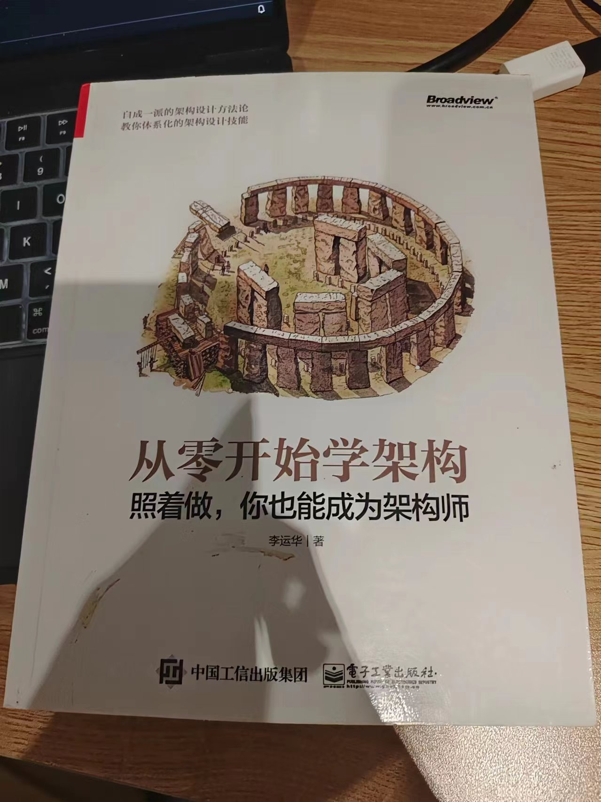

# 从零开始学架构

19年买的书，借着五一假期，重新温习了下。下文我先放 kimi 的总结，然后再加上我的补充

## kimi总结

1. **架构设计基础**：
   - **架构的概念**：<mark>软件架构指的是软件系统的顶层结构，包括系统包含的个体、个体运作和协作的规则。</mark>
   - **设计目的**：<mark>解决由软件系统复杂度带来的问题，如高性能、高可用、可扩展性、低成本和安全等。</mark>
   - **设计原则**：包括合适原则、简单原则和演化原则，强调简单性、适应性和持续改进。

2. **架构设计的历史背景**：
   - **软件危机**：两次软件危机分别催生了结构化程序设计和面向对象的开发思想，而90年代软件架构的流行则是为了解决系统规模增加带来的设计问题。

3. **架构设计的目的和复杂度来源**：
   - **目的**：解决软件系统复杂度带来的问题，通过设计可行的架构方案，及早发现并解决可能出现的危机。
   - **复杂度来源**：包括追求高性能、高可用性、可扩展性、低成本、安全性和规模等因素。

4. **架构模式和理论**：
   - **CAP原则**：在分布式系统中，一致性、可用性和分区容忍性三者中只能同时满足两个。
   - **高性能架构**：涉及单台计算机和多台计算机集群的性能提升策略，如多进程、多线程、任务分配等。
   - **高可用架构**：通过冗余实现系统无中断地执行其功能的能力，包括独裁式、协商式和民主式决策。

5. **架构设计流程**：
   - **变化应对**：<mark>将变化封装在变化层，稳定部分封装在稳定层，或提炼出抽象层和实现层。</mark>

## 读书人补充

### 设计原则

- 合适原则：合适优于业界领先
- 简单原则：简单优于复杂
- 演化原则：演化优于一步到位

### 如何进行架构设计

1. 先识别系统复杂度
2. 进行备选方案设计，一般 2～3 个
3. 备选方案 360 度环评，抉择方案
4. 详细方案设计

### 架构设计误区

1. 设计最优秀的方案
2. 只做一个方案
3. 备选方案过于详细

## 整体总结

这本书除前几章，后面的章节内容都和服务端相关，整体质量可以，看完我有收获，对如何做架构设计更加得心应手。

