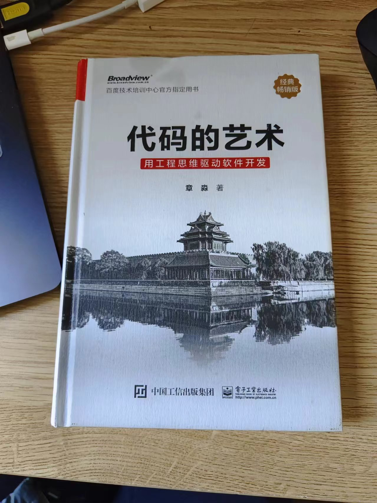

# 代码的艺术

读完，有几点收获，遂总结记录下

## 成为优秀工程师的三条路径

1. 学习-思考-实践
2. 知识-方法-精神
3. 不断的扎实基础

作者阐述了上述，三中路径，我本人的观点是，如果你想成为一个强者，上述三种路径你都需要走好。

## 增强软件工程能力

我认为这本书整篇讲述都没有离开 增强软件工程能力 这个主题。作为一个软件工程师，你在一个公司参与任何项目的代码开放时，你都应该主动思考和衡量，你要怎样才能做好：

- 技术的选型：生态、上手难度、合适性
- 代码质量的把控：可扩展、可读性、易迭代、易复用、评审机制
- 文档的撰写：上手文档、技术沉淀、踩坑总结
- 成果的展示：ppt、视频、文档、通俗易懂
- 版本周期：各种评审、风险应对、上线机制

以上每一点，都很重要，单拿出来都可以说很多内容。

需要不断的思考，学习，实践，总结。