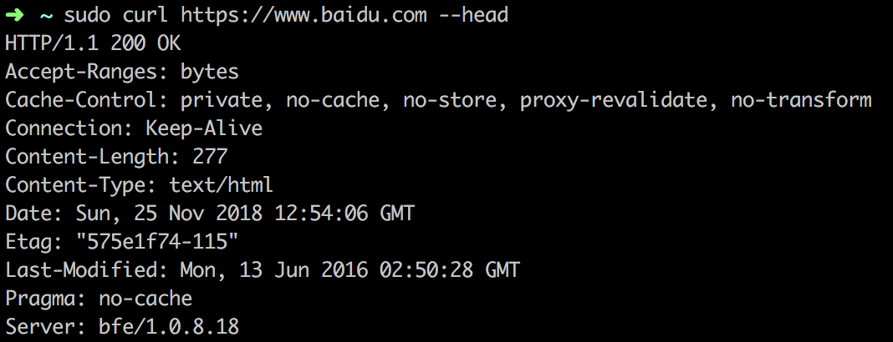

# 包容性Web设计

## 写在最前
前端读书寻宝记系列，会分享一些过去、现在、未来我亲自阅读过的书，选择性的分享一些我个人认为还不错[可能你没有读过]的书籍，同时总结一下我个人认为此书的精华所在。推荐小伙伴们去看看，当然，如果没有时间去阅读，那可以关注我的分享，基本可以从我的分享中了解我分享出的书籍的精华。当然大家有什么好书，也可以在评论区分享出来，一起进步哈~

**Heydon Picering * 著  —— 于坤 * 译   2017年7月第一版**


## 写在最前
很快看完了这本书，这本书很薄，162页，但是里面的一些知识点还是很棒的，就是很多人可能没有注意到的细节，或者说根本想不到的细节，我把它们总结下来，写篇心得吧。

## 先说能想到的知识点
这里的`tips`虽然很多大家都已知道，但是还是比较不错并且值得总结出来的`tips`。

1: 面对对象设计`OOP`

> 数据结构设计需要考虑面对对象，如何用对象思维进行抽象，从而使数据结构变得更加友好，这是一个很值得下功夫的过程，也是一个可以看得见能力成长的过程。


2: 文档类型`Doctype`
> 如果没有声明文档类型，那么浏览器将会不知道怎么解释内容，可能会降级到不符合规范的兼容模式，也就是通常所说的怪异模式。此时布局和交互会变得不可预知，容易出错。

3: 语言属性`lang`
> lang属性对于SEO非常重要，必须设置。

4: 要允许双指缩放
```html
  <meta name="viewport" content="width=device-width, initial-scale=1.0">
```
这个意见我也不知道对不对，书中建议不要在`content`属性里面设置`minimum-scale=1.0, maximum-scale=1.0, user-scalable=no`，也就是不要随意禁止用户缩放。因为有时用户会想放大看清楚细节等。其实这个没有对与错，看产品经理怎么定，有锅产品背。。。

5：字体
> 字体大小要用`rem`

6: 关于`absolute`和`fixed`

如果使用`absolute`和`fixed`定位，那么当视口或内容调整大小时，定位元素不会与文档的其余部分一起`reflow`，导致布局问题，一些元素可能会被挡住或者延伸到视口之外看不见，所以一般不要使用绝对定位。

> 这里说一下项目中在使用定位时，各种定位方式的优先级，通常情况下，我们应该优先使用`flex`，当`flex`无法解决一些场景的时候，正常情况下，我们肯定会优先考虑`relative/absolute`。但是通过上面总结，我们发现绝对定位有时也会导致一些布局问题，如果出现这种问题了，那我们就应该考虑一下`float`了。其实我感觉对float理解的比较深刻的话，用起来也不是那么坑爹吧。关于`float`布局，我写了篇挺不错的文章，可以看看[可能是最全面最易懂的解析前端浮动的文章](https://juejin.im/post/6844903689094692871)。

## 充满惊喜的细节
### 视口`viewport`
如果使用了`vh`，`vw`单位，则文字的大小会根据视口的宽高来自适应，也就是隐式的响应式文本，不再需要媒体查询。但有一个问题，如果元素使用视口单位，则就无法随着页面缩放。为了解决这个问题，可以将视口单位的值加上`em`单位的值恢复缩放功能，这样就能确保页面有最小字体尺寸。原理就是 `1em + (0 * 1vw)` 仍然是`1em`

```css
html { font-size: calc(1em + 1vw); }
```
这样文本内容就会随着视口同比例缩放了。

备注：`font-size: calc(1em + 1vw);`是渐进增强的，无法识别的时候，浏览器会回退到浏览器默认设置，也就是说，如果不兼容，浏览器会使用原定的方式展示文本。

### 字体
`Web`字体通常是大型的资源，应该被视为增强内容。`FOIT`(Flash of Invisible， 不可见字体闪现)现象应该避免，如果字体文件无限加载，浏览器就会卡在没有文字的页面，也要避免。

诀窍就是：加载页面后再加载字体，使用 `onload` 事件触发，要实现这个效果，字体必须用base64编码嵌入到样式表中。同时为了解决FOIT，就必须接受`FOUT`(Flash Of Unstyled Text，无样式字体闪烁)。

### 行距(行高)
行高要设置成无单位的相对值，建议1.5倍间距

不要这样写

```css
p{
    font-size: 16px;
    line-height: 24px;
}
```

要这样写：
```css
p{
    font-size: 1rem;
    line-height: 1.5;
}
```

### 对比度
在任何情况下，都应该避免文本和背景颜色的低对比组合。比如在白色背景上使用浅灰色字体。

### 关于图像
位图(`bitmap`)，又称栅格图(`raster graphics`)或点阵图，是使用像素阵列(`Pixel-array/Dot-matrix`)来表示的图像。

### 关于`curl`
依赖js的静态内容不符合Web设计基础，也就是说 **不能用curl访问，就不存在Web中。**

PS：这个还是很酷的，科普一下，`curl`是什么呢，其实`curl`是`linux`系统中的一个命令，专门用来发送`http`请求的命令，然后可以在命令行中打印出`http`响应内容。比如下图：


所以说如果不能用`curl`访问，就说明不存在`Web`中。

### 防御性编程
会经常在源代码中留下许多不必要的内容
```html
<p></p>
<p></p>
<p></p>
```
这种就是不必要的内容，应当用防御性编程从流中删除空元素，可以使用`display: none;`删除元素的布局，包括他们的`margin`，这里我们可以使用`display: none;`配合`empty`伪类来删除所有空元素，代码如下：
```css
main: empty {
    display: none;
}
```

### 使用flexbox实现网格，为书中代码片段
```html
<!DOCTYPE html>
<html lang="en">
<head>
  <meta charset="UTF-8">
  <meta name="viewport" content="width=device-width, initial-scale=1.0">
  <meta http-equiv="X-UA-Compatible" content="ie=edge">
  <title>Document</title>
</head>
<style>
  html {
    font-size: 20px;
  }
  .flex1{
    display: flex;
    flex-direction: row;

    /* 如果没有足够空间将它们放在一起的话，就自动换行显示 */
    flex-wrap: wrap;

    /* 对称分布 */
    justify-content: center;
  }
  .flex1 li {
    /* 项目将扩充超过10em的宽度以填充可用空间 */
    flex-grow: 1;
    
    /* 确保项目可用收缩 */
    flex-shrink: 1;
    
    /* 列会随着字体大小自动变化 */
    flex-basis: 10em;
    max-width: 20em;
    background: skyblue;
  }
</style>
<body>
  <ul class="flex1">
    <li>1</li>
    <li>2</li>
    <li>3</li>
    <li>4</li>
    <li>5</li>
    <li>6</li>
    <li>6</li>
    <li>6</li>
  </ul>
</body>
</html>
```
点击触发`TP`[可自行进行修改来实时查看布局变化]： [CodeOpen传送门](https://codepen.io/godkun666/pen/VVdvbq)

`flex-basis`可以在元素级别定义理想宽度，通过切换`flex-grow`和`flex-shrink`，网格元素可以围绕这个理想宽度展开或者收缩，从而在无限范围的视口中保持完整有序的网格。

### 关于flex-basis
`flex-basis`可以在元素级别定义理想宽度，通过切换`flex-grow`和`flex-shrink`，网格元素可以围绕这个理想宽度展开或者收缩，从而在无限范围的视口中保持完整有序的网格。在`flexbox`算法中，`flex-basis`的值是当前项目理想的宽度，如上面代码中，每个项目尝试为`10em`宽度，然后共享剩余可用空间。


备注：我看网上一些前端推荐的书籍，其实感觉总缺点什么，就是那种`get`不到好的感觉，一篇文章列几十本书，一本一句话，或者几句话就结束了。。。本人读的书也不少了，就想分享一些读书的心得体会吧，一篇一篇来，就当做记笔记加`review`了，人菜勿喷。

**文末可爱声明：** 我没有自己去扩展书中没有的知识点，这样才能更准确的把此书的真实情况表达出来，希望可以给大家一个参考。我一般写的读后感都是我感觉挺不错的书籍。但也不限于前端，总之。

**Let us reading now.**

