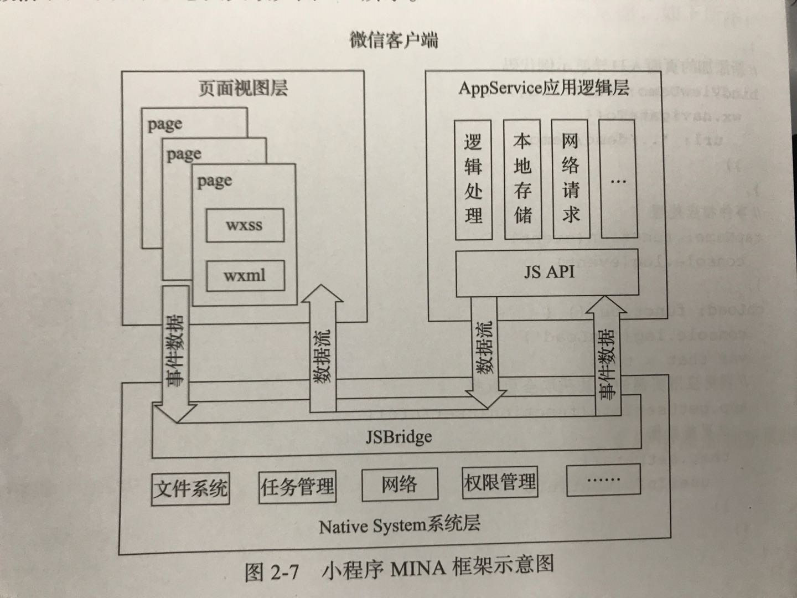
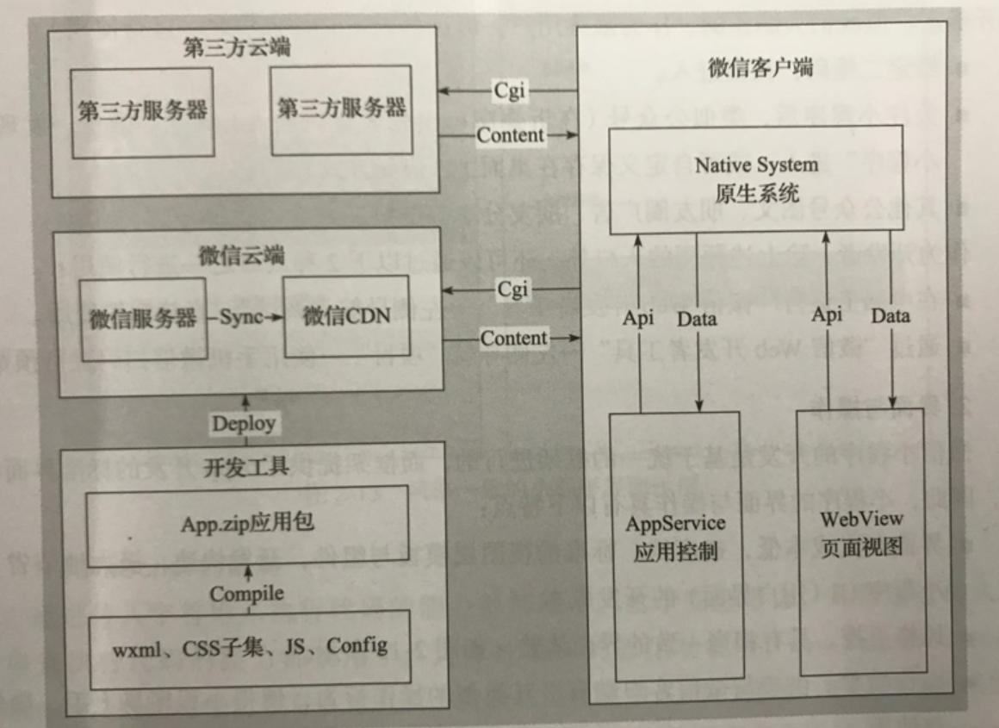
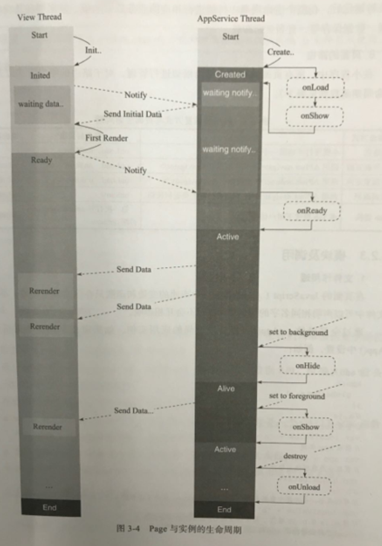

# 小程序巧应用——微信小程序开发实战

**熊普江 谢宇华 著**

## 写在最前
我看的是2017年2月第1版。是本非常好的入门教程，里面说了很多基础性知识和一些容易忽略的细节，用大的系统框架的角度展示微信小程序的整体面貌，值得读一读。我这里写点我认为里面很好的知识点。

## 微信小程序
微信小程序是一个框架，它为开发者提供了一系列基础组件。微信小程序是在基于组件方式开发项目的，也就是微信官方定义好基础组件，我们用基础组件搭建整个项目。

## 关于小程序架构
微信团队为小程序提供的框架命名为MINA应用框架，MINA框架通过封装微信客户端提供的文件系统、网络通信、任务管理、数据安全等基础功能，对上层提供一整套JavaScript API，让开发者能够 非常方便地使用微信客户端提供的各种基础功能与能力，快速构建一个应用。

MINA框架示意图如下所示【我没有重新画架构图，用的作者书上的图】



图中我们可以看到，框架的核心是响应式数据绑定系统，而且是单向数据绑定。当appService中的数据变更时，会主动触发对应页面组件的重新渲染。而且MINA使用了virtual-dom技术，加快了页面的渲染效率。

看下面这张图

我们可以更清楚的知道小程序是如何与Native System进行通信的。以及小程序如何与第三方服务进行通信。

### 逻辑层
事务逻辑处理的地方，在小程序中，逻辑层就是所有.js脚本文件的集合。逻辑层将数据进行处理后发送给视图层，同时接受视图层的事件反馈。

### 视图层
视图层以给定的样式展现数据并反馈事件给逻辑层，而数据展现是以组件进行的，组件是视图的基本组成单元。对于小程序来说，视图层就是所有.wxml文件与.wxss文件的集合。

wxml的开发，可以认为是使用组件、结合事件系统构建页面结构的过程。wxml文件中所绑定的数据，均来自于对应页面的.js文件中Page方法的data对象。



### 线程架构
每个小程序分为2个线程，view与appServer，view线程负责解析渲染页面(wxml 和 wxss)，而appServer线程负责运行js。

## 页面json文件
只能配置window配置项，以决定本页面的窗口表现，所以配置中也无需写window这个键值，比如一个login页面的json文件内容如下
```
{
    "navigationBarTitleText": "登陆页"
}
```

## 一个完整的小程序执行的生命周期
app.onLaunch -> app.onShow -> page1.onLoad -> page1.onShow -> page1.onReady

打开程序，第一个页面page1加载完成

-> page1.onHide -> page2.onLoad -> page2.onShow -> page2.onReady

从第一个页面重新打开page2

-> page2.onUnLoad -> page1.onShow -> .... -> app.onUnload


关闭page2 返回page1 ... 退出小程序。。

## 限制
框架不是运行在浏览器中，所以一些功能会被限制，比如不能操纵DOM和BOM，因为appServer线程运行在jsCore中，也就是js不跑在web-view里，所以不能直接操纵DOM和BOM。这也就是小程序没有window全局变量的原因。


## 关于前台和后台
1. 前台是指用户当前界面运行或操作小程序时为前台
2. 后台是指按了关闭按钮或者home键离开微信，小程序没有销毁，是进入后台。再次打开时，又会从后台进入前台。

## 元素
### 关于 block
<block/>不是一个组件，它只是一个包装元素，不会在页面中做任何渲染，只接受控制属性

## 关于小程序加载运行
关注小程序后，第一次运行时会进行代码下载，然后小程序在微信中启动，相当于打开一个webview，在一定的时间内除非手动关闭，即使返回打开另一个小程序，原来的小程序还会一直以后台的形式运行在内存中，也就是在后台运行，这与HTML5不一样。

## 安全性
### 没有cookie
没有BOM操作，也就意味着没有cookie，那HTML5的CSRF问题理论上是根本解决了。既然没有cookie，那么怎么兼容目前大部分Web App的登陆管理使用cookie的问题呢？答案就是小程序在发送请求时，客户端可以动态地给请求设置Header发送报文的cookie。代码如下
```
wx.request({
    header: {cookie: 'xxxxx'},
    url: 'xxx',
    data:{},
    success: function(res){},
    faile: function(res){}
})
```

## 小程序与页面
做小程序开发时，要理解小程序和页面的区别，理解两者之间的联系。

### 小程序
## 小程序开发步骤
### 创建小程序实例
小程序实例描述了整个小程序主体逻辑、生命周期以及页面构成、样式等。小程序实例由appServer线程执行。

在逻辑层使用App()方法来注册一个小程序，接受一个object参数，用来指定小程序的生命周期函数等。App()方法只有一个，存在于app.js中。

```
App({
    onLaunch: function () {
        // 启动时执行的初始化工作
     },

    onShow: function () {
        // 小程序启动或从后台进入前台时，触发执行的操作
     },
    onHide: function () {
        // 小程序从前台进入后台时，触发执行的操作
      },

})
```

### 创建页面
页面结构和事务处理逻辑，一个完整的页面是由.js .json .wxml .wxss四个文件组成，每个页面的.js和.wxml是必选项。小程序是由view线程执行。

在逻辑层使用Page()方法来注册一个页面，接受一个object参数，用来指定页面的初始数据、生命周期函数、事件处理函数等。Page()方法每个页面只有一个，存在于该页面的.js中。

```
Page({
    Data: {
        text: 'hello world'
    }
    onLoad: function () {
        // 页面加载时执行的初始化工作
     },

    onReady: function () {
        // 页面就绪后，触发执行的操作
     },
     onShow: function () {
        // 页面打开时，触发执行的操作
      },
    onHide: function () {
        // 页面隐藏时，触发执行的操作
      },
     onUnload: function () {
        // 页面关闭时触发执行的操作
     },

})
```

一个page的生命周期从onLoad开始，整个生命周期内onLoad onReady onUnload这三个事件只执行一次。onHide和onShow在每次页面隐藏和显示时都会触发。当用户点击退出按钮时，小程序只触发app.onHide，下次进入小程序时会触发app.onShow以及当前page.onShow。当超时或者退出时，触发app.onUnLoad事件，小程序的生命周期结束。

## 关于rpx和适配
### rpx的出现
WXSS开始并不能适配各种设备，虽然支持rem，但是不能改变HTML的属性，这使得HTML5的rem适配方案失效，为了解决这个问题，微信团队设计了rpx(responsive pixel)，一个新的计量单位，它规定屏幕宽度为750rpx，从而可以依据屏幕宽度来来进行自适应，rpx的实现原理和rem很相似。而且最终还是换算成rem。

rpx最大的优势在于750设计稿不需要进行任何转换即可适配，但是如果是640设计稿，就必须进行换算，1rpx = 640 / 750 但是WXSS不支持算术运算符，所以小程序的视觉稿尽量使用750。


### 样式级联与BEM
"element element"，级联会破坏组件的结构。
推荐使用BEM，BEM是指Block(块)、Element(元素)、 Modifier(修饰符)，是一种CSSClass命名方法。


## 关于组件
所有的组件与属性都需使用小写字符

### 种类
常用组件有：

1. 视图容器组件
2. 基础内容组件
3. 表单组件
4. 互动操作组件
5. 页面导航组件

高级组件有：
1. 地图组件
2. 画布组件
3. 媒体组件

具体的看官网API

## API接口
这个不说了，直接看官网API

## 关于本地缓存
每个微信小程序都有自己的本地缓存，是永久存储的，最大不超过10M，这个可以极大的提高使用速度，小程序可以瞬间秒开，逼近原生体验。主要原理就是先加载图片等原生数据，不需要等待，但是第一次还是要下载的。使用其他设备登陆小程序时，本地缓存的数据将读取不到。

## 关于后端开发
有几个关键点：
1. 最适用的就是最好的，而不是追求最新的技术，系统要稳定，响应要迅速，并能适应业务的变化，还要能给开发带来便利
2. 管理和监控不可少，无论业务开发多忙，都要把监控和管理跟上，做到出事可以迅速知道原因。
3. 安全、容灾、故障恢复，确保数据和软硬件不会丢失、泄密、损坏。即使有，也能即使恢复。
4. 前后端通信的数据格式基本都是json格式传输的，所以一定要确保json格式的正确性，对于异常的处理要封装好。


## 关于事件

### 冒泡事件
tap等，自行查API


### 非冒泡事件
submit、input、scroll等，自行查API


### 事件绑定
```
<view bindtap="tap1"></view>
<view catchtap="tabp2"></view>
```

bind事件绑定不会阻止冒泡事件向上冒泡，catch事件绑定可以阻止冒泡事件向上冒泡。

`bindtap="tap1"`的意识是用bind绑定一个tap事件，tap事件名字为tap1，key value形式。value是一个字符串，需要和Page中定义的函数是同名。


## 引用
文件引用方式有两种：import和include

### import
import可以在该文件中使用目标文件定义的template
```
// item.wxml
<template name="item">
    <text> {{ text }} </text>
</template>

<import src="item.wxml" />
<template is="item" data="{{ text: 'hello' }}" />
```

import有作用域，只会引用目标文件中定义的template，不会引用目标文件嵌套import的template。也就是C包含B，B包含A，C中不能引用A模板。

### include
include是将目标文件除模板代码块的所用代码引入，相当于拷贝到include位置
```
<include src="header.wxml" />
```

## 模板
模板有自己的作用域，只能使用data传入的数据。

## wx:key
如果列表中项目的位置会动态改变，或者有新的项目添加到列表中，并且希望列表中的项目保持自己的特征和状态，需要使用wx:key来指定列表中项目的唯一标识符。

wx:key 的值以两种形式提供：

1. 字符串，代表在for循环数组中item的某个属性，属性唯一，不能动态改变。

2. 保留关键字 *this 代表在for循环中的item本身，这种表示需要item本身是一个唯一的字符串或者数字。比如数字数组，或者字符串数组。当数据改变触发渲染层重新渲染的时候，会校正带有key的组件，框架会确保它们被重新拍讯，而不是重新创建，以确保使组件保持自身的状态，并提高列表渲染的效率。

