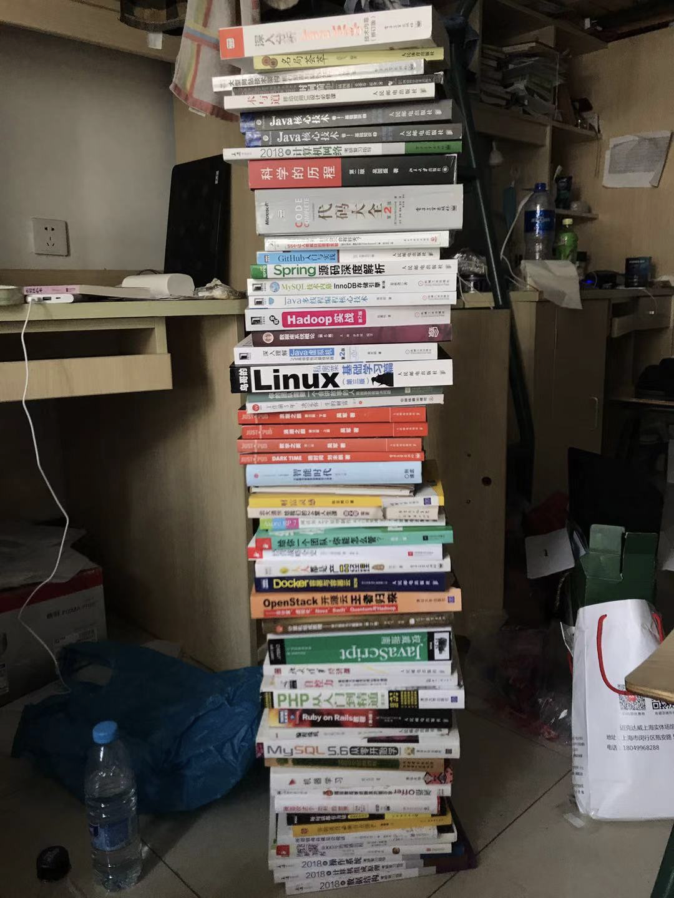
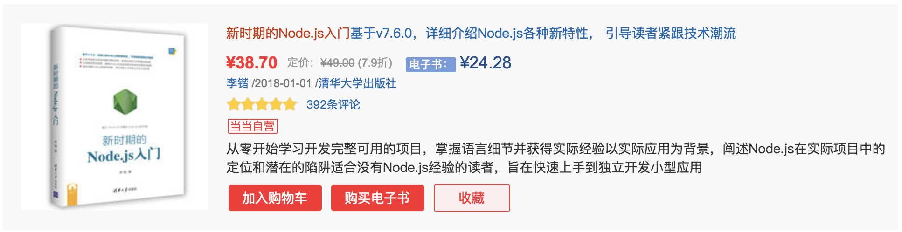
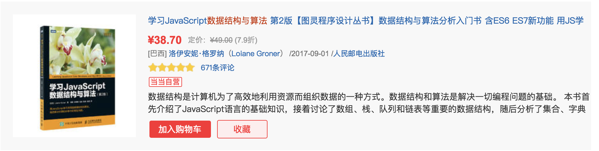
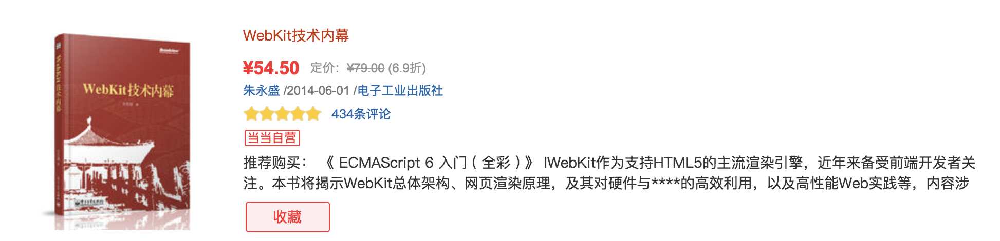

# 推荐书籍

**读书是一种享受，能喜欢读书的人都是幸福的。**

我会毫无保留的把我个人的阅读书籍经验全部分享出来，希望可以帮助更多的还在路上的前端小伙伴可以更好的走上正确的道路。

## 混沌

作为一个前端工程师，我阅读了很多书籍，前端的，后端的，架构的，底层的，软技能系列的，等等吧。甩几张以前保存的图吧：

反正一句话，当时啥都看啥都学。当然这上面的一些书籍我买了也只是翻翻，那为什么要买呢？

**如果要回答，那就是爱好吧，买书拆书翻书对我而言也是一种乐趣。**

好了，不胡诌了，下面我来分享一些非常值得一看的前端书籍，当然我推荐的都是我看过的，算是靠谱的那种推荐。

> PS: 这里的前端是新时代下的前端

## 目前书籍推荐相关博客的缺点

前端书籍推荐的相关博文很多，我也大致看了下，总给我一种这些推荐的书籍已经更不上前端发展的脚本了。原因大致如下：

- 很多博客推荐的书籍涉及到的知识范围面过窄
- 推荐的书籍，出版年数过旧

所以，这里我按照我个人对前端的思考，来推荐一些我认为在 新时代下，**前端工程师需要去看去学习的书籍**。

> PS: 提一下，很多博客中，大多都有的推荐书籍我就不说了。比如高程，犀牛书，阮老师的 `ES6` ，你不知道的系列等。我着重说一下大多数人可能还不清楚的书籍，或者说还在犹豫要不要买的书籍。

**我会根据书籍出版年数，内容的老旧程度以及影响力来作为我推荐的参考因素。**

-----------------

## 书籍推荐

### 计算机基础系列

开篇，我就直接甩出最重要的一个系列，但是解决方案也是非常简单粗暴有效果。

首先，我不推荐读起来可能会感到枯燥的(大学)书籍。我就推荐四本书，当当 **搜王道考研** ，第一个就是，如图所示：

如果你不是计算机专业，那把这四本书看完，努力做做习题，遇到不会的知识点，就去阅读对应的博客，如果能做到这样。那计算机组成，数据结构，计算机网络，操作系统的基本知识你就基本掌握了，也可以说是拥有了计算基础知识，至少我认为对于前端来说，这样学目前是够的。

-------------

### 函数式编程系列

第一本书：JavaScript ES6 函数式编程入门经典

第二本书：JavaScript 函数式编程指南

> 我只推荐这两本书，认真看完，你的函数式绝对可以达到入门和较为熟练。

--------------

### React 系列

这里我只推荐两本书：

第一本书：《React设计模式与最佳实践》

第二本书：《React状态管理与同构实战》

> 推荐理由

出版年数很新，都是 `2018` 年出版的，知识点足够干货，可以说，如果你研究透了这两本书，那你的 `react` 也就差不多了。

> PS1：这里我建议你先把上面我推荐的函数式的书籍看一下，然后你会发现，`react` 也是非常好学的。可以这么说，玩转了函数，你也就玩转了 `react` 。

-------------------

### Vue系列

因为我没买过 `Vue` 书籍(扎心了)，这里不推荐书籍了，认真阅读官方网文档(很详细) 和 `Vue` 的一些知名开源项目就差不多了。这里我推荐掘金小册：

小册一：剖析 Vue.js 内部运行机制

小册二：Vue 组件精讲

> 推荐理由

支持掘金小册，从我做起。

---------------------

### Node.js 系列

这里我推荐5本书

第一本书：《新时期的Node.js入门》

第二本书：《Node.js进阶之路》

第三本书：《Node.js调试指南》

第四本书：《Node.js实战 使用Egg.js + Vue.js + Docker构建渐进式、可持续集成与交付应用》

第五本书：《Node.js设计模式》

第六本书：《Node.js 来一打 C++ 扩展》

> 推荐理由

书籍很新，知识点很完善和丰富。这六本书认真看完，你的 `node.js` 水平一定会得到很大的提升。

---------------

### 算法知识

第一本书：JS数据结构与算法

第二本书：编程珠玑

第三本书：剑指 offer  [曾经用 `java` 全刷了一遍]

第四本书：程序员代码面试指南：IT名企算法与数据结构题目最优解

第五本书：算法问题实战策略

> 推荐理由

JS数据结构的算法书，我也看过几本，我个人认为这里推荐的是最好的一本书，所以推荐给大家。第三本和第四本书，都是针对面试场景的，但是里面也体现了很多思想。第五本书，是我认为目前看过的最棒的算法书。

总之吧，看了过段时间还是会忘，但是，每次看都会有新感觉的 `feel` 也很不错，**为未来的前端人工智能打基础**，奶萌好好看，问题不大。

---------------

### linux 知识

一本书就够了：鸟哥的Linux私房菜之基础学习篇

> 推荐理由

业界标准之作，`linux` 的知识是要熟悉的，以后前端会越来越涉及到服务器方面的东西，为什么呢？因为 `Node.js` ，或者因为新时代下的 `Serverless` ，你现在不去掌握 `linux` 基础知识，那你怎么能做好面对 `Serverless` 的准备呢？

如果你不了解或者熟悉 `Linux` 的话，你会发现很多情况下，你无法理解其中的一些操作。

所以奶萌要好好学啊，加油~

-----------

### 其他编程语言知识

第一本书：C++ Primer Plus

第二本书：Python 高效实战 —— Django、Tornado、Flask、Twisted

第三本书：汇编语言(第3版）

> 推荐理由

第一本书是 `C++` 的经典，要去翻翻。第二本书是我最近买的一本PY书，感觉还不错，用来反补 `JS` 很棒。但我最喜欢的是第三本书，清华大学的王爽老师出的一本汇编语言书籍，当初我阅读这本书的时候，感触很大，比起其他书，通俗易懂，真的了解了很多底层的知识。

> 关于汇编语言的传说

**据说把汇编学通了，你才能真正地从汇编连通到操作系统，连通到     `C/C++` 。你才能真正看清计算机，才能有机会步入大师级计算机学问的境界。**

可是这世上，又有多少人能到达这种境界呢？

为什么我要推荐 `C++` 或者 `汇编语言` 呢？

因为在新时代的前端，`WebAssembly` 的发展是铁板钉钉的事情，其作用和影响将会非常大，而玩好 `WebAssembly` ，你需要有这方面的知识储备。

------------
### 设计模式

前端也有专门说设计模式的书籍，但是怎么说呢，这部分知识，我更倾向于你去看我上面推荐 `nodejs` 系列书籍中的 `Node.js` 设计模式 这本书。

其他的知识你可以通过相关博客或者 `github` 去获得。

> 推荐理由

`nodejs设计模式` 这本书我看过了，已经将设计模式讲的非常透彻了。至于编程语言的其他设计模式的书籍我就不推荐了，就推荐这本书吧，这本书可以让你在学习设计模式的同时又深入学习了 `nodejs` 的底层知识，一举两得吧。

----------------

### 架构系列

第一本书：从零开始学架构：照着做，你也能成为架构师

关于架构我也看过几本书，比如 《大话代码架构》 ，《App架构师》 ，但是我感觉都不太好，这本我推荐的书，我看完以后，我个人觉得很不错，可以通过这本书来提升自己的架构能力，从而为以后的架构师方向做准备。

-------------
### 底层知识

推荐两本书：

第一本书：WebKit 技术内幕

第二本书：编程语言原理 第10版

> 推荐理由

第一本是说浏览器内核的，从内核的层次带你去看浏览器的底层工作原理和运行机制。而第二本书是我唯一全部看完的讲解编程原理方面的书籍，我个人认为，这本书讲解的非常棒，非常通俗易懂。想了解编译原理的小伙伴可以看看这本书，很不错。

一个现实是，这两本书好像在几大官方网站的自营上都没货，如果想买，只能通过其他渠道了。

> 为什么要学习底层知识？

我举个例子，编译原理，为什么 `react` 可以这么火，其他库和 `react` 比起来，其实就了一个 `jsx` ，当然你要说还差一个 `facebook`，那我也只能同意😂。

但是能搞出 `jsx` ，也就意味着要熟悉编译原理层次的一些知识，比如前端最常见的 `ast` 抽象语法树。如果你想了解 `babel` 原理，你也得懂得一些编译原理的知识。当你想彻底的分析 `JS` 这门语言的时候，你也要去了解和掌握一些编译原理的知识。这也是新时代下的前端工程师要掌握的。

-------------

### 图形编程

推荐四本书：

第一本书：HTTML5 Canvas 核心技术

第二本书：Three.js 开发指南

第三本书：WebGL 编程指南

第四本书：OpenGL超级宝典  第5版

> 推荐理由

未来前端，在图形编程领域会走的越来越远，大家不要落下脚步了，多去学习学习，这里关于 `WebGL` 的书籍我也看过几本，但是想来想去还是只推荐一本吧，其他的书籍算不上经典。

这里我还要提一点，如果你想真正的理解图形编程，那你还要去了解图形学的相关知识，这里我推荐一个我看过的一门课：

> https://www.icourse163.org/course/CAU-45006

如下图所示，大学生慕课上的一门图形学公开课，作者是中国农业大学的赵明教授。

> PS：这块学习，还是要多看 `github` 上的开源项目，然后多去模仿吧。

------------

### 其他书籍

第一本书：现代前端技术解析

第二本书：软技能 代码之外的生存指南

第三本书：跨平台桌面应用开发：基于 `Electron` 与 `NW.js`  

第四本书：Meteor 实战

第五本书：Web 安全开发指南

第六本书：同构 JavaScript 应用开发

> 推荐理由

价格不贵，看了会有收获的。

-----------

### 产品方面的书籍

第一本书：浪潮之巅上下册

-------------------

### 信仰之书

只有一本书：`代码大全`

> 推荐理由

信仰之书，这是我作为一个 `programmer` 的精神信仰。

### 《操作系统导论》

封面图如下：

一本非常好的关于操作系统的知识书籍，通俗易懂，强烈建议程序员都读读

### 《Go 语言并发之道》

封面图如下：

对于没有并发编程思维的前端同学，想去做并发编程是一个非常困难的事情，这本书将并发的编程阐述的非常细致，很推荐大家看看

