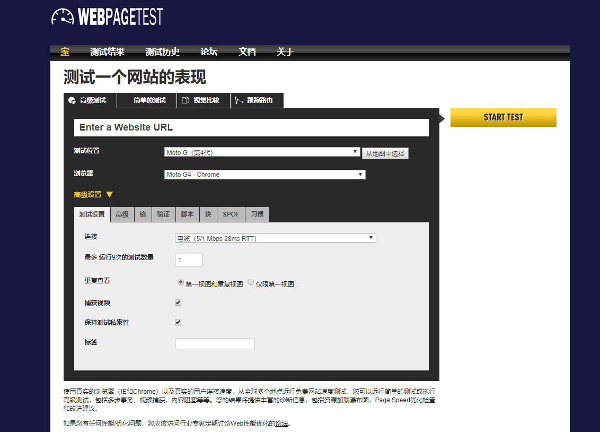
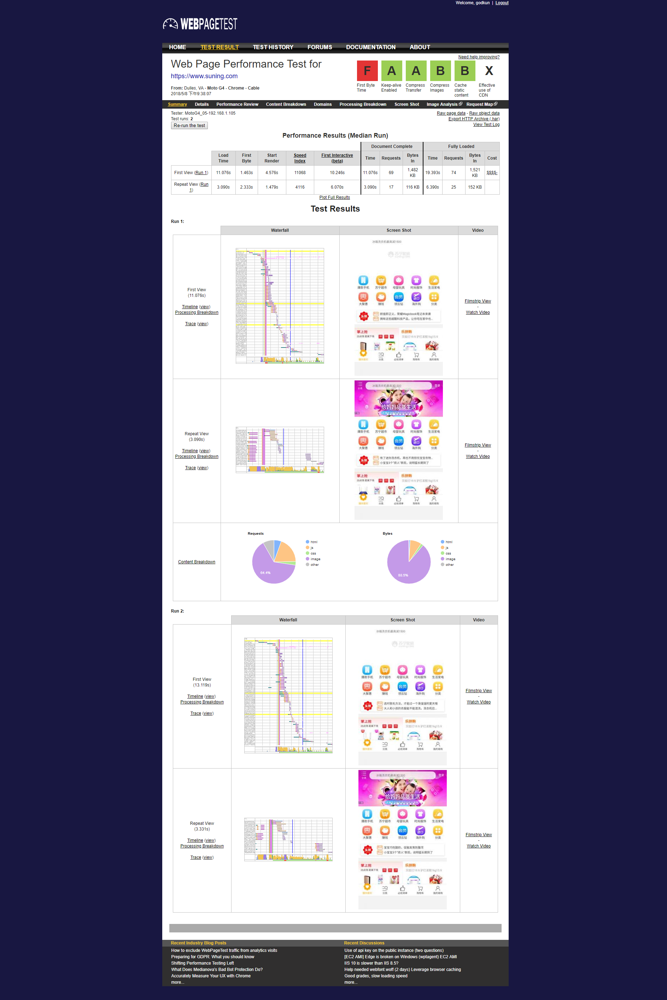

# 读[速度与激情以网站性能提升用户体验]有感

**allender Hogan 著 赵望野 刘帅 译**

-----
## 写在最前
[快速看完了，2016年9月第一版，整体给我的感觉就是，很多都是一些老生常谈的内容。读完后最大的收获就是掌握了一个不错的性能分析工具，WebPagetest。网站如下 [http://www.WebPagetest.org](http://www.WebPagetest.org)，虽然我用PageSpeed还有YSlow还有chrome devtools自带的性能分析工具。但是我感觉综合方面，还是WebPagetest的使用更优越些。

> WebPagetest是一个非常流行的、文档充足的、健壮的综合性能测试解决方案。

- 用默认设置运行测试时，会有一个第一视图和第二视图，以便比较资源缓存前后的加载时间。

- speedIndex是页面可视部分完全显示的平均耗时，他会帮助你测试页面的感知性能，会告诉你第一屏页面的内容要多久才能呈现给用户。

PS：终端用户的响应时间中有80%到90%都耗费在了前端。所以前端对用户体验的影响最大。

打开这个网址后，我将英文页面用谷歌翻译成了中文，有利于你们了解大致功能。

PS：具体代表什么，你们自己去看看帮助吧

## 以一个栗子来说明WebPagetest的使用优势

在URL中，我输入`https://www.suning.com/` 选择test run 次数为2，然后 start test，等待测试完成。完成后会显示如下结果页面，可能图片有点长。不过我还是选择截全了，这样比较好。

**现在我们来根据这个结果页面来分析一下苏宁易购官网的网站性能**

> 衡量网站页面加载速度，有一个原则：用户期望页面能在2秒内加载完成，如果时间超过3秒，多大40%的用户会放弃使用这个网站。

关于网页性能
## 其他性能考虑点
### 关于卡顿
卡顿是指：浏览器的渲染速度低于每秒60帧时，会发生卡顿现象。重绘是引起
卡顿的主要原因。
### 发现某个区域的渲染帧率低于每秒60帧的阙值时，就可以有针对性地对该区域减少重绘。
怎么解决卡顿现象，用chrome浏览器的performance查看，首先通过隐藏页面中该区域的元素来查找造成卡顿的原因，然后尝试通过隐藏颜色、阴影和动画来查找造成网页缓慢的根本原因。

- 优化加载顺序和页面请求大小，让首屏可以很快变成可交互状态

## 感知性能
网上加载的感知速度要比实际的速度更重要，用户的感知速度主要有：
- 开始在页面上看见内容渲染的速度
- 页面变得可以交互的速度
- 以及网站滚动的流畅程度

## 给页面设置性能参数
- TTFB
- 页面完全可见的时间
- 页面完全加载完成的时间

---

- 页面总加载时间
- 页面总大小
- 速度指数

> WebPagetest这样的综合测试工具非常适合在优化网站性能时用来设定性能基准，以及监控网站在一段时间的变化对页面加载时间和感知性能的影响。

## 响应式图片
显示适当尺寸图片最好的方法是利用html的picture元素

## 当增加需求时，要考虑
性能差异
- 会增减多少请求
- 会增减多少页面大小
- 会如何影响感知性能

美感差异
- 对品牌有何影响
- 对已有设计模式有何影响
- 对总体用户体验有何影响

实现成本
- 这种方案的可维护性如何？会使网站代码更简洁吗？
- 目前的团队可以实现这种方案？
- 需要花费多长时间
- 团队学习这种技术有收益吗？能否用到其他项目上？
