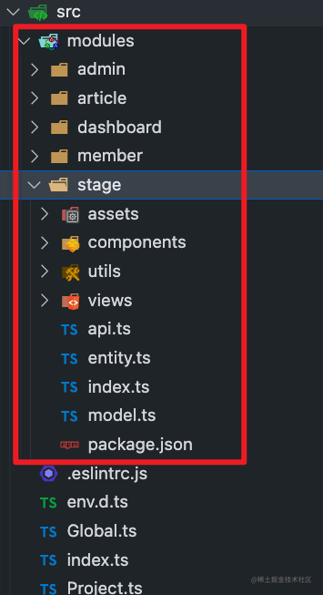

# 开发console产品

分享我为 `Monibuca` 流媒体框架开发 `Web` 管理器 的实践经验。

## 背景

### Monibuca 是什么

`Monibuca` 是一个开源的 `Go` 语言开发的流媒体服务器开发框架。具体介绍可点击下方官网链接：

> 官网地址： https://m7s.live

作为 `Monibuca` 团队开发者，需要为 `Monibuca 4.0` 版本做一个 `Web` 管理器，用来完成对 `Monibuca` 实例的细致化管理和控制。

同时，这个 `Web` 管理器暂时是不开源的。相当于是为一个开源项目做一个闭源的产品。

## 需求讨论和确定

通过团队讨论，确定开发下图所示功能：


主要开发者有两人，前端一人，后端一人，我负责前端开发任务，下文主要以前端开发为基调进行阐述。

## 思考衡量

主要的考量有以下几个方面：

### 时间成本

时间成本是一个重要因素，团队成员目前都是在业余时间进行开发，如果从 `0` 开始搞太浪费时间，我们需要借助开源力量。
对于我负责的前端，更是如此，我不可能从 `0` 开始搞，我也不可能自行设计 `UI` 和交互，我需要把大量时间放在功能开发上，而不是放在 `UI` 和交互上。

### 开发和维护成本

开发和维护成本也是一个重要因素，选择主流实现方式,有助于降低开发和维护成本。
在第一个上线版本前，不要过度设计你的实现，那样会显著增加开发和维护成本。
合理的方式是先以你擅长的主流实现方式，快速完成功能开发，完成之后，再去根据整体情况去调整和优化你的设计。

### 开发和用户体验

开发体验和用户体验这两者在开源和公司中表现正好相反。开源项目的开发体验大多数情况下是非常好的，因为开发者有足够的决定权去提升开发体验，如选择喜欢的技术栈。而开源项目的用户体验一般是不及公司中用户体验的，因为产品所提供的用户体验对于公司是极其重要的，公司会花费很多成本去提升用户体验。
相比之下，开源项目的用户体验一般弱于公司。

当然这不代表开源项目不注重用户体验， `Monibuca Web` 管理器在开发和用户体验上都会兼顾。

### 思考衡量总结

在确定功能，到准备开发的间隔中，建议做一个简单的考量，做到心中有数，运筹帷幄。

## 开发前

在开发项目前，想清楚一件事情：

**那就是要不要在某个开源项目的基础上进行开发，这里我在简单尝试后，选择了在开源项目基础上进行开发。**

因为让我去从 `0` 搭建类似管理后台的 `Monibuca Web` 管理器，时间和开发成本太大，没必要这样做。

想清楚后，下面我要做的就是找到适合 `Monibuca Web` 管理器的开源项目模板。 这个开源项目具有以下特征：

1. 项目 `LICENSE` 是 `MIT` 或者 `Apache` ， 避免不必要的纠纷
2. 项目的 `UI` 和交互符合 `Monibuca Web` 管理器，同时简洁美观
3. 项目采用先进主流技术，如前端采用 `ts` 、 `vite` 、 `vue3` 、 主流组件库 等
4. 项目架构清晰，功能丰富和完善，文档健全

经过搜索、线上体验、阅读源码等过程，最终确定了以 `naive-ui-admin` 为开发模板。 如下图所示：


> 其官方文档地址： https://jekip.github.io/docs

选它的理由是因为它具备以上四个特征。还有一个因素，就是我想用用 `naive-ui` 组件库。

在选择 `naive-ui-admin` 作为开发模板后，我开始了功能开发。

## 开发中

### 联调

整个开发过程，开发和联调是同时存在的，边开发，边联调，有点类似做私活，主要有以下 `2` 个总结：

1. 联调时间动态化：因为是业余时间搞，我有空，他不一定有空，所以需要沟通一个都有空的时间点
2. 联调进度可快可慢：没有截止日期，一个功能，可以很快联调完，也可以联调好几天

### 边熟悉模板代码，边开发功能

这个主要是参照官方文档，看下核心功能的实现，如路由、权限、布局等。

这个开源模板提供的路由和权限功能非常丰富，功能如下图所示：


代码实现也比较复杂，后续会对这部分进行优化和简化。不过在开发前期，尽量不要对原有模板代码进行大调整，按照其定下的规则进行开发功能即可。

### 整理优化点

在开发过程中，对模板代码可以优化的点和如何调整为适合 `Monibuca Web` 管理器的方案做到心中有数，比如下面几点：

1. 去掉 `mock` 、 `stylelint` 、 `husky` 、 `env`
2. 简化路由、权限
3. 优化构建、 `commitizen` 、 代码结构
4. 删部分减模板项目 `UI` 和交互

### 执行优化

在整理优化点后，后面就是执行这些优化，简单的优化在开发前期就解决了，而复杂的优化，需要等熟悉模块代码后，再进行调整。

#### 去掉 mock 、 stylelint 、 husky 、 env

对于人很少的团队来说， `mock` 、 `stylelint` 、 `husky` 的作用不大，可以删掉。

`env` 配置，目前也没有用到，以后用到的话，再加上。

#### 简化路由、权限

路由的简化如下图所示：


图中右侧是 `Web` 管理器，相较于模板代码，做了以下具体调整和优化

1. 入口代码精简
2. 拆分复杂的路由守卫逻辑，拆分逻辑放在 `guard` 目录下
3. 根据实际情况，去掉后端生成路由的逻辑

权限的简化： 去掉后台动态路由，只保留前端角色权限。

#### 优化构建、 commitizen 、 代码结构

优化构建：

1. 去掉了 `build` 目录，构建逻辑都写在 `vite.config.ts` 中
2. 增加了一些 `vite` 插件，如 `visualizer` 、 `icon` 、  `inspector` ，如下图所示：


优化 `commitizen` ：

主要是将 `commitizen` 替换成了 `czg` ，有以下优点：

1. 轻量级 : 零依赖项
2. 简单且快速 : 无需前置配置，无需适配器，没有额外的步骤
3. 可定制化 : 内部包含 `cz-git` 的核心，继承了 `cz-git` 的所有特性

操作如下 `gif` 图所示：


`czg` 官方文档： https://cz-git.qbb.sh/zh/guide/

优化代码结构：

优化后的代码结构和模板代码结构对比如下图所示：


图中右边是优化后的代码结构，从上图可以看到做了以下两点优化：

1. 增加统一入口
2. 重新调整目录

## 提升体验

这里分为开发体验和用户体验。

### 提升开发体验

主要做了以下措施：

1. 使用 `turbo` ，增加多包任务编排能力，如下图所示： 


2. 使用 `pnpm workspace` ， 增加对第三方 `npm` 包定制化能力，如下图所示： 


3. 使用 `vite-plugin-vue-inspector` ， 增加点击 `UI` 自动定位到代码行能力，如下 `gif` 图所示： 


4. 更新 `Vite` 版本，配置依赖预构建

### 提升用户体验

提升用户体验的核心内容，就是要让用户感受到页面很快，交互很友好。

页面很快这个可以通过性能优化来做到，性价比最高的做法如下：

1. 开启 `gzip` 压缩、开启 `h2`
2. 优化打包体积

在优化打包体积的过程中，使用 `rollup-plugin-visualizer` 对打包代码进行体积分析，分析结果发现，体积很大， `Rendered` 体积达到了 `4.5M` 。
模板代码对这块没有做优化，遂进行优化，优化方式也很模板。就是不构建公共库，使用 `cdn` 去加载，配置如下：

```ts
import externalGlobals from 'rollup-plugin-external-globals'
const globals = externalGlobals({
  vue: 'Vue',
  vueRouter: 'VueRouter',
  'naive-ui': 'naive',
  'vue-demi': 'VueDemi'
})
build: {
  target: 'es2015',
  outDir: 'dist',
  rollupOptions: {
    external: ['vue', 'vue-demi', 'vueRouter'],
    plugins: [globals]
  }
}
```

然后再把 `echart` 干掉，不使用 `echart` 。 这样操作下来，构建分析结果如下图所示：


`Rendered` 体积只有 `1.1MB` ， `gzip` 后只有 `360KB` ， 构建体积优化到这里，已经可以了，发布后，页面加载速度提升明显，用户体验也得到不错提升。

## 上线

开发完功能和自测后，就可以准备上线了，上线过程也非常简单，后端整好后，前端这边写一个构建部署脚本即可。

上线后有一个任务，就是在把线上地址宣传出去之前，团队成员进行提前体验。这个过程点检出了一些问题，如特定操作后，页面空白、代码逻辑问题。

这些都需要在宣传之前解决掉。实际情况中，在宣传之后，依然点检出一些问题，目前的方式就是，发现问题，解决问题，发布上线。

### 使用教程

现在控制台界面如下图所示：


有需要的可以用微信扫下面二维码观看视频教程，更加直观。


## 未来规划

规划主要有两个，一个是私有化，一个是微模块。

### 私有化

目前制定了两套方案

第一套方案：

`Monibuca Web` 管理器私有化，这个需要前端和后端同时做好私有化，这个方案的后端考虑因素比较多，需要做不少调整。

第二套方案：

鉴于 `Monibuca` 的特殊场景，也就是需要用户在本地启动 `Monibuca` 实例。我们可以选择桌面端来做私有化，这样就可以不再需要后台服务，只需要写一个桌面端即可。

目前第二套方案的优势更大，不过也要解决一些问题，如桌面端和 `Web` 端 `UI` 共用，各操作系统的兼容性等。

### 微模块

微模块 是跨工程、跨项目共享通用业务代码的理想解决方案。

这个规划主要借鉴了 `eflux` 。 `eflux` 文档地址： https://eluxjs.com/designed/micro-module.html

我们看下 `Monibuca Web` 管理器的前端目录结构，如下图所示：


上图目录是以文件职能划分，功能模块作为次级分类，如果我们想做到下图这种能力


你会发现，是比较困难的，因为我们的功能是通过很多目录协作完成的。如果使用微模块的思想，那么这个问题就会得到很好的解决。

我们约定好路由和状态管理方案，把公共的依赖做成基座。这样就可以很好的做到业务模块的复用。也为后续桌面端和 `Web` 端共用业务模块打下坚实的技术基础。

类似下图:



`stage` 目录为基座，提供公共依赖。其他模块为业务模块。`

## 总结

至此，全文阐述了为 `Monibuca` 开源项目开发 `Monibuca Web` 管理器的方方面面，包含思考衡量、开发前、开发中、优化、未来规划等内容，
希望对读者有所帮助。

## 附

文章只在掘金、 github 和公众号上同步

- github：https://github.com/godkun
- 公众号：  元语言

版权声明：本文系我原创，未经许可，不可转载和二次创作。
