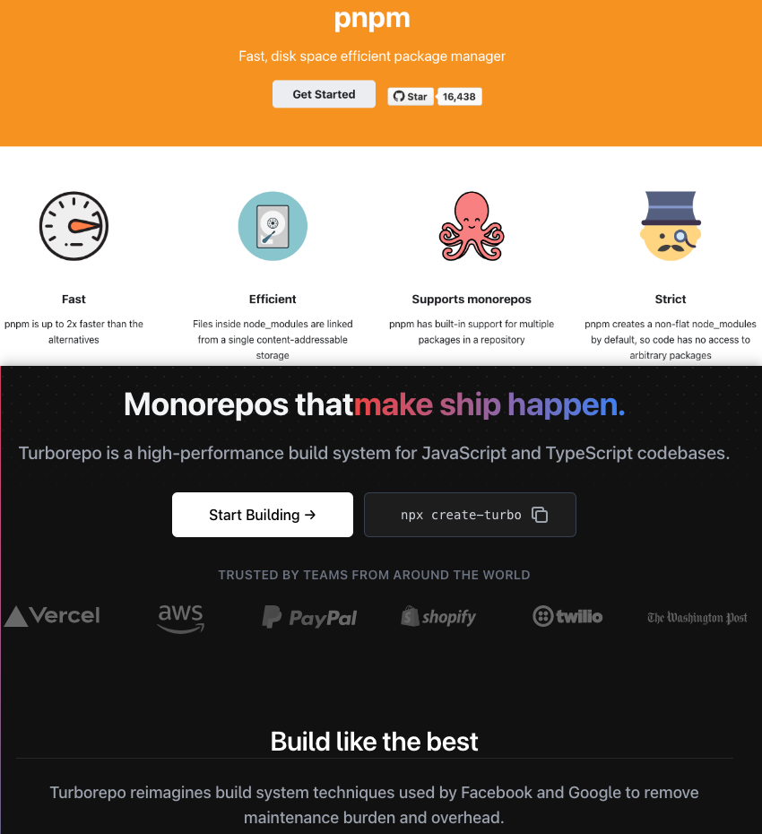
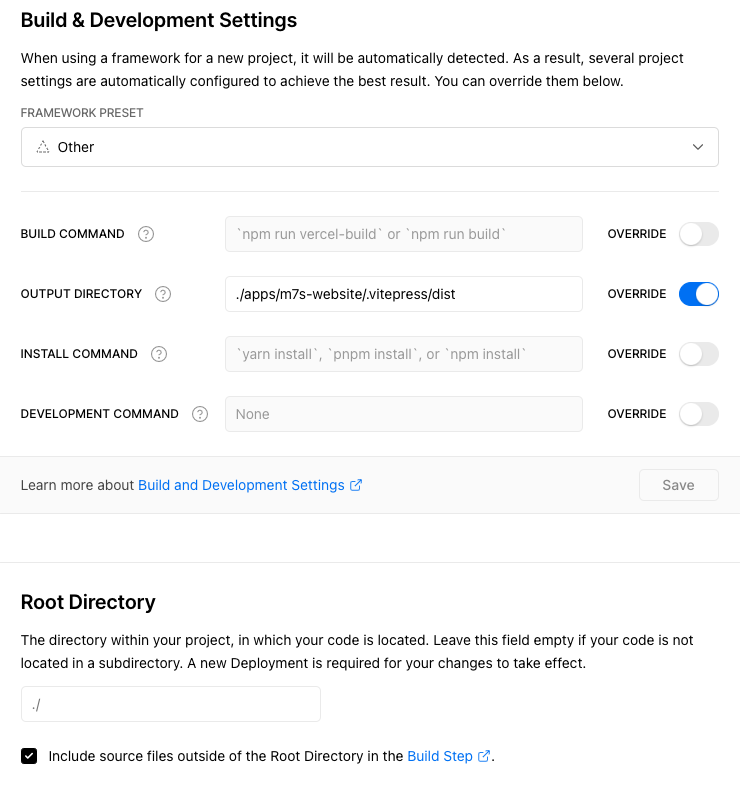

# 第一版官方开发总结

## 目的

- 聚焦开源官网开发，分享从 `0` 到 `1` 的官网开发实践经验
- 作为一个系列文章开头，不定期分享我在开源实践方面的总结和经验，欢迎关注

## 内容

文章主要介绍以下内容：

- 需求、设计、实现思路
- 技术选型： `pnpm` + `turbo` + `vue3` + `ts` + `vite` + `vitepress` + 服务端( `node` | `go` ) + `vercel`
- 技术架构
- 构建部署
- 预览与源码
- 开源实践总结、附（文中提及名词地址）

## 需求

给开源项目 `Monibuca` 换官网，包含以下功能：

- 官网首页： `Monibuca` 的主页
- 文档教程页： `Monibuca` 的使用文档
- 后端服务：提供 `go` 包下载转发

> Monibuca 是什么？

`Monibuca` 是开源 `Go` 语言流媒体服务器开发框架。如下图所示：

## ui 设计

`ui` 这块， 有团队中的设计朋友在帮忙设计官网 `pc` 首页，其他的如文档教程页、移动端自适应等功能，则自行开发实现。

> 设计稿如下图所示：

> 主要设计内容如下：

- 整体分为 【导航 + `banner` + 内容 + 底部】 四个 `ui` 模块
- 整体版心固定为 `1200px`
- `banner` 版心固定为 `1400px`

这期间，我们和设计师保持沟通，首页 `ui` 的设计，是一个不断沟通和调整的过程。

## 自适应方案

`pc` 的自适应方案不只一种，浏览了一些主流官网，最终确定的自适应方案如下：

- 大屏幕（电脑）采用固定版心宽度，版心宽度 `1200px` 基本可以保证最小电脑屏幕能够完整展示出来
- 不做 `rem` 适配，使用媒体查询进行小屏幕（ `pad` 、 手机等）适配

> 提个问题， 为什么 `PC` 页面基本都不用 `rem` ？

## 实现思路

实现思路体现着平衡哲学。

这里有一个前置考虑，那就是实现的代价，主要代价如下：

- 代价大： 功能全部从 `0` 开发（掌控感更好，但费时费力），采用最前沿技术（利于学习成长，但难度大）
- 代价小： 一部分功能从 `0` 开发，一部分功能站在开源的肩膀上，采用前沿技术

非全职维护开源项目，既自由，又不自由，这里不自由主要体现在时间和精力的投入有限，所以综合考虑下，选择代价小的方案。

随后，我有目的的浏览了一些官网，在综合比较下，感觉 `vue` 的官网整体不错。随后阅读了 `vue` 官网的源码，结合实现代价，定下了实现思路：

- 技术选型在整体上和 `vue` 官网保持一致，如 `vitepress` 、 `vite` 、 `vue`
- `vitepress` 主题使用 `vue` 主题进行二次开发，并使用 `pnpm workspace` 进行管理
- 构建使用 `pnpm` 、 `turbo` 、 `vite` 三者结合，将构建性能最大化
- 部署使用 `vercel` 绑定 `github` 项目，实现静态页面和服务端端的自动化部署

## 技术选型

实现思路确定后，整体技术选型也随之确定，即如下：

技术选型 = `pnpm + turbo + vue3 + ts + vite + vitepress + 服务端(node | go) + vercel`

处了服务端，上述选型和 `vue` 官网的选型保持一致（整体理由），下面我会简要介绍各技术选型理由：

### pnpm + turbo

目前的 `monorepo` 生态百花齐放，正确的实践方法应该是集大成法，也就是取各家之长，目前的趋势也是如此，各开源 `monorepo` 工具达成默契，专注自己擅长的能力。

如 `pnpm` 擅长依赖管理， `turbo` 擅长构建任务编排。 遂在 `monorepo` 技术选型上，我选择了 `pnpm` 和 `turbo` 。

`pnpm` 理由如下：

- 目前最好的包管理工具， `pnpm` 吸收了 `npm` 、 `yarn` 、 `lerna` 等主流工具的精华，并去其糟粕。
- 生态、社区活跃且强大
- 结合 `workspace` 可以完成 `monorepo` 最佳设计和实践
- 在管理多项目的包依赖、代码风格、代码质量、组件库复用等场景下，表现出色
- 在框架、库的开发、调试、维护方面，表现出色

相比于 `vue` 官网，在使用 `pnpm` 上，我加了 `workspace` 。

-----

`turbo` 理由如下：

- 它是一个高性能构建系统，拥有增量构建、云缓存、并行执行、运行时零开销、任务管道、精简子集等特性
- 具有非常优秀的任务编排能力，可以弥补 `pnpm` 在任务编排上的短板

### vue3 + ts

`vue3` 理由如下：

- 2022年，使用 `vue3` 是必然趋势（vue 技术栈）

-----

`ts` 理由如下：

- 当今，使用 `ts` 对你来说，是百利而无一害。
- 用 `ts` 可以帮助你更好的去接触和使用其他语言，如 `go` 、 `kotlin` 等

### vite

大家已不陌生。

理由如下：

- 生态社区活跃且强大
- 极速的服务启动、轻量快速的热重载、功能丰富
- 下一代前端开发与构建工具

### vitepress

理由如下：

- 极简主义，提供创作文档所需的最低限度的功能，其他功能全部在主题完成
- 底层使用 `vue3` + `vite` ，性能更好
- 更喜欢 `JavaScript API` 而不是文件布局约定

我赞同 `vitepress` 的设计理念，目前 `Monibuca` 官网主题的实现方案是：

`fork` `@vue/theme` 源码 并用 `pnpm` 进行管理和二次开发，然后慢慢演化成属于 `Monibuca` 的主题。

`vitepress` 官网： <https://vitepress.vuejs.org/>

### 服务端 node | go

`node` 理由如下：

- `node` 是专属前端的后端武器，同时也能和 `pnpm workspace` 完美兼容

-----

`go` 理由如下

- `go` 是目前非常火的语言，也是前端突破 `node` 在服务端的发展限制的一条康庄大道

这里我使用的 `vercel` 提供的 `serverless api` ，方便快速。

### 技术选型总结

至此，技术选型就介绍完了，上面阐述的技术选型，既有主流成熟、也有前沿趋势，整体上是一个不错的方案。

> 当前构建过程，技术选型的趋势是什么？

笔者认为，目前前端的构建工具链已经在快速被 `Rust` 和 `Go` 接管。如 `swc` 、 `vite` 、 `vitest` 、 `turbo` , 速度之快，令人惊叹。这也对前端工程师提出了更高的要求，激励我们学无止境。

> 技术选型确定后，已经开发并维护一段时间，还可以对技术选型进行调整吗？

当然可以，自信点，把吗字去掉。

在架构设计中，有一个原则叫演化原则，演化优于一步到位，好的软件，一定会不断的进行演化，这和人类的演化，地球的演化，宇宙的演化都是一脉相承的。自然法则，大道至简。

提到架构，那下面我将阐述官网的技术架构，请跟我一起往下看。

## 技术架构

### 三个原则

架构设计有以下三个重要原则：

- 合适原则： 合适优于业界领先
- 简单原则： 简单优于复杂
- 演化原则： 演化优于一步到位

也就是说，大家在做架构设计的时候，要有意识的让架构符合这三个原则，这样会保证你的架构设计至少在大方向上是保持正确的。

### 常用软件架构

这里提下常用的 `4` 种软件架构：

- 分层架构：如网络七层协议、 `MVX` 模式 、 `DDD` 、都体现了分层架构思想
- 插件架构：如开源项目 `VSCode` 、 `Vue` 、 `Monibuca` 的设计就体现了插件架构思想
- 事件驱动架构： `electron` 进程间通信(基于 `node` 的 `EventEmitter` )体现了事件驱动思想
- 微服务架构：如 `dubbo` 服务、微前端 体现了微服务架构思想

分层架构是最常用的软件架构，有点递归的感觉，先分大的层，在大的每一层，还可以分小的层。此外插件架构也非常常用，前端层面，一般多使用分层架构和插件架构。

俗语所说：麻雀虽小、五脏俱全。开发官网虽然很容易，但依然可以拥有优秀的架构思想，下面将介绍我对官网进行的架构设计。

### 官网架构

官网的软件架构图如下所示：

采用的是分层架构设计， 具体介绍如下：

- Monorepo： 使用 `pnpm + turbo` 来管理所有代码，是一个不错的实践。目前我还没使用 `changesets` 做多包版本管理，后续如有必要会加上。
- API 层： 使用 `vercel` 的 `serverless api` 来满足官网的服务端需求，使用 `vercel` 平台提供的 `serverless` 能力，降低了官网的维护成本（无需服务器）
- 组件层： 将配置、方法、组件、主题拆成组件，并用 `pnpm workspace` 进行统一管理，具有良好的可复用性和可扩展性
- 业务层： 目前只有 `Monibuca` 官网，后续还会有其他官网需求，放在一起维护，方便复用组件、统一依赖和代码风格
- Devops： 整体使用 `pnpm + turbo` 进行构建，组件层会使用相应的构建工具如 `tsup` 、 `rollup` 等。 代码仓库使用 `github` 进行托管，使用 `vercel` 绑定 `github` 来打通自动化构建部署

上面的架构图不一定完全满足分层架构，这个不重要，重要的是符合架构的设计原则。下面进行简单阐述：

- 合适原则： `u1s1` ， 做到了既合适，又是业界领先。如 `vitepress` 开发文档页、 `pnpm` 管理 `Monorepo` 、 使用 `Vue3` + `TS` 、 `github` + `vercel` 都是合适的
- 简单原则： 提现在自动化构建部署、组件拆分复用等
- 演化原则： 体现在服务端没有做额外设计，包括服务器都没有购买，直接使用 `vercel` 完成，如果后面有其他需求，需要购买服务器，那时我们再做服务端的设计

### 技术架构总结

上文提到的常用软件架构不是独立存在的，他们可能是交叉并存的，这些软件架构本身就遵循着合适、简单、演化等原则。我们要做的就是在软件的生命周期中，运用架构设计来让这个软件发挥更大的价值，承载更多的使命。

## 构建部署

### 构建

核心就是使用 `pnpm + turbo` 进行构建，大致介绍如下：

- 使用 `pnpm` 安装依赖和绑定 `workspace`
- 使用 `turbo` 进行任务编排，进行多核并行构建

构建过程如下图：

可以看到图中 `build` 时间，用时非常少，构建速度极快。

具体使用方法请查阅官方文档和 `github` 开源案例。

## 部署

核心就是： 使用 `vercel` 进行自动化构建部署。

关于 `vercel` 的使用，大家自行搜索，这里我阐述下部署流程，如下所示：

1. 官网代码提交到 `github` 仓库
2. 使用 `github` 登录 `vercel` ， 绑定项目
3. 进行域名设置，绑定官网域名
4. 在 `vercel` 上填写构建配置，这里我贴一下目前官网在 `vercel` 上的构建配置，如下图所示：

只需要对 `Output Directory` 进行设置即可，其他不动
5. 保存构建配置，然后进行构建部署、发布对外
6. 后续官网只要提交代码到 `github` 上，就会自动触发构建部署

> 部署采坑：

官网使用了 `pnpm workspace` 和 `turbo` ， 在使用 `vercel` 进行构建部署时，遇到了本地成功，但在 `vercel` 构建就无法成功的问题，具体原因不祥， `vercel` 官网文档内容非常简单， `github issue` 和 `discussion` 上也没看到有用的信息，最后谷歌搜到了一个 `youtube` 视频，是关于用 `vercel` 构建部署 `pnpm workspace + turbo + nextjs` 。遂看完视频，再结合自身理解，打通了这块流程。

## 预览与源码

预览： 直接访问官网 <https://m7s.live/> 和上文设计图基本一致

源码地址： <https://github.com/godkun/website/>

源码目录如下图所示：

有需要的可以自行下载查看，此处不再做源码内容相关介绍。

## 开源实践总结

- 没有固定 `deadline` ，灵活人性 ☀️
- 没有线上事故定责，现在官网的 `ui` 还有点问题，文档还没有补上，但没关系，想发就发，任性 😄
- 开发官网这种需求，技术自由，只要 `hold` 住和满足需求，想玩什么技术都可以 🚀
- 找业界和开源项目类型相似的优秀官网进行参考，既然都是开源，那就站在开源的肩膀上，用魔法打败魔法 💯

## 附

- 文中架构图绘图软件： <https://excalidraw.com/>
- 图床： `picgo` + `github`
- 架构原则参考书籍： 《从零开始学架构，照着做，你也能成为架构师》
- `Monibuca` 官网： <https://m7s.live/>
- `vitepress` 官网： <https://vitepress.vuejs.org/>
- `vercel` : <https://vercel.com/dashboard>
- `pnpm + turbo + vercel` 教程视频: <https://www.youtube.com/watch?v=A-FE_cn7mFo>
