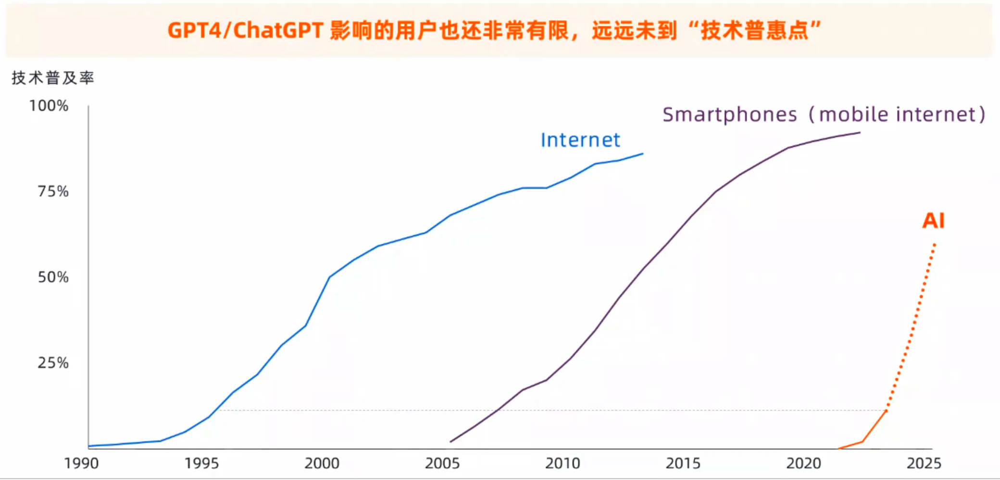
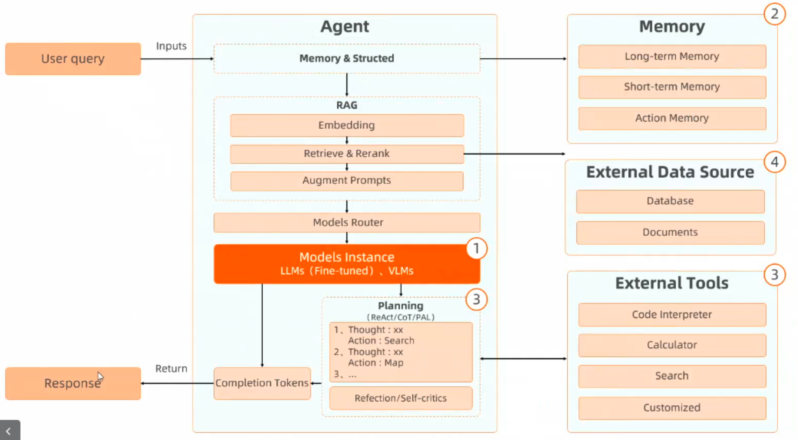
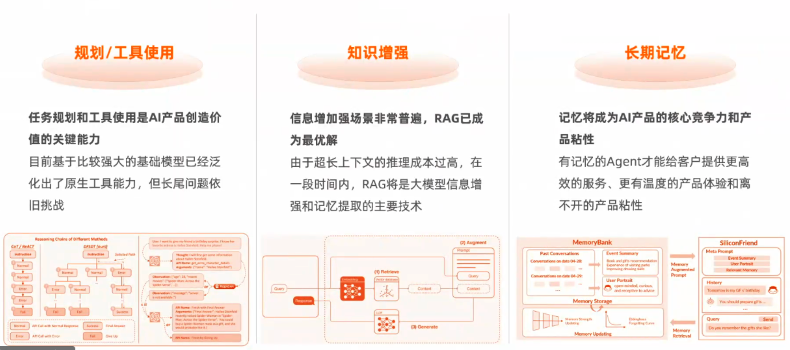

# 2024-4-18

## 回顾

1. 调整几个aicode插件的小功能，增加国际化、使用 key value 映射，更好的解决将配置中的enum替换成中文，不需要动很多业务逻辑代码
2. 继续 开发inline chat 功能，完成快捷键提交功能
3. 花了小半天尝试修改注释线程的按钮背景色，发现没有好的方案，暂时不做修改了
4. 分析代码补全时间慢的原因
5. 晚上在公司听了一个关于 ai大模型的， 7 点一刻 演讲，作者是阿里的，讲的很好，我根据爱搜和爱码问了两个相关问题：

### 第一个问题：

在ppt中的 饿了么 演示，我想咨询下，我输入下单最热门的披萨 之后到走完下单流程,在模型方面，用到了那些大模型，比如视觉模型、文本模型在模型之外，有做其他额外的工作么，比如和饿了么业务方对接，获取一些数据和接口支持还有使用爬虫技术，在后台走一些页面上的实际操作

### 第一个问题回答：

- 用的 vr(没听清，也可能是指vl) 模型
- 饿了么开发了一些开放接口给他
- app如果是单体 的，一般是 终端的界面操作+页面操作 配合
- app如果是超级app，比如手机桌面，可能会有更统一的对外能力，通过这些能力结合大模型去做一些agent


### 第二个问题：

在降低大模型成本方面，发现在降低成本和保证模型质量上很矛盾，比如做Im cache，从模型层面去做的难度也大。在模型降本的同时又能保证质量这块，有没有好的建议

### 第二个回答：

主要有两个方向
1. 做更大尺寸的模型
2. 把模型做的更小

可以确定的是： moe 是一个非常重要的方向，小尺寸 的 moe 很好，模型参数做小，算法要好，本质的方向是知识压缩，也就是目前知识的压缩如何继续优化，或者说，有可能目前的知识压缩算法是错的。

## 其他收获

#### 我们正处于“1999年的互联网”时代



#### 大模型应用技术的三个关键挑战

```
1. 基模能力: 文本生成、指令识别、复杂规划、代码生成
2. Agent工程：Prompt Engineering、SFT、RAG、Tool Use、Memory
3. Infra成本：GPU推理卡成本、推理计算性能、整体云资源成本
```

#### 大模型Agent应用的基本技术架构:



#### Agent工程的核心技术正在逐步成熟：



## 今日成长

[满分5颗星]

成长指数：:star::star::star::star::star:

- 听了一个很棒的ai大模型分享，学习很多

