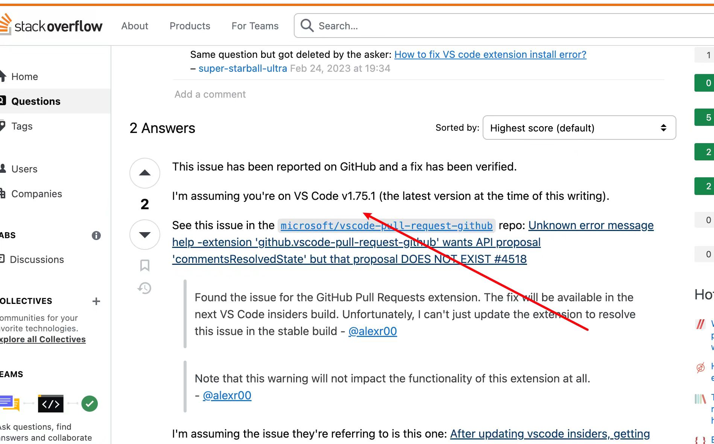

# 2024-5-7

## 回顾

1. 支持爱码2.0版本灰度点检

## 细节
### 处理联网搜索在线上环境，出现接口返回失败问题
有3个原因：

1、爱搜的联网搜索接口是测试环境，在线上环境调不同
2、线上环境北京机房，对搜索引擎进行了屏蔽，俗称被墙
3、爱搜代码使用的九问接口无法在线上环境调通

经过协同处理，此问题快速被解决。

### 定位灰度同事在 1.72 版本vscode上无法使用内联功能

经过分析，发现是vscode官方的一个bug，如下图：

目前只能通过升级vscode版本解决这个问题，已和同事同步解决方案

## 今日成长

[满分5颗星]

成长指数：:star:

心情指数：:star::star: