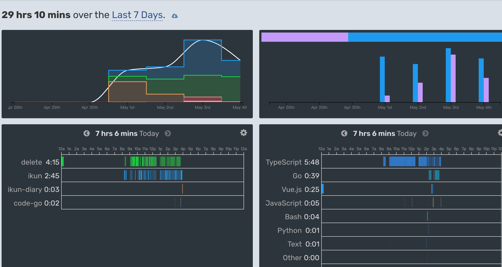

# 2024五一假

截止 4 号，五一的学习时间分布如下图：

做的最多的事情就是不停的打磨inlay chat 功能，大概做了以下事情

1. 修复选中代码，再替换代码，缩进问题，对 js py go ts rust vue等语言进行测试
2. 针对vue文件 编程做了很多优化，单独对vue文件的替换做了额外优化
3. 实现 diff 功能：增加修改前修改后代码diff功能，将 diff的文件类型改成实际语言，diff体验更好
4. 在不选中代码的场景下，增加上下文功能，增强代码生成的准确度
5. 实现 在没有触发快捷键 cmd i 拉起 inlay chat 窗口之前，不显示 comment 加号图标
6. 实现 拉起 inlay chat 窗口后，光标聚焦在非inlay区域，包括点击加号图标，自动隐藏inlay窗口

还有一些事情没有列，总之，对于重要的事情，我的态度是拉满的。