# 大型项目git和gerrit实战总结和经验[苏宁]

## 序
前半部分属于基础，后半部分属于进阶。从初级到中级再到我都 `hold` 不住的高级。全文共 `12000` 余字，超干超干的那种。
然而，写完一半的时候，我突然虎躯一震，我是不是在造轮子？随后我悄悄的搜了一下 `git` 。 嗯？这么多 `git` 文章，我滴天呢，我陷入了沉思，我皱着眉头点了几篇文章，有号称封山之作的2万字真理，也有完整详细的 `git` 系列教程。好像有点轮子啊，但是我继续看了下他们的内容后，有种茅厕顿悟般的惊喜，因为我发现我的文章还是很独树一帜的。最后得出一个结论，我没有造轮子，这是一篇高可用高扩展高性能的 `git` 和 `gerrit` 文章。用实战去推动思考，`kill` 掉大众化的 `git` 知识，从常用的角度去扩展深层的知识，进而抽象出我们可以理解掌握的 `git` 奥秘。不拘泥于 `API` ，不畏惧其他轮子，不要怂，就是干。

本文是站在别人的 `commit` 上去 `merge` 和 `patch` 我自己独具特色的理解，从而生成一个更好的 `commit` ，然后留给大家日后更好的 `merge` 和 `patch` ，技术在一次次 `patch` 中不断进步。

## 开门见山
在实际项目开发中，能灵活的使用 `git` 和 `gerrit` 是一个很重要的事情，一方面可以提高团队开发效率，另一方面可以把控项目的代码质量。不过对于 `gerrit` ， 可能一些同学没有用过，还有 `git` 的一些你可能没有掌握的技巧，今天就一起分享给大家，分享的同时，自己也有很多即时收获。

> **PS:** 为什么我会说我自己也会有很多收获呢，因为是这样的：当我选择写一篇博客的时候，我会自己先去深入的理解我写的这篇博客的相关知识点，在深入理解这个过程中，我会去阅读各种资料，然后去分析，最后总结出属于我自己特色的学习心得，这对我来说，就是一种即时收获和高级进阶。


## 为什么会出现 git
这里我们用 `git` ， 我们就应该去了解一下 `git` 出现的背景，具体故事不说了，自行维基。这里我简单说一下 `git` 的出现，在技术层面上的背景。

`git` 是一个开源的 **分布式版本控制系统** ，源码也在 `github` 上开源了，可以自行搜索。提到分布式版本控制系统，那应该联想到 **集中式版本控制系统** ，具有代表性的比如 `SVN`   ， `SVN` 的全称是 `Subversion` 。

> 那这两者究竟有什么区别呢？用两张图对比一下：

SVN：
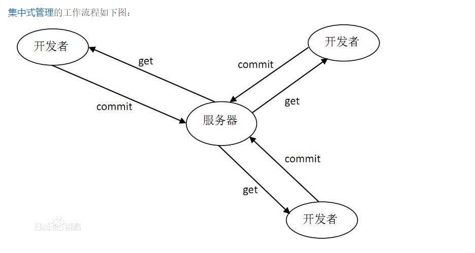

-------------

GIT：


从图中基本可以分析出两者的主要区别。比如：

- `git` 可以离线开发，`svn` 不能离线
- `git` 处理 `merge` 的优势碾压 `svn` 

当然其他的区别还有很多，比如 `git` 的内容更完整，使用了 `SHA-1` 算法，`git` 可以更加灵活的操作 `branch` 。 等等，这里就不造轮子了，参考下面这篇博客：

> [SVN与Git比较的优缺点差异](https://www.cnblogs.com/Sungeek/p/9152223.html#sg3)

看到这里，我们可能比较偏向于， `SVN` 比 `Git` 差一些的观点，但其实这是两种不同的版本控制系统，不能简单的认为谁好谁坏，这里有一篇为 `SVN` 洗白的博客，挺有趣的，大家可以看看：

> [90%人都不知道：SVN 和 Git 的一些误解和真相](https://blog.csdn.net/atsoar/article/details/80460475)

要是高度总结一下，那就是： **SVN 更适用于项目管理， Git 更适用于代码管理。**

## 为什么会出现 gerrit
我们看维基介绍：

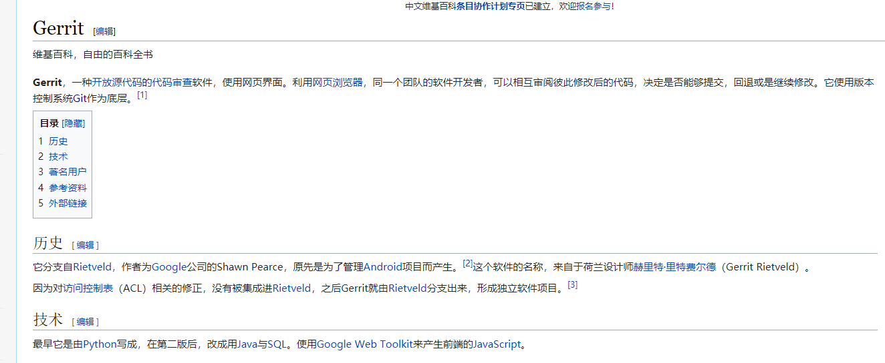

言简意赅：从维基上可知，**`Gerrit` 是一种开源的代码审查软件，专门用来 `CR` 的。**


## 版本控制系统

###  版本控制系统的三板斧

这里说一下版本控制系统的三板斧：

第一板斧： 存储内容

第二板斧： 跟踪内容更改

第三板斧： 与协作者分发内容和历史记录

> 理解了上面的三板斧，你就理解了版本控制系统的精髓，这里先不做解释，继续阅读，然后自己体会。

### 版本控制系统发展史
现在和将来的前端，一定是和 `git` 打交道最多的行业之一，上面提到了版本控制系统，那为了扩展版本控制的知识，我们有必要去了解一下版本控制系统的发展历史，历史大致是这样的：


> 从 手动 `copy`  `diff`  打 `patch` ， **到** 引入了互斥写入机制的 `RCS` ， **再到** 第一次引入了 `branch` 概念的 `CVS` ，**再到** 实现原子操作级别合并的 `SVN` ，**再到** 现在的新皇登基 `git` 。每一个时代，都有自己的那一份骄傲，这里推荐一篇非常非常好的博客：

博主大佬：**Vamei**

> 博文：[版本管理三国志 (CVS, Subversion, git)](http://www.cnblogs.com/vamei/archive/2013/02/21/2918069.html)

这篇文章简直把版本控制系统的整个历史解释的堪称完美，从最开始的个人手工 `copy` 压缩打包，到后面的通过 `diff` 出 `patch` ( 也就是我们常说的 补丁 )，然后通过邮件进行传达 `patch` 。然后继续说了 `rcs`  `cvs`  `svn`  `git` 在说到 `git` 时，解释之精妙，令人佩服。

> 这里我修改一下文中最后一段：

**和三国志不同， `VCS` 的三国还没有决出最终胜负，或许 `SVN` 会继续在一些重要项目上发挥作用，但是 `git` 最终会一统江山，至少会一统前端江湖。**


## git 和 gerrit 命名的由来
有时候，我们可能对为什么叫 `git` 、 `gerrit` 不怎么在意。但是很多命名都是有自己的故事的，比如 `vue` , `react` 为什么这样命名。可以去查阅资料了解一下，这有助于我们更形象化的理解它们。

### git 的命名
比如说，`git` 一词的由来，可以从维基百科上的一段话可以看出：

> Quoting Linus: "I'm an egotistical bastard, and I name all my projects after myself. First 'Linux', now 'Git'".('git' is British slang for "pig headed, think they are always correct, argumentative").

翻译一下就是：**我是一个自负的混蛋，我把自己的所有项目命名为自己。首先是 "Linux" ，现在是 "Git" 。**( `git` 在英国俚语中是猪头，认为他们总是正确的，有争议的 )。

> 是不是发现其实命名也是有自己的故事的。

再举个例子，比如 `MySQL` 中的 `My` 并不是 **我的** 的意识。**MySQL** 的命名由来是这样的，维基上有介绍：

> Its name is a combination of "My", the name of co-founder Michael Widenius's daughter,[7] and "SQL", the abbreviation for Structured Query Language.

### gerrit 的命名
由于已经说了 `git` 的命名由来了，这里我就言简意赅点，`gerrit` 的命名来自于荷兰设计师赫里特·里特费尔德( `Gerrit Rietveld` ) 的名字首个单词。

## 为什么要用 git 
> 这也是一个值得思考的问题，我们为什么要用 `git` ？

直觉上，我们自然而然的用了，发现也很好用。那我们可以问一下自己，`git` 为什么很好用，如果我们看了上面提到的博客，可能我们已经有了答案，其实很多很棒的东西的诞生，都是在诞生的某个维度背景下，解决了大部分同类没有解决掉的痛点。

所以现在我们用了 `git` ，我们也觉得很好用，但是事实上我们好像并不清楚 `git`
的出现，解决了什么样的痛点，我们只知道好用。我说这句话，就是想说明一下，去了解一个东西，最好去了解这个东西诞生时所处的时代背景或者技术背景。哎，好像我没有回答为什么要用 `git` ？ 不慌，问题不大，其实答案已经在前面提到了。 

## 谈谈 git-flow 流程
网上有很多 `git-flow` 开发流程的博客，这里不进行讲解了，但是我想讲的就是：

> 总结出一个符合本项目的 `git` 开发模式，才是真正意义上的 `git-flow`。

### 如何去制定一个好的 git-flow
目前的代码托管平台主要有：`github` 、 `gitlab` 、 `Coding` 、 码云 。 这是我知道的主流的代码托管平台( 排除 `bitbucket` ，因为国内用的不多)。由于最近 `github` 允许个人开发也可以建立私有仓库，那也就说明这四个代码托管平台都可以免费建立私有仓库了，这算是一个重要时刻吧。

> 参与了几个项目后，我在想一个事情，就是什么样子的开发模式 ( 只针对开发 ) 才是一个好的开发模式，最后我得出一个关键的因素，那就是：

**一个好的开发模式，可以提高团队的开发效率，同时提高团队的代码质量。**  ( 这不是废话吗，手动滑稽 )

我们上面提到的，不管是 `svn` 还是 `git` ， 都是为了优化现有的开发模式。那么，如何去按照本项目的特点去制定属于本项目 `style` 的 `git-flow` 呢？下面我会分享一些我自己的看法。


### 项目背景
目前参与一个前端开发者达到几十人的一个大型项目，使用的是 `git` 版本控制。本人负责给项目加上 `gerrit` 和 帮助其他开发者平稳过渡到 `gerrit` 开发模式中，说通俗点就是：

> 有啥 `git` 和 `gerrit` 操作问题，我负责解决。

### 熊和鱼掌不可兼得
根据我的经验，如果要提高团队的代码质量，那一定会降低团队的开发效率，也就是在平均时间内，工作产出会降低。

> 为什么这样说呢？因为这是合理的，我用 `V8` 来举个例子：

拿 `V8` 引擎来说，`V8` 对 `JS` 代码的优化，并没有一网打尽似的全部采用 `JIT`编译器 进行优化，而是针对性对一部分代码使用 `JIT` 优化，对另一部分代码直接生成本地代码。

> 原因很简单：

**优化的越好，就意味着需要的分析和生成代码的时间就越长。** 对 `C++` 这种编译型，等待的时间长一点可以接受，但是对于 `JavaScript`来说，哪怕是 `200ms`，那对于用户体验来说，都是一个考验。

> 我举这个例子是为了从软件编程领域去说明一个道理：

就是不能一味的追求质量，而是要把质量和效率结合在一起，去达到一种最优解。

我个人认为，网上标准的 `git-flow` 模式 对于那些开源的项目可能比较适合，或者公司内部很重要的项目合适，其实 `git` 诞生背景，主要就是为了让开源的代码版本控制变得更强大。`github` 的出现，让 `git` 变得非常流行。我们看一下网上那一套标准的 `git-flow` 模式，如下图：

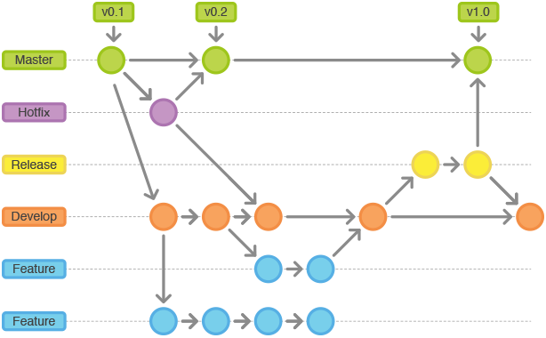

> 是不是看的眼花缭乱，都有点害怕，我不就是做个版本控制吗，有必要这么复杂吗？ 

首先，完全没有必要这么复杂，各位小伙伴不要被这种博客吓到了，吓到都不敢用 `git` 。虽然上图的 `git-flow` 模式可以说是使用 `git` 进行版本控制的 `best practice`
。但是我认为这并不适合大部分的业务项目。

> 敢问，在大公司内，或者小公司内，使用上述的标准版 `git-flow` 模式进行开发的前端项目占比是多少？ 我想占比几乎没有，或者说能有 `10%` ，我觉得都是奇迹。如果项目开发时间紧，迭代快，那几乎不可能按照这种模式来，那怎么来呢？

我觉得应该是：在分析项目的时间，和迭代速度后，做出一个既可以控制代码质量和版本管理，又可以让开发过程变的不那么繁琐，从而保证一定的开发效率。这才是一个比较好的 `git-flow` ，

> 大白话就是: 

**怎么舒服怎么来，自行脑补。** 

所以当你想学习 `git-flow` 模式开发的时候，然后去网上搜了一下博客，发现 `git-flow` 模式有点抽象。这个时候请不要害怕，我不认为这种标准抽象的 `git-flow` 就是属于你现在项目的 `git-flow`。

> 你应该去学习这种标准 `git-flow` 模式的思想。

比如通过几个关键性的 `branch` 来对版本的生命周期进行精细控制，通过 `branch` 来分割各个生命周期的代码，保证版本的各个生命周期代码的纯洁性。

> 纯洁性是什么意识？

举个例子：下个版本的代码，你也开发一半了，那这些代码就不能出现在现在版本的线上代码中，纯洁性就可以这样理解。

> 我想说的就是：

比起要学会如何使用 `git-flow` ， 我们更应该去体会一个很棒的版本控制系统 的解决方法，其背后的思想。当深入理解了思想，那后面用其他版本控制系统的软件，也能游刃有余了。

### 在大型项目中 git-flow 怎么实施
这里以我目前参与的一个大型项目作为例子，说一下如何在实践中，总结出属于本项目的 `git-flow` 流程。

这里介绍一下项目的分支结构，没有所谓的 `feature` 分支，有 `develop` 分支，但也是简写成 `dev` ( 怎么方便怎么来 )。

> `dev` 分支有两个作用:

一个是充当 `feature` 分支，一个是充当 `develop` 分支。当要发布一个新的版本的时候，就从 `dev` 上切一个 `dev-xx` 系列的分支，用来发布一个版本。嗯，就是这么简单直接。

> 项目开始的时候：

<!--目前负责项目的 `code review` 。-->
项目代码是托管到内部的 `gitlab` 上的，项目一开始的时候，是没有 `CR` 的。所有开发者都可以向 `dev` 分支上提交代码。

> 为什么要这样呢？

是为了提高开发效率，因为项目处于一个急速开发的阶段，如果太注重质量上的保证的话，就会增加人力成本，降低开发效率，最后和急速开发背道而驰，这也算是符合那句俗语：**过早的优化就是地狱。**

> 但是提高开发速度的同时，就意味着要承担对应的风险。

比如，同事进行了错误的操作，导致代码缺失。我说一下我这边遇到的一个经典案例 ( 简要说一下这一部大片 ) 就是： 

你 ( 代表一个同事 ) 在 `merge` 的时候处理不当，然后成功的把其他同事的很多代码搞没了，但是你并不知情，以为自己操作是对的，然后提交代码到 `dev` 分支 。而此时，`commit` 时间线又在持续的往前走，走了好久，你才发现，然后突然 `at` 全体人员，然后我们就懂了。然后当你发现的时候，你果断的想自己去处理这个问题，但是你没有考虑到全面，只想到用 `SourceTree` 将代码回滚到 `merge` 错误的索引处，但是你又不小心点错分支了，将 `dev` 分支代码回滚到了上个版本。于是，远端 `dev` 分支，从上个版本到现在这个版本的代码都没了，记录也没了...

> 上面这个例子基本上算是除了删库以外，在 `git` 操作过程中出现的最大的问题了，为什么会这样说，理由可以概括为以下几点：

1. 把一个分支 `merge` 到另一个分支时，处理不当。
2. 没有及时发现自己的错误操作，导致各个产品线的开发在错误的代码上持续走了半天，由于项目涉及到的人员过多，导致半天时间内就有很多次 `commit`，然后你懂的。
3. 没有考虑清楚，就使用 `reset` 这种可怕的命令，去操作其他 `coder` 的 `commit`。
4. `reset` 错分支了， 导致一个大版本的代码被干掉了，远端记录都没了。


> 我给出的理由是不是挺充分的，那么这个事情怎么解决的呢 ？ 经过讨论，有两种方案：

<!--这个需要通过实验去证明哪种最好-->
**第一种：** 通过将此次分支回滚到 到 `merge` 错误之前的 `commit` 。 然后将在错误后面继续提交的那些 `commit` 挨个加进去。这种方式有个问题，由于远端记录都没了，导致只能依靠有相对完整记录的某个开发来做这件事，但是谁也不能保证这个记录就是完整的。

**第二种：** 留给各个产品线自己去认领，自己解决自己的代码丢失，哪里丢失，补哪里，采用责任制。

> 最后采用了哪种方案呢？ 

通过讨论，采用了第二种方案。

> 有人可能要问了，为什么不使用第一种方案？ 理由如下：


第一：远端记录都没了，这点很伤。

第二：相信某个开发的本地记录是不可靠的，最后还得让各个产品线去 `CR` 自己的代码，看有没有修复完整。

> 综合一下，最后采取了第二种方案，直接让各个产品线去认领，虽然麻烦了大家，但是可以让各个产品线去 `CR` 自己的代码，更为保险和可靠。

这次事故也充分证明了，在提高开发效率的同时，如果不去合理的限制权限，那么在将来就可能会出现你不想看到的事故。

> 有人可能又会问，为什么没有 `CR` 机制，比如为什么一开始没有上 `gerrit` ？

对于这个问题，我个人的观点是这样的：

上 `gerrit` 就意味着操作复杂度的增加和人力成本的增加，比如对于一个 `APP` 级别的项目，需要腾出更多的人力去 `CR`。而一般项目刚开始的时候，人力都是紧张的，那么这样做无疑是增加了项目成本。如果大家能通过个人技术素养，保证不会出现代码问题，那就可以先不上 `CR` 机制。在没有上的情况下，项目迭代了很多版本，也没有出现任何版本控制上的问题，从这点也可以说明，有些优化不一定要从一开始就上，还是要结合实际情况去制定符合自己的一套 `rule` 。 但是随着人数越来越多，出错的概率大大增加，然后就出错了(滑稽脸)，出错了怎么办，那就上 `CR` 机制吧。

`CR` 机制怎么上，如何去 `CR` 一个 `APP` 级别 ( 参与开发达到几十的规模 ) 的项目，可以继续往下看，下面有专门介绍 `gerrit` 的知识。

## git 中级 之 git 理论知识 和 git 实战技巧
上面大致是 `git` 的科普，还有对项目开发过程中遇到的问题的一些思考。我把上面的部分称为 `git` 初级。

> 而下面我要说的就是 `git` 的中级知识

如果你能够灵活运用 `git` 知识去解决版本控制过程中的各种问题，那就可以说你是属于中级水平了。

> 这里我想说一点：

我是用的命令行形式去进行 `git` 操作的，当然也有很多人是用的 `SourceTree` `VsCode` `WebStorm` 这种软件去操作 `git`。 不过每个人应该都有主次之分，比如我，就主用命令行，`VsCode` 我也用。

> 我一般的使用规律就是：

除了我需要去阅读文件，对比文件前后版本，或者查看多个历史版本时，我会用 `VsCode` 外， 其他操作都统一用命令行解决。

**PS：** 用命令行玩转 `git` 的话，那基本的 `linux` 知识还是要掌握的，如果有兴趣可以去学学 `linux` 。 推荐书籍：

> 《鸟哥的 Linux 私房菜: 基础学习篇》

因为生命不止，学习不止。

### git 中级之理论知识
很多人只是在记 `git` 的命令操作，并不清楚这样做的底层原因，从而导致了 知其然不知其所以然，最后就没有办法在一个大的知识层面上对 `git` 进行一个更为抽象和深刻的理解。

下面我会站在别人的肩膀上( 不重复劳动 )，根据我所学习的 `git` 知识来简要分析一下 `git` 的一些中级理论知识。

> 这里我用网上的一张图来简单概括一下 `git` 的 `API` 级别的原理，图片如下：

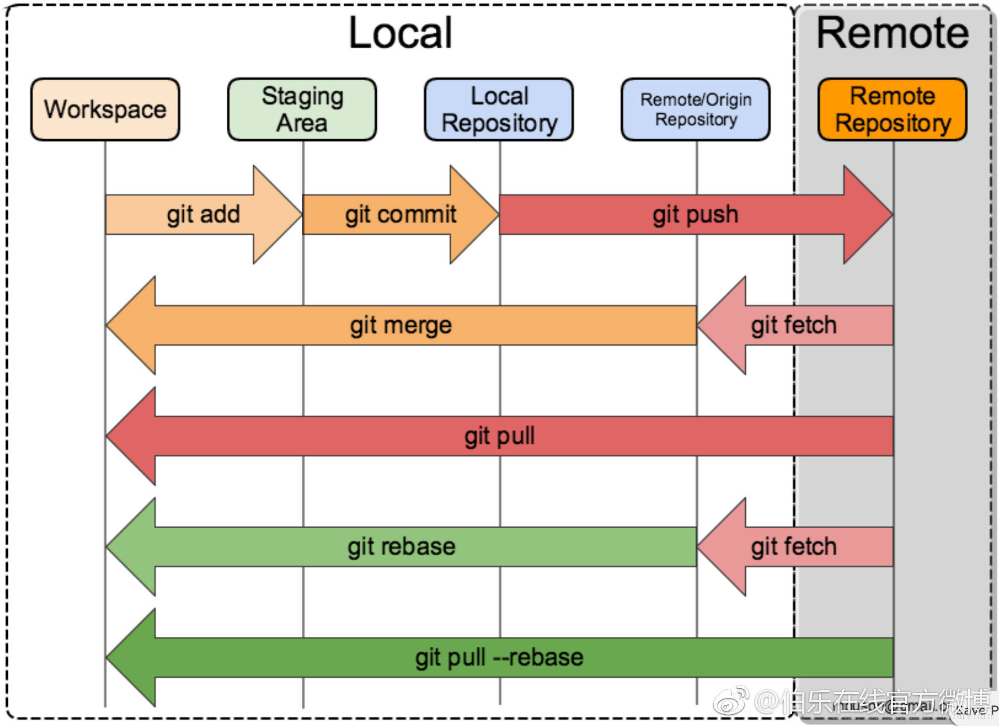

--------------


然后我再展示大佬 `Vamei` 的两张 `git` 分析图( 图 加 文字分析 ):

> 第一张图：


-----------

> 第二张图：

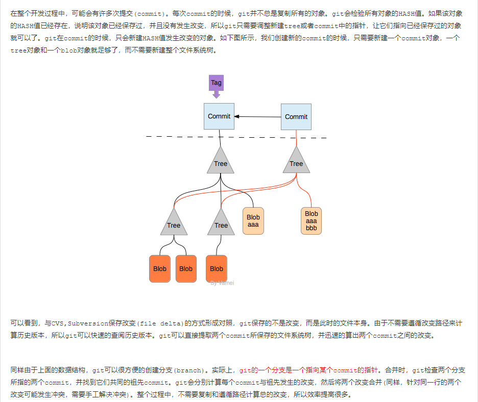


上面三张图分别是一张 `API` 级别的 图 和 大佬 `Vamei` 的两张 `git` 原理分析图。

如果对上面的三张图理解深刻的话，是能从图中就能感受到 `git` 的设计思想和与众不同的特点。如果能理解深刻，那其实也可以说你已经掌握了中级的理论知识了。


> 但是不理解没关系，下面我会简要分析一下 `git` 的中级理论知识。

#### git init 干了什么

要想知道 `git init` 干了什么，我们就要去执行 `git init` , 然后去分析执行前后的具体变化。

我们从新建目录开始，然后初始化一个全新的 `git` 仓库，具体执行的代码如下：
```bash
// godkun
mkdir 0112-git-test
// 新建的目录，用 ls -a 查看，是没有任何东西的
cd 0112-git-test
git init
cd .git/
ls -a
ls -l
```
`git init` 执行完后，如图所示
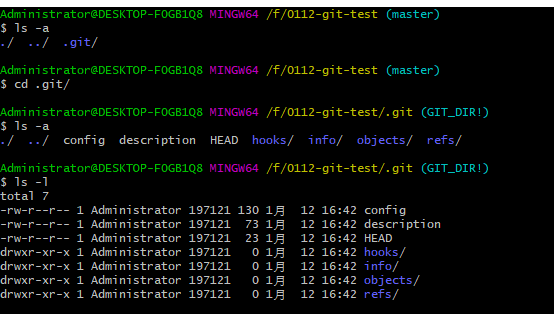
从上图中，我们能看到执行 `git init` 命令后，在当前目录下新建了一个 `.git` 目录，我们再通过 `ls -l` 可以看到 `.git` 目录下的所有文件和目录，同时包括这些文件和目录的权限。

> 下面我不在命令行下使用其他 `linux` 命令去分析具内容了体，我来使用 `code .` 打开 `VsCode` 来具体看一下 `.git` 目录下的真相，`VsCode` 中的 `.git` 截图如下：

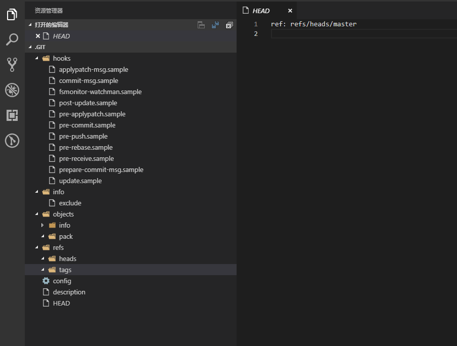

> 我们从图中可以分析出几个信息 

第一个： 在 `0112-git-test` 空目录下进执行了 `git init` 后，生成的 `.git` 目录下的 `objects` 和 `refs` 目录和他们的子目录都是空目录，很纯洁。

第二个： `.git` 目录下的 `HEAD` 文件中写了一行代码 `ref: refs/heads/master` ， 我们按照这个路径去找，却发现在 `refs/heads` 目录下并没有 `master`。

> 上面的情况是我们在空目录下执行了 `git init` 的结果，那如果在一个非空目录下执行 `git init` 呢？ 比如：

```
mkdir 0112-git-test-2
cd 0112-git-test-2
vi 1.txt
// 写入文件然后保存退出
git init
```
我们按照上面分析的步骤去分析非空目录下进行 `git init` 的操作，会发现 `.git` 目录下没有任何变化。 

> 我们会发现

经过两次分析，我们可以看到，在进行 `git init` 后，不管当前目录有没有文件， `.git` 目录都是一样的，同时 `HEAD` 默认是指向 `master` 分支，看下图：


> 图中可以看到，执行完 `git init` 后，当前分支就指向 `master` 分支了，所以这时候我们就能解决掉下面这个问题了：

为什么会 `git init` 后默认指向 `master` ， 通过上面简单的操作，我们就可以从中级层面去理解这个事情了。  

> 现在我们继续推，对非空目录下执行 `gst` ， 显示如下图：


我们看箭头处，会发现这个文件是 `untrack` ，我们结合 `git init` 命令前后的 `.git` 并没有发生任何变化。

> 可以推出：

`1.txt` 没有被纳入到版本控制系统中，`untrack` 就代表没有纳入到版本控制中。

**PS：**我们在分析 `.git` 目录的时候，一定要带着版本控制的思想去分析。

> 思考时间

我分析了 `git init` ，那么类推一下， `git clone` 干了什么呢？ 这里留给小伙伴们分析吧。


#### 整体分析 .git 目录
上面我们通过 `git init` 后，生成了一个 `.git` 目录，可能你对 `.git` 目录还比较陌生，如果想掌握好 `git` 的中级理论知识，那么 `.git` 目录是要去征服的。

> 从上面 `git init` 后的目录截图我们可以知道（简要介绍一下）

第一：`.git` 根目录下，有很多一级子目录和一级子文件。

第二：看 `hooks` 目录，从命名我们联系到 `react` 最新的 `Hook` 特性，万物都是相通的。里面有很多文件，比如 `pre-commit.sample` 文件，这是一个样本文件，我们按照样本文件的写法进行编写代码，然后把 `.sample`  去掉，写成 `pre-commit` ，这样就可以在你执行 `git commit -m 'xxx'` 时，去执行 `pre-commit` 文件中的代码。这就是 `git` 中的生命周期钩子。

第三：看 `objects` 目录，这是一个存放各种数据的目录。我们的项目，不管是什么形式的数据，图片也好，音频也好，代码也好，都会被转换成统一的数据格式存放在 `objects` 目录下。

关于 `objects` 目录的基本信息，可以看下面这篇介绍 `git-objects` 的博客：

[Git-Internals-Git-Objects](https://git-scm.com/book/en/v2/Git-Internals-Git-Objects)

第四：`refs` 目录下有 `heads` 和  `tags` 目录。以及子文件 `HEAD` 中写着  `ref: refs/heads/master` , 这是 `git` 当前指向的分支。


> 有什么感受

我希望在整体分析时，大家能把 `.git` 目录当成一个前端工程去分析，比如你可以把 `objects` 目录当成前端项目中的 `dist` 目录。其他类推，只要能有助于你去理解，那都是好的类推。

**PS: 这里是整体分析，没有去深入介绍，整体了解一下就好。**

#### git add 后发生了什么
当我把一个不在版本控制系统中的文件，使用 `git add ·` 加到暂存区后，我来看一下 `.git` 目录的变化，如图所示：

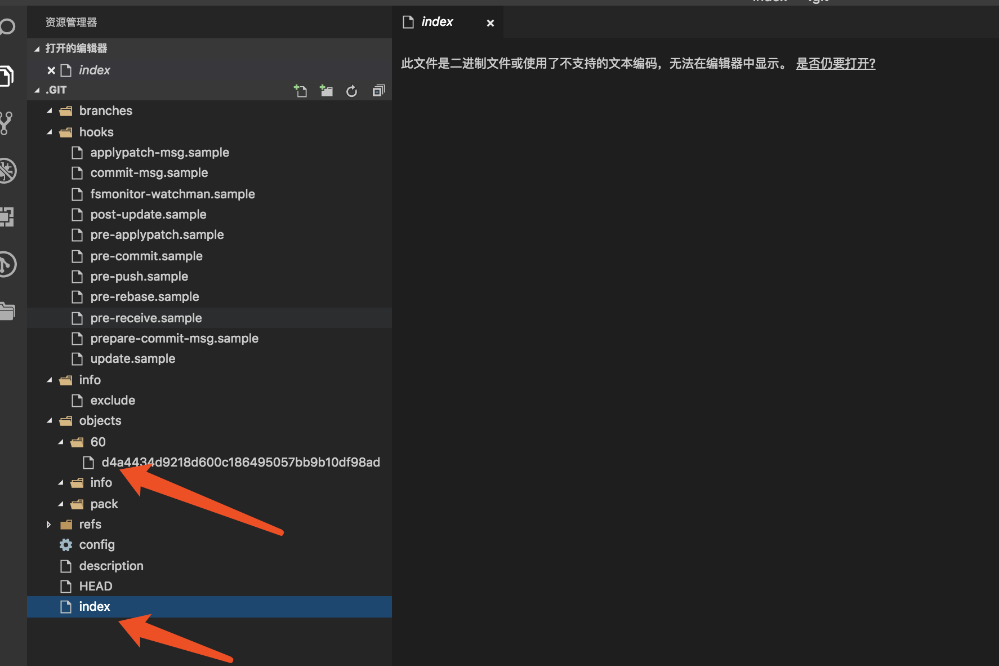

我们会发现在 `Object` 目录下增加了一个名为 `60` 的目录。该目录下有一个二进制文件。同时 `.git` 根目录下多了一个 `index` 文件，也是一个二进制文件。

> 从这里我们可以分析出几个信息：

第一个：`git add ` 操作会把不在版本控制下的文件纳入到版本控制中，为什么会这样说，从中级角度看，是因为 `.git` 目录有实质性的改变了。

第二个： `git add` 操作会在 `objects` 目录下生成子目录为 `60` ，文件名为 `d4a4434d9218d600c186495057bb9b10df98ad` 的一个二进制文件。

第三个：`git add` 操作会在 `.git` 根目录下生成一个命为 `index` 的二进制文件。

> 我们看一下 `d4a4434d9218d600c186495057bb9b10df98ad` 文件中的内容是什么？

执行：
```
git cat-file -t 60d4a4434d9218d600c186495057bb9b10df98ad
```

执行结果如下图所示：


就输出了一个单词，`blob` 。

> `blob` 是什么?

`blob` 是 `binary large object` 翻译一下就是二进制大对象。那我们可以这样理解，这个文件是一个二进制大对象，`OK` ，继续往下分析。

> 文件为什么要用一串字符串命名

比如文件 `d4a4434d9218d600c186495057bb9b10df98ad` ，不理解没关系，继续往前端上去联想，是不是想到了 `webpack` 打包后的文件名，可以在前面加上 `hash` 前缀。有种豁然开朗的感觉了吧，留给大家自行去分析吧。

> `git add` 和 `blob` 和 文件名 `d4a4434d9218d600c186495057bb9b10df98ad ` 的关联

没有执行 `git add` 的时候，目录下是空的。当 `git add` 后，多了一个 `blob` ，同时生成了一个 `40` 个字符的 `hash` 串，然后目录和文件用 `hash` 表示。也就是说:

`git add` 后生成了一个 `blob` 对象，`blobId` 为 `60d4a4434d9218d600c186495057bb9b10df98ad` 。

看到这你是不是又有点感觉了，记住一句话：

> **万物皆可推**。

我们平常的各种 ` git commit -m 'xxxxxx'` 其实生成一个 `commit` 对象，同时生成了 `commitId` 也是40位的 `hash` 字符，存在 `objects` 目录下。

> 根目录下多了一个 `index` 文件，它是什么？

现在确定的一点是，当用 `git add` 把文件放到暂存区的时候，`index` 文件就生成了，这个 `index` 文件是一个二进制文件，我使用下面命令去查看 `index` 的内容：

```bash
od -tx1 -tc -Ax index
```
如图所示：

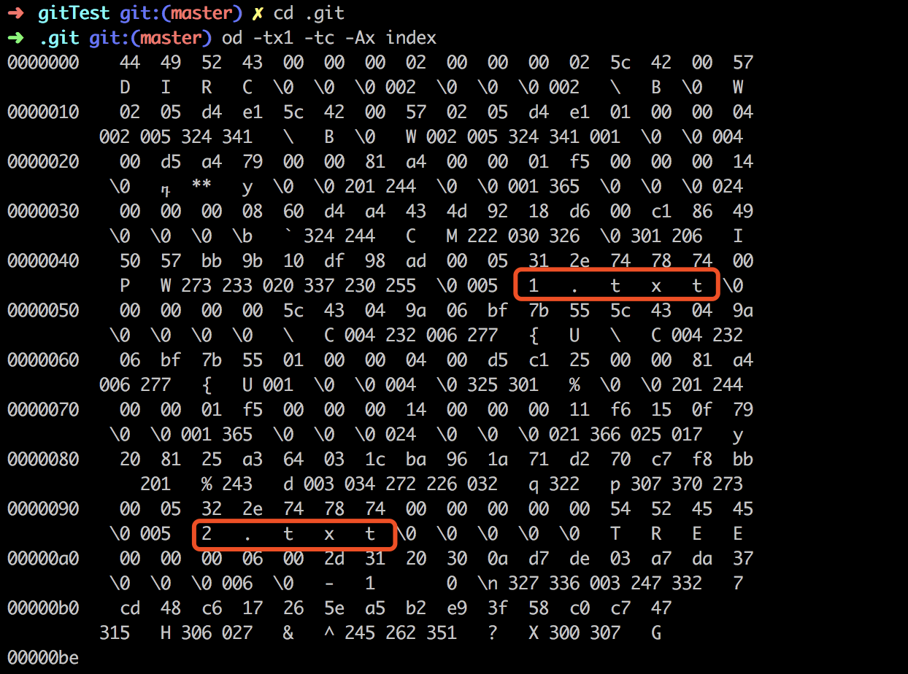

上面图中的那一串数据是 `index` 文件中的二进制数据。

> 这里我们看一下图中我标注的红框。

可以看到，`index` 文件中包含了很多信息，比如 `1.txt` ，`2.txt` ，还有 `TREE` 。目前从表现上看，我只能了解到这么多的信息，它们之间肯定有某种联系。其实了解过暂存区的应该可以联想到，`index` 文件就是一个暂存区。

可以看这篇直接给结论的官方文档：

[Git-Internals-Plumbing-and-Porcelain](https://git-scm.com/book/en/v1/Git-Internals-Plumbing-and-Porcelain)

##### 思考时刻
留几个问题给各位小伙伴思考：

> 如果你的项目还没有一个 `commit` 的话， 在上面这张情况下，我们使用 `git stash`会发现有以下报错：


为什么会报这个错误提示？

> 为什么 `40` 字符的 `hash` 串要拿出前两位作为目录？

这个做法其内部的道理是什么，这样做是和算法有关系吗，目的是为了更好的性能吗，前端可不可以借鉴这种思想，还是说前端已经有了这种思想，那这种思想是什么？

> 为什么 `git` 要用二进制数据格式来存储数据？

自行想一想，也许会有一些有趣的收获呢。


#### 如何去理解 git stash 
这里我会通过实践去告诉大家，`git stash` 在 `.git` 目录是如何表现的。

首先我进行一次 `commit` , 项目现在只有一个 `commitId` ，如下图所示：


这个时候，我使用下面命令：
```bash
vim 2.txt
// 编辑 2.txt
git add .
```

`git add` 后，我们看 `.git` 目录，如下图所示：

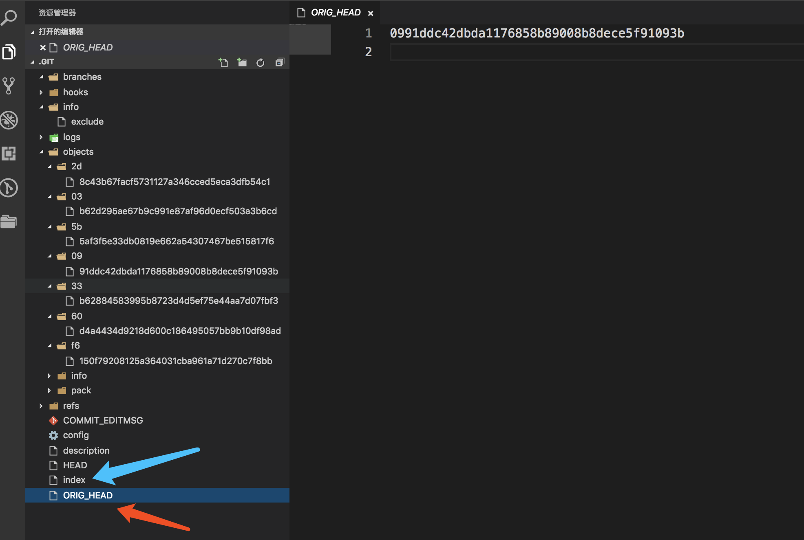

关注一下上面的箭头所指的文件。

点击 `ORIG_HEAD` 可以看到是一个字符串 `0991ddc42dbda1176858b89008b8dece5f91093b` 对照着在 `objects` 目录下找，发现确实有，我们再用下面命令

```bash
git cat-file -p 0991ddc42dbda1176858b89008b8dece5f91093b
```


我们看到了 `tree` ，`tree` 也有一个 `treeId` ，`treeId` 为 `33b62884583995b8723d4d5ef75e44aa7d07fbf3`

再结合 `git log` 
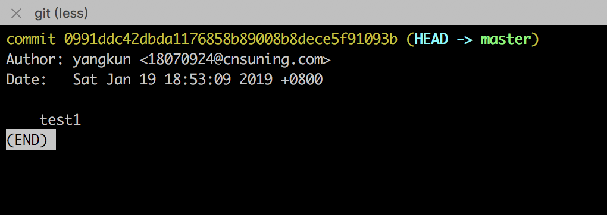


再看下面这张图：

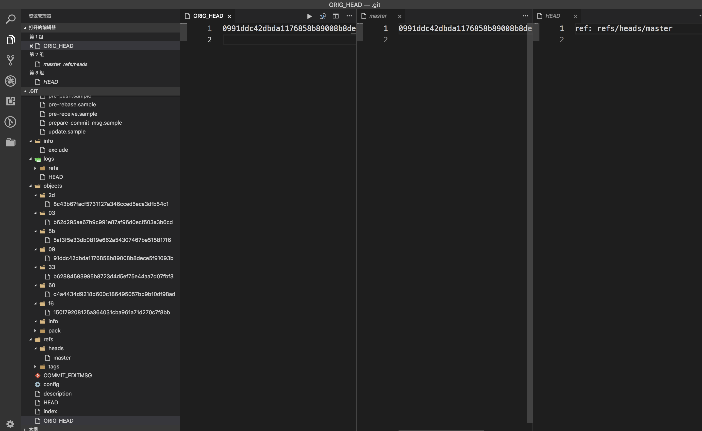

对比两张图， 会发现 `ORIG_HEAD` 文件中的 `hash` 值 相等于 `HEAD` 中所指向的文件位置中的 `hash` 值。话不能说太透，后面的自行领悟吧。

> 执行 git stash 会发生什么？

看下图：

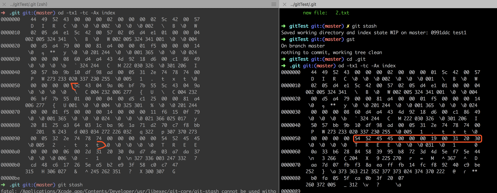

图中的左边是我把 `2.txt` 通过 `git add` 放到暂存区的 `index` 文件的内容。右边是我使用 `git stash` 后的暂存区的 `index` 文件的内容。可以看出，`git stash` 前后的 `index` 文件差别。

请看下面我演示的 `gif` 图：


可以看到，当我 `git commit` 的时候，`refs/heads` 目录下的 `matser` 文件中存放的 `commitId` 变成了最新提交的 `commitId` ，而 `ORIG_HEAD` 没有改变。由此可以知道，`HEAD` 文件存放的路径，其路径下的文件的 `hash` 值是当前目录下最近的一次 `commit` 。

可以参考这篇博客：

[Git暂存区原理](https://blog.csdn.net/s646575997/article/details/52143586)

#### git merge 和 git rebase 

`merge` 和 `rebase` 的问题大概是 `git`  中最著名的问题了吧，在面试中也是考察的最多的知识点。比如，你知道 `merge` 和  `rebase` 的区别吗？这种类似的问题，不胜枚举。

网上教程也一大堆，如果你想深刻了解 `git merge` 和 `git rebase` 的话，那就请按照我上面的那种分析方法，一步一步去操作，然后观察 `.git` 目录下的各种变化，然后根据重要的变化来去细致的分析其中的原因和道理。

> 但是，很多教程写的过于复杂了，我拿 `rebase` 来做一个我个人理解的通俗解释。

比如当前分支为 `dev` ，然后我执行：
```
git rebase master
```

> 上面的命令怎么理解

**一个最关键的一点就是: 要知道 `rebase` 是变基的意识。`rebase master` 是以 `master` 为 `base` ，然后把 `dev` 分支的补丁打到 `master` 后面，打的过程中生成的 `commitId` 是新的 `commitId` ，`dev` 原有的 `commitId` 被丢弃，时间线也就变成了直线。**

最终，`matser` 和我的 `dev` 分支合并，让最新的 `commmitId` 以我的最新提交的为准( 这里就是我在 `dev` 分支上的最新提交 )。所以当我 `push` 后，我提交的代码就成为了基准。

`rebase` 就这么简单。


可以看看我的两篇简洁 `issues`：

> [让 git rebase 的概念终结于此吧](https://github.com/godkun/git-gerrit-learning/issues/18)

> [通俗易懂的 git merge 的策略解释](https://github.com/godkun/git-gerrit-learning/issues/19)

#### git 中的 `blob` `commit` `tag` `tree` 是怎么串起来的
其实这是一个非常关键的问题，很多人都不清除这些 `单词` 背后的的真理究竟是一种什么样子的美丽。

但是我不打算造轮子了，因为好文章太多了，这里我还想放上面的一张图，因为这张图太经典了。


解释已经在图中的文字中了，比如知道了这些，你就知道了我们在给版本打上 `tag` 的时候，究竟是做了什么。我们不能浮于表面，只知道要打 `tag` ，我们还要知道打 `tag` 背后的原因。只有这样，才能做到知其然知其所以然。

> 终结 tag : https://github.com/godkun/git-gerrit-learning/issues/9

### 其他零碎的知识点

> COMMIT_EDITMSG 文件

此文件里面写的内容是本地最后一个提交的信息

> packed-refs

clone仓库时所有的引用

### git 中级之实战技巧
我把在使用 `git` 进行版本控制过程中，我所用到的所有 `git` 操作高度提炼一下。

> 我的这些 `git` 操作的目的可以概括为以下几点：

<!--第三个目的：避免错误的干涉到其他 `coder` 的代码-->

1. 第一个目的：处理合并，解决冲突
2. 第二个目的：提交代码
3. 第三个目的：提高开发效率
4. 第四个目的：合理的优化
5. 第五个目的：当自己出现错误操作时，做到快速且正确的处理掉
6. 第六个目的：帮助同事解决他们的一些 `git` 操作问题


下面简要分析一下上面各个目的过程中的一些心得。

#### 处理合并，解决冲突
`git` 处理合并和解决冲突的能力 碾压 `svn` 。比如 `svn` 处理一个冲突，由于是集中式的仓库管理，仓库只有远程一个，可想而知，解决冲突就是一场提交竞赛。

> 我本人是如何在项目中处理各种冲突和合并的呢？

按照我的这几个步骤来，基本不会存在任何冲突解决失败的情况。

首先，当我去 `pull` 远端代码的时候，比如执行

```
git pull origin dev
```

执行完之后，我发现的控制台多了很多 `conflict` 提示，我看了下，很多都是别人代码的冲突，这个时候我怎么会呢？

我会毫不犹豫的 `git reset --hard`

回滚掉这次 `merge` ，然后我已经知道了这样是不行的，但是我又不能去等着别人把冲突修改掉，怎么呢？我会先在当前分支的基础上新切一个分支
```
git checkout -b dev-backup
```
相当于备份一下目前本地的代码，`dev-backup` 分支用来保存本地代码。然后这时，我
```
git checkout dev
```

切换到 `dev` 上，切换后，我要怎么办呢，这时我会将 `dev` 分支的代码全部替换成远端的 `dev` 分支：
```
git reset --hard origin/dev
```

这时，我本地的 `dev` 分支已经全部采纳远端 `dev` 分支代码了，这个时候我还需要将我本地修改的代码合并进去，但是这个时候我就可以使用一个命令：

```
git checkout dev-backup pages/xxxx
```
通过上面的命令，我们就可以将 `dev-backup` 分支上的 `xxx` 目录下或者 `xxx` 文件的代码单独合并到 `dev` ， 而这部分代码就是我本地自己修改的代码，所以就算有 `conflict` ， 我也可以迅速解决掉，然后安全 `push` 远端仓库上。

上面的解决冲突的方法，虽然方式简单，但是是我个人认为可以完美解决掉 `git` 版本控制中的所有合并和冲突问题。

在版本控制系统中，合并一直都是一个核心节点，我们要去理解合并和解决冲突在版本控制系统中究竟占有多大的重要性。

#### 提交代码
提交代码这个应该没什么问题，但其实你把本地代码提交到远端仓库这一步骤，是一个非常重要的时刻，为什么我说非常重要呢？想必你之前听过外国一个程序员因为同事经常 `git push -f` 而把同事给终结掉了，😂。所以害怕了吧，莫事，不慌，你只要遵守这几个原则就 `ojbk` 了：

1. 千万不要用 `git push -f` 除非你已经做好不想活的准备了。😂
2. 不要把冲突提交了，提交前检查一下有没有冲突。
3. 写好你的 `commit message` 
4. `git commit ` 之前先 `git status` 看一下，检查一下有没有无意间改动了其他文件。

其实我个人的感觉就是，如果是自己的业务项目，除了第一点，第二点，第四点需要去注意外，像 第四点，`commit message` 这种，开心就好吧，不用很刻意的。

#### 提高开发效率
谈到这个，我想大家都有一些自己的总结吧，在用多了 `git` 后， 慢慢的会发现有一些可以加快使用 `git` 进行版本控制的小技巧。下面我总结一下我自己总结的几点提升开发效率的方法吧。

> 配好最适合你自己的 `alias`

比如我配的有：`gst` 代表 `git status` , 当然你还可以更加简单，开心就好。

> 优化你的 `stash`

用好 `stash` 也是一个既简单又可以提高开发效率的方法，具体用法不说了，我的 `github` 有相关详细资料，它主要是起一个暂存的目的，但是一般大家都是 `git stash`  

#### 合理的优化
谈到优化，其实我想说优化是一个相对的概念，如果对 `git` 控制版本的过程进行优化的话，我个人觉得我目前用到的优化也不多，大概就是以下几个：

1. 我会偶尔用 `git rebase -i` 对我的一些我都看不下去的 `commit` 进行处理。

#### 当自己出现错误操作时，做到快速且正确的处理掉
这个当然是自己蠢了，不小心把东西搞砸了，那就要快速解决掉自己的错误操作，怎么解决，思想也很简单：

> 一般我是本着一个原则：以最快的速度把错误操作从远端仓库中移除掉，从而最大化的减少对其他    `coder` 的影响。

比如通过本地切分支快速备份我自己的代码，然后切换回去，快速把自己的错误代码回滚掉，然后 `push` 到远端仓库，解决远端仓库的代码冲突问题，然后我再继续解决本地我自己代码的问题。

#### 帮助同事解决他们的一些 `git` 操作问题
我感觉如果一个项目很大的话，参与者很多的话，随时有新的 `coder` 参与进来，你是无法保证所有人的 `git` 操作都会很正确的，而这个过程中，一些人可能有进行了错误的 `git` 操作，自己也无法解决，然后会找其他同事寻求帮助，我也帮助过一些同事。我在帮助其他同事处理 `git` 问题的时候，使用的命令还是比较多的，有时候还得使用一些不常用的技巧，比如正则，过滤等，这里就不细说了。 

### 实战过程中自己的一些感悟
我觉得，我们没有必要在项目开发过程中把 `git` 操作复杂化，一些黑科技什么的，也没有必要去关注，有句话是这样说的：能用简单的操作解决复杂的问题才是大牛。所以上面我介绍的实战技巧，可以说没有什么高大深的技巧，当理解的足够深入的时候，通过简单的操作也可以保证项目的有序进行。


## git 高级 -- 你可能不知道的 git 知识
这里呼应一下文章开始所说的那一句话：

**从初级到中级再到我都 `hold` 不住的高级。**

为什么我说我都 `hold` 不住呢？是因为我真的 `hold` 不住。但是我还是去学习了一番，重新简单翻了一遍 `C` 和 `C++` 语言，尝试着去理解一下。

<!--### 源码是如何执行的-->


### 简单看一下 github 上的 git 源码
首先把 `github` 上的 `git` 仓库 `clone` 下来。

#### 先看一下 git 项目 代码量
这里我用到一个代码行数分析工具 `cloc` ，可以通过下面进行安装:

```bash
<!--安装 homebrew 后-->

brew install cloc
```

安装完毕后，在 `.git` 目录执行：

```
cloc *.c *.h *.sh
```

得到如图所示：


从图中我们可以发现，当前 `github` 上的 `git` 项目是由很多语言组成的，`master` 分支的总代码行数大约 `50` 万左右( `PO File` 不算)。主要语言有 `C` `sh(Bourne Shell)` `Perl` `C/C++ Header` 。给我的感觉有几点：

第一点：代码量不算大，50万行左右，与 `linux` 内核这种千万级别的代码还是有差距的，只能算是一个工具。

第二点：涉及到的语言很多，但是核心语言基本就 `C` `sh` `C/C++ Header` 这三种。

> 下面我要怎么分析它呢。

#### 先降维分析
目前由于目录过于复杂，我想到了去看 `git` 项目第一次 `commit` 的内容，一般来说，第一次 `commit` 的代码量是比较小的。我在 `github` 上找到的截图如下：


我进入git 目录 执行了  
```
git checkout e83c5163316f89bfbde7d9ab23ca2e25604af290
```
去看一下第一次 `commit` 的代码内容，如下图所示：

命令行：


VScode 截图：

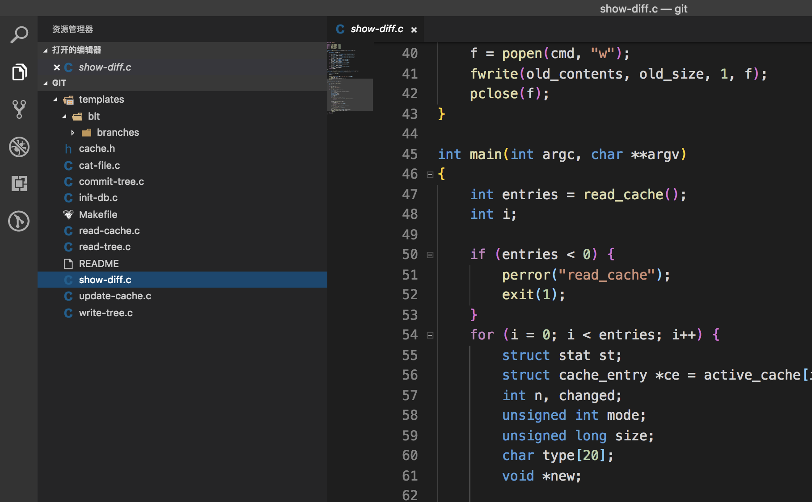

我好奇的使用 `cloc` 看了下代码量，下图所示：


惊了！只有848行，是不是瞬间有了信心。那就开始终结它吧！

按照惯例，我去 `README` 中看了下项目介绍：

如图所示：


编辑者是 **Linux Torvalds**

> GIT - the stupid content tracker

> "git" can mean anything, depending on your mood.

这两句是作者本人对 `GIT` 的介绍，是本尊无疑了。

> 我阅读完  `README` 后，获得了以下几点信息：

> All objects are named by their content, which is
approximated by the SHA1 hash of the object itself.  Objects may refer
to other objects (by referencing their SHA1 hash), and so you can build
up a hierarchy of objects. 

第一点：所有对象都是用他们自己的内容来命名，通过 `SHA1` `hash` 值来标识自己。对象可以通过引用其他对象的 `SHA1` `hash` 来引用其他对象。所以可以建立起一个有层次的对象模型。

第二点：对象内容都是用 `zlib` 进行压缩，同时 `SHA1` 哈希始终是
是压缩后的对象内容的哈希值，而不是原始对象内容的哈希值。

第三点：A "blob" object is nothing but a binary blob of data, and doesn't
refer to anything else. 简单点说就是: `blob` 没有任何其他属性，仅仅表示文件的内容。

> The "current directory cache" is a simple binary file, which contains an efficient representation of a virtual directory content at some random
time.  It does so by a simple array that associates a set of names,
dates, permissions and content (aka "blob") objects together.  The cache
is always kept ordered by name, and names are unique at any point in
time, but the cache has no long-term meaning, and can be partially
updated at any time. 

第四点：当前目录缓存，可以理解为是暂存区，暂存区也是一个二进制文件，它通过一个简单的数组来记录着时间，权限，和对象内容。

第五点：使用了 `SHA1` ，所以改变和内容是值得信任的。

> `README` 的信息还是很足的。说明了很多事情。


> 第一次 commit 的源码分析

这里我就不造轮子了，找到了一篇文章，基本把第一次 `commit` 的源码各个文件的作用解释的较透彻。

[Git源码学习](https://blog.csdn.net/acmdream/article/details/66968037)

### 简单分析一下最新的 git 源码
执行 `git checkou master` 切到 master 分支


从图中我们可以看到，有很多很多东西，一点都不想分析，那就不分析了，都1万多字了，写不动了。就这么愉快的同意啦！开开心心过完年后，再单独写一篇( 嘿嘿嘿 )。

## gerrit 原理知识
这个原理知识就不说了，简单点说就是搭一个 `gerrit` 服务器，然后通过 `UI` 界面去进行代码的 `CR` ，`CR` 通过，点击 `submit` 就会把代码同步到 `gitlab` 上。

## gerrit 实战总结
本人负责给项目实施 `gerrit` ， 并解决同事在过渡到 `gerrit` 方式的过程中出现的各种问题。我在解决各种问题的时候，对整个 `gerrit` 的流程和操作都理解了狠多，下面就分享一下我在帮助同事过渡 `gerrit` 的过程中遇到的问题和总结的一些心得吧。

### gerrit 基本设置
这个就不说了，基本的像 `ssh` 认证 、 `remote` 设置、邮箱设置、这种我就不造轮子了，按照网上的基本教程来。

### 提交 gerrit 时提示缺失 Change-Id
#### 问题描述
这个错误，是在过渡到 `gerrit` 的过程中出现最多的错误，没有之一，几乎都会遇到。

错误如下图：
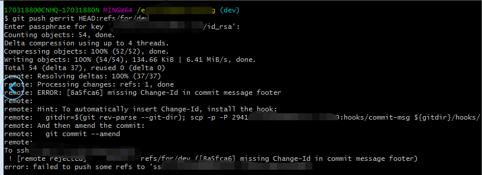

从图中可以看到，提示 `[8a5fca6] missing Change-Id in commit message footer`

什么意识呢，就是说 `commitId` 为 `8a5fca6` 的提交没有 `Change-Id` ，所以就提交失败了。

同时我们可以看到打印信息里面有给解决这个问题的方法，先执行：

`gitdir=$(git rev-parse --git-dir); scp -p -P 29418 name@git.co.com:hooks/commit-msg ${gitdir}/hooks/`

再执行：

`git commit --amend`

但是在解决这个问题的过程中，我发现上面的提示，有时候并不能成功。我总结出了几种情况，下面一一列出。

#### 缺少 Change-Id 的 `commitId` 是 head 指向的 commitId
如果是 `head` 的话，也就是 `git log` 的第一个 `commitId` 。 那可以直接按照上面提示的命令去执行。

这里提一下，在执行 `git commit --amend` 时，会进入 `vi` 界面，进入后可以不用修改任何东西的，直接保存退出即可，就可以重新刷新 `head` 指向 的 `commitId` 的 值了。


#### 缺少 Change-Id 的 `commitId` 不是 head 指向的 commitId
如果不是 `head` 的话，比如是第 6 个 `commitId` 缺少 `Change-Id` ，那怎么办呢？ 针对这种情况，有两种办法：

第一种：`git reset --soft`

> 使用 `git reset --soft commitId` 将 `commit` 记录 **软回滚** 到缺少 `Change-Id ` 的这个 `commitId` 处，比如上图的 `commitId`[8a5fca6] 是第6个 `commitId`，那此时就可以这样操作：

```
git reset --soft 8a5fca6
git commit --amend
```
然后就可以 `push` 成功了。但是美中不足的地方就是，软回滚了其他的 `commit` 。 但是问题不大，如果都是你自己的 `commit`，那就直接 `soft` 吧，不是的话，可以采用下面第二种方法。

第二种：`git rebase -i commitId`

>  `git rebase -i commitId` 这个命令可以帮助你去编辑 `commit`，比如把几个 `commit` 合并成一个 `commit` 。而这里我们想要做的是，通过这个命令来完成只修改上图中的指定 `commit` ， 同时不会对其他已存在的 `commit` 造成任何影响。具体操作是：

注意：`git rebase -i commitId` 中的 `commitId` 并不是提示的 `commitId` 。 而是提示中 `commitId` 的前一个 `commitId` 。比如执行 `git log` ：
```
// .....
commit 7b7b7b7
commit avacaba
commit 8a5fca6
commit godkun666
```
那这个 `commitId` 就是 `godkun666` 。

```bash
git rebase -i godkun666
```

然后进入 `VI` 界面，如下面：
```
pick 8a5fca6 i am godkun1
pick avacaba I am godkun2
pick 7b7b7b7 I am godkun3
```
直接把缺少 `Change-Id` 的 `commitId[8a5fca6]` 前面的 `pick` 修改为 `reward`，然后保存退出就好了。这种方法也试用一次性修改多个缺少 `Change-Id` 的 `commitId` 。保存退出后，就可以直接 `push` 了。 对于 `rebase -i` 的相关知识，请自行谷歌百度，这里不做讲解。

#### 上述两者方式都试了，还是不行
这种情况出现在一个同事身上了，两个情况的解决方法都试了，还是不行，然后我仔细看了下，在执行：

`gitdir=$(git rev-parse --git-dir); scp -p -P 29418 name@git.co.com:hooks/commit-msg ${gitdir}/hooks/` 

出现了一个报错，由于我没有保存截图，大致意识就是 `hook is not directory` 可能我这样说出来，感觉很简单啊，但是在过程中，这个提示是很不明显的，后面我进入 `.git` 目录看了下才知道怎么回事， `hooks` 是一个文件了，不是目录，这也是够秀的，我初步猜测是在复制这个命令的时候，复制的不全，导致生成了 `hooks` 文件 。然后我删除 `hooks` 后，又新建了一个 `hooks` 目录，重新执行了上述命令就好了。


### commiter email address xxxx does not match your user account


出现这种问题，是因为图中提示的 `commitId` 其所绑定的邮箱不正确。需要你先设置正确的邮箱，在设置完正确的邮箱后，我们继续其他操作，我总结的有三种方法可以解决这个问题：

第一种方法：把这个有问题的 `commit` 撤销掉，可以使用软回滚 `git reset --soft commitId` 回滚掉。

第二种方法：如果这个 `commitId` 就是 `head` 的指向，那直接 `git commit --amend` 刷新这个 `commitId`。

第三种方法：如果这个 `commitId` 就是 `head` 的指向， 那通过 `rebase -i` 去 `reword` 这个 `commitId` 。

> 原则：如果按照怎么舒服怎么来，那我就用 `git -reset --soft`，如果严谨点，那我就按条件划分使用下面两种方法了。

### gerrit cannot merge and Submit including parents
不造轮子了，基本操作问题都在下面这篇博客中有提到:

[如何解决gerrit代码冲突](https://www.cnblogs.com/zndxall/p/9140813.html)

但是，没有自己的看法的话，那和咸鱼有什么区别呢？

> 我来分析一下 `including parent` 和 `not merge`

如何所示：


> 表面原因：

`coder` 本地开发后，产生了 `commit` 然后 `push` 到 `gerrit` 上后，`CR` 者会根据情况进行拒绝，如果拒绝了，但是 `coder` 本地的 `commit`  并没有撤销，那么就会导致后续提交的系列 `commit` 出现上图这种情况，因为现在的 `commit` 依赖前面的几次 `commit` 。但是前面提交的 `commit` 并没有同意。所以就导致了很多 `CR` 问题。

> 核心原因：

`coder` 和 `CR` 者的 `commit` 时间线不一致。

> 如何解决：

核心是把 `commit` 时间线做到一致


#### 如果还没有出现上述的问题，如何做预防：
> 第一种：

当 `coder` 成功把本地的 `commit push` 到 `gerrit` 上后，记得要 `reset` 
掉，如果不放心，那可以软回滚，然后 `stash` ，等 `CR` ，如果拉下来发现没问题，就可以把 `stash` 放弃掉。

> 第二种：

当 `push` 后，切新分支进行备份，然后切回去，再把本地的 `commit reset` 掉。这样就不会存在上面图中的各个不能合并的问题的。当 `CR` 后，你 `pull` ，发现代码都对的时候，就可以把备份分支删掉了。

#### 如果已经出现上述问题了，怎么办？

核心思路：现在 `coder` 需要把本地的那些已经被 `gerrit abandon`  掉的那些 `commit` 干掉。

> 第一种: 

直接 重新 `git clone` 

> 第二种：

切一个分支进行备份，然后切回去，使用：

```bash
git reset --hard origin/dev
```
放弃本地所有代码，全部采用远端代码。。然后使用 `cherry pick` 把备份分支的 你需要的 `commit` 合到 `dev` 上。

PS: 当然这些只能是本地 `coder` 去解决这个问题。


> 第三种：

使用 `rebase` 去挨个修改或者使用 `git reset --soft` 把前面的很多 `commit`  都回滚掉。
不建议使用第三种方法，操作要求高，容易出错。


### how to make SourceTree push to Gerrit

`git` 仓库代码根目录下执行：

```bash
git config remote.origin.push refs/for/dev
```

### how to make TortoiseGit push to Gerrit
小乌龟 `push gerrit` 时会出现这种错误，如下图所示：

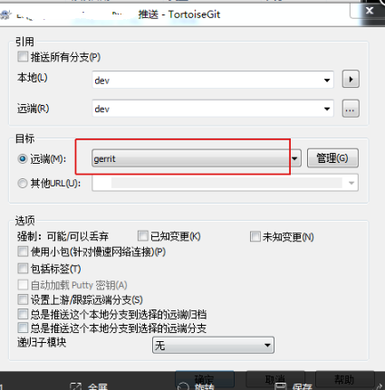


怎么解决呢？请看下面截图：

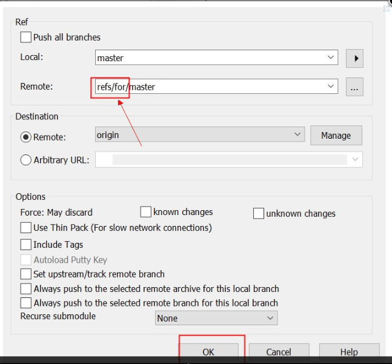

用小乌龟推送 `gerrit` 的时候应该要在 `remote` 前边手动加上 `refs/for/` 

参考博客：
[TortoiseGit推送代码到Gerrit的过程](https://www.cnblogs.com/zndxall/p/8609734.html)

### 如何快速高效的 CR ( coder review )
当各个产品线提交的代码都要你来 `CR` 的时候，你会发现根本没法去 `CR` ，因为你本身就不熟悉他们的代码，怎么 `CR` 呢，最后我决定这样做：

各个产品线的 `coder` 需要 `CR` 的话 群里 `at` 我一下，我在 `CR` 的过程中，有三个原则：

第一个原则：我默认相信各个产品线对自己负责的代码做出修改，也就是相信 `coder` 修改自己负责的代码，责任制。

第二个原则：我会严格关注各个 `coder` 有没有改动其他 `coder` 代码，如果改动，我会去私聊询问，为什么要这样做。

第三个原则：我会严格关注各个 `coder` 有没有改动公共部分的代码，比如登录模块，如果改动，我会去私聊询问，为什么要这样做。

只要不符合上诉三个原则，一律 `abandon` 。

## git FAQ 传送
发个关于 git FAQ 的链接：https://git.wiki.kernel.org/index.php/GitFaq#Why_the_.27Git.27_name.3F

## 参考链接
1. https://github.com/git/git
2. http://fabiensanglard.net/git_code_review/index.php
3. https://nvie.com/posts/a-successful-git-branching-model
4. https://git-scm.com/book/en/v2/Git-Internals-Git-Objects
5. http://schacon.github.io/git/user-manual.html#birdview-on-the-source-code
6. https://blogs.msdn.microsoft.com/devops/2018/01/11/microsofts-performance-contributions-to-git-in-2017
7. http://aosabook.org/en/git.html  这是一个很不错的介绍git的网站
8. https://learngitbranching.js.org/  这是一个在线实验 `git` 的网站
9. https://mirrors.edge.kernel.org/pub/software/scm/git/docs/git-rebase.html
10. https://mirrors.edge.kernel.org/pub/software/scm/git/docs/gitrepository-layout.html
11. https://mirrors.edge.kernel.org/pub/software/scm/git/docs/gitcore-tutorial.html
12. https://mirrors.edge.kernel.org/pub/software/scm/git/docs/user-manual.html

> 上面几篇关于 `git` 的文章都是我认为很不错的文章，可以阅读阅读，会有惊喜的。